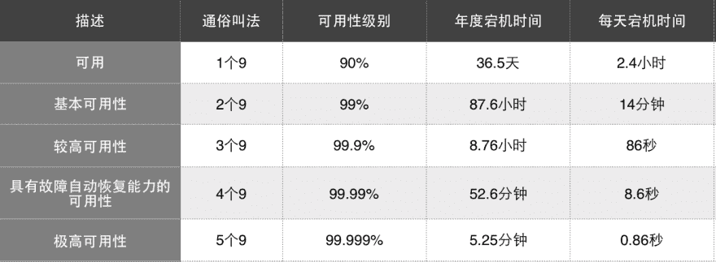

# Those Abilities you need to know

> 原文：<https://dev.to/fangdajiang/-abilities-8e1>

引自:[http://xianjing.github.io/2017/08/11/abilities/](http://xianjing.github.io/2017/08/11/abilities/)

If you buy a mobile phone, what factors will you consider? Generally, we will first consider smart phones, camera functions, capacity, etc. Besides these, we usually consider the brand, color, appearance, fashion or not. As a software product is no exception, users will first expect the system to meet the normal functional requirements, and at the same time, the system should meet other features such as usability, good performance, stability and reliability. We generally call these non-functional requirements or cross-functional requirements. Every failure and downtime of the system is a loss that can't be ignored for users, so these non-functional requirements are also very important attributes of software quality, and are the goals that software architecture design needs to meet.

In the non-functional requirements at runtime, we often mention several words such as Availability, Stability and Reliability, that is, the system should be highly available, reliable and stable. So what do you mean by availability, reliability and stability? How to measure? What's the difference between them? I often hear these words mixed in different scenes. Let's talk about these ability first today.

### 1。有效性可用性

> 可用性定义了系统运行和工作的时间比例。它可以在预定义的时间段内以总系统停机时间的百分比来衡量。可用性会受到系统错误、基础设施问题、恶意攻击和系统负载的影响。-微软应用架构指南

Availability refers to the probability that the system can work normally in a given time, usually expressed by SLA indicators, as shown in the following figure.
SLA indicators
[](https://res.cloudinary.com/practicaldev/image/fetch/s--FigybUXs--/c_limit%2Cf_auto%2Cfl_progressive%2Cq_auto%2Cw_880/https://thepracticaldev.s3.amazonaws.com/i/4rga1ynsofu6l7p30hd0.png) 
Murphy's law says that "everything that can go wrong will always go wrong", and the availability of 100 is unattainable. For SLA indicators, the higher the number of 9, the higher the availability and the less downtime, so that the system can work normally in a high proportion in a given time. However, the greater the challenge to the system, the higher the investment cost. For example, five 9s require the system to be down for only about 5 minutes a year, while four 9s require the system to be down for no more than one hour a year. This makes the system need to adopt various ways in different levels such as design, infrastructure and data backup, and even increase infrastructure investment to ensure availability.

> "When your equipment deals with life-threatening matters, or a minute of business interruption will cost millions of dollars, then you can consider the reliability of 99.99%." Robertson(Linux High Availability Project Developer)

The usability requirements of different systems are also different. For example, Taobao, JD.COM and other e-commerce systems have a large number of users, and a large number of users are using the system in different districts at different times, which inevitably requires high usability of the system. According to the fault statistics and inaccurate test data of these systems in the past, their current availability is about 3 9s to 4 9s. Relatively speaking, because the enterprise work software is usually only used during working hours, or only used in certain areas, or only given to some people for a certain time, the usability requirement will be lower. Salesforce is a typical system, and you often see the prompt "Upgrade again at the weekend".

There are many factors that affect usability, including system failure, infrastructure failure, data failure, security attack, system pressure and so on.

### 2。可靠性可靠性

> 可靠性是对一个项目在规定的条件下，在规定的时间间隔内执行其预期功能的概率的度量。

Reliability is the probability that the system can run continuously without faults at a given time interval and under a given condition. So what's the difference between reliability and usability? In the following examples mentioned in Principles and Paradigms of Distributed Systems, the difference between them is explained accurately:

> If the system crashes for 1ms every hour, its availability will exceed 99.9999%, but it is still highly unreliable. Similarly, if a system never crashes, but it is down for two weeks every year, it is highly reliable, but its availability is only 96%.

In short, availability is concerned with the ability of the system to work normally at any time, and the overall duration of the service. The longer the overall running time of the system in a given time, the higher the availability. Reliability pays more attention to the probability that the system can run continuously without faults, and focuses on the failure rate. The higher the frequency of failure, the lower the reliability. Poor reliability will affect usability to some extent, but the reverse is not necessarily true.

There are also some commonly used indicators to measure usability and reliability:

*   MTBF(Mean Time Between Failure) refers to the average time between starting the new product under the specified operating environment and the first failure. A longer MTBF indicates higher reliability and greater ability to operate correctly.
*   MTTR(Mean Time To Repair) is the average repair time. It refers to the average repair time of a repairable product, that is, the period from failure to repair. The shorter the MTTR, the better the recoverability.
*   MTTF(Mean Time To Failure) is the average time to failure. On average, how long can the system run normally before it fails once? The higher the reliability of the system, the longer the mean time between failures.

Based on the above indicators, availability can be calculated as follows:

> 可用性=正常运行时间/(正常运行时间+停机时间)=平均无故障时间/(平均无故障时间+ MTTR)

As the response of the system, the primary goal is to reduce the frequency of failures, so as to improve the reliability. At the same time, after the failure occurs, it is necessary to improve the recovery time and speed of the failure, so as to improve the usability of the business.

Factors affecting reliability are all factors that can cause failures, including software design errors, coding errors, hardware failures, and so on.

### 3。稳定性稳定性

> 稳定性是关于一个应用程序表现出多少失败；无论是表现为意外或非预期的行为、用户收到错误，还是导致系统崩溃的灾难性故障。观察到的故障越少，应用程序就越稳定。

The stability of software refers to the probability of errors, the trend of performance deterioration, etc. of the software in a running cycle, under certain pressure conditions, and in the continuous operation time. If a system has a high failure rate, it must be highly unreliable and unstable. So how do you distinguish between stability and reliability?

> As far as the power system is concerned, stability means "people don't use electricity suddenly, suddenly, quickly and slowly", and reliability means "don't use it suddenly". -Zhihu's midsummer daydream

If the performance of a system is good or bad, it must be unstable, not necessarily unreliable. Stability pays more attention to whether the response of the system is consistent and the behavior is stable under given conditions. Reliability is the premise of availability, and stability is the further improvement of reliability.

It's interesting to see such a code in Stackoverflow today to show the difference between the two:

```
Reliable but unstable:
  add(a,b):
    if randomInt mod 5 == 0: 
      throw exception
    else
      print a+b        
Stable but unreliable:
  add(a,b):
    if randomInt mod 5 == 0: 
      print a+a
    else
      print a+b 
```

Do you have a clearer understanding of usability, reliability and stability? With these indicators, we can analyze the problems existing in the system, such as high failure frequency and long recovery time. Then the reliability and usability of the system must be very low, and the impact on users must be very high, which can prompt us to improve and improve from all angles, find the problems of architecture design, the defects of system implementation, the dependent infrastructure problems, and so on, so as to improve our system. Especially in today's complex distributed systems, these are particularly important.

So, finally, which of our common fault-tolerant processing, blue-green deployment, rollback, cluster and disaster recovery will help to improve the above ability?