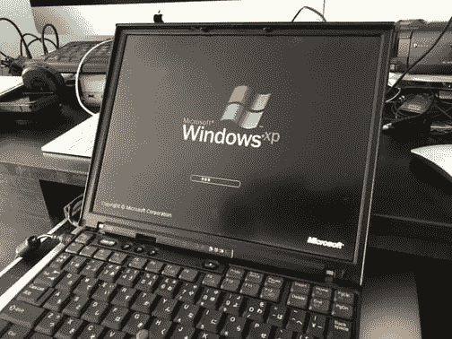

# 已经有很多受害报告了！ 如何下载和应用适用于 Windows XP / Server 2003 / Windows 8 的更新，以防止随机软件损害

> 原文：<https://dev.to/takimura/-windows-xp--server-2003--windows-8--iop>

[T2】](http://livedoor.blogimg.jp/cv_k/imgs/7/0/70cec04f-s.jpg)

流出去已经晚了！

全世界都报告了兰瑟姆服装造成的损害。 由于这次的随机软件损害非常大，微软还将破例向 Windows XP 和 Windows Server 2003 提供更新。 本文介绍了在 Windows XP 上应用随机软件防护更新的步骤。

[接下来的阅读](http://connect.coron.tech/archives/51999080.html)