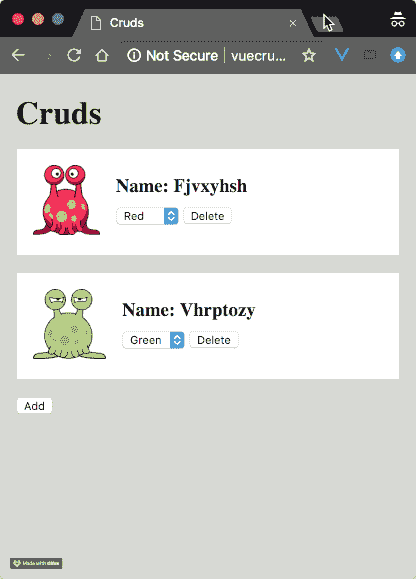

# 构建一个 Vue & Laravel 单页 CRUD 应用程序

> 原文：<https://dev.to/anthonygore/build-a-vue-laravel-single-page-crud-app-4d4k>

在本教程中，我将向您展示如何使用 Laravel 6 后端设置一个全栈 Vue 2.6 SPA，包括每个 CRUD 操作(创建、读取、更新和删除)。

AJAX 是这个架构的关键，所以我们将使用 Axios 作为 HTTP 客户端。我还将向您展示一些应对这种架构的 UX 陷阱的策略。

跟随简单的演示应用程序是一个好主意，可以在[这个 GitHub repo](https://github.com/anthonygore/vue-laravel-crud) 中找到。

## 全栈视图/生幼虫

CRUD(创建、读取、更新和删除)是基本的数据操作，也是作为 Laravel 开发人员首先要学习的东西之一。Vue.js 2.6 是 Laravel 6 可用的`laravel/ui`包的一部分。Vue 是为 CRUD 操作创建动态用户界面的绝佳选择。

结合 Vue 和 Laravel 的标准方法是创建 Vue 组件，然后将它们放到您的刀片文件中。但是这种架构下的 CRUD 操作需要刷新页面才能在 UI 中反映出来。

> *注:本文最初于 2018/02/05 在 Vue.js 开发者博客上发布[。](https://vuejsdevelopers.com/2018/02/05/vue-laravel-crud/?utm_source=devto&utm_medium=article&utm_campaign=crd)*

### 单页应用

通过用 Laravel 创建 Vue *单页应用* (SPA)可以实现卓越的用户体验。CRUD 操作可以异步完成，无需刷新页面

但是，这种配置需要特别注意，以确保前端和后端的数据状态一致。在本教程中，我将向您展示如何做到这一点。

## 演示 app

演示应用程序允许用户创建新的“垃圾”，经过大量的创造性思维后，我决定，这些垃圾是具有奇怪名称的外星生物，能够从红色变成绿色，然后再变回来。

crud 显示在主页上，用户可以创建新的 crud，删除它们，或者更新它们的颜色。

[T2】](https://res.cloudinary.com/practicaldev/image/fetch/s--tFleBod---/c_limit%2Cf_auto%2Cfl_progressive%2Cq_66%2Cw_880/https://vuejsdevelopers.cimg/posts/vue-laravel-crud.gif)

## 在 Laravel 后端设置 CRUD

我们将从完成 CRUD 操作的 Laravel 后端开始本教程。我将保持这一部分的简短，因为 Laravel CRUD 是一个在其他地方广泛涉及的主题，并且我假设您已经熟悉 Laravel 的基础知识。

总之，我们将:

*   建立一个数据库
*   使用资源控制器设置 RESTful API 路由
*   在控制器中定义执行 CRUD 操作的方法

### 数据库

首先，创建一个新的迁移，我们将使用它来创建一个表来存储我们的 Cruds。Cruds 有两个属性:名称和颜色，我们将它们存储为文本。

*2018 _ 02 _ 02 _ 081739 _ create _ cruds _ table . PHP*

```
<?php

...

class CreateCrudsTable extends Migration
{
  public function up()
  {
    Schema::create('cruds', function (Blueprint $table) {
      $table->increments('id');
      $table->text('name');
      $table->text('color');
      $table->timestamps();
    });
  }

  ...
}
... 
```

### API

现在，我们设置了 Vue SPA 需要的 RESTful API 路由。`Route` facade 的`resource`方法将自动创建我们需要的所有动作。然而，我们不需要`edit`、`show`或`store`，所以我们将排除这些。

*routes/api.php*

```
<?php

Route::resource('/cruds', 'CrudsController', [
  'except' => ['edit', 'show', 'store']
]); 
```

有了这些，下面是我们现在可以从后端 API 获得的路线:

| 动词 | 小路 | 行动 | 路线名称 |
| --- | --- | --- | --- |
| 得到 | /api/cruds | 指数 | cruds .索引 |
| 得到 | /api/cruds/create | 创造 | cruds.create |
| 放 | /api/cruds/{id} | 更新 | cruds.update |
| 删除 | /api/cruds/{id} | 破坏 | 垃圾，销毁 |

### 控制器

我们现在需要在控制器中实现这些逻辑:

*app/Http/Controllers/crudscontroller . PHP*

```
<?php

namespace App\Http\Controllers;

use App\Crud;
use Illuminate\Http\Request;
use Illuminate\Http\Response;
use Faker\Generator;

class CrudsController extends Controller
{
  // Methods
} 
```

**创造**。我们使用包含在 Laravel 中的`Faker`包来随机化新 Crud 的名称和颜色。我们将新创建的 Crud 数据作为 JSON 数据发送回我们的 Vue 应用程序。

```
<?php

...

public function create(Generator $faker)
{
  $crud = new Crud();
  $crud->name = $faker->lexify('????????');
  $crud->color = $faker->boolean ? 'red' : 'green';
  $crud->save();

  return response($crud->jsonSerialize(), Response::HTTP_CREATED);
} 
```

**指标**。我们用`index`方法返回完整的 Cruds 集，同样作为 JSON。在更严肃的应用程序中，我们会使用分页，但现在让我们保持简单。

```
<?php

...

public function index()
{
  return response(Crud::all()->jsonSerialize(), Response::HTTP_OK);
} 
```

**更新**。这个动作允许客户端改变 Crud 的颜色。

```
<?php

...

public function update(Request $request, $id)
{
  $crud = Crud::findOrFail($id);
  $crud->color = $request->color;
  $crud->save();

  return response(null, Response::HTTP_OK);
} 
```

**消灭**。这就是我们删除垃圾的方法。

```
<?php

...

public function destroy($id)
{
  Crud::destroy($id);

  return response(null, Response::HTTP_OK);
} 
```

## 创建 Vue.js 单页 app

现在是我们的 Vue.js SPA。这将适用于 Laravel 5.x，或者适用于 Laravel 6 的`laravel/ui`包。我假设你知道 Vue.js 的基础知识，所以我不会解释像*组件*等基本概念。

### 积垢成分

我们将首先创建一个单文件组件来显示目录`resources/assets/js/components`中名为`CrudComponent.vue`的 Cruds。

[T2】](https://res.cloudinary.com/practicaldev/image/fetch/s--uGT4MAqX--/c_limit%2Cf_auto%2Cfl_progressive%2Cq_auto%2Cw_880/v1/posts/vue-laravel-crud_01.png)

这个组件主要是为了显示，没有太多的逻辑。以下是值得注意的方面:

*   显示的图像取决于污垢的颜色(red.png*或 green.png*的
**   有一个 delete 按钮，它在点击时触发一个方法`del`，这个方法发出一个带有 Crud 的事件`delete`*   有一个 HTML select(用于选择颜色),它在更改时触发一个方法`update`,该方法发出一个事件`update`,带有 Crud 的 ID 和所选的新颜色*

 **资源/资产/js/组件/CrudComponent.vue*

```
<template>
  <div class="crud">
    <div class="col-1">
      
    </div>
    <div class="col-2">
      <h3>Name: {{ name | properCase }}</h3>
      <select @change="update">
        <option
          v-for="col in [ 'red', 'green' ]"
          :value="col"
          :key="col"
          :selected="col === color ? 'selected' : ''"
        >{{ col | properCase }}</option>
      </select>
      <button @click="del">Delete</button>
    </div>
  </div>
</template>
<script>
  export default {
    computed: {
      image() {
        returnimg/${this.color}.png`;
      }
    },
    methods: {
      update(val) {
        this.$emit('update', this.id, val.target.selectedOptions[0].value);
      },
      del() {
        this.$emit('delete', this.id);
      }
    },
    props: ['id', 'color', 'name'],
    filters: {
      properCase(string) {
        return string.charAt(0).toUpperCase() + string.slice(1);
      }
    }
  }
</script>
<style>...</style> 
```

### App 组件

Vue SPA 需要一个根组件，这个根组件就是 *App.vue* 。在目录 *resources/assets/js* 中创建这个文件。然后，您需要通过将 *app.js* 的内容更改为:

*资源/资产/js/app.js*

```
window.Vue = require('vue');

import App from './App.vue';

const app = new Vue({
  el: '#app',
  components: {
    App
  },
  render: h => h(App)
}); 
```

### 模板

现在让我们创建 *App.vue* 的模板。这有以下工作:

*   用上面讨论的`crud-component`组件显示我们的 Cruds
*   遍历 Crud 对象的数组(在数组`cruds`中)，每个对象映射到一个`crud-component`实例。我们将 Crud 的所有属性作为道具传递给相应的组件，并为`update`和`delete`事件设置监听器
*   我们还有一个*添加*按钮，通过点击触发方法`create`来创建新的 Cruds

*资源/资产/js/组件/App.vue*

```
<template>
  <div id="app">
    <div class="heading">
      <h1>Cruds</h1>
    </div>
    <crud-component
      v-for="crud in cruds"
      v-bind="crud"
      :key="crud.id"
      @update="update"
      @delete="del"
    ></crud-component>
    <div>
      <button @click="create">Add</button>
    </div>
  </div>
</template> 
```

### 逻辑

下面是来自 *App.vue* 的`script`的逻辑:

*   我们将创建一个工厂函数`Crud`，它创建新的对象来表示我们的 Cruds。每个都有一个 ID、颜色和名称
*   我们导入`CrudComponent`并在这个组件中使用它
*   我们提供一个数组`cruds`作为数据属性
*   我还为每个 CRUD 操作保留了方法，这将在下一节中填充

*资源/资产/js/组件/App.vue*

```
<template>...</template>
<script>
  function Crud({ id, color, name}) {
    this.id = id;
    this.color = color;
    this.name = name;
  }

  import CrudComponent from './components/CrudComponent.vue';

  export default {
    data() {
      return {
        cruds: []
      }
    },
    methods: {
      async create() {
        // To do
      },
      async read() {
        // To do
      },
      async update(id, color) {
        // To do
      },
      async del(id) {
        // To do
      }
    },
    components: {
      CrudComponent
    }
  }
</script> 
```

## 利用 AJAX 在 Vue SPA 中实现 CRUD

全栈应用中的所有 CRUD 操作都将在后端执行，因为数据库就在那里。然而，CRUD 操作的触发将发生在 Vue SPA 中。

因此，HTTP 客户端(可以通过互联网在我们的前端和后端之间进行通信的东西)在这里非常重要。Axios 是一个很棒的 HTTP 客户端，预装了默认的 Laravel 前端。

让我们再次查看我们的资源表，因为每个 AJAX 调用都需要针对一个相关的 API 路由:

| 动词 | 小路 | 行动 | 路线名称 |
| --- | --- | --- | --- |
| 得到 | /api/cruds | 指数 | cruds .索引 |
| 得到 | /api/cruds/create | 创造 | cruds.create |
| 放 | /api/cruds/{id} | 更新 | cruds.update |
| 删除 | /api/cruds/{id} | 破坏 | 垃圾，销毁 |

### 阅读

让我们从`read`方法开始。这个方法负责从后端检索我们的 Cruds，并将目标指向我们的 Laravel 控制器的`index`动作，从而使用端点`GET /api/cruds`。

我们可以用`window.axios.get`设置一个 GET 调用，因为 Axios 库在默认的 Laravel 前端设置中已经被别名化为`window`对象的属性。

像`get`、`post`等 Axios 方法返回一个承诺。我们可以使用 async/await 来整齐地响应对象。我们将析构它，这样我们就可以获取 AJAX 响应主体的`data`属性。

*资源/资产/js/组件/App.vue*

```
...

methods() {
  async read() {
    const { data } = window.axios.get('/api/cruds');
    // console.log(data)
  },
  ...
}

/*
Sample response:

[
  {
    "id": 0,
    "name": "ijjpfodc",
    "color": "green",
    "created_at": "2018-02-02 09:15:24",
    "updated_at": "2018-02-02 09:24:12"
  },
  {
    "id": 1,
    "name": "wjwxecrf",
    "color": "red",
    "created_at": "2018-02-03 09:26:31",
    "updated_at": "2018-02-03 09:26:31"
  }
]
*/ 
```

如您所见，Cruds 以 JSON 数组的形式返回。Axios 自动解析 JSON 并给我们 JavaScript 对象，这很好。让我们遍历这些并使用我们的`Crud`工厂函数创建新的 Cruds，将每个新的 Cruds 推送到`cruds`数组数据属性。

最后，我们将从`created`钩子以编程方式触发这个方法，确保在页面首次加载时添加我们的 Cruds。

*资源/资产/js/组件/App.vue*

```
...

methods() {
  async read() {
    const { data } = window.axios.get('/api/cruds');
    data.forEach(crud => this.cruds.push(new Crud(crud)));
  },
  ...
},
...
created() {
  this.read();
} 
```

完成后，当我们加载应用程序时，我们现在可以看到应用程序中显示的 Cruds:

[T2】](https://res.cloudinary.com/practicaldev/image/fetch/s--ZopcojUB--/c_limit%2Cf_auto%2Cfl_progressive%2Cq_auto%2Cw_880/v1/posts/vue-laravel-crud_02.png)

> 注意:从`created`钩子加载数据是可行的，但是效率不是很高。最好是去掉`read`,只在第一次加载时将应用程序的初始状态内联到文档头中。这里我不会告诉你如何做，因为它变得很混乱，但我在文章[中深入讨论了这种设计模式，在全栈 Vue/Laravel 应用中避免这种常见的反模式](https://vuejsdevelopers.com/2017/08/06/vue-js-laravel-full-stack-ajax/)。

### 更新(和同步状态)

`update`动作允许我们改变污垢的颜色。我们将向 API 端点发送表单数据，以便它知道我们想要使用什么颜色。注意，URL 中也提供了 Crud 的 ID。

这是讨论我在文章开头提到的一个问题的好时机:对于单页面应用程序，您必须确保数据的状态在前端和后端都是一致的。

对于`update`方法，我们可以在 AJAX 调用之前立即更新前端应用程序中的 Crud 对象，因为我们已经知道了新的状态。

然而，在 AJAX 调用完成之前，我们不会执行这个更新。为什么？原因是操作可能由于某种原因而失败:互联网连接可能会断开，更新的值可能会被数据库拒绝，或者其他原因。

如果我们在更新前端状态之前等待服务器响应，我们可以确保操作成功，前端和后端数据同步。

*资源/资产/js/组件/App.vue*

```
methods: {
  async read() {
    ...
  },
  async update(id, color) {
    await window.axios.put(`/api/cruds/${id}`, { color });
    // Once AJAX resolves we can update the Crud with the new color
    this.cruds.find(crud => crud.id === id).color = color;
  },
  ...
} 
```

> 你可能会说，在不必显示更改的数据之前等待 AJAX 解决问题是糟糕的 UX，但是我认为误导用户认为更改已经完成是更糟糕的 UX，而事实上，我们不确定更改是否已经完成。

### 创建和删除

既然您已经理解了体系结构的关键点，那么在没有我的评论的情况下，您将有望理解最后两个操作:

*资源/资产/js/组件/App.vue*

```
methods: {
  async read() {
    ...
  },
  async update(id, color) {
    ...
  },
  async create() {
    const { data } = window.axios.get('/api/cruds/create');
    this.cruds.push(new Crud(data));
  },
  async del(id) {
    await window.axios.delete(`/api/cruds/${id}`);
    let index = this.cruds.findIndex(crud => crud.id === id);
    this.cruds.splice(index, 1);
  }
} 
```

## UX 增强功能

如您所知，我们的 CRUD 操作是异步的，因此在我们等待 AJAX 调用到达服务器、服务器响应并接收响应时会有一点延迟。

为了提高 UX，最好有某种可视的加载指示器，并在等待当前操作解决时禁用任何交互性。这让用户知道正在发生什么，另外，它给他们数据状态的确定性。

Vue.js 加载状态有一些很好的插件，但我在这里只是做一些快速和肮脏的东西:当 AJAX 正在进行时，我将在应用程序顶部覆盖一个全屏、半透明的`div`。这将一石二鸟。

*resources/views/index . blade . PHP*T2】

```
<body>
<div id="mute"></div>
<div id="app"></div>
<script src="js/app.js"></script>
</body> 
```

为此，每当 AJAX 运行时，我们将把布尔值`mute`从 false 切换到 true，并使用该值显示/隐藏`div`。

*资源/资产/js/组件/App.vue*

```
export default {
  data() {
    return {
      cruds: [],
      mute: false
    }
  },
  ...
} 
```

下面是我们如何在`update`方法中实现`mute`的切换。当该方法被调用时，`mute`被设置为 true。当承诺完成时，AJAX 就完成了，所以用户可以安全地再次与应用程序交互，所以我们将`mute`设置回 false。

*资源/资产/js/组件/App.vue*

```
async update(id, color) {
  this.mute = true;
  await window.axios.put(`/api/cruds/${id}`, { color });
  this.cruds.find(crud => crud.id === id).color = color;
  this.mute = false;
}, 
```

> 您需要在每个 CRUD 方法中实现相同的东西，但是为了简洁起见，我不会在这里展示。

为了制作加载指示器标记和 CSS，我们在 mount 元素`<div id="app"></div>`的正上方添加了元素`<div id="mute"></div>`。

从内嵌样式可以看出，当类`on`被添加到`<div id="mute">`时，它将完全覆盖应用程序，添加一点灰色，并防止任何点击事件到达按钮和选择:

*resources/views/index . blade . PHP*T2】

```
<!doctype html>
<html lang="{{ app()->getLocale() }}">
<head>
  <meta charset="utf-8">
  <meta http-equiv="X-UA-Compatible" content="IE=edge">
  <meta name="viewport" content="width=device-width, initial-scale=1">
  <meta name="csrf-token" content="{{ csrf_token() }}">
  Cruds
  <style>
    html, body {
      margin: 0;
      padding: 0;
      height: 100%;
      width: 100%;
      background-color: #d1d1d1
    }
    #mute {
      position: absolute;
    }
    #mute.on {
      opacity: 0.7;
      z-index: 1000;
      background: white;
      height: 100%;
      width: 100%;
    }
  </style>
</head>
<body>
<div id="mute"></div>
<div id="app"></div>
<script src="js/app.js"></script>
</body>
</html> 
```

这个难题的最后一部分是通过在`mute`的值上使用一个`watch`来切换`on`类，每次`mute`改变
时都会调用这个方法

```
export default {
  ...
  watch: {
    mute(val) {
      document.getElementById('mute').className = val ? "on" : "";
    }
  }
} 
```

完成后，您现在就有了一个带有加载指示器的全栈 Vue/Laravel CRUD SPA。这又是它最辉煌的时刻:

[T2】](https://res.cloudinary.com/practicaldev/image/fetch/s--tFleBod---/c_limit%2Cf_auto%2Cfl_progressive%2Cq_66%2Cw_880/https://vuejsdevelopers.cimg/posts/vue-laravel-crud.gif)

不要忘记在这个 GitHub repo 中抓取代码[，如果你有任何想法或问题，请给我留下评论！](https://github.com/anthonygore/vue-laravel-crud)

* * *

喜欢这篇文章吗？

通过 *Vue.js 开发者简讯*每周在您的收件箱中获取更多类似的文章。

[点击这里加入！](https://vuejsdevelopers.com/newsletter?utm_source=devto&utm_medium=article)

* * **