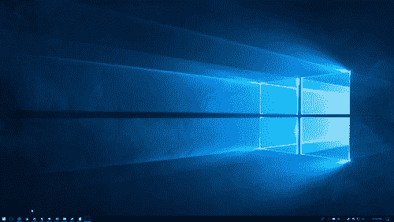
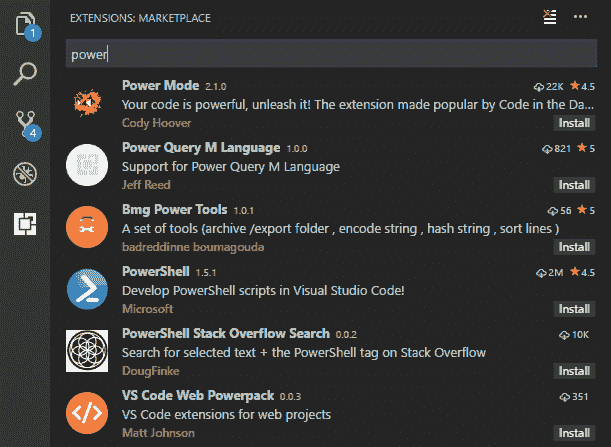

# Visual Studio 代码是我最喜欢的文本编辑器

> 原文：<https://dev.to/terrehbyte/visual-studio-code-is-my-favorite-text-editor-5e0d>

*交叉发布自我的[博客](https://terrehbyte.com/visual-studio-code-is-my-favorite-text-editor/)T3】*

很长一段时间以来，我一直认为 Visual Studio 是我推荐用于大多数用例开发的首选工具。这是我用 C++和 C#编程的第一个工具，也是我再次开始使用 Python 时非常怀念的工具。

最近，我发现自己在问自己是否可以用 VS 代码解决同样的问题。最近听起来很真实。由于我有一段时间处于观望状态，我想我应该花些时间列出一些我越来越喜欢将 VS 代码作为日常驱动程序的原因。

### 工作区专用设置

我和我的同事花了很多时间争论一些相对无害但对我们的编码指南很重要的规则(空格更好)。

在确定了 8 个空格宽的缩进后，我很快意识到我将遇到 Visual Studio 的一个问题:文本编辑器设置只能在程序范围内设置。如果我想遵守我们设定的约定，我将不得不来回切换或者找到一个合适的扩展来这样做。

[T2】](https://res.cloudinary.com/practicaldev/image/fetch/s--zHwA_1qF--/c_limit%2Cf_auto%2Cfl_progressive%2Cq_auto%2Cw_880/https://thepracticaldev.s3.amazonaws.com/i/mjxe0iljn7jye9eg1pfo.PNG)

在 VS 代码中,“工作区”的概念允许你定义一组在打开文件夹时应用的设置。为特定的工作区创建一个覆盖非常简单；我只需要创建一个新文件夹并指定一些覆盖。它遵循在用户级定义它们时使用的相同格式。这让我可以保留我个人项目的设置，同时无缝地遵守我们愉快地达成的约定。

### 启动时间相对较快

[T2】](https://res.cloudinary.com/practicaldev/image/fetch/s--icry3hFm--/c_limit%2Cf_auto%2Cfl_progressive%2Cq_66%2Cw_880/https://thepracticaldev.s3.amazonaws.com/i/776plczjjhl5236v6bvp.gif)

记事本是一个很棒的文本编辑器，可以编辑所有以 CRLF 结尾的文本，但是你还能做什么呢？没有适当的换行符来编辑一切听起来就像一场噩梦。为单个文件或[文件夹](https://blogs.msdn.microsoft.com/vcblog/2016/10/05/bring-your-c-codebase-to-visual-studio-with-open-folder/)打开 Visual Studio 绝对是一个选择，但是你可能要等一会儿。对我来说，答案是 VS 代码。

| 奔跑 | VS 2017 | VS 代码 |
| --- | --- | --- |
| one | 3.5508 | 1.1607 |
| Two | 2.9868 | 1.1258 |
| three | 3.4115 | 1.1736 |
| four | 2.4786 | 1.1928 |
| five | 3.3778 | 1.0983 |
| six | 2.9395 | 1.1373 |
| seven | 3.1672 | 1.1528 |
| eight | 2.8437 | 1.3238 |
| nine | 3.4466 | 1.1818 |
| Ten | 2.9016 | 1.1408 |

| 结果 | VS 2017 | VS 代码 |
| --- | --- | --- |
| 平均 | 3.1104 | 1.1688 |
| 福建话 | 2.4786 | 1.0983 |
| 最大 | 3.5508 | 1.3238 |

以上时间以秒为单位。

我决定做一些不专业的评测，看看在 VS 2017 和 VS 代码中，从启动到开始页面需要多长时间。平均而言，VS 代码准备就绪的速度比 VS 2017 快 2 秒！这并不多，但是如果我打开了很多文件或者发现自己需要经常重启编辑器，这可能会增加。

您可以深入了解我在本[要点](https://gist.github.com/terrehbyte/f7a375d0da08b98c3929f6811ce2cc15)中用于分析的设置和配置背后的细节。

### 跨平台支持

根据 Steam 硬件&软件调查，绝大多数 PC 游戏玩家都在某种版本的 Windows 上玩游戏。(在撰写本文时，这一比例为 98.33%)在游戏开发者中也可以找到类似的统计数据，如果仅仅是为了在与大多数游戏玩家不会太不同的配置上进行游戏测试的话。

> 为了控制和控制，我对使用其他东西感兴趣，但是我的许多学生在他们的家用机器上使用 OS X 或 Ubuntu。

Visual Studio 仅在 Windows 上得到官方支持，但基于 MonoDevelop 的迭代[可用于 Mac](https://www.visualstudio.com/vs/visual-studio-mac/) 。虽然两者共享相同的品牌，但它们确实是完全不同的产品，只是在微软收购其原始维护者 Xamarin 后，它们才开始共享一些逻辑。

Windows、Mac 和 Linux 都得到 VS 代码团队的官方支持。这至少使*又多了一个我们可以继续使用的工具*我们不再觉得有义务将 Windows 作为我们的日常驱动程序！这也意味着我的没有 Windows 的学生有了一个工具，他们可以把它作为他们工具的一部分。

> 大多数学生不习惯使用终端，所以当他们在使用 Git 提交时省略了`-m`开关时，脸上会有很多“WTF”的表情。
> 
> 我想这排除了像 Vim 这样的东西作为他们的替代品。；)

虽然你很难在旧游戏开发工具中找到跨平台支持，但这似乎是当今工具投入资源的一个考虑因素。我只能想象，这在一定程度上是由于越来越需要在各种平台上部署，而不是只在一个平台上部署。

### 通过扩展和设置实现高通用性

[T2】](https://res.cloudinary.com/practicaldev/image/fetch/s--1uOwh8Ao--/c_limit%2Cf_auto%2Cfl_progressive%2Cq_auto%2Cw_880/https://thepracticaldev.s3.amazonaws.com/i/ptnwtp3tu8218nj6vboq.PNG)

Visual Studio 和 [VS Code](https://marketplace.visualstudio.com/vs) 都提供了丰富的扩展库，可以很容易地从你喜欢的网络浏览器和应用程序中浏览。这增加了编辑器的*可扩展性* (heh)，允许您根据自己的偏好和用例进行定制。

VS 代码已经采取了更多的模块化方法，将对主要语言如 [C++](https://marketplace.visualstudio.com/items?itemName=ms-vscode.cpptools) 和 [C#](https://marketplace.visualstudio.com/items?itemName=ms-vscode.csharp) 的支持构建为单独的包，尽管默认包含 TypeScript。这些接口与一组标准 API 接口，以提供通用的代码完成和符号查找功能，这是任何对您选择的语言提供一流支持的 ide 所期望的。

## 心愿单

### 更好的窗口系统

虽然 Atom 和 VS 代码都在朝着这个方向努力，但我还没有找到像 Visual Studio 这么好的窗口系统。它是如此简单，能够撕下任何标签，停靠它，捕捉它，或创建一个新的窗口。

现在，您可以在水平或垂直堆叠的一个、两个或三个编辑器窗格布局之间进行选择。这不太灵活，但是已经足够好地完成工作了。

### 针对不同文件系统的路径规范化

在调试我的虚幻引擎 4 项目时，[缺乏路径规范化](https://github.com/Microsoft/vscode/issues/12448)已经给了我很多痛苦。在我的源代码中放置和管理断点非常顺利，但问题是当断点被触发时会发生什么:打开了“同一个文件”的两个编辑器。

| 路径输入 | 价值 |
| --- | --- |
| 用户打开的路径 | `C:\MyProject\Source\MyGameMode.cpp` |
| 调试器提供的路径 | `C:\myproject\source\mygamemode.cpp` |

当在 NTFS 文件系统中工作时，这两个文件通常会解析为相同的路径，但是大小写的不同会导致 VS 代码将它们视为两个不同的文件，从而导致打开两个不同的编辑器，从而使我的编辑器变得混乱。当我遍历跨越多个源文件的逻辑时，这种情况会加剧，所有这些都会在这个过程中产生大量的编辑器。

> 您可以在相同的路径中存储两个不同的文件，只是大小写不同，但是您需要使用不依赖于 Win32 API 的东西来读写该文件。
> 
> 有关更多信息，请参见此堆栈溢出帖子:[“为什么 NTFS 区分大小写？”](https://superuser.com/questions/364057/why-is-ntfs-case-sensitive)。

## 关闭思绪

综上所述，VS 代码肯定不适合所有人。我坚信找到最能满足您目标的解决方案和工具，而不是尽可能在单一工具的限制下工作。如果你可以选择你的解决方案，那么重要的是要评估是否有更好的东西，你应该朝着它前进。

甚至 [VS Code FAQ](https://code.visualstudio.covs-communitym/docs/supporting/faq#_what-is-the-difference-between-vs-code-and-) 也指出，它的目标只是成为一个轻量级工具，当你只是想编码、构建和调试你的项目时，它是一个可靠的选择。利用更大的工具，如 NVIDIA Nsight 或内置分析等，这些都留给了 Visual Studio 等更大的工具。