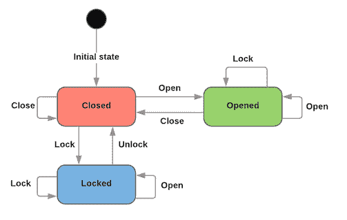
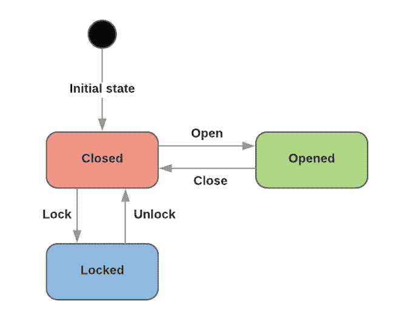

# 用户界面的状态驱动开发(第 2 部分:有限状态机)

> 原文：<https://dev.to/nimmo/state-driven-development-for-user-interfaces-part-2-finite-state-machines-3hgc>

注意:这篇文章假设读者对 Redux 的工作方式有一个基本的了解，尽管如果没有这种了解，核心概念并不会丢失任何东西。不过，如果你在第二部分挠头的话，还是值得看看[解释 Redux like I five](https://dev.to/hemanth/explain-redux-like-im-five)。我也将使用 React，但是这里提出的想法不需要 React。

为了实现我在[上一篇文章](https://dev.to/dnimmo/state-driven-development-for-user-interfaces-part-1-an-introduction-27f1)中讨论的技术，能够从`Finite State Machine`的角度来考虑我们的应用程序特别有帮助。

对于不熟悉 FSM 的人来说，顾名思义，它们只能有有限数量的可能状态，但关键是在任何给定时间只能处于这些状态中的一个状态。

例如，考虑一扇门。它可能在几个州？最初可能是这样的:

```
LOCKED
UNLOCKED
OPENED
CLOSED 
```

Enter fullscreen mode Exit fullscreen mode

这绝对是我们的门可能处于的状态的有限列表，但是你可能已经注意到我们在这里犯了一个错误。我们真的需要为`CLOSED` *和* `UNLOCKED`设置单独的状态吗？嗯，如果我们希望能够说我们的大门只能在有限数量的州中的一个州，那么我会说我们可能不会。我们可以假设`CLOSED`的意思是`UNLOCKED`，因为我们知道我们的门不能(有意义地)同时是`LOCKED`和`OPENED`。因此，也许我们的州应该更像这样:

```
LOCKED
CLOSED
OPENED 
```

Enter fullscreen mode Exit fullscreen mode

现在我们已经弄清楚了我们的状态，我们可能想知道我们的门如何从一个状态转换到另一个状态，对吗？

这是我们门的一个非常简单的状态转换图:

[T2】](https://res.cloudinary.com/practicaldev/image/fetch/s--i3WGWAEl--/c_limit%2Cf_auto%2Cfl_progressive%2Cq_auto%2Cw_880/https://thepracticaldev.s3.amazonaws.com/i/msad1wt8juebhkb216ss.png)

在这种情况下，`initial state`并不重要(我的意思是这些状态中的任何一个都可以作为初始状态)，但是假设我们门的初始状态是`CLOSED`。

而且，你知道吗，我们并不真正关心那些仅仅回到它们之前状态的转换，不是吗？毕竟，它们只是显示了在当前状态下不可用的操作:

[T2】](https://res.cloudinary.com/practicaldev/image/fetch/s--tg7RQvF6--/c_limit%2Cf_auto%2Cfl_progressive%2Cq_auto%2Cw_880/https://thepracticaldev.s3.amazonaws.com/i/avtto0irobpxjze3s6gs.png)

现在，我们并没有花太多的时间来构建虚拟门户，但是我们认为我们已经发现了市场的一个缺口，我们希望通过将门户构建成一个网络应用来填补这个缺口。

我们已经完成了第一步:找出我们的状态和转换。现在是时候写一点代码了。

## 输入 Redux

说“Redux 对此没有必要”当然是多余的。但是因为它恰好是我们想要实现的目标的完美体现，所以这就是我们将要做的。因此，我们可以使用我们的图表，并使用它来编写我们的`store`文件:

```
export
const actionTypes = {
  OPEN: 'OPEN',
  CLOSE: 'CLOSE',
  LOCK: 'LOCK',
  UNLOCK: 'UNLOCK',
};

export
const stateTypes = {
  OPENED: { 
    name: 'OPENED', 
    availableActions: [actionTypes.CLOSE] 
  },
  CLOSED: { 
    name: 'CLOSED', 
    availableActions: [actionTypes.OPEN, actionTypes.LOCK] 
  },
  LOCKED: { 
    name: 'LOCKED', 
    availableActions: [actionTypes.UNLOCK] 
  },
};

const initialState = {
  _stateType: stateTypes.CLOSED,
};

export
const open = 
  () => ({ 
    type: actionTypes.OPEN,  
  });

export
const close =
  () => ({ 
    type: actionTypes.CLOSE,  
  });

export
const lock =
  () => ({ 
    type: actionTypes.LOCK,  
  });

export
const unlock =
  () => ({ 
    type: actionTypes.UNLOCK,  
  });

const door =
  (state = initialState, action) => {
    const actionIsAllowed =
      state._stateType.availableActions.includes(action.type);

    if(!actionIsAllowed) return state;

    switch(action.type) {
      case actionTypes.OPEN: 
        return { _stateType: stateTypes.OPENED };

      case actionTypes.CLOSE:
      case actionTypes.UNLOCK:
        return { _stateType: stateTypes.CLOSED };

      case actionTypes.LOCK:
        return { _stateType: stateTypes.LOCKED };

      default: 
        return state;
    }
  };

export default door; 
```

Enter fullscreen mode Exit fullscreen mode

现在我们有了我们的`reducer`，它是我们状态转换图的编码版本。你注意到从图到代码有多容易了吗？当然，这个例子的复杂程度是非常低的，但是我希望你能明白为什么我们发现这个非常有用。

这里唯一“不寻常”的是使用了`_stateType`，您可以看到它还包含了给定状态下可用操作的列表。这样做的有用性可能值得怀疑，但是我相信它为代码的读者提供了额外的文档，并且在从一种状态转换到另一种状态时提供了防止错误的潜在安全网。

## 实现

把这些连接到一个容器里来支撑我们的门，看起来是这样的

```
import React from 'react';
import { connect } from 'react-redux';
import { bindActionCreators } from 'redux';

import { 
  stateTypes,
  close as closeFunction,
  open as openFunction,
  lock as lockFunction,
  unlock as unlockFunction, 
} from './path/to/store';

import OpenedDoor from './path/to/opened_door';
import ClosedDoor from './path/to/closed_door';
import LockedDoor from './path/to/locked_door';

const Door = 
  ({ 
    _stateType, 
    open,
    close,
    lock,
    unlock,
  }) => {
    switch(_stateType) {
      case stateTypes.OPENED:
        return (
          <OpenedDoor 
            close={close} 
          />);

      case stateTypes.CLOSED: 
        return (
          <ClosedDoor 
            open={open} 
            lock={lock}
          />);

      case stateTypes.LOCKED:
        return (
          <LockedDoor 
            unlock={unlock}
          />);

      default: 
        return null;
    }
  };

const mapStateToProps = 
  ({ door }) => ({
    _stateType: door._stateType,
  });

const mapDispatchToProps =
  dispatch => 
    bindActionCreators(
      {
        open: openFunction,
        close: closeFunction,
        lock: lockFunction,
        unlock: unlockFunction,
      }, dispatch);

export default connect(
  mapStateToProps,
  mapDispatchToProps,
)(Door); 
```

Enter fullscreen mode Exit fullscreen mode

本质上，容器的呈现方式与在我们的`reducer`中处理`actions`的方式完全相同；`stateType`上的 switch 语句返回给定状态的正确子组件。

从这里开始，我们将为每一种“门”类型(开/关/锁)提供单独的无状态组件，这些组件将根据门所处的状态呈现给用户，并且只允许基于我们原始状态转换图的可用操作(继续并仔细检查；它们应该匹配得很好)。

值得注意的是，组件的实际呈现几乎感觉像是事后的想法这一事实并不是巧合(以至于我甚至不认为*展示*组件本身的代码会给这篇文章增加任何价值，但是如果你不这么认为，你可以在 Github 上查看它们[)。将状态放在第一位来考虑有助于简单的计划，实际上把它放在一起是非常简单的。这种方法实际上是促进更多的预先思考；虽然在比我们的门更复杂的应用中好处更明显。](https://github.com/dnimmo/state-machine-example/tree/part-1)

在下一部分中，我们将通过引入[一种处理并行状态机](https://dev.to/dnimmo/state-driven-development-for-user-interfaces-part-3-parallel-state-machines-2oja)的方法，来看看如何扩展它，使其在实际应用中更有用。