# 为 Angular part 1 开发一个跨平台的 Angular 和 Ignite UI 应用程序

> 原文:[https://dev . to/kena kamu/develop-a-cross-platform-application-by-angular-and-ignite-ui-for-angular-part-1-22cc](https://dev.to/kenakamu/develop-a-cross-platform-application-by-angular-and-ignite-ui-for-angular-part-1-22cc)

在本文中，我将创建一个简单的示例用户管理应用程序。

# 点燃 UI 进行角化

Angular 的 Ignite UI 是从 Infragistics 发布的。如果你把它用于社区活动，它是免费的。 [Ignite UI for Angular](https://www.infragistics.com/products/ignite-ui-angular)
即使它作为移动应用程序运行得很好，我还是会先创建桌面大小的应用程序。

## 我在这篇文章中使用的环境

*   Node.js 版本 8.7.0 和 npm 版本 5.5.1
*   Visual Studio 代码

# 创建一个角度项目

按照以下步骤创建新的角度项目。

1.通过 npm 安装 Angular CLI

```
npm install -g @angular/cli 
```

<svg width="20px" height="20px" viewBox="0 0 24 24" class="highlight-action crayons-icon highlight-action--fullscreen-on"><title>Enter fullscreen mode</title></svg> <svg width="20px" height="20px" viewBox="0 0 24 24" class="highlight-action crayons-icon highlight-action--fullscreen-off"><title>Exit fullscreen mode</title></svg>

2.运行 Angular CLI 命令创建项目。在这种情况下，我指定- routing 选项来为项目启用路由。

```
ng new ignite-ui-app --routing
cd ignite-ui-app 
```

<svg width="20px" height="20px" viewBox="0 0 24 24" class="highlight-action crayons-icon highlight-action--fullscreen-on"><title>Enter fullscreen mode</title></svg> <svg width="20px" height="20px" viewBox="0 0 24 24" class="highlight-action crayons-icon highlight-action--fullscreen-off"><title>Exit fullscreen mode</title></svg>

3.然后安装 Ignite UI 组件和依赖项。hammer.js 是支持触摸和手势的库。

```
npm install igniteui-angular hammerjs @types/hammerjs
npm install 
```

<svg width="20px" height="20px" viewBox="0 0 24 24" class="highlight-action crayons-icon highlight-action--fullscreen-on"><title>Enter fullscreen mode</title></svg> <svg width="20px" height="20px" viewBox="0 0 24 24" class="highlight-action crayons-icon highlight-action--fullscreen-off"><title>Exit fullscreen mode</title></svg>

4.通过 Visual Studio 代码启动项目。

```
code . 
```

<svg width="20px" height="20px" viewBox="0 0 24 24" class="highlight-action crayons-icon highlight-action--fullscreen-on"><title>Enter fullscreen mode</title></svg> <svg width="20px" height="20px" viewBox="0 0 24 24" class="highlight-action crayons-icon highlight-action--fullscreen-off"><title>Exit fullscreen mode</title></svg>

5.然后将样式的 css 包含在。angular-cli.json。

[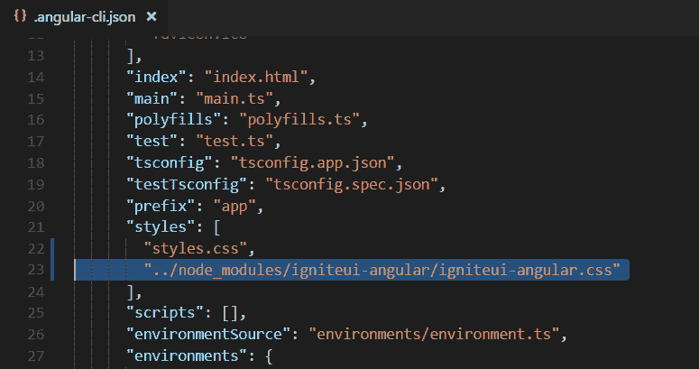T2】](https://res.cloudinary.com/practicaldev/image/fetch/s--AqN3ylLx--/c_limit%2Cf_auto%2Cfl_progressive%2Cq_auto%2Cw_880/https://qiita-image-store.s3.amazonaws.com/0/214116/a03dd890-ae18-7f4e-a2e0-b1d4bf05fef3.png)

6.尝试在此时运行它，以确保一切正常。

```
ng server --open 
```

<svg width="20px" height="20px" viewBox="0 0 24 24" class="highlight-action crayons-icon highlight-action--fullscreen-on"><title>Enter fullscreen mode</title></svg> <svg width="20px" height="20px" viewBox="0 0 24 24" class="highlight-action crayons-icon highlight-action--fullscreen-off"><title>Exit fullscreen mode</title></svg>

它将打开一个浏览器，您将看到如下所示的基本应用程序。
[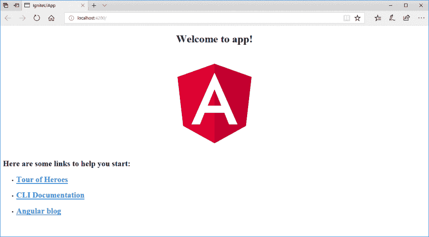T3】](https://res.cloudinary.com/practicaldev/image/fetch/s--j4-UcdTr--/c_limit%2Cf_auto%2Cfl_progressive%2Cq_auto%2Cw_880/https://qiita-image-store.s3.amazonaws.com/0/214116/321f1a30-be07-edac-4983-9eb933358e7f.png)

立即开始使用 Ignite UI 开发应用程序！

# 创建一个应用外壳

## 导航栏

1.首先，让我们在应用程序的顶部添加导航。要使用 Ignite UI 控件，需要在 src/app/app.module.ts 中注册适当的模块，我还在这里添加了 hammer.js 作为依赖模块。

src/app/app.module.ts

```
import { BrowserModule } from '@angular/platform-browser';
import { NgModule } from '@angular/core';
import { AppRoutingModule } from './app-routing.module';
import { AppComponent } from './app.component';
import { IgxNavbarModule } from 'igniteui-angular/main';
import "hammerjs"; 

@NgModule({
  declarations: [
    AppComponent
  ],
  imports: [
    BrowserModule,
    AppRoutingModule,
    IgxNavbarModule
  ],
  providers: [],
  bootstrap: [AppComponent]
})
export class AppModule { } 
```

<svg width="20px" height="20px" viewBox="0 0 24 24" class="highlight-action crayons-icon highlight-action--fullscreen-on"><title>Enter fullscreen mode</title></svg> <svg width="20px" height="20px" viewBox="0 0 24 24" class="highlight-action crayons-icon highlight-action--fullscreen-off"><title>Exit fullscreen mode</title></svg>

2.将组件添加到。html 文件和逻辑。ts 文件。在这种情况下，我使用“菜单”图标，但你可以从[https://material.io/icons/](https://material.io/icons/)选择你想要的任何东西。

src/app/app.component.html

```
<!--The content below is only a placeholder and can be replaced.-->
<igx-navbar [title]="title"    
   actionButtonIcon="menu"
   (onAction)="onClickMenu()">
</igx-navbar>

<router-outlet></router-outlet> 
```

<svg width="20px" height="20px" viewBox="0 0 24 24" class="highlight-action crayons-icon highlight-action--fullscreen-on"><title>Enter fullscreen mode</title></svg> <svg width="20px" height="20px" viewBox="0 0 24 24" class="highlight-action crayons-icon highlight-action--fullscreen-off"><title>Exit fullscreen mode</title></svg>

src/app/app.component.ts

```
import { Component } from '@angular/core';

@Component({
  selector: 'app-root',
  templateUrl: './app.component.html',
  styles: []
})
export class AppComponent {
  title = 'Ignite Ui App';

  onClickMenu(){
    window.alert("menu clicked");
  }
} 
```

<svg width="20px" height="20px" viewBox="0 0 24 24" class="highlight-action crayons-icon highlight-action--fullscreen-on"><title>Enter fullscreen mode</title></svg> <svg width="20px" height="20px" viewBox="0 0 24 24" class="highlight-action crayons-icon highlight-action--fullscreen-off"><title>Exit fullscreen mode</title></svg>

3.一旦保存，浏览器会自动重新加载内容。
[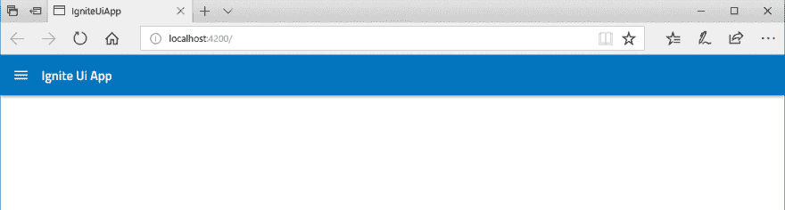T3】](https://res.cloudinary.com/practicaldev/image/fetch/s--4lGkrHMa--/c_limit%2Cf_auto%2Cfl_progressive%2Cq_auto%2Cw_880/https://qiita-image-store.s3.amazonaws.com/0/214116/a51f0dc4-8120-da92-1ea6-86a7fe284a1b.png)

4.单击左上角的菜单图标，确保它显示一个警告。

## 图标

有许多方法可以利用图标。让我们将它们添加到导航栏中。

1.首先添加一个模块。

src/app/app.module.ts

```
import { BrowserModule } from '@angular/platform-browser';
import { NgModule } from '@angular/core';
import { AppRoutingModule } from './app-routing.module';
import { AppComponent } from './app.component';
import { IgxNavbarModule, IgxIconModule } from 'igniteui-angular/main';
import "hammerjs"; 

@NgModule({
  declarations: [
    AppComponent
  ],
  imports: [
    BrowserModule,
    AppRoutingModule,
    IgxNavbarModule,
    IgxIconModule
  ],
  providers: [],
  bootstrap: [AppComponent]
})
export class AppModule { } 
```

<svg width="20px" height="20px" viewBox="0 0 24 24" class="highlight-action crayons-icon highlight-action--fullscreen-on"><title>Enter fullscreen mode</title></svg> <svg width="20px" height="20px" viewBox="0 0 24 24" class="highlight-action crayons-icon highlight-action--fullscreen-off"><title>Exit fullscreen mode</title></svg>

2.然后将“添加”图标添加到 igx-icon 元素中。

src/app/app.component.html

```
<!--The content below is only a placeholder and can be replaced.-->
<igx-navbar [title]="title"    
   actionButtonIcon="menu"
   (onAction)="onClickMenu()">
   <igx-icon name="add" (click)="onClickAdd()"></igx-icon>
   <igx-icon name="refresh" (click)="onClickRefresh()"></igx-icon>
</igx-navbar>

<router-outlet></router-outlet> 
```

<svg width="20px" height="20px" viewBox="0 0 24 24" class="highlight-action crayons-icon highlight-action--fullscreen-on"><title>Enter fullscreen mode</title></svg> <svg width="20px" height="20px" viewBox="0 0 24 24" class="highlight-action crayons-icon highlight-action--fullscreen-off"><title>Exit fullscreen mode</title></svg>

src/app/app.component.ts

```
import { Component } from '@angular/core';

@Component({
  selector: 'app-root',
  templateUrl: './app.component.html',
  styleUrls: ['./app.component.css']
})

export class AppComponent {
  title = 'Ignite Ui App';

  onClickMenu(){
    window.alert("menu clicked");
  }

  onClickAdd(){
    window.alert("add clicked");
  }

  onClickRefresh(){
    window.alert("refresh clicked");
  }
} 
```

<svg width="20px" height="20px" viewBox="0 0 24 24" class="highlight-action crayons-icon highlight-action--fullscreen-on"><title>Enter fullscreen mode</title></svg> <svg width="20px" height="20px" viewBox="0 0 24 24" class="highlight-action crayons-icon highlight-action--fullscreen-off"><title>Exit fullscreen mode</title></svg>

3.保存后，尝试单击每个按钮。
[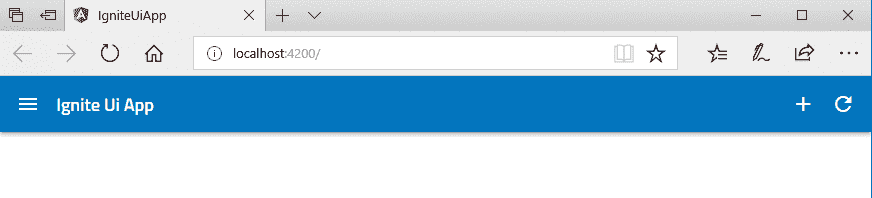T3】](https://res.cloudinary.com/practicaldev/image/fetch/s--mDJhF-bF--/c_limit%2Cf_auto%2Cfl_progressive%2Cq_auto%2Cw_880/https://qiita-image-store.s3.amazonaws.com/0/214116/91d4d34c-33e5-52a5-946c-11e0922c1b5a.png)

# 列表

现在应用程序顶部有了导航栏，让我们在左侧窗格添加列表。

## 滚动列表

Ignite UI 提供“列表”控件和“滚动”控件。List 提供了更多功能，scroll 提供了滚动功能。我在这个应用程序中使用滚动控件。

1.首先添加模块。

```
import { BrowserModule } from '@angular/platform-browser';
import { NgModule } from '@angular/core';
import { AppRoutingModule } from './app-routing.module';
import { AppComponent } from './app.component';
import { IgxNavbarModule, IgxIconModule, IgxScrollModule } from 'igniteui-angular/main';
import "hammerjs"; 

@NgModule({
  declarations: [
    AppComponent
  ],
  imports: [
    BrowserModule,
    AppRoutingModule,
    IgxNavbarModule, 
    IgxIconModule, 
    IgxScrollModule, 
  ],
  providers: [],
  bootstrap: [AppComponent]
})
export class AppModule { } 
```

<svg width="20px" height="20px" viewBox="0 0 24 24" class="highlight-action crayons-icon highlight-action--fullscreen-on"><title>Enter fullscreen mode</title></svg> <svg width="20px" height="20px" viewBox="0 0 24 24" class="highlight-action crayons-icon highlight-action--fullscreen-off"><title>Exit fullscreen mode</title></svg>

2.然后将角度分量添加到应用程序中。您可以继续在主模块中添加特性，但是为了简化，您可以为每个特性创建单独的模块。

```
ng generate component list 
```

<svg width="20px" height="20px" viewBox="0 0 24 24" class="highlight-action crayons-icon highlight-action--fullscreen-on"><title>Enter fullscreen mode</title></svg> <svg width="20px" height="20px" viewBox="0 0 24 24" class="highlight-action crayons-icon highlight-action--fullscreen-off"><title>Exit fullscreen mode</title></svg>

3.修改 app.component.css 以加载添加的模块，并更新 app.component.css 以进行样式设置。要进行双向绑定，可以像[(selectedUser)]一样组合[]和()。

src/app/app.component.html

```
<!--The content below is only a placeholder and can be replaced.-->
<igx-navbar [title]="title" actionButtonIcon="menu" (onAction)="onClickMenu()">
  <igx-icon name="add" (click)="onClickAdd()"></igx-icon>
  <igx-icon name="refresh" (click)="onClickRefresh()"></igx-icon>
</igx-navbar>

<app-list [(selectedUser)]="selectedUser"></app-list> 
<router-outlet></router-outlet>
<div>{{selectedUser.name}}</div> 
```

<svg width="20px" height="20px" viewBox="0 0 24 24" class="highlight-action crayons-icon highlight-action--fullscreen-on"><title>Enter fullscreen mode</title></svg> <svg width="20px" height="20px" viewBox="0 0 24 24" class="highlight-action crayons-icon highlight-action--fullscreen-off"><title>Exit fullscreen mode</title></svg>

src/app/app.component.css

```
app-list, div {
    float: left;
} 
```

<svg width="20px" height="20px" viewBox="0 0 24 24" class="highlight-action crayons-icon highlight-action--fullscreen-on"><title>Enter fullscreen mode</title></svg> <svg width="20px" height="20px" viewBox="0 0 24 24" class="highlight-action crayons-icon highlight-action--fullscreen-off"><title>Exit fullscreen mode</title></svg>

src/app/app.component.ts

```
import { Component } from '@angular/core';
import { User } from './models/user';

@Component({
  selector: 'app-root',
  templateUrl: './app.component.html',
  styleUrls: ['./app.component.css']
})

export class AppComponent {
  title = 'Ignite Ui App';
  public selectedUser: User = new User("", "", 0);

  onClickMenu() {
    window.alert("menu clicked");
  }

  onClickAdd() {
    window.alert("add clicked");
  }

  onClickRefresh() {
    window.alert("refresh clicked");
  }
} 
```

<svg width="20px" height="20px" viewBox="0 0 24 24" class="highlight-action crayons-icon highlight-action--fullscreen-on"><title>Enter fullscreen mode</title></svg> <svg width="20px" height="20px" viewBox="0 0 24 24" class="highlight-action crayons-icon highlight-action--fullscreen-off"><title>Exit fullscreen mode</title></svg>

3.接下来，在 Models 文件夹中添加一个用户模型。您可以通过运行 Angular CLI 命令来完成此操作。

```
ng generate class models/user 
```

<svg width="20px" height="20px" viewBox="0 0 24 24" class="highlight-action crayons-icon highlight-action--fullscreen-on"><title>Enter fullscreen mode</title></svg> <svg width="20px" height="20px" viewBox="0 0 24 24" class="highlight-action crayons-icon highlight-action--fullscreen-off"><title>Exit fullscreen mode</title></svg>

src/app/models/user.ts

```
export class User {
    public image: string
    public name: string
    public id: number

    constructor(image: string, name: string, id: number) {
        this.image = image;
        this.name = name;
        this.id = id;
    }
} 
```

<svg width="20px" height="20px" viewBox="0 0 24 24" class="highlight-action crayons-icon highlight-action--fullscreen-on"><title>Enter fullscreen mode</title></svg> <svg width="20px" height="20px" viewBox="0 0 24 24" class="highlight-action crayons-icon highlight-action--fullscreen-off"><title>Exit fullscreen mode</title></svg>

4.现在，修改刚刚添加的列表组件。首先导入模块，更新 UI。我这次用的模块是 IxgScroll 和 IgxScrollEvent，支持滚动和相关事件。要绑定 selectedUser，需要添加@Input 和@Output 属性，并在 OnItemSelect function 中返回值。一旦你习惯了 Angular 和 binding 的工作方式，这应该不会太难。

src/app/list/list . component . ts

```
import { Component, OnInit, Input, Output, EventEmitter } from '@angular/core';
import { IgxScroll, IgxScrollEvent } from "igniteui-angular/main";
import { User } from '../models/user';

@Component({
  selector: 'app-list',
  templateUrl: './list.component.html',
  styleUrls: ['./list.component.css']
})
export class ListComponent implements OnInit {
  @Input() selectedUser: User;
  @Output() selectedUserChange: EventEmitter<User> = new EventEmitter();

  constructor() {
    for (let i = 1; i <= 22; i++) {
      this.users.push(new User(
        `http://www.infragistics.com/angular-demos/asseimg/avatar/${i}.jpg`,
        "User: " + i,
        i
      ));
    }

    this.visibleUsers = this.users.slice(0, this.visibleUsersCount);
  }

  public users: User[] = new Array<User>();
  public visibleUsers: User[];
  public visibleUsersCount: number = 8;

  ngOnInit() {
  }

  private onItemSelect(user: User): void {
    this.selectedUserChange.emit(user);
  }

  private updateList($event: IgxScrollEvent): void {
    this.visibleUsers = this.users.slice($event.currentTop, $event.currentTop + this.visibleUsersCount);
  }
} 
```

<svg width="20px" height="20px" viewBox="0 0 24 24" class="highlight-action crayons-icon highlight-action--fullscreen-on"><title>Enter fullscreen mode</title></svg> <svg width="20px" height="20px" viewBox="0 0 24 24" class="highlight-action crayons-icon highlight-action--fullscreen-off"><title>Exit fullscreen mode</title></svg>

5.修改 UI 组件。

src/app/list/list . component . html

```
<igx-scroll #scroll (onScroll)="updateList($event)" 
    [visibleItemsCount]="visibleUsersCount" 
    [itemHeight]="70" 
    [totalItemsCount]="users.length">
    <ul class="list">
        <li class="list-item" *ngFor="let user of visibleUsers" (click)="onItemSelect(user)">
            <h5 class="list-item-value">{{user.name}}</h5>
        </li>
    </ul>
</igx-scroll> 
```

<svg width="20px" height="20px" viewBox="0 0 24 24" class="highlight-action crayons-icon highlight-action--fullscreen-on"><title>Enter fullscreen mode</title></svg> <svg width="20px" height="20px" viewBox="0 0 24 24" class="highlight-action crayons-icon highlight-action--fullscreen-off"><title>Exit fullscreen mode</title></svg>

src/app/list/list . component . CSS

```
.list {
    width: 250px;
} 
```

<svg width="20px" height="20px" viewBox="0 0 24 24" class="highlight-action crayons-icon highlight-action--fullscreen-on"><title>Enter fullscreen mode</title></svg> <svg width="20px" height="20px" viewBox="0 0 24 24" class="highlight-action crayons-icon highlight-action--fullscreen-off"><title>Exit fullscreen mode</title></svg>

6.保存并确认更改。您可以单击列表中的任何项目，查看它是如何传递给 main 的。

[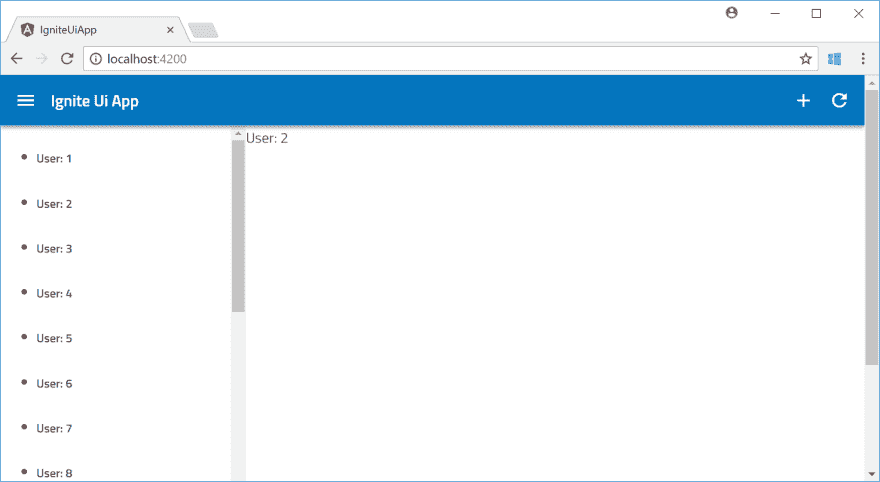T2】](https://res.cloudinary.com/practicaldev/image/fetch/s--qUeWzoU2--/c_limit%2Cf_auto%2Cfl_progressive%2Cq_auto%2Cw_880/https://qiita-image-store.s3.amazonaws.com/0/214116/6d0028fe-4543-d18c-7cfe-f718538fa16c.png)

## 头像

列表中的图片看起来并不酷，因为最近每个个人资料图片都应该是圆形的。头像控制解决了。

1.照常添加模块。

```
import { BrowserModule } from '@angular/platform-browser';
import { NgModule } from '@angular/core';
import { AppRoutingModule } from './app-routing.module';
import { AppComponent } from './app.component';
import { IgxNavbarModule, IgxIconModule, IgxScrollModule, IgxAvatarModule } from 'igniteui-angular/main';
import "hammerjs"; 
import { ListComponent } from './list/list.component';

@NgModule({
  declarations: [
    AppComponent,
    ListComponent
  ],
  imports: [
    BrowserModule,
    AppRoutingModule,
    IgxNavbarModule,
    IgxIconModule,
    IgxScrollModule,
    IgxAvatarModule,  ],
  providers: [],
  bootstrap: [AppComponent]
})
export class AppModule { } 
```

<svg width="20px" height="20px" viewBox="0 0 24 24" class="highlight-action crayons-icon highlight-action--fullscreen-on"><title>Enter fullscreen mode</title></svg> <svg width="20px" height="20px" viewBox="0 0 24 24" class="highlight-action crayons-icon highlight-action--fullscreen-off"><title>Exit fullscreen mode</title></svg>

2.将 IgxAvatar 也导入 list.component.ts，以便可以在相关的 html 中使用它。

src/app/list/list . component . ts

```
import { Component, OnInit, Input, Output, EventEmitter } from '@angular/core';
import { IgxScroll, IgxScrollEvent, IgxAvatar } from "igniteui-angular/main";
import { User } from '../models/user';

@Component({
  selector: 'app-list',
  templateUrl: './list.component.html',
  styleUrls: ['./list.component.css']
})
export class ListComponent implements OnInit {
  @Input() selectedUser: User;
  @Output() selectedUserChange: EventEmitter<User> = new EventEmitter();

  constructor() {
    for (let i = 1; i <= 22; i++) {
      this.users.push(new User(
        `http://www.infragistics.com/angular-demos/asseimg/avatar/${i}.jpg`,
        "User: " + i,
        i
      ));
    }

    this.visibleUsers = this.users.slice(0, this.visibleUsersCount);
  }

  public users: User[] = new Array<User>();
  public visibleUsers: User[];
  public visibleUsersCount: number = 8;

  ngOnInit() {
  }

  private onItemSelect(user: User): void {
    this.selectedUserChange.emit(user);
  }

  private updateList($event: IgxScrollEvent): void {
    this.visibleUsers = this.users.slice($event.currentTop, $event.currentTop + this.visibleUsersCount);
  }
} 
```

<svg width="20px" height="20px" viewBox="0 0 24 24" class="highlight-action crayons-icon highlight-action--fullscreen-on"><title>Enter fullscreen mode</title></svg> <svg width="20px" height="20px" viewBox="0 0 24 24" class="highlight-action crayons-icon highlight-action--fullscreen-off"><title>Exit fullscreen mode</title></svg>

3.最后，更新 html 和 css。

src/app/list/list . component . html

```
<igx-scroll #scroll (onScroll)="updateList($event)" 
    [visibleItemsCount]="visibleUsersCount" 
    [itemHeight]="70" 
    [totalItemsCount]="users.length">
    <ul class="list">
        <li class="list-item" *ngFor="let user of visibleUsers" (click)="onItemSelect(user)">
            <igx-avatar class="list-item-image" roundShape="true" src="{{user.image}}"></igx-avatar>
            <h5 class="list-item-value">{{user.name}}</h5>
        </li>
    </ul>
</igx-scroll> 
```

<svg width="20px" height="20px" viewBox="0 0 24 24" class="highlight-action crayons-icon highlight-action--fullscreen-on"><title>Enter fullscreen mode</title></svg> <svg width="20px" height="20px" viewBox="0 0 24 24" class="highlight-action crayons-icon highlight-action--fullscreen-off"><title>Exit fullscreen mode</title></svg>

src/app/list/list . component . CSS

```
.list {
    width: 250px;
}

.list-item {
    list-style: none;
    height: 64px;
    display: flex;
    flex-direction: row;
    justify-content: flex-start;
    align-items: center;    
}

.list-item-image, .list-item-value {
    flex-grow: 1;
    flex-shrink: 1;
    flex-basis: auto;
} 
```

<svg width="20px" height="20px" viewBox="0 0 24 24" class="highlight-action crayons-icon highlight-action--fullscreen-on"><title>Enter fullscreen mode</title></svg> <svg width="20px" height="20px" viewBox="0 0 24 24" class="highlight-action crayons-icon highlight-action--fullscreen-off"><title>Exit fullscreen mode</title></svg>

4.保存并检查结果。
[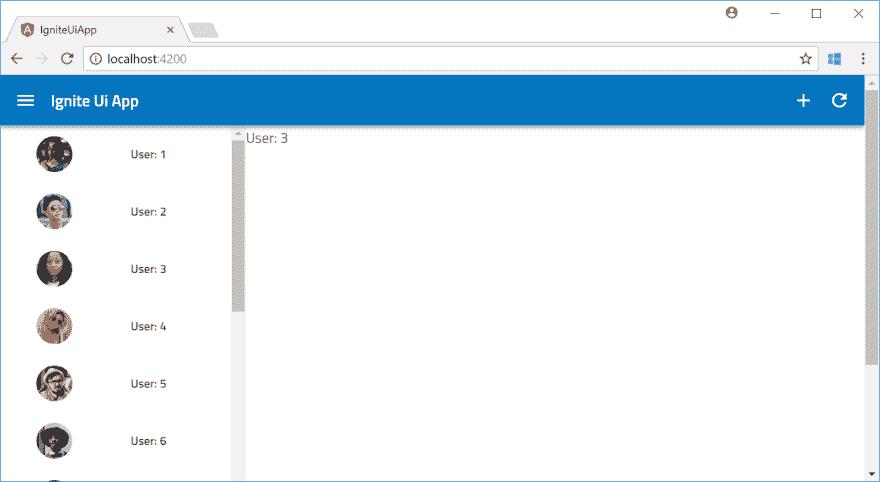T3】](https://res.cloudinary.com/practicaldev/image/fetch/s--lcWy1ZTP--/c_limit%2Cf_auto%2Cfl_progressive%2Cq_auto%2Cw_880/https://qiita-image-store.s3.amazonaws.com/0/214116/a41f5453-3c83-b126-7550-8723d496039e.png)

# 详细画面

现在应用程序有了导航和列表，让我们添加另一个组件来显示用户详细信息。我还添加了将用户信息作为数据源提供给应用程序的服务。

## 角度 2 路由和细节组件。

在使用 Ignite UI 实现细节屏幕之前，我重新构建了应用程序以利用路由功能。

1.运行以下命令添加详图构件。

```
ng generate component detail 
```

<svg width="20px" height="20px" viewBox="0 0 24 24" class="highlight-action crayons-icon highlight-action--fullscreen-on"><title>Enter fullscreen mode</title></svg> <svg width="20px" height="20px" viewBox="0 0 24 24" class="highlight-action crayons-icon highlight-action--fullscreen-off"><title>Exit fullscreen mode</title></svg>

2.将组件添加到 app-routing.module.ts，以便 Angular 将模块识别为路由的一部分。它需要“id”作为详图构件的参数。

src/app/app-routing . module . ts

```
import { NgModule } from '@angular/core';
import { Routes, RouterModule } from '@angular/router';
import { DetailComponent } from './detail/detail.component'; 

const routes: Routes = [
  { path: 'detail/:id', component: DetailComponent } 
];

@NgModule({
  imports: [RouterModule.forRoot(routes)],
  exports: [RouterModule]
})
export class AppRoutingModule { } 
```

<svg width="20px" height="20px" viewBox="0 0 24 24" class="highlight-action crayons-icon highlight-action--fullscreen-on"><title>Enter fullscreen mode</title></svg> <svg width="20px" height="20px" viewBox="0 0 24 24" class="highlight-action crayons-icon highlight-action--fullscreen-off"><title>Exit fullscreen mode</title></svg>

3.更新应用程序组件以删除测试数据并选择用户，因为我们不再需要路由功能。

src/app/app.component.ts

```
import { Component } from '@angular/core';
import { User } from './models/user';

@Component({
  selector: 'app-root',
  templateUrl: './app.component.html',
  styleUrls: ['./app.component.css']
})

export class AppComponent {
  title = 'Ignite Ui App';

  onClickMenu() {
    window.alert("menu clicked");
  }

  onClickAdd() {
    window.alert("add clicked");
  }

  onClickRefresh() {
    window.alert("refresh clicked");
  }
} 
```

<svg width="20px" height="20px" viewBox="0 0 24 24" class="highlight-action crayons-icon highlight-action--fullscreen-on"><title>Enter fullscreen mode</title></svg> <svg width="20px" height="20px" viewBox="0 0 24 24" class="highlight-action crayons-icon highlight-action--fullscreen-off"><title>Exit fullscreen mode</title></svg>

src/app/app.component.html

```
<!--The content below is only a placeholder and can be replaced.-->
<igx-navbar [title]="title" actionButtonIcon="menu" (onAction)="onClickMenu()">
  <igx-icon name="add" (click)="onClickAdd()"></igx-icon>
  <igx-icon name="refresh" (click)="onClickRefresh()"></igx-icon>
</igx-navbar>

<app-list></app-list> 
<router-outlet></router-outlet> 
```

<svg width="20px" height="20px" viewBox="0 0 24 24" class="highlight-action crayons-icon highlight-action--fullscreen-on"><title>Enter fullscreen mode</title></svg> <svg width="20px" height="20px" viewBox="0 0 24 24" class="highlight-action crayons-icon highlight-action--fullscreen-off"><title>Exit fullscreen mode</title></svg>

src/app/app.component.css

```
app-list, router-outlet {
    float: left;
} 
```

<svg width="20px" height="20px" viewBox="0 0 24 24" class="highlight-action crayons-icon highlight-action--fullscreen-on"><title>Enter fullscreen mode</title></svg> <svg width="20px" height="20px" viewBox="0 0 24 24" class="highlight-action crayons-icon highlight-action--fullscreen-off"><title>Exit fullscreen mode</title></svg>

4.更新 detail.component.ts 和 html 以接收用户 id 参数。

src/app/detail/detail . component . ts

```
import { Component, OnInit } from '@angular/core';
import { ActivatedRoute } from '@angular/router';
@Component({
  selector: 'app-detail',
  templateUrl: './detail.component.html',
  styleUrls: ['./detail.component.css']
})
export class DetailComponent implements OnInit {

  public id: string;
  constructor( private route: ActivatedRoute ) {
  }

  ngOnInit() {
    // Monitoring the parameter change.
    this.route.params.subscribe(params => {
      this.id = params.id;
    });
  }
} 
```

<svg width="20px" height="20px" viewBox="0 0 24 24" class="highlight-action crayons-icon highlight-action--fullscreen-on"><title>Enter fullscreen mode</title></svg> <svg width="20px" height="20px" viewBox="0 0 24 24" class="highlight-action crayons-icon highlight-action--fullscreen-off"><title>Exit fullscreen mode</title></svg>

src/app/detail/detail . component . html

```
<p>
  {{id}}
</p> 
```

<svg width="20px" height="20px" viewBox="0 0 24 24" class="highlight-action crayons-icon highlight-action--fullscreen-on"><title>Enter fullscreen mode</title></svg> <svg width="20px" height="20px" viewBox="0 0 24 24" class="highlight-action crayons-icon highlight-action--fullscreen-off"><title>Exit fullscreen mode</title></svg>

5.接下来，修改列表组件以采用路由。路由器作为构造函数被传递，你可能想知道它是从哪里来的。这是 Angular 的一个注入特性，你可以很容易地注入任何注册到应用程序的服务。同时删除选定用户的输入/输出。

src/app/list/list . component . ts

```
import { Component, OnInit, EventEmitter } from '@angular/core';
import { IgxScroll, IgxScrollEvent, IgxAvatar } from "igniteui-angular/main";
import { User } from '../models/user';
import { Router } from '@angular/router';

@Component({
  selector: 'app-list',
  templateUrl: './list.component.html',
  styleUrls: ['./list.component.css']
})
export class ListComponent implements OnInit {

  constructor(private router: Router) {
    for (let i = 1; i <= 22; i++) {
      this.users.push(new User(
        `http://www.infragistics.com/angular-demos/asseimg/avatar/${i}.jpg`,
        "User: " + i,
        i
      ));
    }

    this.visibleUsers = this.users.slice(0, this.visibleUsersCount);
  }

  public users: User[] = new Array<User>();
  public visibleUsers: User[];
  public visibleUsersCount: number = 8;

  ngOnInit() {
  }

  private onItemSelect(user: User): void {
    this.router.navigate([`/detail/${user.id}`]);
  }

  private updateList($event: IgxScrollEvent): void {
    this.visibleUsers = this.users.slice($event.currentTop, $event.currentTop + this.visibleUsersCount);
  }
} 
```

<svg width="20px" height="20px" viewBox="0 0 24 24" class="highlight-action crayons-icon highlight-action--fullscreen-on"><title>Enter fullscreen mode</title></svg> <svg width="20px" height="20px" viewBox="0 0 24 24" class="highlight-action crayons-icon highlight-action--fullscreen-off"><title>Exit fullscreen mode</title></svg>

6.保存并确认应用程序是否按预期工作。

[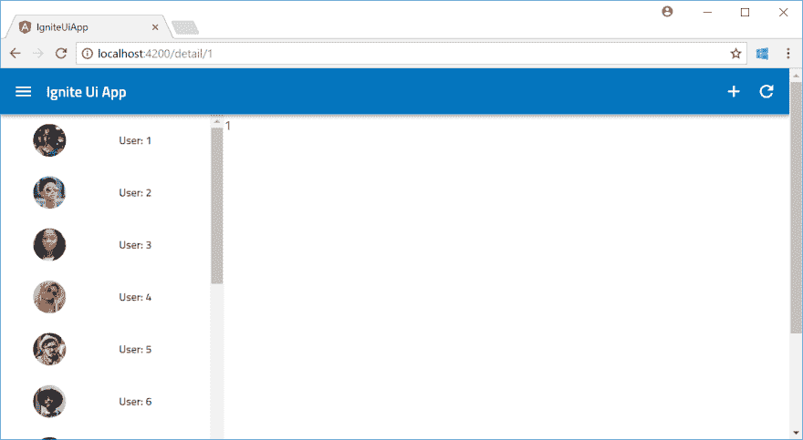T2】](https://res.cloudinary.com/practicaldev/image/fetch/s--3IVGKGiI--/c_limit%2Cf_auto%2Cfl_progressive%2Cq_auto%2Cw_880/https://qiita-image-store.s3.amazonaws.com/0/214116/0996b21e-a7a5-0043-e053-f7b10d15df6e.png)

## 服务于角度

好吧！，则布线部分完成。让我们继续服务。

1.运行下面的命令来创建服务。与组件不同，服务文件将在默认应用程序模块下创建。我指定- flat false，这样它就位于自己的文件夹下。

```
ng generate service user --module=app --flat false 
```

<svg width="20px" height="20px" viewBox="0 0 24 24" class="highlight-action crayons-icon highlight-action--fullscreen-on"><title>Enter fullscreen mode</title></svg> <svg width="20px" height="20px" viewBox="0 0 24 24" class="highlight-action crayons-icon highlight-action--fullscreen-off"><title>Exit fullscreen mode</title></svg>

2.在 app.module.ts.
中将服务指定为提供者

```
import { BrowserModule } from '@angular/platform-browser';
import { NgModule } from '@angular/core';
import { AppRoutingModule } from './app-routing.module';
import { AppComponent } from './app.component';
import { IgxNavbarModule, IgxIconModule, IgxScrollModule, IgxAvatarModule } from 'igniteui-angular/main';
import "hammerjs"; 
import { ListComponent } from './list/list.component';
import { DetailComponent } from './detail/detail.component';
import { UserService } from './user/user.service';

@NgModule({
  declarations: [
    AppComponent,
    ListComponent,
    DetailComponent   
  ],
  imports: [
    BrowserModule,
    AppRoutingModule,
    IgxNavbarModule,
    IgxIconModule,
    IgxScrollModule, 
    IgxAvatarModule, 
  ],
  providers: [UserService],
  bootstrap: [AppComponent]
})
export class AppModule { } 
```

<svg width="20px" height="20px" viewBox="0 0 24 24" class="highlight-action crayons-icon highlight-action--fullscreen-on"><title>Enter fullscreen mode</title></svg> <svg width="20px" height="20px" viewBox="0 0 24 24" class="highlight-action crayons-icon highlight-action--fullscreen-off"><title>Exit fullscreen mode</title></svg>

3.实现服务来回报用户。即使这个服务立即返回用户信息，但在现实世界中，它应该是异步调用。因此，我使用 Observe 和 of 来进行异步调用。

```
import { Injectable } from '@angular/core';
import { Observable } from 'rxjs/Observable';
import { of } from 'rxjs/observable/of';
import { User } from '../models/user'
@Injectable()
export class UserService {

  private users: Array<User>;

  constructor() {
    this.users = new Array<User>();
    for (let i = 1; i <= 22; i++) {

      this.users.push(new User(
        `http://www.infragistics.com/angular-demos/asseimg/avatar/${i}.jpg`,
        "User: " + i,
        i
      ));
    }
   }

  getUsers(): Observable<User[]>{
      return of(this.users)
  }

  getUser(id: number): Observable<User>{
      return of(this.users.find(x=>x.id === +id));
  }
} 
```

<svg width="20px" height="20px" viewBox="0 0 24 24" class="highlight-action crayons-icon highlight-action--fullscreen-on"><title>Enter fullscreen mode</title></svg> <svg width="20px" height="20px" viewBox="0 0 24 24" class="highlight-action crayons-icon highlight-action--fullscreen-off"><title>Exit fullscreen mode</title></svg>

4.替换 list.component.ts 中的硬编码用户生成部分，以使用该服务。

src/app/list/list . component . ts

```
import { Component, OnInit, EventEmitter } from '@angular/core';
import { IgxScroll, IgxScrollEvent, IgxAvatar } from "igniteui-angular/main";
import { User } from '../models/user';
import { UserService } from '../user/user.service';
import { Router } from '@angular/router';

@Component({
  selector: 'app-list',
  templateUrl: './list.component.html',
  styleUrls: ['./list.component.css']
})
export class ListComponent implements OnInit {

  constructor(private userService: UserService, private router: Router) {
    // Fetch user information as async service.
    this.userService.getUsers().subscribe(
      (users) => {
        this.users = users;
        this.visibleUsers = this.users.slice(0, this.visibleUsersCount);
      }
    );
  }

  public users: User[] = new Array<User>();
  public visibleUsers: User[];
  public visibleUsersCount: number = 8;

  ngOnInit() {
  }

  private onItemSelect(user: User): void {
    this.router.navigate([`/detail/${user.id}`]);
  }

  private updateList($event: IgxScrollEvent): void {    
    this.visibleUsers = this.users.slice($event.currentTop, $event.currentTop + this.visibleUsersCount);
  }
} 
```

<svg width="20px" height="20px" viewBox="0 0 24 24" class="highlight-action crayons-icon highlight-action--fullscreen-on"><title>Enter fullscreen mode</title></svg> <svg width="20px" height="20px" viewBox="0 0 24 24" class="highlight-action crayons-icon highlight-action--fullscreen-off"><title>Exit fullscreen mode</title></svg>

5.也更新 detail.component.ts 和 html

src/app/detail/detail . component . ts

```
import { Component, OnInit } from '@angular/core';
import { ActivatedRoute } from '@angular/router';
import { UserService } from '../user/user.service';
import { User } from '../models/user';

@Component({
  selector: 'app-detail',
  templateUrl: './detail.component.html',
  styleUrls: ['./detail.component.css']
})

export class DetailComponent implements OnInit {

  public user: User;
  constructor( private route: ActivatedRoute, private userService: UserService ) {
  }

  ngOnInit() {
    this.route.params.subscribe(params => {
      this.userService.getUser(params.id).subscribe(
        (user) => {this.user = user;}
      );
    });
  }
} 
```

<svg width="20px" height="20px" viewBox="0 0 24 24" class="highlight-action crayons-icon highlight-action--fullscreen-on"><title>Enter fullscreen mode</title></svg> <svg width="20px" height="20px" viewBox="0 0 24 24" class="highlight-action crayons-icon highlight-action--fullscreen-off"><title>Exit fullscreen mode</title></svg>

src/app/detail/detail . component . html

```
<p>
  {{user.name}}
</p> 
```

<svg width="20px" height="20px" viewBox="0 0 24 24" class="highlight-action crayons-icon highlight-action--fullscreen-on"><title>Enter fullscreen mode</title></svg> <svg width="20px" height="20px" viewBox="0 0 24 24" class="highlight-action crayons-icon highlight-action--fullscreen-off"><title>Exit fullscreen mode</title></svg>

6.保存并检查它是否按预期工作。

# 显示细节

伟大的工作，应用程序的重新结构已经完成！现在让我们实现用户细节组件。

## 输入和标注

Ignite UI 提供了用于显示和修改记录的输入和标签控件。

1.首先添加模块。由于某种原因，输入模块的名称中没有“module”。所以注意别忘了加。我还添加了角形模块来支持形状。

src/app/app.module.ts

```
import { BrowserModule } from '@angular/platform-browser';
import { NgModule } from '@angular/core';
import { FormsModule } from '@angular/forms';
import { AppRoutingModule } from './app-routing.module';
import { AppComponent } from './app.component';
import { IgxNavbarModule, IgxIconModule, IgxScrollModule, IgxAvatarModule,
IgxLabelModule, 
IgxLabel, IgxInput} from 'igniteui-angular/main';
import "hammerjs"; 
import { ListComponent } from './list/list.component';
import { DetailComponent } from './detail/detail.component';
import { UserService } from './user/user.service';

@NgModule({
  declarations: [
    AppComponent,
    ListComponent,
    DetailComponent   
  ],
  imports: [
    BrowserModule,
    AppRoutingModule,
    FormsModule,
    IgxNavbarModule,
    IgxIconModule,
    IgxScrollModule,
    IgxAvatarModule,
    IgxLabelModule,
    IgxInput,
  ],
  providers: [UserService],
  bootstrap: [AppComponent]
})
export class AppModule { } 
```

<svg width="20px" height="20px" viewBox="0 0 24 24" class="highlight-action crayons-icon highlight-action--fullscreen-on"><title>Enter fullscreen mode</title></svg> <svg width="20px" height="20px" viewBox="0 0 24 24" class="highlight-action crayons-icon highlight-action--fullscreen-off"><title>Exit fullscreen mode</title></svg>

2.接下来更新 detail.component。

src/app/detail/detail . component . ts

```
import { Component, OnInit } from '@angular/core';
import { ActivatedRoute } from '@angular/router';
import { IgxLabel, IgxInput, IgxAvatar } from 'igniteui-angular/main';
import { UserService } from '../user/user.service';
import { User } from '../models/user';

@Component({
  selector: 'app-detail',
  templateUrl: './detail.component.html',
  styleUrls: ['./detail.component.css']
})

export class DetailComponent implements OnInit {

  public user: User;
  constructor( private route: ActivatedRoute, private userService: UserService ) {
  }

  ngOnInit() {
    this.route.params.subscribe(params => {
      this.userService.getUser(params.id).subscribe(
        (user) => {this.user = user;}
      );
    });
  }
} 
```

<svg width="20px" height="20px" viewBox="0 0 24 24" class="highlight-action crayons-icon highlight-action--fullscreen-on"><title>Enter fullscreen mode</title></svg> <svg width="20px" height="20px" viewBox="0 0 24 24" class="highlight-action crayons-icon highlight-action--fullscreen-off"><title>Exit fullscreen mode</title></svg>

src/app/detail/detail . component . html

```
<div class="detail">
  <div>
      <h2 igxLabel>User ID: {{user.id}}</h2>
      <igx-avatar size="large" roundShape="true" src="{{user.image}}"></igx-avatar>
  </div>
  <div class="igx-form-group">
    <input [(ngModel)]="user.name" igxInput type="text" />
    <label igxLabel>Name</label>
  </div>
</div> 
```

<svg width="20px" height="20px" viewBox="0 0 24 24" class="highlight-action crayons-icon highlight-action--fullscreen-on"><title>Enter fullscreen mode</title></svg> <svg width="20px" height="20px" viewBox="0 0 24 24" class="highlight-action crayons-icon highlight-action--fullscreen-off"><title>Exit fullscreen mode</title></svg>

src/app/detail/detail . component . CSS

```
.detail {
    float: left;
    margin: 30px;
} 
```

<svg width="20px" height="20px" viewBox="0 0 24 24" class="highlight-action crayons-icon highlight-action--fullscreen-on"><title>Enter fullscreen mode</title></svg> <svg width="20px" height="20px" viewBox="0 0 24 24" class="highlight-action crayons-icon highlight-action--fullscreen-off"><title>Exit fullscreen mode</title></svg>

3.全部保存以确认行为。

[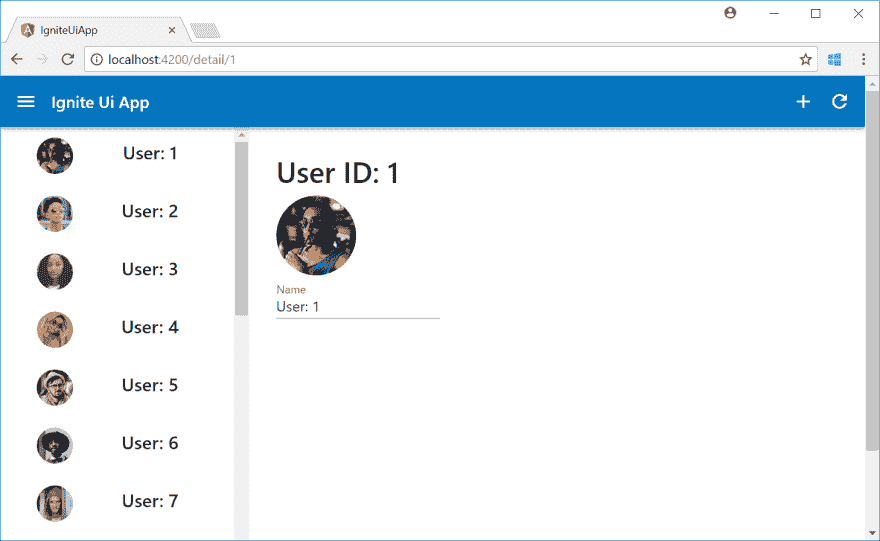T2】](https://res.cloudinary.com/practicaldev/image/fetch/s--kNFwyJi7--/c_limit%2Cf_auto%2Cfl_progressive%2Cq_auto%2Cw_880/https://qiita-image-store.s3.amazonaws.com/0/214116/a06df289-a39c-549c-9aa3-21c00b94fbed.png)

## DateTime picker

如您所知，从开发人员的角度来看，datetime 格式是一种繁琐而麻烦的格式，因为我们不知道每个用户使用哪种格式。日期时间选择器是方便的解决方案，Ignite UI 提供了控件。

1.为用户模型添加生日。

src/app/models/user.ts

```
export class User {
    public image: string
    public name: string
    public id: number
    public birthdate: Date

    constructor(image: string, name: string, id: number, birthdate: Date) {
        this.image = image;
        this.name = name;
        this.id = id;
        this.birthdate = birthdate;
    }
} 
```

<svg width="20px" height="20px" viewBox="0 0 24 24" class="highlight-action crayons-icon highlight-action--fullscreen-on"><title>Enter fullscreen mode</title></svg> <svg width="20px" height="20px" viewBox="0 0 24 24" class="highlight-action crayons-icon highlight-action--fullscreen-off"><title>Exit fullscreen mode</title></svg>

2.更新用户服务。我还添加了一个函数来保存用户。

src/app/user/user . service . ts

```
import { Injectable } from '@angular/core';
import { Observable } from 'rxjs/Observable';
import { of } from 'rxjs/observable/of';
import { User } from '../models/user'
@Injectable()
export class UserService {

  private users: Array<User>;

  constructor() {
    this.users = new Array<User>();
    for (let i = 1; i <= 22; i++) {
      let birthdate = new Date(2018, 0, i);
      this.users.push(new User(
        `http://www.infragistics.com/angular-demos/asseimg/avatar/${i}.jpg`,
        "User: " + i,
        i,
        birthdate
      ));
    }
   }

  getUsers(): Observable<User[]>{
      return of(this.users)
  }

  getUser(id: number): Observable<User>{
      return of(this.users.find(x=>x.id === +id));
  }

  save(user: User): Observable<boolean> {
    let index = this.users.indexOf(user);
    if (index !== -1) {
      this.users[index] = user;
      return of(true);
    }
    else {
      return of(false);
    }
  }
} 
```

<svg width="20px" height="20px" viewBox="0 0 24 24" class="highlight-action crayons-icon highlight-action--fullscreen-on"><title>Enter fullscreen mode</title></svg> <svg width="20px" height="20px" viewBox="0 0 24 24" class="highlight-action crayons-icon highlight-action--fullscreen-off"><title>Exit fullscreen mode</title></svg>

3.为日期时间选择器添加模块。它依赖于 BrowserAnimation 模块，所以我也添加了它。

src/app/app.module.ts

```
import { BrowserModule } from '@angular/platform-browser';
import { BrowserAnimationsModule } from '@angular/platform-browser/animations';
import { NgModule } from '@angular/core';
import { FormsModule } from '@angular/forms';
import { AppRoutingModule } from './app-routing.module';
import { AppComponent } from './app.component';
import { IgxNavbarModule, IgxIconModule, IgxScrollModule, IgxAvatarModule,
IgxLabelModule, IgxLabel, IgxInput, IgxDatePickerModule　} from 'igniteui-angular/main';
import "hammerjs"; 
import { ListComponent } from './list/list.component';
import { DetailComponent } from './detail/detail.component';
import { UserService } from './user/user.service';

@NgModule({
  declarations: [
    AppComponent,
    ListComponent,
    DetailComponent
  ],
  imports: [
    BrowserModule,
    BrowserAnimationsModule,
    AppRoutingModule,
    FormsModule,
    IgxNavbarModule,
    IgxIconModule,
    IgxScrollModule,
    IgxAvatarModule,
    IgxLabelModule,
    IgxInput, 
    IgxDatePickerModule
  ],
  providers: [UserService],
  bootstrap: [AppComponent]
})
export class AppModule { } 
```

<svg width="20px" height="20px" viewBox="0 0 24 24" class="highlight-action crayons-icon highlight-action--fullscreen-on"><title>Enter fullscreen mode</title></svg> <svg width="20px" height="20px" viewBox="0 0 24 24" class="highlight-action crayons-icon highlight-action--fullscreen-off"><title>Exit fullscreen mode</title></svg>

4.将日期选择器添加到 detail.component.html。该控件提供了许多功能，我在这里使用了“关闭”、“选择今天”、“数据绑定”和“选择区域”功能。

src/app/detail/detail . component . html

```
<div class="detail">
  <div>
      <h2 igxLabel>User ID: {{user.id}}</h2>
    <igx-avatar size="large" roundShape="true" src="{{user.image}}"></igx-avatar>
  </div>
  <div class="igx-form-group">
    <input [(ngModel)]="user.name" igxInput type="text" />
    <label igxLabel>Name</label>
  </div>
  <div class="igx-form-group">
    <input style="display: none" [(ngModel)]="user.birthdate" igxInput type="text" />
    <igx-datePicker [cancelButtonLabel]="'Close'" [todayButtonLabel]="'Today'" [locale]="'ja-JP'" [(ngModel)]="user.birthdate"></igx-datePicker>
      <label igxLabel>Birthday</label>
    </div>
</div> 
```

<svg width="20px" height="20px" viewBox="0 0 24 24" class="highlight-action crayons-icon highlight-action--fullscreen-on"><title>Enter fullscreen mode</title></svg> <svg width="20px" height="20px" viewBox="0 0 24 24" class="highlight-action crayons-icon highlight-action--fullscreen-off"><title>Exit fullscreen mode</title></svg>

5.把它们都保存起来，然后试试日期选择器。它非常好用。

[T2】](https://res.cloudinary.com/practicaldev/image/fetch/s--kEXhONu0--/c_limit%2Cf_auto%2Cfl_progressive%2Cq_auto%2Cw_880/https://qiita-image-store.s3.amazonaws.com/0/214116/162e6909-58d3-25a4-c47b-ab0749e265d4.png)

# 保存记录

到目前为止，应用程序只是显示信息。现在添加特征以保存修改。

## 按钮

当然，按钮对于任何应用程序都是必不可少的，Ignite UI 提供了按钮控制。

1.首先添加模块。除了 Button，我还添加了 Ripple。波纹模块提供动画效果，当你点击按钮，它很好。

src/app/app.module.ts

```
import { BrowserModule } from '@angular/platform-browser';
import { BrowserAnimationsModule } from '@angular/platform-browser/animations';
import { NgModule } from '@angular/core';
import { FormsModule } from '@angular/forms';
import { AppRoutingModule } from './app-routing.module';
import { AppComponent } from './app.component';
import { IgxNavbarModule, IgxIconModule, IgxScrollModule, IgxAvatarModule,
IgxLabelModule, IgxLabel, IgxInput, IgxDatePickerModule, IgxButtonModule, IgxRippleModule　} from 'igniteui-angular/main';
import "hammerjs"; 
import { ListComponent } from './list/list.component';
import { DetailComponent } from './detail/detail.component';
import { UserService } from './user/user.service';

@NgModule({
  declarations: [
    AppComponent,
    ListComponent,
    DetailComponent
  ],
  imports: [
    BrowserModule,
    BrowserAnimationsModule,
    AppRoutingModule,
    FormsModule,
    IgxNavbarModule,
    IgxIconModule, 
    IgxScrollModule,
    IgxAvatarModule,
    IgxLabelModule,
    IgxInput, 
    IgxDatePickerModule, 
    IgxButtonModule, 
    IgxRippleModule,
  ],
  providers: [UserService],
  bootstrap: [AppComponent]
})
export class AppModule { } 
```

<svg width="20px" height="20px" viewBox="0 0 24 24" class="highlight-action crayons-icon highlight-action--fullscreen-on"><title>Enter fullscreen mode</title></svg> <svg width="20px" height="20px" viewBox="0 0 24 24" class="highlight-action crayons-icon highlight-action--fullscreen-off"><title>Exit fullscreen mode</title></svg>

2.更新详图构件以添加按钮。

src/app/detail/detail . component . ts

```
import { Component, OnInit } from '@angular/core';
import { FormsModule } from '@angular/forms';
import { ActivatedRoute } from '@angular/router';
import { IgxLabel, IgxInput, IgxAvatar } from 'igniteui-angular/main';
import { UserService } from '../user/user.service';
import { User } from '../models/user';

@Component({
  selector: 'app-detail',
  templateUrl: './detail.component.html',
  styleUrls: ['./detail.component.css']
})

export class DetailComponent implements OnInit {

  public user: User;
  constructor( private route: ActivatedRoute, private userService: UserService ) {
  }

  ngOnInit() {
    this.route.params.subscribe(params => {
      this.userService.getUser(params.id).subscribe(
        (user) => {this.user = user;}
      );
    });
  }

  public save(){
    this.userService.save(this.user);
  }
} 
```

<svg width="20px" height="20px" viewBox="0 0 24 24" class="highlight-action crayons-icon highlight-action--fullscreen-on"><title>Enter fullscreen mode</title></svg> <svg width="20px" height="20px" viewBox="0 0 24 24" class="highlight-action crayons-icon highlight-action--fullscreen-off"><title>Exit fullscreen mode</title></svg>

src/app/detail/detail . component . html

```
<div class="detail">
  <div>
    <h2 igxLabel>User ID: {{user.id}}</h2>
    <igx-avatar size="large" roundShape="true" src="{{user.image}}"></igx-avatar>
  </div>
  <div class="igx-form-group">
    <input [(ngModel)]="user.name" igxInput type="text" />
    <label igxLabel>Name</label>
  </div>
  <div class="igx-form-group">
    <input style="display: none" [(ngModel)]="user.birthdate" igxInput type="text" />
    <igx-datePicker [cancelButtonLabel]="'Close'" [todayButtonLabel]="'Today'" [locale]="'ja-JP'" [(ngModel)]="user.birthdate"></igx-datePicker>
    <label igxLabel>Birthday</label>
  </div>
  <div>
    <span igxButton="raised" igxRipple (click)="save()">Save</span>
  </div>
</div> 
```

<svg width="20px" height="20px" viewBox="0 0 24 24" class="highlight-action crayons-icon highlight-action--fullscreen-on"><title>Enter fullscreen mode</title></svg> <svg width="20px" height="20px" viewBox="0 0 24 24" class="highlight-action crayons-icon highlight-action--fullscreen-off"><title>Exit fullscreen mode</title></svg>

3.全部保存并检查行为。选择用户并修改生日，然后单击保存。然后选择另一个用户，并回到原来的用户，看看生日是否保持不变。

[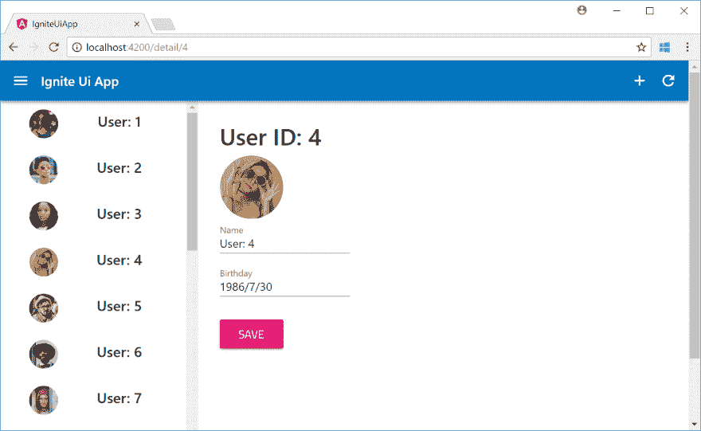T2】](https://res.cloudinary.com/practicaldev/image/fetch/s--Q2qR1HbL--/c_limit%2Cf_auto%2Cfl_progressive%2Cq_auto%2Cw_880/https://qiita-image-store.s3.amazonaws.com/0/214116/ebe5e49a-40f9-f3b0-6be7-b99f22d533a5.png)

## 敬酒通知

它工作了。是的，它是。但是从用户的角度来看，很难看出它是否真的保存了。所以让我们添加 toast 通知控件。

1.首先添加模块。

```
import { BrowserModule } from '@angular/platform-browser';
import { BrowserAnimationsModule } from '@angular/platform-browser/animations';
import { NgModule } from '@angular/core';
import { FormsModule } from '@angular/forms';
import { AppRoutingModule } from './app-routing.module';
import { AppComponent } from './app.component';
import { IgxNavbarModule, IgxIconModule, IgxScrollModule, IgxAvatarModule,
IgxLabelModule, IgxLabel, IgxInput, IgxDatePickerModule, IgxButtonModule, IgxRippleModule,
IgxToastModule　} from 'igniteui-angular/main';
import "hammerjs"; 
import { ListComponent } from './list/list.component';
import { DetailComponent } from './detail/detail.component';
import { UserService } from './user/user.service';

@NgModule({
  declarations: [
    AppComponent,
    ListComponent,
    DetailComponent
  ],
  imports: [
    BrowserModule,
    BrowserAnimationsModule,
    AppRoutingModule,
    FormsModule,
    IgxNavbarModule, 
    IgxIconModule, 
    IgxScrollModule, 
    IgxAvatarModule,
    IgxLabelModule,
    IgxInput,
    IgxDatePickerModule, 
    IgxButtonModule,
    IgxRippleModule,
    IgxToastModule,  
  ],
  providers: [UserService], 
  bootstrap: [AppComponent]
})
export class AppModule { } 
```

<svg width="20px" height="20px" viewBox="0 0 24 24" class="highlight-action crayons-icon highlight-action--fullscreen-on"><title>Enter fullscreen mode</title></svg> <svg width="20px" height="20px" viewBox="0 0 24 24" class="highlight-action crayons-icon highlight-action--fullscreen-off"><title>Exit fullscreen mode</title></svg>

2.然后更新详图构件。要引用 HTML 中的元素，可以使用 ViewChild 特性。如果直接引用 HTML 中的组件，可以使用(#)来指定名称。

src/app/detail/detail . component . ts

```
import { Component, OnInit, ViewChild } from '@angular/core';
import { FormsModule } from '@angular/forms';
import { ActivatedRoute } from '@angular/router';
import { IgxLabel, IgxInput, IgxAvatar, IgxToastModule, IgxToast } from 'igniteui-angular/main';
import { UserService } from '../user/user.service';
import { User } from '../models/user';

@Component({
  selector: 'app-detail',
  templateUrl: './detail.component.html',
  styleUrls: ['./detail.component.css']
})

export class DetailComponent implements OnInit {

  @ViewChild('toast') toast: IgxToast;

  public user: User;
  constructor( private route: ActivatedRoute, private userService: UserService ) {
  }

  ngOnInit() {
    this.route.params.subscribe(params => {
      this.userService.getUser(params.id).subscribe(
        (user) => {this.user = user;}
      );
    });
  }

  public save(){
    this.userService.save(this.user).subscribe(()=>{
      this.toast.show();
    });    
  }
} 
```

<svg width="20px" height="20px" viewBox="0 0 24 24" class="highlight-action crayons-icon highlight-action--fullscreen-on"><title>Enter fullscreen mode</title></svg> <svg width="20px" height="20px" viewBox="0 0 24 24" class="highlight-action crayons-icon highlight-action--fullscreen-off"><title>Exit fullscreen mode</title></svg>

src/app/detail/detail . component . html

```
<div class="detail">
  <div>
    <h2 igxLabel>User ID: {{user.id}}</h2>
    <igx-avatar size="large" roundShape="true" src="{{user.image}}"></igx-avatar>
  </div>
  <div class="igx-form-group">
    <input [(ngModel)]="user.name" igxInput type="text" />
    <label igxLabel>Name</label>
  </div>
  <div class="igx-form-group">
    <input style="display: none" [(ngModel)]="user.birthdate" igxInput type="text" />
    <igx-datePicker [cancelButtonLabel]="'Close'" [todayButtonLabel]="'Today'" [locale]="'ja-JP'" [(ngModel)]="user.birthdate"></igx-datePicker>
    <label igxLabel>Birthday</label>
  </div>
  <div>
    <span igxButton="raised" igxRipple (click)="save()">Save</span>
  </div>
  <igx-toast #toast message="Updated!">
  </igx-toast>
</div> 
```

<svg width="20px" height="20px" viewBox="0 0 24 24" class="highlight-action crayons-icon highlight-action--fullscreen-on"><title>Enter fullscreen mode</title></svg> <svg width="20px" height="20px" viewBox="0 0 24 24" class="highlight-action crayons-icon highlight-action--fullscreen-off"><title>Exit fullscreen mode</title></svg>

3.保存并确认行为。当你保存生日时，你会看到祝酒通知。

[T2】](https://res.cloudinary.com/practicaldev/image/fetch/s--fZB00VZn--/c_limit%2Cf_auto%2Cfl_progressive%2Cq_auto%2Cw_880/https://qiita-image-store.s3.amazonaws.com/0/214116/888849ad-91af-92d3-f296-918b7a06e2d7.png)

# [删除一条记录](#delete-a-record)

接下来，实现删除功能。

## 对话框

每当用户做一些危险的操作时，显示确认对话框是很重要的。Ignite UI 提供了对话框控件来实现它。

1.首先添加模块

```
import { BrowserModule } from '@angular/platform-browser';
import { BrowserAnimationsModule } from '@angular/platform-browser/animations';
import { NgModule } from '@angular/core';
import { FormsModule } from '@angular/forms';
import { AppRoutingModule } from './app-routing.module';
import { AppComponent } from './app.component';
import { IgxNavbarModule, IgxIconModule, IgxScrollModule, IgxAvatarModule,
IgxLabelModule, IgxLabel, IgxInput, IgxDatePickerModule, IgxButtonModule, IgxRippleModule,
IgxToastModule, IgxDialogModule　} from 'igniteui-angular/main';
import "hammerjs"; 
import { ListComponent } from './list/list.component';
import { DetailComponent } from './detail/detail.component';
import { UserService } from './user/user.service';

@NgModule({
  declarations: [
    AppComponent,
    ListComponent,
    DetailComponent
  ],
  imports: [
    BrowserModule,
    BrowserAnimationsModule,
    AppRoutingModule,
    FormsModule,
    IgxNavbarModule, 
    IgxIconModule, 
    IgxScrollModule,
    IgxAvatarModule, 
    IgxLabelModule, 
    IgxInput, 
    IgxDatePickerModule, 
    IgxButtonModule,
    IgxRippleModule, 
    IgxToastModule,   
    IgxDialogModule　
  ],
  providers: [UserService], 
  bootstrap: [AppComponent]
})
export class AppModule { } 
```

<svg width="20px" height="20px" viewBox="0 0 24 24" class="highlight-action crayons-icon highlight-action--fullscreen-on"><title>Enter fullscreen mode</title></svg> <svg width="20px" height="20px" viewBox="0 0 24 24" class="highlight-action crayons-icon highlight-action--fullscreen-off"><title>Exit fullscreen mode</title></svg>

2.更新详图构件。当用户删除记录时，会显示一个确认对话框。如果用户真的删除了记录，它会使用路由器服务导航回主页。

src/app/detail/detail . component . ts

```
import { Component, OnInit, ViewChild } from '@angular/core';
import { FormsModule } from '@angular/forms';
import { ActivatedRoute } from '@angular/router';
import { IgxLabel, IgxInput, IgxAvatar, IgxToastModule, IgxToast, IgxDialogModule } from 'igniteui-angular/main';
import { UserService } from '../user/user.service';
import { User } from '../models/user';
import { Router } from '@angular/router';

@Component({
  selector: 'app-detail',
  templateUrl: './detail.component.html',
  styleUrls: ['./detail.component.css']
})

export class DetailComponent implements OnInit {

  @ViewChild('toast') toast: IgxToast;
  public user: User;
  constructor( private route: ActivatedRoute, private router: Router,private userService: UserService ) {
  }

  ngOnInit() {
    this.route.params.subscribe(params => {
      this.userService.getUser(params.id).subscribe(
        (user) => {this.user = user;}
      );
    });
  }

  public save(){
    this.userService.save(this.user).subscribe(()=>{
      this.toast.show();
    });    
  }

  public delete(){
    this.userService.delete(this.user).subscribe(()=>{
      this.toast.message = "deleted";
      this.toast.show();
      this.router.navigate([`/`]);
    })
  }
} 
```

<svg width="20px" height="20px" viewBox="0 0 24 24" class="highlight-action crayons-icon highlight-action--fullscreen-on"><title>Enter fullscreen mode</title></svg> <svg width="20px" height="20px" viewBox="0 0 24 24" class="highlight-action crayons-icon highlight-action--fullscreen-off"><title>Exit fullscreen mode</title></svg>

src/app/detail/detail . component . html

```
<div class="detail">
  <div>
    <h2 igxLabel>User ID: {{user.id}}</h2>
    <igx-avatar size="large" roundShape="true" src="{{user.image}}"></igx-avatar>
  </div>
  <div class="igx-form-group">
    <input [(ngModel)]="user.name" igxInput type="text" />
    <label igxLabel>Name</label>
  </div>
  <div class="igx-form-group">
    <input style="display: none" [(ngModel)]="user.birthdate" igxInput type="text" />
    <igx-datePicker [cancelButtonLabel]="'Close'" [todayButtonLabel]="'Today'" [locale]="'ja-JP'" [(ngModel)]="user.birthdate"></igx-datePicker>
    <label igxLabel>Birthday</label>
  </div>
  <div>
    <span igxButton="raised" igxRipple (click)="save()">Save</span>
    <span igxButton="raised" igxRipple (click)="dialog.open()">Delete</span>
  </div>
  <igx-toast #toast message="Updated!">
  </igx-toast>

  <igx-dialog #dialog
    title="Confirmation"
    message="Are you sure you want to delete the user?"
    leftButtonLabel="Cancel"
    (onLeftButtonSelect)="dialog.close()"
    rightButtonLabel="OK"
    (onRightButtonSelect)="delete()">
</igx-dialog>
</div> 
```

<svg width="20px" height="20px" viewBox="0 0 24 24" class="highlight-action crayons-icon highlight-action--fullscreen-on"><title>Enter fullscreen mode</title></svg> <svg width="20px" height="20px" viewBox="0 0 24 24" class="highlight-action crayons-icon highlight-action--fullscreen-off"><title>Exit fullscreen mode</title></svg>

3.UI 完成了，但是用户服务需要支持删除特性。列表还需要知道用户何时删除记录，以便能够刷新列表。为了实现它，我使用了 rxjs。

src/app/user/user . service . ts

```
import { Injectable } from '@angular/core';
import { Observable } from 'rxjs/Observable';
import { of } from 'rxjs/observable/of';
import { User } from '../models/user'
import { Subject }    from 'rxjs/Subject';
@Injectable()
export class UserService {

  private users: Array<User>;
  // Provision a Subject
  private userUpdate = new Subject<string>()
  public userUpdateSource$ = this.userUpdate.asObservable();

  constructor() {
    this.users = new Array<User>();
    for (let i = 1; i <= 22; i++) {
      let birthdate = new Date(2018, 0, i);
      this.users.push(new User(
        `http://www.infragistics.com/angular-demos/asseimg/avatar/${i}.jpg`,
        "User: " + i,
        i,
        birthdate
      ));
    }
  }

  getUsers(): Observable<User[]> {
    return of(this.users)
  }

  getUser(id: number): Observable<User> {
    return of(this.users.find(x => x.id === +id));
  }

  save(user: User): Observable<boolean> {
    let index = this.users.indexOf(user);
    if (index !== -1) {
      this.users[index] = user;
      return of(true);
    }
    else {
      return of(false);
    }
  }

  delete(user: User): Observable<boolean> {
    let index = this.users.indexOf(user);
    if (index !== -1) {
      this.users.splice(index, 1);
      // Notify that user deleted a record to subject.
      this.userUpdate.next("updated");
      return of(true);
    }
    else {
      return of(false);
    }
  }
} 
```

<svg width="20px" height="20px" viewBox="0 0 24 24" class="highlight-action crayons-icon highlight-action--fullscreen-on"><title>Enter fullscreen mode</title></svg> <svg width="20px" height="20px" viewBox="0 0 24 24" class="highlight-action crayons-icon highlight-action--fullscreen-off"><title>Exit fullscreen mode</title></svg>

4.接下来，更新列表组件以在用户删除记录时接收通知。

src/app/list/list . component . ts

```
import { Component, OnInit, EventEmitter } from '@angular/core';
import { IgxScroll, IgxScrollEvent, IgxAvatar } from "igniteui-angular/main";
import { User } from '../models/user';
import { UserService } from '../user/user.service';
import { Router } from '@angular/router';

@Component({
  selector: 'app-list',
  templateUrl: './list.component.html',
  styleUrls: ['./list.component.css']
})
export class ListComponent implements OnInit {

  constructor(private userService: UserService, private router: Router) {
    this.load();
  }

  public users: User[] = new Array<User>();
  public visibleUsers: User[];
  public visibleUsersCount: number = 8;

  ngOnInit() {
    // Reload the list when user delete a record.
    this.userService.userUpdateSource$.subscribe(
      (user)=>{this.load();}
    )
  }

  public load():void{    
    this.userService.getUsers().subscribe(
      (users) => {
        this.users = users;
        this.visibleUsers = this.users.slice(0, this.visibleUsersCount);
      }
    );
  }

  private onItemSelect(user: User): void {
    this.router.navigate([`/detail/${user.id}`]);
  }

  private updateList($event: IgxScrollEvent): void {    
    this.visibleUsers = this.users.slice($event.currentTop, $event.currentTop + this.visibleUsersCount);
  }
} 
```

<svg width="20px" height="20px" viewBox="0 0 24 24" class="highlight-action crayons-icon highlight-action--fullscreen-on"><title>Enter fullscreen mode</title></svg> <svg width="20px" height="20px" viewBox="0 0 24 24" class="highlight-action crayons-icon highlight-action--fullscreen-off"><title>Exit fullscreen mode</title></svg>

5.全部保存，确认是否按预期工作。在下面的截图中，我删除了用户:5。

[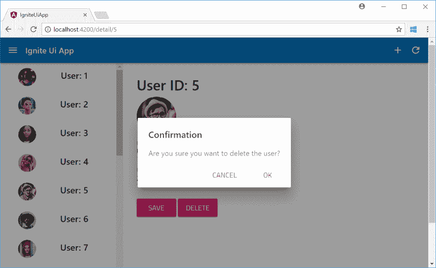](https://res.cloudinary.com/practicaldev/image/fetch/s--UfuAVYbI--/c_limit%2Cf_auto%2Cfl_progressive%2Cq_auto%2Cw_880/https://qiita-image-store.s3.amazonaws.com/0/214116/79789910-beeb-5ce5-455d-cc6e3b9150fb.png)
[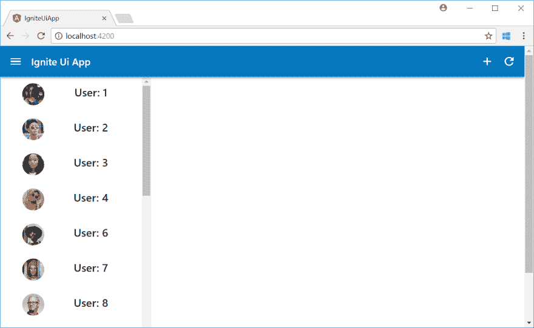T6】](https://res.cloudinary.com/practicaldev/image/fetch/s--322qdEKW--/c_limit%2Cf_auto%2Cfl_progressive%2Cq_auto%2Cw_880/https://qiita-image-store.s3.amazonaws.com/0/214116/fd7c4887-18d8-62aa-0058-9c3b06cd64d7.png)

# 添加记录

当你可以删除一个用户时，你应该可以添加一个新的！让我们实现添加功能，好吗？

## 复选框、开关、滑块和单选框

Ignite UI 提供了各种控件来支持用户输入。

1.首先向用户添加更多字段。

```
export class User {
    public image: string
    public name: string
    public id: number
    public birthdate: Date
    public gender: Gender
    public userRank: number
    public isAdmin: boolean

    constructor(image: string, name: string, id: number, birthdate: Date,
    gender: Gender, userRank: number, isAdmin: boolean ) {
        this.image = image;
        this.name = name;
        this.id = id;
        this.birthdate = birthdate;
        this.gender = gender;
        this.userRank = userRank;
        this.isAdmin = isAdmin;
    }
}

export enum Gender {
    Male = 1,
    Female,
    Other,
} 
```

<svg width="20px" height="20px" viewBox="0 0 24 24" class="highlight-action crayons-icon highlight-action--fullscreen-on"><title>Enter fullscreen mode</title></svg> <svg width="20px" height="20px" viewBox="0 0 24 24" class="highlight-action crayons-icon highlight-action--fullscreen-off"><title>Exit fullscreen mode</title></svg>

2.更新用户服务以处理新字段。还添加了一个创建新用户的功能。

src/app/user/user . service . ts

```
import { Injectable } from '@angular/core';
import { Observable } from 'rxjs/Observable';
import { of } from 'rxjs/observable/of';
import { User, Gender } from '../models/user'
import { Subject } from 'rxjs/Subject';

@Injectable()
export class UserService {

  private users: Array<User>;
  private userUpdate = new Subject<string>()
  public userUpdateSource$ = this.userUpdate.asObservable();

  constructor() {
    this.users = new Array<User>();
    for (let i = 1; i <= 22; i++) {
      let birthdate = new Date(2018, 0, i);
      this.users.push(new User(
        `http://www.infragistics.com/angular-demos/asseimg/avatar/${i}.jpg`,
        "User: " + i,
        i,
        birthdate,
        Gender.Other,
        i,
        false
      ));
    }
  }

  getUsers(): Observable<User[]> {
    return of(this.users)
  }

  getUser(id: number): Observable<User> {
    return of(this.users.find(x => x.id === +id));
  }

  add(user: User): Observable<boolean> {
    this.users.push(user);
    this.userUpdate.next("updated");
    return of(true);
  }

  save(user: User): Observable<boolean> {
    let index = this.users.indexOf(user);
    if (index !== -1) {
      this.users[index] = user;
      return of(true);
    }
    else {
      return of(false);
    }
  }

  delete(user: User): Observable<boolean> {
    let index = this.users.indexOf(user);
    if (index !== -1) {
      this.users.splice(index, 1);
      this.userUpdate.next("updated");
      return of(true);
    }
    else {
      return of(false);
    }
  }
} 
```

<svg width="20px" height="20px" viewBox="0 0 24 24" class="highlight-action crayons-icon highlight-action--fullscreen-on"><title>Enter fullscreen mode</title></svg> <svg width="20px" height="20px" viewBox="0 0 24 24" class="highlight-action crayons-icon highlight-action--fullscreen-off"><title>Exit fullscreen mode</title></svg>

3.运行命令添加“新”组件。

```
ng generate component new 
```

<svg width="20px" height="20px" viewBox="0 0 24 24" class="highlight-action crayons-icon highlight-action--fullscreen-on"><title>Enter fullscreen mode</title></svg> <svg width="20px" height="20px" viewBox="0 0 24 24" class="highlight-action crayons-icon highlight-action--fullscreen-off"><title>Exit fullscreen mode</title></svg>

4.将模块添加到路由中。

```
import { NgModule } from '@angular/core';
import { Routes, RouterModule } from '@angular/router';
import { DetailComponent } from './detail/detail.component'; 
import { NewComponent } from './new/new.component'; 

const routes: Routes = [
  { path: 'detail/:id', component: DetailComponent },
  { path: 'new', component: NewComponent } 
];

@NgModule({
  imports: [RouterModule.forRoot(routes)],
  exports: [RouterModule]
})
export class AppRoutingModule { } 
```

<svg width="20px" height="20px" viewBox="0 0 24 24" class="highlight-action crayons-icon highlight-action--fullscreen-on"><title>Enter fullscreen mode</title></svg> <svg width="20px" height="20px" viewBox="0 0 24 24" class="highlight-action crayons-icon highlight-action--fullscreen-off"><title>Exit fullscreen mode</title></svg>

5.添加 Ignite UI 模块。

```
import { BrowserModule } from '@angular/platform-browser';
import { BrowserAnimationsModule } from '@angular/platform-browser/animations';
import { NgModule } from '@angular/core';
import { FormsModule } from '@angular/forms';
import { AppRoutingModule } from './app-routing.module';
import { AppComponent } from './app.component';
import {
  IgxNavbarModule, IgxIconModule, IgxScrollModule, IgxAvatarModule,
  IgxLabelModule, IgxLabel, IgxInput, IgxDatePickerModule, IgxButtonModule, IgxRippleModule,
  IgxToastModule, IgxDialogModule, IgxCheckboxModule, IgxSwitchModule, IgxSliderModule, IgxRadioModule
　} from 'igniteui-angular/main';
import "hammerjs";
import { ListComponent } from './list/list.component';
import { DetailComponent } from './detail/detail.component';
import { UserService } from './user/user.service';
import { NewComponent } from './new/new.component';

@NgModule({
  declarations: [
    AppComponent,
    ListComponent,
    DetailComponent,
    NewComponent
  ],
  imports: [
    BrowserModule,
    BrowserAnimationsModule,
    AppRoutingModule,
    FormsModule,
    IgxNavbarModule,
    IgxIconModule, 
    IgxScrollModule, 
    IgxAvatarModule,
    IgxLabelModule,
    IgxInput, 
    IgxDatePickerModule,
    IgxButtonModule, 
    IgxRippleModule,
    IgxToastModule,     
    IgxDialogModule,　
    IgxCheckboxModule, 
    IgxSwitchModule,
    IgxSliderModule,
    IgxRadioModule,　
  ],
  providers: [UserService], 
  bootstrap: [AppComponent]
})
export class AppModule { } 
```

<svg width="20px" height="20px" viewBox="0 0 24 24" class="highlight-action crayons-icon highlight-action--fullscreen-on"><title>Enter fullscreen mode</title></svg> <svg width="20px" height="20px" viewBox="0 0 24 24" class="highlight-action crayons-icon highlight-action--fullscreen-off"><title>Exit fullscreen mode</title></svg>

6.为新组件实现逻辑和 UI。我还使用 CSS 修改 Ignite UI 控件的默认颜色。

src/app/new/new . component . ts

```
import { Component, OnInit, ViewChild } from '@angular/core';
import { FormsModule } from '@angular/forms';
import { User, Gender } from '../models/user';
import { UserService } from '../user/user.service';
import { IgxLabel, IgxInput, IgxAvatar, IgxToast, IgxDialog, IgxCheckbox, IgxSwitch, IgxSlider, IgxRadio } from 'igniteui-angular/main';
import { Router } from '@angular/router';
import { ActivatedRoute } from '@angular/router';

@Component({
  selector: 'app-new',
  templateUrl: './new.component.html',
  styleUrls: ['./new.component.css']
})
export class NewComponent implements OnInit {

  constructor(private userService: UserService, private router: Router) {   
  }

  @ViewChild('toast') toast: IgxToast;
  public user: User;
  public gender: string[];

  ngOnInit() {
    this.user = new User("", "", 0, null, Gender.Other, 0, true);
    let genderValues = Object.keys(Gender);
    this.gender = genderValues.slice(genderValues.length / 2);
  }

  public loadImage(input: HTMLInputElement): void {
    if (!input.value) {
      return;
    }

    let reader = new FileReader();
    // Callback when file read.
    reader.onload = () => {
      input.value = "";
      this.user.image = reader.result;
    }

    reader.readAsDataURL(input.files[0]);
  }

  public create() {
    this.userService.add(this.user).subscribe(() => {
      this.toast.show();
      this.router.navigate([`/`]);
    });
  }
} 
```

<svg width="20px" height="20px" viewBox="0 0 24 24" class="highlight-action crayons-icon highlight-action--fullscreen-on"><title>Enter fullscreen mode</title></svg> <svg width="20px" height="20px" viewBox="0 0 24 24" class="highlight-action crayons-icon highlight-action--fullscreen-off"><title>Exit fullscreen mode</title></svg>

src/app/new/new . component . html

```
<div class="new">
  <div>
    <input #imageInput [(ngModel)]="user.image" igxInput type="file" (change)="loadImage(imageInput)" />
    <igx-avatar size="large" roundShape="true" src="{{user.image}}"></igx-avatar>
  </div>
  <div class="igx-form-group">
      <input [(ngModel)]="user.id" igxInput type="number" />
      <label igxLabel>User ID</label>
    </div>
  <div class="igx-form-group">
    <input [(ngModel)]="user.name" igxInput type="text" />
    <label igxLabel>Name</label>
  </div>
  <div class="igx-form-group">
    <input style="display: none" [(ngModel)]="user.birthdate" igxInput type="text" />
    <igx-datePicker [cancelButtonLabel]="'Close'" [todayButtonLabel]="'Today'" [locale]="'ja-JP'" [(ngModel)]="user.birthdate"></igx-datePicker>
    <label igxLabel>Birthday</label>
  </div>
  <igx-radio *ngFor="let item of gender" value="{{item}}" name="group" [(ngModel)]="user.gender">{{item}}</igx-radio>

  <div class="igx-form-group slider">
    <igx-slider [minValue]="0" [maxValue]="50" [lowerBound]="0" [value]="0" [(ngModel)]="user.userRank"></igx-slider>
    <label igxLabel>User Rank</label>
  </div>
  <igx-switch [checked]="user.isAdmin" [(ngModel)]="user.isAdmin" >
      Is Admin
  </igx-switch>

  <div>
      <span igxButton="raised" igxRipple (click)="create()">Create</span>
    </div>
  <igx-toast #toast message="Created!">
  </igx-toast>
</div> 
```

<svg width="20px" height="20px" viewBox="0 0 24 24" class="highlight-action crayons-icon highlight-action--fullscreen-on"><title>Enter fullscreen mode</title></svg> <svg width="20px" height="20px" viewBox="0 0 24 24" class="highlight-action crayons-icon highlight-action--fullscreen-off"><title>Exit fullscreen mode</title></svg>

src/app/new/new . component . CSS

```
.new {
    float: left;
    margin: 30px;
}

.slider {
    padding-top: 10px;
    margin-bottom: -10px
}

igx-slider >>> .igx-slider__track-fill {
    background: #e41c77;
} 
```

<svg width="20px" height="20px" viewBox="0 0 24 24" class="highlight-action crayons-icon highlight-action--fullscreen-on"><title>Enter fullscreen mode</title></svg> <svg width="20px" height="20px" viewBox="0 0 24 24" class="highlight-action crayons-icon highlight-action--fullscreen-off"><title>Exit fullscreen mode</title></svg>

7.更新导航栏以支持新按钮和刷新按钮。

src/app/app.component.ts

```
import { Component, ViewChild, ElementRef } from '@angular/core';
import { User } from './models/user';
import { ListComponent } from './list/list.component';
import { Router } from '@angular/router';

@Component({
  selector: 'app-root',
  templateUrl: './app.component.html',
  styleUrls: ['./app.component.css']
})

export class AppComponent {

  @ViewChild('applist') listComponent: ListComponent;
  selectedUser: User;

  title = 'Ignite Ui App';

  constructor(private router: Router) {
  }

  onClickMenu(){
    window.alert("menu clicked");
  }

  onClickAdd(){
    this.router.navigate(['/new']);
  }

  onClickRefresh(){
    this.listComponent.load();
  }
} 
```

<svg width="20px" height="20px" viewBox="0 0 24 24" class="highlight-action crayons-icon highlight-action--fullscreen-on"><title>Enter fullscreen mode</title></svg> <svg width="20px" height="20px" viewBox="0 0 24 24" class="highlight-action crayons-icon highlight-action--fullscreen-off"><title>Exit fullscreen mode</title></svg>

src/app/app.component.html

```
<!--The content below is only a placeholder and can be replaced.-->
<igx-navbar [title]="title" actionButtonIcon="menu" (onAction)="onClickMenu()">
  <igx-icon name="add" (click)="onClickAdd()"></igx-icon>
  <igx-icon name="refresh" (click)="onClickRefresh()"></igx-icon>
</igx-navbar>

<app-list #applist></app-list> 
<router-outlet></router-outlet> 
```

<svg width="20px" height="20px" viewBox="0 0 24 24" class="highlight-action crayons-icon highlight-action--fullscreen-on"><title>Enter fullscreen mode</title></svg> <svg width="20px" height="20px" viewBox="0 0 24 24" class="highlight-action crayons-icon highlight-action--fullscreen-off"><title>Exit fullscreen mode</title></svg>

8.将它们全部保存并尝试应用程序。

[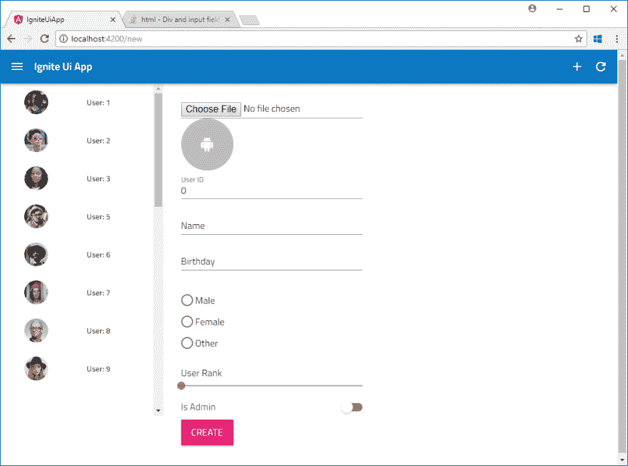T2】](https://res.cloudinary.com/practicaldev/image/fetch/s--ysXggwq6--/c_limit%2Cf_auto%2Cfl_progressive%2Cq_auto%2Cw_880/https://qiita-image-store.s3.amazonaws.com/0/214116/19e84426-d4c6-8a18-acca-2b6895564083.png)

# 总结

在本文中，我使用 Angular 和 Ignite UI 快速创建简单的应用程序。Ignite UI 拥有比我在这里介绍的更多的功能。因此，在下一篇文章中，我将通过使用其他控件来增强应用程序。敬请期待！

# 参考文献

[Ignite UI for Angular](https://www.infragistics.com/products/ignite-ui-angular)
T3】Ignite UI GitHubT5[Angular 教程](https://angular.io/tutorial)