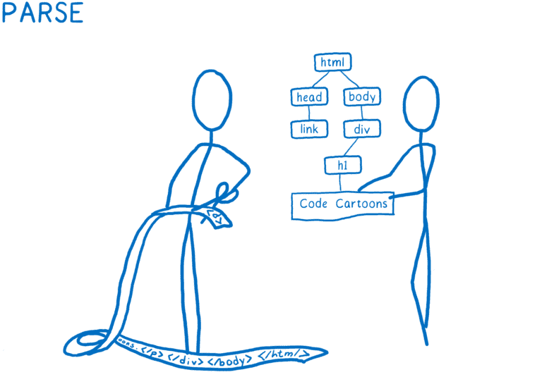
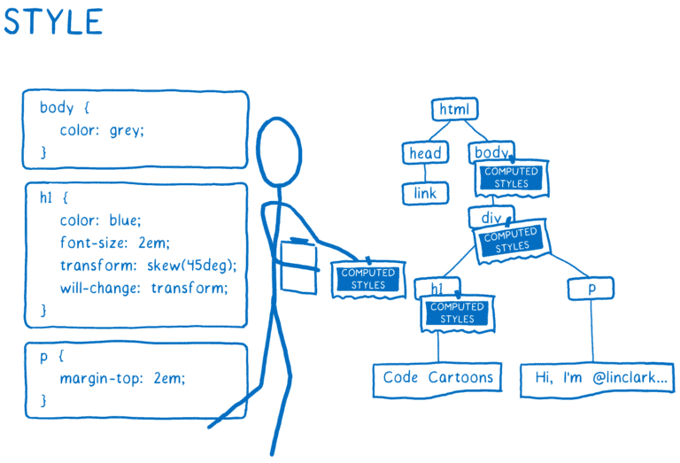
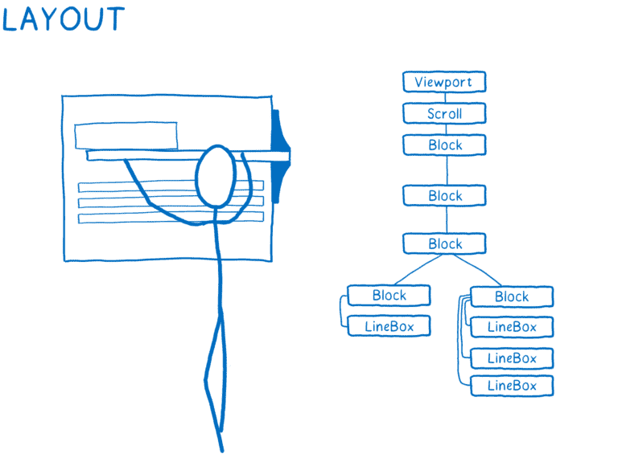
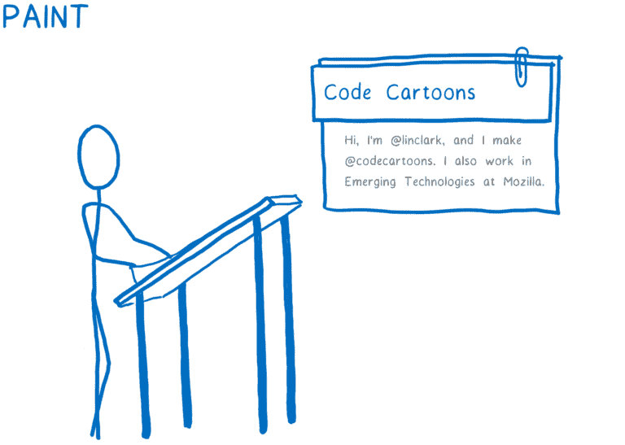
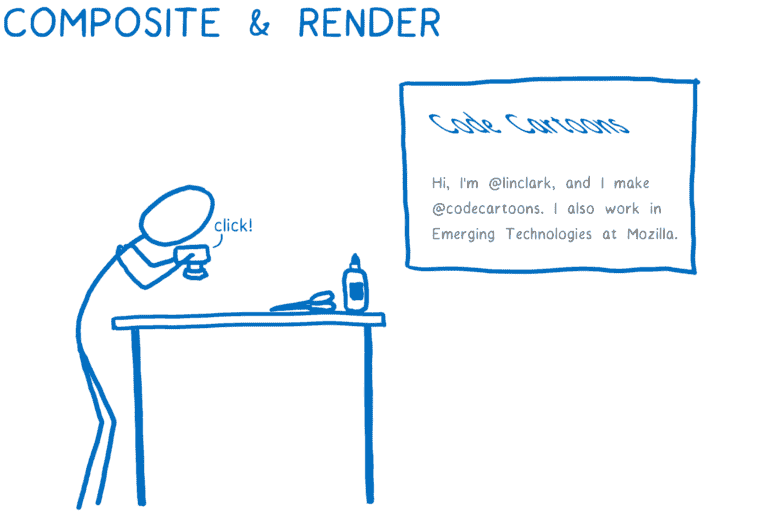
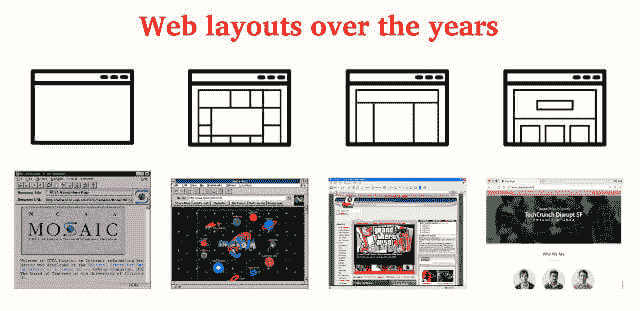

# 向新人教授 CSS 网格

> 原文:[https://dev.to/huijing/teaching-css-grid-to-newcomers-4hlo](https://dev.to/huijing/teaching-css-grid-to-newcomers-4hlo)

我在 2018 年有了一个很好的开端，这主要是因为我倾向于“说好，以后再担心”，这对我很有帮助，但有时也会让我质疑我的智力。因此，在 2018 年 1 月，我成为了一名全职员工，组织了一场为期[半天的 CSS 会议](https://singaporecss.github.io/24/)，在 [JSConf 上发言。并在那里举办了一个关于 CSS 网格的研讨会。](https://2018.jsconf.asia/)

你能理解为什么我告诉我的朋友我是一个白痴，现在却不能查看她的日历吗？总之，圣诞节期间，我认识了一群朋友，他们刚从新加坡众多训练营项目中的一个毕业。

这个特别的 bootcamp 显然没有把重点放在前端技术上，因为他们没有涵盖 Javascript，并且主要使用 Bootstrap 作为他们所有项目的 CSS 解决方案。

我听到这话时的表情... <video loop=""><source src="https://www.chenhuijing.com/assets/videos/wtf.mp4" type="video/mp4">很抱歉，您的浏览器不支持嵌入式视频，但别担心，您可以[下载它](https://www.chenhuijing.com/assets/videos/wtf.mp4)并用您最喜爱的视频播放器观看它！</video> 

如果你不了解我，只需知道我真的非常非常不喜欢预包装的 CSS 框架。我同意每个项目都应该有自己定制的 CSS 框架，但是我们改天再谈这个。

事情的 TLDR 版本是这样的，因为我正在为 JSConf 举办 CSS 网格研讨会。亚洲，为什么不让他们中的两个做我的共同主持人，我会事先给他们一个 CSS 布局的速成班？这只是我又一个轻率的计划🤷。

**结论:CSS 网格对新来者来说是直观的，并将改变我们教授网页布局的方式。**

## 用问题建立理解

可能只有我，但我喜欢先问基本的问题。比如:

*   什么是自举？
*   什么是 CSS？
*   你觉得 X 是什么？
*   你认为 Y 为什么要这么做？

类似的东西。或者，如果我觉得厚脸皮，我会从“告诉我关于 CSS 的事情”开始，对此我通常会有这样的表情🤨。但这确实有助于了解对方的立场，这样我就能更好地表达我的观点。

## 与浏览器交朋友是关键

我可能不是最有经验的网络老手，但我有公平的份额试图向非开发人员解释为什么某些设计在我的代理生涯中是不可行的。最终我意识到，很多问题都是由于缺乏对浏览器如何呈现内容的理解而产生的。

几乎所有我能想到的其他媒介都允许直接操纵画布。当你画画的时候，你可以确定你想要一个元素出现的确切位置，如果你使用任何数字图像制作软件，比如 Sketch 或者 Photoshop，也是一样。如果你习惯了这种操作模式，浏览器可能看起来不便于设计。

这是因为在你、创意设计师和浏览器之间还有一层隔离，那就是画布。这一层是代码，我们必须给浏览器的指令，告诉它我们希望我们的元素如何出现。如果没有对浏览器的功能和行为的深刻理解，这将变得像试图告诉一个蹒跚学步的孩子如何操作叉车一样有趣。

或者是一只没有四肢的海象... <video loop=""><source src="https://www.chenhuijing.com/assets/videos/walrus.mp4" type="video/mp4">很抱歉，您的浏览器不支持嵌入式视频，但别担心，您可以[下载它](https://www.chenhuijing.com/assets/videos/walrus.mp4)并用您最喜爱的视频播放器观看它！</video> 

我发现真正有用的解释浏览器的资源是去年发表在 Mozilla Hacks 上的林·克拉克的文章，她在文章中解释了的量子 CSS 引擎。当她解释的时候，解析→样式→布局→绘制→合成的步骤就容易理解多了。

<figcaption>解析</figcaption>

<figcaption>风格</figcaption>

<figcaption>布局</figcaption>

<figcaption>绘</figcaption>

<figcaption>复合</figcaption>

## 比喻一个事物

我发现自己做的另一件事是使用各种与网络无关的类比来表达我的观点。有时候，教学感觉就像精炼一个单口相声套路(omg，我又做了一次)，因为当我绞尽脑汁尽可能简单地解释事情时，新的想法会突然出现在我的脑海中。

这些是我目前为止使用的与 CSS 相关的类比:

1.  棋盘和棋子，用于放置网格项目。比如，在网格上放置物品就像在棋盘上放置棋子。
2.  Jay-Z 和 Beyoncé，对于 Grid 和 Flexbox 的关系。就像 Jay-Z 和 Beyoncé一样，他们都很棒，但在一起，达到了另一个水平。就像 Grid 和 Flexbox 一样。这是我做过的每一次版面设计演讲的必去之处🤣。
3.  Water，解释了 CSS 的级联性、全球性和大多数传统编程语言的模块化、封装性。就像，传统的编程范式离散地对待函数，就像你可以捡起的石头，但 CSS 就像水，它流动着，无法控制，只能塑造。
4.  团队运动，用于描述 CSS 的全部力量在组合使用时是如何闪耀的。比如，大多数教程或文章都倾向于孤立地看待某个特定的属性，这对于理解和学习新东西很有帮助。但是结合属性才是魔法的来源。
5.  策划美化，比较过去的布局技术与 CSS 网格。就像，依赖于项目大小的预网格布局类似于把你的种子扔向大致的方向，只希望它们都能在正确的地方生长。但是 grid 可以让我们在特定的地块上种植花卉，这样它们就可以完全按照我们的意愿生长。

随着我不断尝试向人们解释网页布局，这个列表只会继续增长，所以请继续关注更多相同的内容。如果你不认同我自娱自乐的方式，我也无能为力，不是吗？

## 一点历史有助于理解

注意，我说的是一点点，不是很多。那只会变得无聊。我想一些关于 CSS 的背景知识会有助于解决那些对 CSS 感到不舒服的人的一些难以言表的情感创伤。也可能不是。我还是得试试，对吧？

在过去的二十年里，CSS 随着浏览器功能的发展而发展，其规范的结构也一直在更新。CSS 规范现在本质上是模块化的，有助于维护和更新。

如果你停下来想一想，这是一个相当长的旅程，从没有办法做布局，到在 HTML 中用`table`元素做布局，到破解 floats 和 flexbox，在我们最终得到 CSS grid 作为一种手段来正确地布局一整页的元素之前。

网络布局，一种进化。 

解释一下为什么我们不得不千方百计试图在 web 上设计一个页面的背景，会让我们更容易接受 CSS 的本质(至少基于我有限的样本量)。不管怎样，我对 CSS 的过度热爱意味着我正在享受谈论 CSS 的时光。我的两个在接收端的朋友…？你得问他们🤣。

## 团队 Anyhowly

> 总之/ˈɛnɪhaʊ/:在一个粗心或偶然的方式。>-ly:通常是-like 的缩略词，通常加在形容词后构成副词，但在某些情况下也用于构成形容词。

正确学习英语的人会意识到*无论如何*已经是副词了，因此 *-ly* 是多余的。但是新加坡式英语是什么，我们不在乎。就像说 ATM 机，或者液晶显示器。冗余无处不在，接受它吧🤷。

因为我随意的方式，我已经决定把这个术语**作为我个人使用。就像我们*如何组织[演讲一样。CSS max-content edition](https://singaporecss.github.io/24/) (视频都上传了 ICYMI #shamelessplug)，以及我如何*无论如何*决定请两个之前没有 CSS grid 经验的人做我的共同主持人。Anyhowly。***

团队任意重复谈话。CSST2T4】

我想借此机会向她们两个，Gloria Soh(左)和 Shirlaine Phang(右)表达我最大的谢意，感谢她们一直陪着我胡闹，并容忍我缺乏成人技能。JSConf。无论如何，有他们在，亚洲网格研讨会更有趣。

永远的团队🙆。愿恶作剧永不停止。

*最初发布于[www.chenhuijing.com](https://www.chenhuijing.com/blog/teaching-css-grid-to-newcomers/)2018 年 2 月 4 日。*