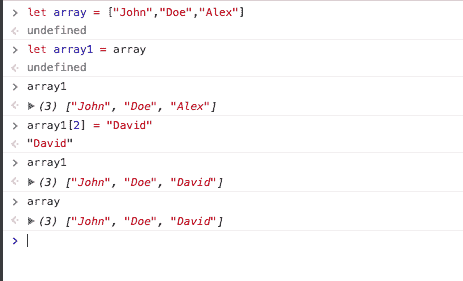
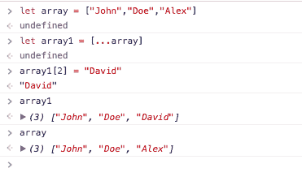
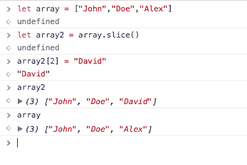
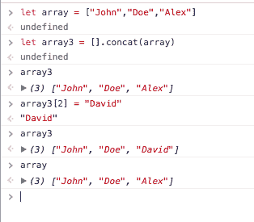
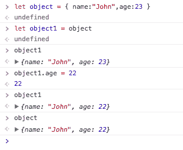
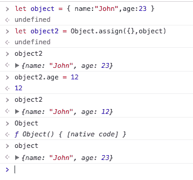
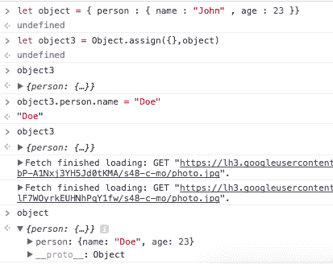
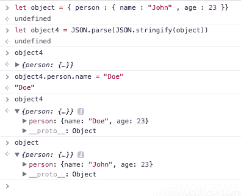

# 在 Javascript 中引用和复制对象和数组

> 原文:[JavaScript-2h 23 中的 https://dev.to/simo_benhida/reference-and-copying-objetcs 数组](https://dev.to/simo_benhida/reference-and-copying-objetcs--arrays-in-javascript-2h23)

当我们想把一个数组或者一个对象复制到一个新变量的时候，我们都会遇到这个错误，当我们更新新变量的时候，我们会改变原来的变量。

***阵列***T5】

所以在这个例子中，我们有一个`array`变量

```
let array = ["John","Doe","Alex"] 
```

<svg width="20px" height="20px" viewBox="0 0 24 24" class="highlight-action crayons-icon highlight-action--fullscreen-on"><title>Enter fullscreen mode</title></svg> <svg width="20px" height="20px" viewBox="0 0 24 24" class="highlight-action crayons-icon highlight-action--fullscreen-off"><title>Exit fullscreen mode</title></svg>

我们创建一个新的变量`array1`，它取`array`的值

```
let array1 = array

console.log(array1)
//["John", "Doe", "Alex"] 
```

<svg width="20px" height="20px" viewBox="0 0 24 24" class="highlight-action crayons-icon highlight-action--fullscreen-on"><title>Enter fullscreen mode</title></svg> <svg width="20px" height="20px" viewBox="0 0 24 24" class="highlight-action crayons-icon highlight-action--fullscreen-off"><title>Exit fullscreen mode</title></svg>

现在如果我们修改`array1[2]`例如

```
array1[2] = "David"

console.log(array1)
//["John", "Doe", "David"]

console.log(array)
//["John", "Doe", "David"] 
```

<svg width="20px" height="20px" viewBox="0 0 24 24" class="highlight-action crayons-icon highlight-action--fullscreen-on"><title>Enter fullscreen mode</title></svg> <svg width="20px" height="20px" viewBox="0 0 24 24" class="highlight-action crayons-icon highlight-action--fullscreen-off"><title>Exit fullscreen mode</title></svg>

[T2】](https://res.cloudinary.com/practicaldev/image/fetch/s--X8rXOP3M--/c_limit%2Cf_auto%2Cfl_progressive%2Cq_auto%2Cw_880/https://image.ibb.co/mded9R/Screen_Shot_2018_02_03_at_10_47_43_PM.png)

我们注意到，如果我们改变数组 1，我们的原始数组也会改变。

为了防止这种情况，我们有多种方法:

->我们可以使用 ES6

```
let array = ["John","Doe","Alex"]

let array1 = [...array]

array1[2] = "David"

console.log(array1)
//["John","Doe","David"]

console.log(array)
//["John","Doe","Alex"] 
```

<svg width="20px" height="20px" viewBox="0 0 24 24" class="highlight-action crayons-icon highlight-action--fullscreen-on"><title>Enter fullscreen mode</title></svg> <svg width="20px" height="20px" viewBox="0 0 24 24" class="highlight-action crayons-icon highlight-action--fullscreen-off"><title>Exit fullscreen mode</title></svg>

[T2】](https://res.cloudinary.com/practicaldev/image/fetch/s--vKbxhx1v--/c_limit%2Cf_auto%2Cfl_progressive%2Cq_auto%2Cw_880/https://image.ibb.co/eDm3b6/Screen_Shot_2018_02_03_at_10_55_55_PM.png)

-> array.slice()

```
let array2 = array.slice()

console.log(array2)
//["John","Doe","David"]

console.log(array)
//["John","Doe","Alex"] 
```

<svg width="20px" height="20px" viewBox="0 0 24 24" class="highlight-action crayons-icon highlight-action--fullscreen-on"><title>Enter fullscreen mode</title></svg> <svg width="20px" height="20px" viewBox="0 0 24 24" class="highlight-action crayons-icon highlight-action--fullscreen-off"><title>Exit fullscreen mode</title></svg>

[T2】](https://res.cloudinary.com/practicaldev/image/fetch/s--FUPaIcQX--/c_limit%2Cf_auto%2Cfl_progressive%2Cq_auto%2Cw_880/https://image.ibb.co/mCpZim/Screen_Shot_2018_02_03_at_10_59_46_PM.png)

-> [].串联(数组)

```
let array3 = [].concat(array)

console.log(array3)
//["John","Doe","David"]

console.log(array)
//["John","Doe","Alex"] 
```

<svg width="20px" height="20px" viewBox="0 0 24 24" class="highlight-action crayons-icon highlight-action--fullscreen-on"><title>Enter fullscreen mode</title></svg> <svg width="20px" height="20px" viewBox="0 0 24 24" class="highlight-action crayons-icon highlight-action--fullscreen-off"><title>Exit fullscreen mode</title></svg>

[T2】](https://res.cloudinary.com/practicaldev/image/fetch/s--kHp1V8Ih--/c_limit%2Cf_auto%2Cfl_progressive%2Cq_auto%2Cw_880/https://image.ibb.co/mJ4Zim/Screen_Shot_2018_02_03_at_11_02_25_PM.png)

现在你知道如何处理数组了，让我们看看对象。

```
let object = { name:"John",age:23 }

let object1 = object

console.log(object1)

//{name: "John", age: 23}
object1.age = 23

console.log(object1)
//{name: "John", age: 23}

console.log(object)
//{name: "John", age: 23} 
```

<svg width="20px" height="20px" viewBox="0 0 24 24" class="highlight-action crayons-icon highlight-action--fullscreen-on"><title>Enter fullscreen mode</title></svg> <svg width="20px" height="20px" viewBox="0 0 24 24" class="highlight-action crayons-icon highlight-action--fullscreen-off"><title>Exit fullscreen mode</title></svg>

[T2】](https://res.cloudinary.com/practicaldev/image/fetch/s--ZiAKyP7i--/c_limit%2Cf_auto%2Cfl_progressive%2Cq_auto%2Cw_880/https://image.ibb.co/j37LOm/Screen_Shot_2018_02_03_at_11_05_18_PM.png)

我们发现了与数组相同的错误，如果我们改变新的变量，它也会改变原来的变量。

所以让我们来看看如何用物体来解决这个问题。

我们可以使用`Object.assign({},object)`将现有对象传递给一个空对象。

```
let object = { name:"John",age:23 }

let object2 = Object.assign({},object)

console.log(object2)

//{name: "John", age: 23}

object2.age = 12

console.log(object2)
//{name: "John", age: 12}

console.log(object)
//{name: "John", age: 23} 
```

<svg width="20px" height="20px" viewBox="0 0 24 24" class="highlight-action crayons-icon highlight-action--fullscreen-on"><title>Enter fullscreen mode</title></svg> <svg width="20px" height="20px" viewBox="0 0 24 24" class="highlight-action crayons-icon highlight-action--fullscreen-off"><title>Exit fullscreen mode</title></svg>

[T2】](https://res.cloudinary.com/practicaldev/image/fetch/s--G3XyWHGF--/c_limit%2Cf_auto%2Cfl_progressive%2Cq_auto%2Cw_880/https://image.ibb.co/djLUG6/Screen_Shot_2018_02_03_at_11_09_30_PM.png)

但是，如果我们在第一个对象中添加第二个对象，我们会有同样的错误，就像这样

```
let object = {person : { name:"John",age:23 } }

let object3 = Object.assign({},object)

console.log(object3)

//{person : { name:"John",age:23 } }

object3.person.name = "Doe"

console.log(object3)
//{person : { name:"Doe",age:23 } }

console.log(object)
//{person : { name:"Doe",age:23 } } 
```

<svg width="20px" height="20px" viewBox="0 0 24 24" class="highlight-action crayons-icon highlight-action--fullscreen-on"><title>Enter fullscreen mode</title></svg> <svg width="20px" height="20px" viewBox="0 0 24 24" class="highlight-action crayons-icon highlight-action--fullscreen-off"><title>Exit fullscreen mode</title></svg>

[T2】](https://res.cloudinary.com/practicaldev/image/fetch/s--bu-n_9zj--/c_limit%2Cf_auto%2Cfl_progressive%2Cq_auto%2Cw_880/https://image.ibb.co/jDYo9R/Screen_Shot_2018_02_03_at_11_13_53_PM.png)

所以我们需要一个更好的解决方案，我们把对象转换成字符串，然后用`JSON.parse(JSON.stringify(object))`再次解析它

```
let object = { person : { name : "John" , age : 23 }}

let object4 = JSON.parse(JSON.stringify(object))

console.log(object4)
//{person : { name:"John",age:23 } }

object4.person.name = "Doe"

console.log(object4)
//{person : { name:"Doe",age:23 } }

console.log(object)
//{person : { name:"John",age:23 } } 
```

<svg width="20px" height="20px" viewBox="0 0 24 24" class="highlight-action crayons-icon highlight-action--fullscreen-on"><title>Enter fullscreen mode</title></svg> <svg width="20px" height="20px" viewBox="0 0 24 24" class="highlight-action crayons-icon highlight-action--fullscreen-off"><title>Exit fullscreen mode</title></svg>

[T2】](https://res.cloudinary.com/practicaldev/image/fetch/s--YH1rvizr--/c_limit%2Cf_auto%2Cfl_progressive%2Cq_auto%2Cw_880/https://image.ibb.co/nbJc3m/Screen_Shot_2018_02_03_at_11_18_46_PM.png)

我希望你喜欢阅读这篇文章。感谢阅读**