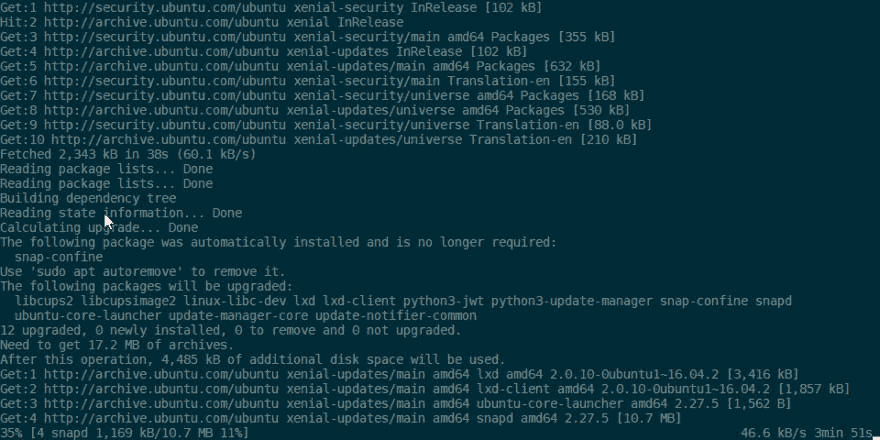
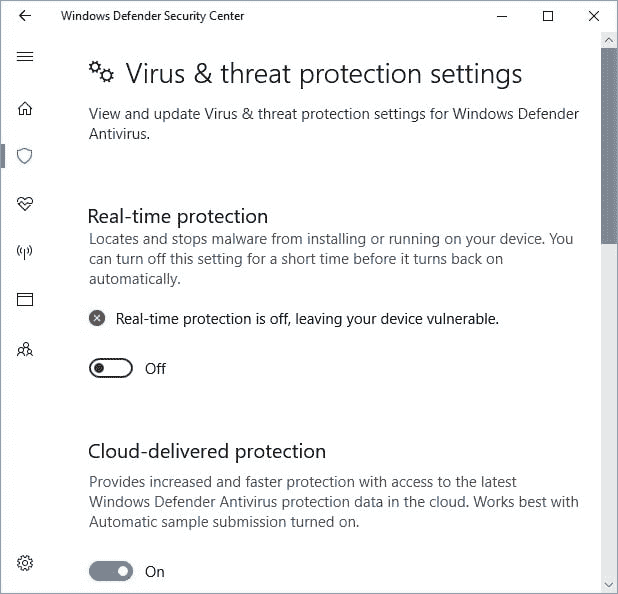
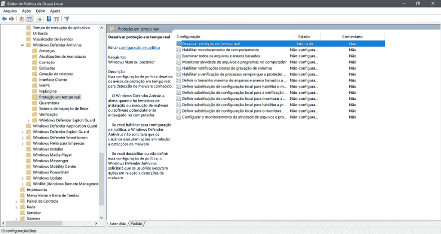

# 将 WSL I/O 速度提高了 5 倍以上，节省了大量电池寿命和 CPU 使用量

> 原文:[https://dev . to/Leandro CRS/speeding-up-wsl-io-up-than-5x-fast-saving-a-lot-of-lot-battery-life-CPU-usage-jfl](https://dev.to/leandrocrs/speeding-up-wsl-io-up-than-5x-fast--saving-a-lot-of-battery-life--cpu-usage-jfl)

<figure>

<figcaption>WSL 内部运行的 Ubuntu 试图更新 Windows 实时防护后面的一些包坏蛋</figcaption>

</figure>

虽然有助于检测一些常见的 Windows 恶意软件，但在 GNU/Linux 端，它是如此低效，实际上是没有帮助的。

每次你试图访问/读/写一些文件/文件夹，Windows Defender 拦截 WSL 的反病毒扫描申请，减慢事情，直到你讨厌 WSL 中的一切！

因此，要做到这一点，首先获取 UbuntuOnLinux(或您选择的发行版)的安装路径，转到*% user profile % \ AppData \ Local \ Packages*，并查找类似于 **CanonicalGroupLimited 的内容。UbuntuonWindows _ 79 rhkp 1 fndgsc***。*

*从 Explorer.exe 地址栏复制完整路径，然后进入*设置>更新&安全> Windows Defender >打开 Windows Defender Secutiry Central>防病毒&威胁>高级配置… >排除>添加或删除>添加>文件夹，最后:粘贴之前复制的路径。

### 警告:高安全性有时意味着低性能

<figure>

<figcaption>Windows Defender 实时减速…保护</figcaption>

</figure>

上面的提示可能会加快一点速度，但不是这样。还有一件事让你的性能下降: **Window Defender 实时保护**。

正如 [David Tansey](https://github.com/tanseydavid) 在本期[WSL](https://github.com/Microsoft/WSL/issues/1932)中所提到的，实时保护对 Visual Studio 构建工具和 Kubernetes 等开发工具有着巨大的影响。，包括 WSL。

我们将禁用它，但请注意:您可能会更容易受到一些常见的恶意脚本执行攻击。

所以，让我们禁用:

<figure> 

<figcaption>使用组策略(gpedit.msc)禁用实时防护</figcaption>

</figure>

**使用组策略禁用实时防护:**

1.  在您的组策略管理机器上，打开[组策略管理控制台](https://technet.microsoft.com/library/cc731212.aspx)，右击您想要配置的组策略对象，点击**编辑**。
2.  在**组策略管理编辑器**中转到**电脑配置**。
3.  点击**策略**，然后点击**管理模板**。
4.  展开树到 **Windows 组件> Windows Defender 杀毒>实时防护**。
5.  双击**关闭实时保护**设置，将选项设置为**使能**。点击**确定**。

我只进行了表面上的测试，但我可以确保性能大幅提升。

免责声明:我有计划提高我的英语技能，但我愿意提供更多的帮助。

### 参考文献:

在 Windows Defender AV | Microsoft Docs 中配置始终开启的实时防护—[https://Docs . Microsoft . com/en-us/Windows/threat-protection/Windows-Defender-anti virus/configure-real-time-protection-Windows-Defender-anti virus](https://docs.microsoft.com/en-us/windows/threat-protection/windows-defender-antivirus/configure-real-time-protection-windows-defender-antivirus)