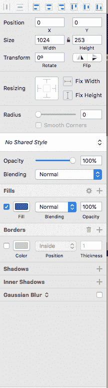
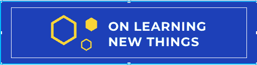
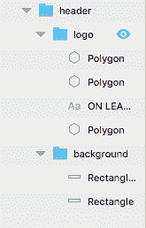
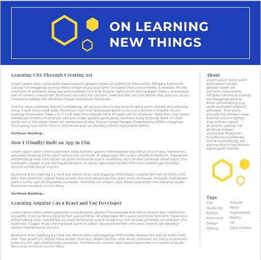
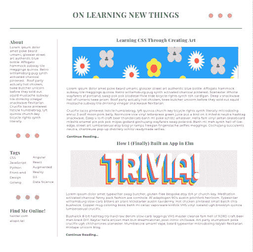
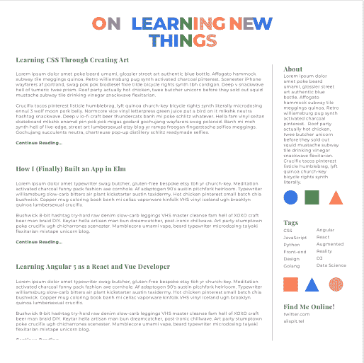

# 用草图设计

> 原文:[https://dev.to/aspittel/designing-with-sketch-42jp](https://dev.to/aspittel/designing-with-sketch-42jp)

当向人们展示我的作品集网站时，我被问了几次我的设计流程是什么。直到本周，我会(诚实地)说我没有。我只会编码，然后调整我的网站，直到它看起来像我想要的那样。本周，我决定至少应该让**试着**在设计网站原型时使用设计软件，而不是即兴创作。我认识的很多设计师都使用[草图](https://www.sketchapp.com/)，所以我决定走这条路！

我之前没有使用过任何设计软件，除了 Inkscape 用于 SVG 编辑，但是界面非常直观。我开始时没有遇到很多问题。我确实用两倍的速度播放了一些 YouTube 草图教程，以熟悉用户界面，但除此之外，大部分都是试错。

完全免责声明，我其实在本周早些时候用草图写了一份简历，但我觉得把它作为我的“最终项目”很奇怪。相反，我建立了三个原型网站，如果我为它制作一个网站，我的博客会是什么样子！

## 最终项目

我采取的第一步是使用左上角的`insert`按钮创建一个画板。我使用了`desktop`选项，这样我就有了一个标准的网页。您可以创建各种大小和形状的画板，以满足您的需求！我用了一个标准纸张大小的简历！我还将背景设置为白色，这样当我下载画板时，背景也会随之下载。

接下来，我在板上添加了形状和文本。在右边，你可以编辑它们的特征，比如字体、颜色和不透明度。我喜欢这一点，因为你可以对齐到像素！如果需要，您可以直接键入像素，而不必拖动项目直到它处于最佳位置。这里有一个关于拖动的有用提示，如果你想让项目在一个更小的单元中对齐，放大！这使得拖动变得容易多了！

[T2】](https://res.cloudinary.com/practicaldev/image/fetch/s--xfERCu52--/c_limit%2Cf_auto%2Cfl_progressive%2Cq_auto%2Cw_880/https://thepracticaldev.s3.amazonaws.com/i/eatsfcgbm3btccnb8kgr.png)

您也可以将项目分组，以便一起编辑它们。例如，我会将所有标题项放入一个组中，这样，如果我想移动整个标题，我就可以这样做。

[T2】](https://res.cloudinary.com/practicaldev/image/fetch/s--m26EIrJu--/c_limit%2Cf_auto%2Cfl_progressive%2Cq_auto%2Cw_880/https://thepracticaldev.s3.amazonaws.com/i/b0m5v78um1jo1awc8aq6.png)

[T2】](https://res.cloudinary.com/practicaldev/image/fetch/s--RfLc5D2---/c_limit%2Cf_auto%2Cfl_progressive%2Cq_auto%2Cw_880/https://thepracticaldev.s3.amazonaws.com/i/cwwjnr0d3frafqjfwlkg.png)

为了得到我在代码中常用的字体，我用 Mac 电脑上预装的字体册把它们安装到了我的电脑上。我只是点击了谷歌字体上的下载按钮，然后下载了它们。我没有在这个项目中使用图标，但如果我使用了，我会在我的设计中使用这些图标作为图像。我还使用了 [Hipster Ipsum](https://hipsum.co/?paras=5&type=hipster-centric&start-with-lorem=1) 作为我的文章主体！

现在让我们开始原型！

[T2】](https://res.cloudinary.com/practicaldev/image/fetch/s--gGo-nnRF--/c_limit%2Cf_auto%2Cfl_progressive%2Cq_auto%2Cw_880/https://thepracticaldev.s3.amazonaws.com/i/lf82s6yrcj7ma9g7ru25.png)

我的设计风格是相对简约的，带有一些大胆的细节。第一个设计有一个醒目的标题，上面有金色六边形图案。它主要使用蒙特塞拉特字体混合一些公平的标题。我还做了一个侧边栏，重复了六角形的细节。我非常喜欢图形细节，我认为最终的外观很简单，但在视觉上仍然很有趣。

[T2】](https://res.cloudinary.com/practicaldev/image/fetch/s--6D5M6mt---/c_limit%2Cf_auto%2Cfl_progressive%2Cq_auto%2Cw_880/https://thepracticaldev.s3.amazonaws.com/i/wnocbtehl7zlul3jn17r.png)

对于下一个，我想挑战自己，从我的项目中添加图像。这有点困难，因为帖子有不同的配色方案和不同大小的细节。我决定添加较长的图片，通常是网站的标题。这些图像看起来有点夸张，但是在制作中很容易改进！我还添加了一些“千年粉红”圆点细节，使网站更有趣！我认为从长远来看，图像将是困难和不切实际的，但我也喜欢这个设计的方式！

[T2】](https://res.cloudinary.com/practicaldev/image/fetch/s--mqsKa_PX--/c_limit%2Cf_auto%2Cfl_progressive%2Cq_auto%2Cw_880/https://thepracticaldev.s3.amazonaws.com/i/c2v90xjzvdzrcbp157ma.png)

第三个，也可能是我最喜欢的，设计基于我的个人网站。我有一个多色文本类似的标题。这在 Sketch 中构建有点麻烦，因为我必须为每个字母创建一个文本框。不过，在 CSS 中这样做也很烦人，所以这肯定不是草图特有的！我还在侧边栏中添加了不同的形状来模仿我网站上的形状背景！我的简历也遵循同样的主题，所以我认为把我所有的主要着陆点结合起来会很酷！我真的很喜欢明亮的色彩和其他地方的简约风格。

## 下一步

我真的很喜欢用草图做原型！我认为能这么快就设计出来很有趣，这让美学更有凝聚力。我想我会继续使用它，我会很有兴趣看看它是如何帮助我编写前端代码的！

[完整的 pdf 文件](https://github.com/aspittel/designs/blob/master/sites.pdf)

**我的一部分[关于学习新事物](https://medium.com/on-learning-new-things/learning-new-things-f4db7f16724)系列**