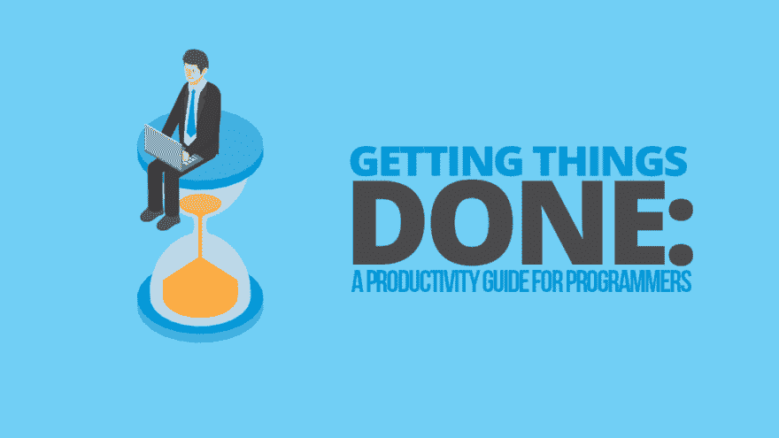

# 入住

> 原文:[https://dev.to/rpalo/checking-in-4i4l](https://dev.to/rpalo/checking-in-4i4l)

嗨！距离我的上一篇博客已经过去快四周了，所以我需要写点东西来保持流畅。这只是对已经发生的事情和即将发生的事情的更新。

## 今年迄今

今年，我和妻子试着为自己设定一些具体的目标，并坚持下去。到目前为止，它运行得很好，但它无疑使同时兼顾所有事情变得更加困难。我们加入了健身房和东湾社区篮球联盟，试图变得更加活跃。事实证明，当你消耗大量精力锻炼时，你就没有动力在下班后写博客或写代码。因此，我现在发现自己的处境。但是，我发现，随着我越来越习惯于少玩网飞和视频游戏，我也越来越习惯于默认的高效率。

我已经加入了 2018 年 code newbie Challenge，这是一个在 2018 年实现编码目标的有指导的、基于社区的过程。

[T2】](https://res.cloudinary.com/practicaldev/image/fetch/s--GVWLggAV--/c_limit%2Cf_auto%2Cfl_progressive%2Cq_auto%2Cw_880/https://assertnotmagic.com/img/cnc2018.jpg)

有四条轨道:开始编码，多编码，多博客，找份工作。我正在努力实现“更多代码”的目标，并试图安排一些里程碑和任务，以便取得进展并实际完成一些附带项目。在我的项目中工作已经真正帮助我了解了更多，更深入地挖掘了 Ruby，并且开始有了很多博客帖子的想法。

另外，我向[解构会议](https://www.deconstructconf.com/)提交了一份演讲提议，所以……祈祷吧！

## 即将到来

另一个我最近没有贴子的原因是我一直在做一个很大的东西，应该会在接下来的几天里发布。到时候我一定会分享一个链接。

**2018 年 2 月 5 日更新:**我客串发表了一篇关于简单程序员的帖子！[把事情做好:程序员生产率指南](https://simpleprogrammer.com/getting-things-done-productivity-guide/)现在在他们的网站上。(图片由简单程序员提供)

[T2】](https://res.cloudinary.com/practicaldev/image/fetch/s--PS4mOJGM--/c_limit%2Cf_auto%2Cfl_progressive%2Cq_auto%2Cw_880/https://thepracticaldev.s3.amazonaws.com/i/szua2t889rr3tg3cxhj4.png)

最后，我想分享一些我现在想做的博文想法。

*   闭包——为什么它们比你想象的更有用、更有趣

*   我的编译器可以打败我

*   教授逐句通过代码的艺术

*   我发现了子弹日记，它很棒

*   一旦你掌握了基本知识，Powershell 就非常棒

*   使用[夹钳](https://github.com/mdub/clamp)构建 CLI

*   揭秘使用 Bundler 构建 Gem:加载路径、Require 语句和运行脚本

如果你对这些话题比其他话题更感兴趣，请告诉我，我会知道哪些应该优先考虑。好事来了！

* * *

*原帖 [`assert_not magic?`](https://assertnotmagic.com/2018/02/03/checking-in/)*