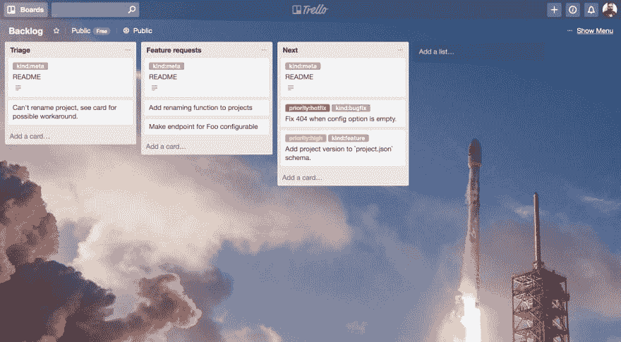
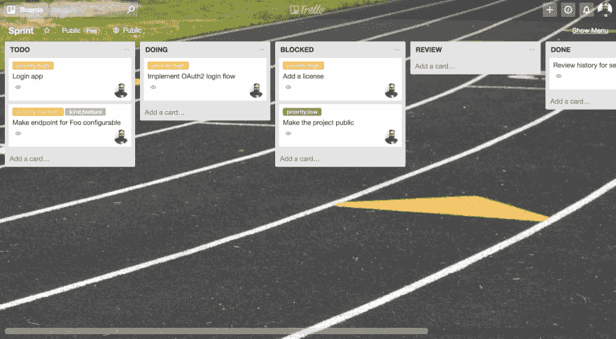
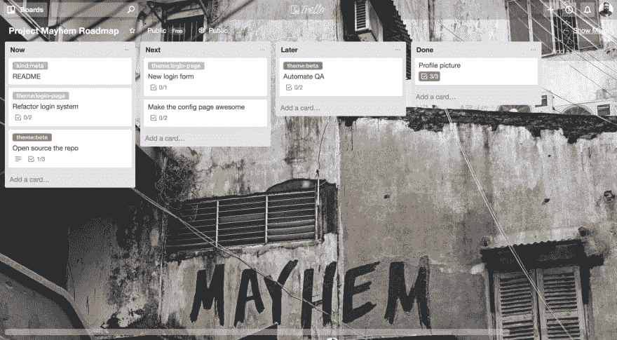

# 我如何在特雷罗的帮助下管理一个小团队

> 原文：<https://dev.to/masci/how-i-manage-a-small-team-with-the-help-of-trello-49d6>

封面由 Flickr 的 gdsteam 提供。

这不是关于敏捷管理理论的，我对此知之甚少；我就是这样做的，让一个小的工程师团队保持在正轨上，而不用把我 100%的时间分配给管理层。如果你继续阅读，你会发现我并没有发明任何东西，这只是“另一种方式”来组合现有的工具和实践，以实现一个适合我的过程。那么，为什么另一个帖子呢？

问题是，我花了很多时间和反复试验才走到这一步，我决定分享我的经验，以便其他人可以从中获得灵感，特别是如果以下几点适用的话:

1.  你是一个小团队的一员，比如说 8 个人或更少。
2.  您的团队负责交付新项目和维护现有项目。
3.  你有正式的期限、目标和目的。
4.  你希望花一些时间在产品上，而不是在管理上。
5.  你想让事情变得简单。

## 工具

我的团队地理位置分散，所以我们需要远程工具来共享信息。除了无处不在的电子邮件和即时消息，我们唯一使用的管理工具是 Trello。

作为通用工具，Trello 提供了你可以在专业工具如吉拉和 Asana 中找到的一小部分功能，但如果你想让你的团队管理开销最小，这实际上是一个关键点。

## 基础知识

我的方法基于三个构件:

1.  积压
2.  剧本
3.  路线图

让我们看看这些意味着什么，以及如何用 Trello 实现这样的块。

#### 积压

[T2】](https://res.cloudinary.com/practicaldev/image/fetch/s--pdSFUcQk--/c_limit%2Cf_auto%2Cfl_progressive%2Cq_auto%2Cw_880/https://thepracticaldev.s3.amazonaws.com/i/rmsuypnd3poxy7vzhky8.png)

作为一个团队，我们通常不会孤立地工作:与产品管理、客户支持、文档和其他工程团队的互动是可取的，也是期望的。Backlog 是与公司其他部门联系的点，是放置项目的地方，如功能请求、bug 报告或我的团队应该完成的任何小型、独立的任务——这些项目用 Trello 卡表示。我们有时会将自己的任务放在待办事项列表中，例如当需要讨论和评估优先级时。

Trello 板非常适合实现 Backlog，参见[这个基本示例](https://trello.com/b/0A4qO3OV/backlog)。根据团队活动的不同，列表的数量和类型会有很大变化，但至少应该有两列:

1.  *Triage* :是新任务等待分配优先级的地方。
2.  *下一个*:在优先级被分配后，任务被发送到这里，等待在即将到来的 sprint 中被分配和调度。

分配一些时间来检查待办事项板是很重要的，多久检查一次取决于工作量。固定的时间表对我来说更好，但这里真的没有规则。评审应该包括可以帮助决定优先级的经理和产品经理，以及可以帮助更好地定义卡的范围或卡所暗示的工作量的工程师。

#### 冲刺

[T2】](https://res.cloudinary.com/practicaldev/image/fetch/s--HTSlPY4A--/c_limit%2Cf_auto%2Cfl_progressive%2Cq_auto%2Cw_880/https://thepracticaldev.s3.amazonaws.com/i/uzr6iot6nyegr8d1fvhe.png)

sprint 板提供了团队当前状态的图片:完成了什么，谁在做什么，什么在等待评审，最重要的是，什么被阻止了，为什么。为此，每张卡必须有一个或多个所有者，这是我们在 Trello 上通过在“成员”列表中列出特定用户来实现的。你可以在 Trello [这里](https://trello.com/b/zFlf1VII/sprint)看到短跑板的样子。

你在 Sprint 板上看到的大部分卡片都来自待办事项，具体来说就是来自下一个列的*。这个过程通过计划会议正式化，计划会议通常在 sprint 开始之前举行，但你也可以让人们在需要时从那里挑选任务，因为卡片应该已经计划好并分配了优先级。*

关于 Sprint 板没有太多要讨论的，但是有一些警告:

1.  *TODO* 列应该只包含应该在当前 sprint 中完成的卡片。卡片往往会堆积在那里，特别是低优先级的，所以当这种情况发生时，我会删除所有者并将它们送回待办事项列表，甚至在*分类*上:也许优先级是错误的，任务定义不明确，甚至在回顾中不需要，这没关系。

2.  所有的卡片都必须有主人！这可能看起来很明显，但由于大多数时候你看着 sprint 板，一些过滤器是活动的，孤儿卡可能会变得不可见。

3.  完全跳过 backlog 板，直接在 sprint 板上添加一张卡是可以的:这是针对 bugfixes 或 midpsprint 弹出的紧急任务的情况，但我们试图将这作为一个例外。

#### 路线图

[T2】](https://res.cloudinary.com/practicaldev/image/fetch/s--B75K-5EE--/c_limit%2Cf_auto%2Cfl_progressive%2Cq_auto%2Cw_880/https://thepracticaldev.s3.amazonaws.com/i/38wlg3osr3dxpmbwip9z.png)

Backlog 和 sprint 板非常适合跟踪团队的工作，因为它非常容易回答诸如“你现在正在做什么？”，“下一步是什么？”，“有没有屏蔽器？”但是如果你想知道一个具体项目的整体状态呢？在 Trello 上，你可以使用标签将卡片链接到一个项目，但卡片可能会分散在 Backlog 和 Sprint 中，虽然你仍然可以过滤，但你无法避免在两个面板之间来回切换。路线图可以增加另一个维度，让你可以从中看到你团队的卡片。

路线图板上的每张卡片都代表一个宏观特性，或者一个*史诗*，并且必须包含一个简短的描述以及一个或多个清单。清单中的每一项都是一张卡片的链接，这张卡片可能在 backlog 或 sprint board 中，参见[这个 Trello board](https://trello.com/b/WTSoEcD1/project-mayhem-roadmap) 中的例子。

你需要一个 Trello 板来跟踪每个项目；至于待办事项栏，你可以随意增加列表的数量，但以下内容应该始终存在:

1.  *现在*:目前正在开发的史诗。
2.  *下一个*:一旦你有带宽就应该做的史诗。
3.  *稍后*:优先级低，应该*最终*完成的史诗。

卡片永远不会离开路线图板，你只需要在列表中移动它们，理想的是从*之后的*到*下一个*，然后到*现在的*，最后存档(或者移动到*完成*列表)。

作为任务的集合，epics 代表了一个团队相当大的一部分工作，但是它们可能不足以跟踪大的特性或长期目标；在这种情况下，你可以用一个*主题*对史诗进行分组，这个主题在 Trello 中可以用一个标签来表示。主题的例子可能是`version:1.0`或`feature:SAML`。然后，您可以按标签过滤路线图板，以查看某个特定主题的项目状态。

管理路线图板需要一些额外的时间，特别是编写清单，因为这都是手工工作，但作为交换，您可以获得项目状态的完美视图，这在讨论跨越多个 sprints 甚至多个季度的长期目标时可能非常有用。

## 结论

我仍在评估维护路线图的额外工作和回答有关大局的问题的能力之间的权衡，但总体来说，它工作得很好，证明我终于可以找到时间来写这篇文章。如果您有任何反馈，请联系 Twitter @maxpippi。