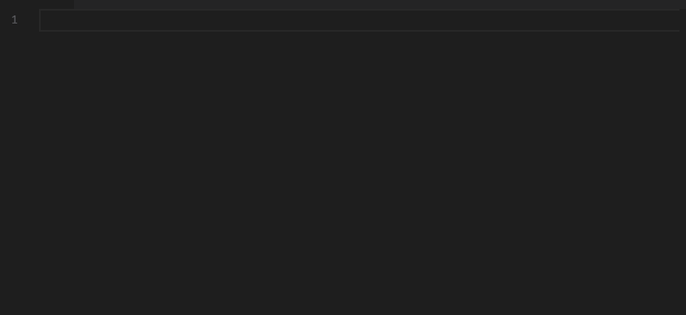
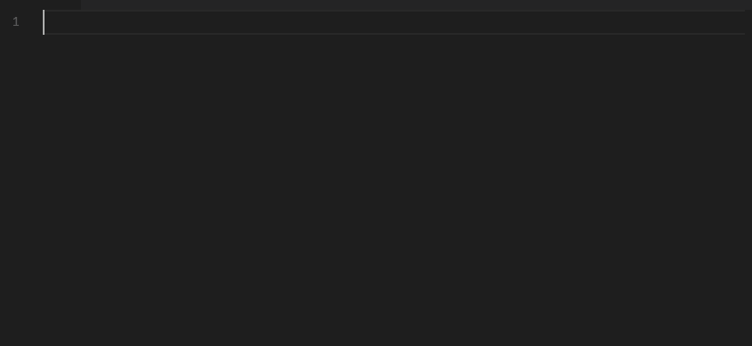

# 你见过埃米特吗？

> 原文:[https://dev.to/jonstodle/have-you-met-emmet-120d](https://dev.to/jonstodle/have-you-met-emmet-120d)

今天大多数流行的代码编辑器都支持 *Emmet* 片段，如果你还没有开始使用它们的话。你的生活会变得轻松一些。

在使用您选择的代码编辑器时，您可能会遇到一些代码片段。代码片断让你可以通过一个简单的快捷方式插入小代码块。埃米特是这个想法的兴奋剂。

Emmet 让你用 CSS 语法一次定义 HTML 的多个部分。键入您想要的元素、它们应该具有的 id、应该包含的类以及内容。看看这个例子:

[T2】](https://res.cloudinary.com/practicaldev/image/fetch/s--6i3XAJQf--/c_limit%2Cf_auto%2Cfl_progressive%2Cq_66%2Cw_880/https://blog.jonstodle.com/conteimg/2018/01/emmet-01.gif)

你可以用这个变得很高级。它支持添加子元素、内容等等。您甚至可以将表达式相乘来创建多个相同的元素:

[T2】](https://res.cloudinary.com/practicaldev/image/fetch/s--uwi8Iego--/c_limit%2Cf_auto%2Cfl_progressive%2Cq_66%2Cw_880/https://blog.jonstodle.com/conteimg/2018/01/emmet-02.gif)

这里有很多东西需要深入研究，所以我建议去看看这个项目的[文档](https://docs.emmet.io/)，看看有什么是可能的。

一旦你习惯了，它真的很有用。上面的演示是用 Visual Studio 代码录制的，其中包含了 HTML 文件的现成 Emmet 片段。很多编辑器都附带了 Emmet，对于那些不支持 Emmet 的编辑器，有很多插件。

这是一个等待使用的非常好的特性！

编码快乐！