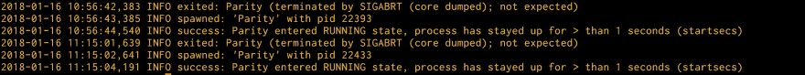

# 在 EC2 上建立 Ethereum 主网的 parity 节点

> 原文:[https://dev.to/sot528/ec2parity-32ke](https://dev.to/sot528/ec2parity-32ke)

描述了在 AWS 的 EC2 实例中构建主网的 parity 节点用于开发的过程。
为了在最短的时间内构建，意识低下，从电脑开始工作。 参考以下视频。

*   [https://youtu.be/4ac5ZeTveSs](https://youtu.be/4ac5ZeTveSs)

# [建立](#%E3%82%A4%E3%83%B3%E3%82%B9%E3%82%BF%E3%83%B3%E3%82%B9%E3%82%92%E7%AB%8B%E3%81%A6%E3%82%8B)实例

参考视频建立进行了以下设定的实例。

*   阿米:`Canonical, Ubuntu, 16.04 LTS, amd64 xenial image build on 2017-11-21`
*   端口释放:`8545`
*   确保存储容量:`20GB`

# 安装奇偶校验

参考视频连接 SSH 安装 parity。

*   `bash <(curl https://get.parity.io -kL)`

# 启动奇偶校验

这里与视频不同，附加`--light`选项作为灯光客户端模式。

*   `parity --jsonrpc-hosts all --jsonrpc-interface all --light`

# 从客户端连接并确认同步状态

参考视频获取实例的 ip，记载以下脚本(`getBlockNumber.js`) (`xx.xx.xx.xx`改写为所获取的 ip )

```
W3 = require('web3')
web3 = new W3(new W3.providers.HttpProvider('http://xx.xx.xx.xx:8545'))
web3.eth.getBlockNumber().then(result => {console.log(result)}) 
```

<svg width="20px" height="20px" viewBox="0 0 24 24" class="highlight-action crayons-icon highlight-action--fullscreen-on"><title>Enter fullscreen mode</title></svg> <svg width="20px" height="20px" viewBox="0 0 24 24" class="highlight-action crayons-icon highlight-action--fullscreen-off"><title>Exit fullscreen mode</title></svg>

*   Hang hang

    ```
    node getBlockNumber.js 
    ```

*   如下所示，如果输出了块号码，则同步成功，正在进行。

    ```
    308485 
    ```

*   几个最新的区块会勾选[ethstats](https://ethstats.net) 。 2018/02 时有 500 万个街区左右。

    *   灯光客户端模式也需要几天才能完全同步。

# parity 在中途掉落的情况下进行守护进程

在灯光客户端模式下移动 parity 可能会在同步一段时间后掉落。
在这种情况下可以进行守护进程。 总结使用 supervisor 守护程序的步骤。

1.  安装 supervisor

    ```
    sudo apt-get update
    sudo apt-get install supervisor
    sudo mkdir /var/log/supervisor/jobs 
    ```

2.  将以下设定文件配置为`/etc/supervisor/conf.d/`以下的`parity.conf`。

    ```
    [program:Parity]
    command=/usr/bin/parity --jsonrpc-hosts all --jsonrpc-interface all --light
    user=root
    autorestart=true
    stdout_logfile=/var/log/supervisor/jobs/parity.log
    stdout_logfile_maxbytes=1MB
    stdout_logfile_backups=5
    stdout_capture_maxbytes=1MB
    redirect_stderr=true 
    ```

3.  supervisorを起動

    ```
    sudo supervisord
    sudo supervisorctl start all 
    ```

4.  确认日志，如果 parity 开始同步就 OK 了。

    ```
    tail -f /var/log/supervisor/jobs/parity.log 
    ```

*   即使掉了也要再次站起来。
    [](https://res.cloudinary.com/practicaldev/image/fetch/s--6XdKLSJf--/c_limit%2Cf_auto%2Cfl_progressive%2Cq_auto%2Cw_880/https://thepracticaldev.s3.amazonaws.com/i/t753n0ajfd5b0z4fv0s2.png)

*   如果要好好做的话，事先将 supervisor 本身服务化(省略)。

# Prepare for the exam

*   奇偶校验:`v1.9.0-beta`
*   2018/02 确认当前可以通过上述步骤同步到最新的块(需要几天时间)。
*   geth 也可以，但 parity 给人的印象还是多少有些稳定。 然而，如果是全节点，则可能要等待好几个星期才能完全同步。
*   因为 light client mode 还处于实验阶段，所以在生产运用中需要注意。