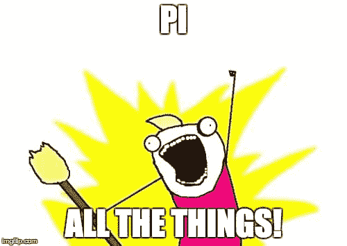

# 哪个 Pi？

> 原文：<https://dev.to/nickytonline/which-pi-43hf>

嘿大家好。我正在考虑购买一个 Pi，但老实说，我被所有的型号淹没了。甚至还有“橘子皮”呢！

[T2】](https://res.cloudinary.com/practicaldev/image/fetch/s--1ipMOJd0--/c_limit%2Cf_auto%2Cfl_progressive%2Cq_auto%2Cw_880/https://thepracticaldev.s3.amazonaws.com/i/xdb6wcxn99jdhflollrg.jpg)

我还不知道我想用它做什么，但很可能会在 Node 中编程。

如果任何与 Pi 合作过的人对初级模型有什么建议，我将不胜感激。

封面图片由 Flickr 用户 [Ginger](https://www.flickr.com/photos/deepfriedkudzu/34339030392/in/photolist-STLugb-6SrEeC-5toss2-5n38vH-5mPF1e-5gdYwJ-5cCjeM-DVVPU-adDyMP-4UgQRL-adDuua-4E76i7-aiwjsd-6PcUSa-6t8PPo-qpajp-hSkn3-WhDTnm-fQuhdK-oStXSc-6jJemJ-c69gkw-2mknJP-41Pmu1-6SmN8P-kYcZh-zxgKr-cvFZbQ-73XzKX-VhkiC8-ouRjq4-9E7HtA-6Snpjg-vZUzb-W8u9kt-96PKyz-z642kB-5Rkgxz-9dtyu1-twi5w-8HBB5z-Ujqvo9-6Srs91-nvG8T-6SnNxk-8ARkk-bcUYW-5L9zSY-Wk3FWM-64N9G8) 提供