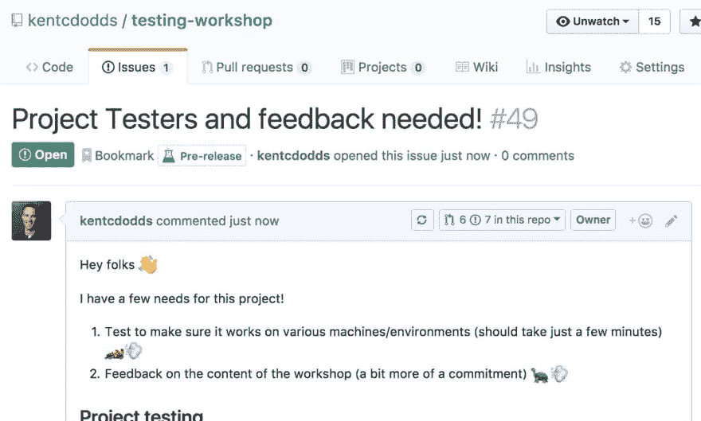

# 每周网络综述- 05

> 原文：<https://dev.to/ardennl/weekly-web-roundup---05-1i4j>

又过了一周，还是没有网站。嘘我。我把 DNS 搞砸了，长话短说:周末时间到了。尽管如此，我们还是非常欢迎你订阅邮件列表。

*   [第 04 周](https://dev.to/ardennl/weekly-web-roundup---04-375j)
*   [第 03 周](https://dev.to/ardennl/weekly-web-roundup---week-03-5d74)
*   [第 02 周](https://dev.to/ardennl/weekly-web-roundup---02-1f39)
*   [第 01 周](https://dev.to/ardennl/weekly-web-roundup---01-15d6)

## 新闻

*   [ECMAScript 2018](http://2ality.com/2017/02/ecmascript-2018.html) (那将是‘ES9’，还是我们放弃那些名字？)已经完成，并为我们带来了`rest/spread`，新的`regex`功能，`promise.finally`和更多的好东西！Axel Rauschmayer 博士明智地指出 ECMAScript 版本不太重要，因为我们有阶段。如果一个提议进入了第 4 阶段，这意味着它将被包含在下一个 ECMAScript 版本中，那么使用它是安全的。

## JavaScript

*   奉承是很难理解的概念之一，我总是欢迎更多关于这个主题的材料。雷米在 codementor.io 上用 JavaScript 写了一篇关于[谄媚的精彩解释。](https://www.codementor.io/michelre/currying-in-javascript-g6212s8qv)
*   [Emily Morehouse-Valcarcel](https://twitter.com/emilyemorehouse) 写了一本关于 Git-hook 的必读介绍，并获得 2018 年最佳英雄形象奖。阅读 javascriptjanuary.com 上的
*   的确，Webpack 的配置会很快变得复杂。制作支持框架的配置、传输、单独的登台/开发/构建选项、测试、缩小等。可以让你同时浏览四个不同的文档。Webpack 处理了很多东西，是一个令人印象深刻且经过深思熟虑的构建工具。我很期待第 4 版，它也提供了“零配置”选项，但通过 webpack.academy 上由 webpack 大师[肖恩·拉金](https://twitter.com/TheLarkInn)教授的[免费课程来更新你的知识不会有什么坏处。](https://webpack.academy/p/the-core-concepts)
*   关于这一点，[阿瑟·里斯·普钦](https://codeburst.io/modules-and-bundlers-why-are-we-even-f85230162aad)的一个小提示是，打包工有时会让人不知所措。
*   Sarah Drasner 的文章[“JavaScript，我爱你，你是完美的，现在改变”](https://css-tricks.com/javascript-love-youre-perfect-now-change/)在 css-tricks.com 上有一些关于语言改进的好想法！不是每个人都会同意，有些甚至可能不可行(因为原因)，但它表明我们可以在语言中分享自己喜欢和不喜欢的想法。
*   我承认。我仍然不习惯用断点调试 JavaScript，也不习惯频繁地在代码中弹出一个`console.log`。我知道我应该拥有*适当的*调试的技能，我希望这篇由[达斯汀驱动](https://twitter.com/dustin_driver)和[杰森林泓](https://twitter.com/jasonlaster11)撰写的精彩杂志文章能在我的道路上帮助我:[用一个你不知道已经有了](https://www.smashingmagazine.com/2018/02/javascript-firefox-debugger/)的真正调试器调试 JavaScript

## 发展

*   你们很多人都知道戴夫·格迪斯。我在早期版本的综述中特别提到了他的一些文章，他是像[网格生物](https://t.co/NkZQGmD8At)这样的令人敬畏的课程的创造者。他对 stackingthebricks.com 做了一次很有见地的采访，我建议你去看看！*“在这次采访中，你将了解到戴夫是如何在无聊的工作中开辟出一条意想不到的道路，创造出自己的产品”*
*   由于 Slack web 应用程序不支持 FireFox 中的视频，干草叉本周再次被禁用。如果马特·佩里没有把我的想法写在一篇名为《T2》的文章中，我会分享给大家。我要给懈怠队发个好消息，BRB。
*   - [在浏览器中绘制草图](https://medium.com/seek-blog/sketching-in-the-browser-33a7b7aa0526)是一篇关于让开发人员和设计人员的设计系统更加紧密的长篇读物。Seekjobs 的设计团队负责人[马克·达利](https://twitter.com/markdalgleish/)在本文中详细解释了他们设计流程的演变。

## CSS / HTML

*   可变字体就在我们面前，在这篇文章之前，我还不知道它们是干什么的。 [Richard Rutter](https://twitter.com/clagnut) 写了[‘如何在现实世界中使用可变字体’](https://medium.com/clear-left-thinking/how-to-use-variable-fonts-in-the-real-world-e6d73065a604)，解释了什么是可变字体以及如何在现实应用中使用它们。
*   [戴夫·鲁伯特](https://twitter.com/davatron5000)写了一点关于用 CSS 变量制作 [`cheapass`视差的内容。这似乎是一个非常优雅的技术，甚至可以用`Intersection Observer`进一步改进。我要把这个链接放在手边。](https://daverupert.com/2018/02/cheapass-parallax/)
*   如果你曾经使用过 sprite 中的 SVG 图标作为`<use>`符号，你就会知道控制多个路径的样式变得很困难。[莎拉·达扬](https://twitter.com/sarahmalekoum)发表了一篇文章向你展示[如何用 css 变量制作多色 SVG 图标](https://medium.freecodecamp.org/lets-make-your-svg-symbol-icons-multi-colored-with-css-variables-cddd1769fca4)🎉！

# [我们](#oss)

*   Socket 是“最可爱的小 WebSocket 包装器！”。他们已经让我出现在标志上了。顾名思义，它是一个很小的(344 字节)`WebSocket`包装器，在连接丢失时重新连接。由[卢克·爱德华兹](https://twitter.com/lukeed05)制造。
*   2018 年最佳 OSS 名称奖授予了 URQL，这是一个缩写词“Universal React Query Library”。[肯·惠勒](https://twitter.com/FormidableLabs)/[formiblelabs](https://twitter.com/ken_wheeler)创建了 URQL 来简化 React 中 GraphQL 的工作。查看 github 上的[介绍文章](https://formidable.com/blog/2018/introducing-urql/)和[回购。我期待着尝试一下。](https://github.com/FormidableLabs/urql)
*   Callbag 是 JS 回调的标准，支持轻量级的可观察性和可迭代性。我不完全确定这是什么意思，但它看起来真的很聪明。 [callbags-basic](https://github.com/staltz/callbag-basics) 是一个基于 Callbag 标准的微型库。[阅读安德烈·斯塔尔茨的文章](https://staltz.com/why-we-need-callbags.html)中的“为什么”，当你读完后，请像我五岁时那样向我解释。
*   我敢肯定，JSDOM-worker 对某些人来说会非常有用:*添加了伪 Web Workers 来开玩笑！可以把它想象成一个 Web Workers polyfill for Node。*由[杰森·米勒](https://twitter.com/_developit)
*   KAP 是一个开源的截屏工具，它看起来很漂亮，简单，是为开发者设计的！去试试吧！

## 公益告示

*   是的。是的，它是液体错误:内部
*   有趣的想法，我有点同意。在一个应用程序中构建和标准化数据并搭建数据是非常复杂的，并且远离设计和 UX。此外，擅长组织数据的人在 UX 不一定是好的，反之亦然。

    > T4】史蒂夫金内[@史蒂夫肯尼【T8](https://dev.to/stevekinney)我越来越清楚"前端架构师"是一个需要存在的角色.
    > 
    > 我们将很多复杂性从服务器转移到了客户端。如果我们不考虑如何管理它,我们将以悲伤的猴拳结束 2018 年年 2 月 01 日上午 00:16

*   我从来没有真正想过这个，但这很酷！液体错误:内部
*   肯特·c·多兹致力于帮助他人，现在他需要你的帮助。算是吧。他实际上又在帮助*的人*参与开源软件

    > 肯特 c。多兹T14】@肯特多兹嘿朋友们！我需要你的帮助！
    > T23T252018 年 2 月 02 日上午 07:50

## 灵感

*   格林索克更新了他们的展示网站，非常棒。液体错误:内部
*   爱恋此像素渐变工具由诺亚利

    > <video loop="" controls=""><source src="https://video.twimg.com/tweet_video/DU-ST6XVoAAxeEI.mp4" type="video/mp4"></video>诺亚利🤖💕@ noahdleigh今天,我很高兴地宣布我在[@小故障](https://twitter.com/glitch):动画像素渐变创建器上的像素艺术创作的下一次迭代！
    > 
    > [动画像素渐变。故障。me](https://t.co/GX7qOXHrFK)2018 年 2 月 01 日下午 19:31T45】

*   克里斯甘农 eggcels 在制造装载机轭！液体错误:内部
*   迷幻的触角。我喜欢它液体错误:内部

## 我一直在忙什么

*   我还没写完 transpiling 上的博文。这是一篇相当长的文章，我觉得不应该匆忙。在这篇文章中，我解释了 ECMAScript 的历史、版本、阶段、Babel，单独使用 Babel 或者与 Webpack 结合使用。写这篇文章让我学到了很多，包括巴别塔和巴别塔团队是多么令人印象深刻。👏
*   写这篇文章我学到的另一件事是命名和版本控制真的很难。不仅仅是做 web 应用的人，做工具、框架甚至语言的人也一样。感谢永不遗忘的互联网，你的工具的命名和版本控制的任何变化都会导致一批新的困惑的开发者得到不再是最新的谷歌结果。
*   一些其他令人兴奋的事情正在发生，但我在这里试图保持离散。更快。

一如既往的感谢阅读，周末不要工作太多！

阿登