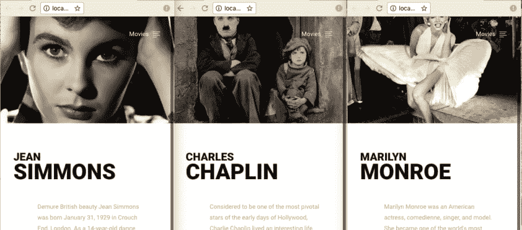

# 用 Express.js 创建一个基本网站

> 原文：<https://dev.to/aurelkurtula/creating-a-basic-website-with-expressjs-j92>

Express 被描述为一个轻量级的 web 框架，这意味着我们可以用它来创建网站。今天我将从最基本的开始。该网站将只有几个静态页面，我们将能够通过导航。

和现在的大多数框架一样，Express 有自己的生成器。至少在开始时，从生成器开始可能会很好，您将看到一种构建项目的方式。重要的是要记住表达是不固执己见的。虽然样板文件是以一种特殊的方式构建的，但是你可以用任何对你有意义的方式来构建你的 express 项目。

在本教程中，我将涵盖非常基础的。到最后我们会有一个三页的网站。

让我们开始吧。

创建您的项目文件夹。然后在终端中运行下面两行

```
npm init
npm install --save express 
```

Enter fullscreen mode Exit fullscreen mode

第一行创建了`package.json`文件，它基本上启动了项目。第二个安装 express。注意，`--save`标志只是在包文件中添加了 express，这样如果我们需要重新安装包，`package.json`就知道/记住了项目需要哪些包

现在创建一个`server.js`文件。这是我们写代码的地方。

让我们从最基本的结构开始。

```
import express from 'express';
const app = express()
app.get('/', (req, res) => {
    res.send('Hello World')
})
app.listen(5656, () => {
    console.log('http://localhost:5656')
}) 
```

Enter fullscreen mode Exit fullscreen mode

在那里，我们创建了一个运行在本地主机端口 5656 的基本网站。

我们可以选择从终端改变端口号。我们通过如下方式修改上面的代码来做到这一点:

```
const port = process.env.PORT || 5656;
app.listen(port, () => {
    console.log(`http://localhost:${port}`)
}) 
```

Enter fullscreen mode Exit fullscreen mode

这样，你就可以运行`PORT=8081 npm start`来改变端口号，当然，运行`npm run`默认端口号是`5656`

## 在浏览器中渲染 HTML。

到目前为止，我们的网站无聊透顶。我们无法以这种方式创建网站。我们宁愿向浏览器发送 html 页面，而不是向浏览器发送文本字符串(尽管该字符串可以是 html)。

Express 让我们可以选择使用模板引擎来代替 html。随着我们开始使用动态内容，这种能力变得非常有用。

有很多模板引擎可以选择，我最喜欢的是`pug`。当然，它不是所有选项中最友好的，但是我喜欢它。我们不需要打开和关闭任何标签。让我们设置一下，让 express 知道我们打算使用什么。

`pug`本身是一个包，所以首先让我们把它安装在终端`npm --save pug`中。现在让我们让 express 知道这就是我们正在使用的。

```
app.set('view engine', 'pug'); 
```

Enter fullscreen mode Exit fullscreen mode

就是这样，我们设置模板引擎为`pug`。现在不是将`Hello world`发送到浏览器。让我们转而呈现一个`pug`页面。

```
app.get('/', (req, res) => {
    res.render('index')
}) 
```

Enter fullscreen mode Exit fullscreen mode

当设置`view engine`时，express 希望`pug`页面位于一个名为`views`的目录中，因此让我们创建该目录并添加索引文件:`views/index.pug`。在这里，我们添加希望在浏览器上显示的代码。我们来给它一个哈巴狗版的 hello world:

```
 #message
        h1 Hello World 
        h3 pug's in the house 
```

Enter fullscreen mode Exit fullscreen mode

我相信你能猜到上面的内容是如何翻译成 html 的

```
 <div id="message">
        <h1>Hello World</h1>
        <h3>pug's in the house</h3>
    </div> 
```

Enter fullscreen mode Exit fullscreen mode

基本上就是这样了！了解 express 的基本用法。

## 让我们创建一个网站

为了演示 express 的基本用法，我创建了以下网站。是一个页面很少的网站。每一页都告诉我们某个艺术家的一些情况。它展示了 react 应用程序中资源(图片、css、js)的使用，以及路由器的更详细的使用。

[T2】](https://res.cloudinary.com/practicaldev/image/fetch/s--IevHCec8--/c_limit%2Cf_auto%2Cfl_progressive%2Cq_auto%2Cw_880/https://thepracticaldev.s3.amazonaws.com/i/d9v90pmxqq8j5v9iv1a4.png)

## 让我们用路由工作

从上面的截图可以看出，这个网站将有三个简单的页面。这就是创建路线的方式

```
 app.get('/charles', (req, res) => {
        res.render('chaplin')
    })
    app.get('/marilyn', (req, res) => {
        res.render('monroe')
    })
    app.get('/jean', (req, res) => {
        res.render('jimmons')
    }) 
```

Enter fullscreen mode Exit fullscreen mode

我们找到了。如果用户导航到`/charles`，页面上会呈现一个`chaplin.pug`模板。

在我们的例子中，每个艺术家的结构都是完全相同的，所以路由器将呈现相同的 pug 模板！

```
 app.get('/charles', (req, res) => {
        res.render('index')
    })
    app.get('/marilyn', (req, res) => {
        res.render('index')
    })
    app.get('/jean', (req, res) => {
        res.render('index')
    }) 
```

Enter fullscreen mode Exit fullscreen mode

最后，使用上面的配置，如果用户导航到网站的根目录，他们会得到一个错误`Cannot GET /`，因为我们已经删除了根路由器(`app.get('/', (req, res) => {})`)。要解决这个问题，我们可以将用户重定向到我们需要的另一个页面。

```
 app.get('/', (req,res) =>{
        res.redirect('/charles')
    }) 
```

Enter fullscreen mode Exit fullscreen mode

## 处理动态数据

我们能够将数据从路由传递到 pug 模板。这里有一个例子:

```
 app.get('/charles', (req, res) => {
        res.render('index', {
            firstname: 'Charles',
            lastname: 'Chaplin',
            tag: 'The Little Tramp',
            content: '...',
            movies: [...]
        })
    })
    app.get('/marilyn', (req, res) => {
        res.render('index', {
            firstname: 'Marilyn',
            lastname: 'Monroe',
            tag: 'Being normal is boring',
            content: '...',
            movies: [...]
        })
    }) 
```

Enter fullscreen mode Exit fullscreen mode

我们仍然要求呈现`index.pug`页面，但是我们也传递了一个对象给它。然后`index.pug`页面看起来会像这样

```
 body
        .wrap
            .profile.hide
                a(href='#').menu
                    span Movies
            .information
                .information__heading
                    span.information__heading__tag= tag
                h1.information__name 
                    small=firstname  
                    | #{lastname}
                p.information__description= content 
```

Enter fullscreen mode Exit fullscreen mode

看看我们在路由中传递的 json 信息是如何使用的。Pug 可以读取我们传递的所有数据变量，如果我们只需要呈现一个变量，可以使用等号，或者像这样包装变量。

## 资源文件

每个网站都需要风格和图像。这就是我如何链接样式表和前端 JavaScript 的。

```
 doctype html 
    html
        head
            title=title
            link(rel='stylesheet', href='/styles/style.css')
            meta(name='viewport' content='windth=device-width, initial-scale=1')
        body
            .wrap
                ...
        script(src='js/script.js') 
```

Enter fullscreen mode Exit fullscreen mode

即使`/styles/style.css`和`js/script.js`被正确地放置在它们各自的目录中，express 也不会让它们像我们在上面的设置中所期望的那样可用。

我们首先需要告诉 express 这些文件在哪里。或者换句话说，我们需要告诉 express 我们的静态内容在哪里。静态内容指的是样式表、javascript 文件和库，甚至是字体。

为此，我们需要在`server.js`中写下下面一行:

```
app.use(express.static(__dirname + '/public')); 
```

Enter fullscreen mode Exit fullscreen mode

准备就绪后，我们需要创建一个`public`目录，并在其中创建`/styles/style.css`和`js/script.js`文件。最后，正如我们从上面的 pug 片段中看到的，`public`文件夹中的所有东西都可以从根目录访问，我的意思是，`public/js/script.js`在`/js/script.js`是可用的。

## 从 json 文件中获取内容

虽然这超出了本教程的范围，但这些艺术家的内容将存储在数据库中，不会像我们上面所做的那样硬编码在路线中。然而，今天，我们可以将内容存储在一个单独的 JSON 文件中，并在路由中使用它。这将有助于我们比现在更好地管理数据。

```
 import data from './data/artists.json'
    ...
    app.get('/charles', (req, res) => {
        res.render('index', data.artist[0])
    })
    app.get('/marilyn', (req, res) => {
        res.render('index', data.artist[1])
    })
    app.get('/jean', (req, res) => {
        res.render('index', data.artist[2])
    }) 
```

Enter fullscreen mode Exit fullscreen mode

现在，每条路线获得不同的数据，产生以下三个页面:

[T2】](https://res.cloudinary.com/practicaldev/image/fetch/s--6JOA_gPp--/c_limit%2Cf_auto%2Cfl_progressive%2Cq_auto%2Cw_880/https://thepracticaldev.s3.amazonaws.com/i/smlk83cpadq40n3h31el.png)

## 重述

就这样，我们讨论了路由器、模板和静态文件。这是我们在`server.js`中应该有的全部代码。然后剩下的就是平常的前端代码了。

```
 import express from 'express';
    import data from './data/artists.json';
    const app = express();
    app.set('view engine', 'pug');
    app.use(express.static(__dirname + '/public'));
    const port = process.env.PORT || 5656;
    app.get('/', (req,res) =>{
        res.redirect('/charles')
    })
    app.get('/charles', (req, res) => {
        res.render('index', data.artist[0])
    })
    app.get('/marilyn', (req, res) => {
        res.render('index', data.artist[1])
    })
    app.get('/jean', (req, res) => {
        res.render('index', data.artist[2])
    })
    app.listen(port, () => {
        console.log(`http://localhost:${port}`)
    }) 
```

Enter fullscreen mode Exit fullscreen mode

你可以在 [github](https://github.com/aurelkurtula/basic-express-js-setup) 查看整个项目