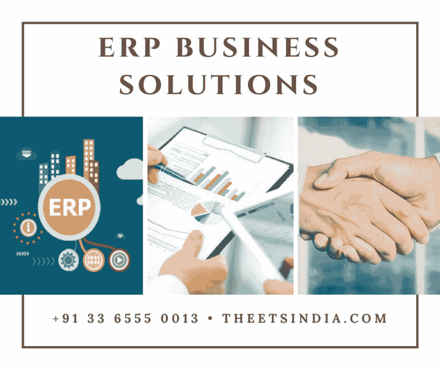
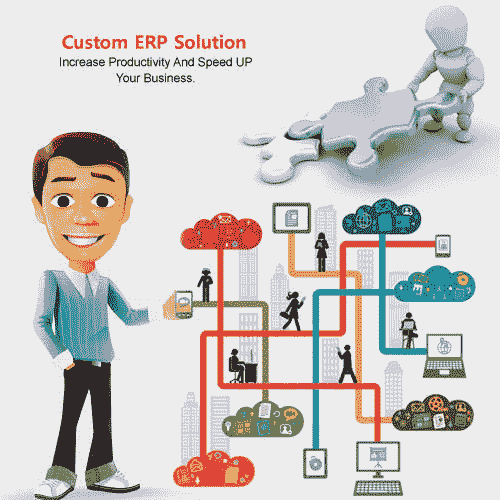

# 中型企业应该学会如何通过降低成本来获得最大收益

> 原文:[https://dev . to/ets India/medium-scale-industry-should-learn-how-to-maximum-incoming-less-cost-eoa](https://dev.to/etsindia/medium-scale-industry-should-learn-how-to-maximize-revenue-by-incurring-lesser-cost-eoa)

[T2】](https://thepracticaldev.s3.amazonaws.com/i/ar9xp2n99mgeoge9ptbg.png)

通过降低成本来最大限度地增加收入绝非易事。由于商业机构发现自己处于各种各样的环境中，他们不得不采取这种做法，并且有各种各样的方式这样做。然而，当中小型企业面对这些情况并采取这些措施时，事情变得更加棘手。虽然小规模工业(很大程度上由于其较薄的基础设施)可以绕过实践的困难，大公司(由于其资金实力)也可以，但中等规模工业部门面临着真正的冲击。

这是一个黄金法则，为了最大化的形象，企业需要生产更多的产出，直到额外的单位增加更多的收入，这个数字高于他们为此付出的成本。然而，通过减少支出可以获得额外的收入。事实上，这是另一种增加收入的方法。然而，整章还有另一个方面。按照现代经济学家的说法，有增加收入、边际收入、增加成本和边际成本等方面。每个公司都需要通过减少支出来增加产量，直到边际收益与边际成本相匹配；事实上，这是收入最大化和支出达到最低利润的点。如何才能做到？

**阅读还:[定制定制 ERP 是中小规模行业的唯一解决方案](https://etsindia-software-development.blogspot.in/2017/10/custom-erp-is-only-solution-for-small_91.html)**

有许多 ERP 或企业资源规划模块开发公司可以帮助这个行业。事实上，一个定制的 ERP 开发公司将能够通过想出[定制的和行业特定的 ERP](http://theetsindia.com/blog-details/1277/What-Benefits-You-Will-Get-If-You-Choose-Customized-ERP-Development-Services?) 模块来帮助企业，从而制定商业计划。

一家企业软件提供商公司推出了定制的 ERP 软件包，这将有助于公司扩大业务。

这些模块对于企业来说是无可挑剔和不可或缺的，尤其是中等规模的模块，原因有很多。

[T2】](https://thepracticaldev.s3.amazonaws.com/i/9c4002hmnkrhrakdz5pp.jpg)

*   他们将尽最大努力维持企业的效率以及与之相关的其他重要活动。
*   一家[定制的 ERP 开发公司](http://theetsindia.com/enterprise-solutions)开发的软件包降低了企业营销成本以及其他任务。
*   他们还保留每个项目的记录。
*   他们努力在不同部门之间建立更好的理解差距，并将一切置于单一体系之下。
*   他们总是在寻找节省时间和确保各级生产效率的方法。
*   他们使用移动友好的应用程序来访问数据库。

ERP 开发现在已经成为企业最重要的组成部分之一，每一个小型和大型企业都希望实施相同的成功。印度的每一家定制 ERP 开发公司都聚集了大量能力出众的专家和技术人员，他们提出高度可行的定制 ERP 解决方案，帮助企业以更低的成本实现收入最大化。事实上，这些公司想出了正确的 ERP 软件包，是为每一个业务类型量身定做的。

**阅读还:[ERP 对小企业有什么好处？](http://theetsindia.com/blog-details/1301/What-is-the-Benefits-of-ERP-for-Small-Businesses?)T3】**