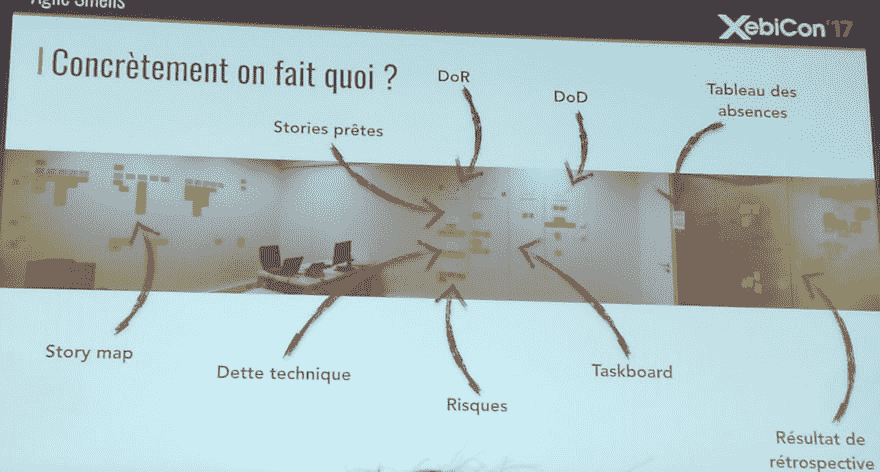

# 我对 XebiCon 2017 -敏捷气味的反馈

> 原文：<https://dev.to/schreiber_chris/my-returns-on-xebicon-2017---agile-smells-gh>

2017 年 11 月 30 日，我参加了 XebiCon 大会，这是一个由 Xebia society 及其合作伙伴组织的会议，会上讨论了许多主题，如技术主题(Kotlin、大数据、物联网、区块链、DevOps...)、组织方面(特色团队...)当然，还有几个人谈到了敏捷方法。Julien Rossignol 的一个非常有趣的演讲是关于敏捷气味，这些迹象表明你的团队组织中有问题。
这次演讲基于他于 2017 年初在 [Xebia 的博客](https://blog.xebia.fr/2017/03/15/agile-agile-smells-management-visuel/)(法语)上发表的一系列文章。

## 缺乏可视化管理

提醒一下，可视化管理就是利用你办公室的墙壁来展示关于你团队生活的信息:正在进行的任务，目标，潜在的问题...这使得路过的每个人都能快速了解团队目前正在做什么。对于 Julieu Rossignol 来说，一个敏捷团队的办公室，空白的墙壁(没有便利贴、烧毁图表或任何其他信息)是一个重要问题的真实标志，例如:

*   来自管理层的外部压力，导致团队隐藏信息来保护自己
*   缺乏产品视角和中长期目标，这会导致团队成员失去动力
*   仅使用数字工具，这并不适合所有人，可能会导致成员在仪式期间参与度降低。以下是 Julien 在会议期间提供的良好视觉管理示例:作为本部分的总结，Julien 揭示了良好工作空间的 3 个特征:
*   可听性:任何人都应该能够很容易地听到并与团队的其他成员交谈
*   可见性:每个团队成员都应该看到彼此
*   孤立:你应该能够在不打扰团队其他成员的情况下进行讨论

## 任务板:用户故事停留在进行中列

Julian 描述了一个简单的例子:由于开发任务在开发结束后会保留在“进行中”列中，所以让我们添加一个验证列。在那之后，我们看到一个评论专栏会很有用，然后是一个测试专栏，然后是部署...
将任务板中的列相乘再次显示了团队中的故障:

*   需要多个验证步骤可能表明产品所有者没有充分参与
*   没有测试最佳实践
*   没有团队精神，这解释了为什么代码审查需要这么长时间
*   没有操作配置文件，这使得部署速度较慢

这对冲刺过程也有影响:

*   有很多正在进行的用户故事
*   故事在列之间来回出现(例如进行中->验证->进行中->验证...)
*   这些实际上是伪装的等候队伍
*   团队成员之间的协作是不被鼓励的，因为没有人会努力把故事从进展栏中去掉

朱利安提出了解决这个问题的几种选择:

*   删除不必要的列。根据他的说法，对于大多数团队来说，4 栏已经足够了:就绪|待办事项|进行中|完成
*   限制正在进行的工作(就像看板方法一样)有利于团队精神。开发人员必须互相帮助，通过结对编程、代码审查...
*   如果可能的话，最好有一个团队，每个人都可以从事任何主题的工作，而不是每个领域都有专门的专家

## 晨会迟到

这是每个 Scrum 团队都必须面对的一个经典问题:-P
坏主意是将会议推迟到稍后的时间，这样每个人都可以参加。几周之后，由于团队成员新的延迟，您可能需要推迟甚至更晚。这样做，你只是治标不治本。拖延通常是对这个仪式缺乏兴趣的标志。
Julien 再次提出了解决这一问题的几种方法:

*   通过限制每个成员的发言时间来控制会议的持续时间，并在会后推迟讨论
*   改变格式:不要让每个人先后发言，你可以尝试专注于每个故事，每个参与这个故事的人都可以谈论有意义的话，避免人与人之间的重复。你也可以尝试一个更非正式的会议，比如在咖啡前，但是根据经验，朱利安认为这不是一个很好的选择。
*   改变 Sprint 的组织:尽量减少目标和与之相关的故事，限制正在进行的工作，鼓励结对编程...
*   如果团队真的认为这个会议没有意义，你甚至可以明确取消它，例如当团队成员已经知道团队的其他成员正在做什么，并且在一天中有良好的沟通(特别是对于小团队)

## 开会时注意力不集中

*   根据一些研究，成年人的平均注意力时间是 52 分钟。所以，长时间的会议对参与者有负面影响，因为他们可能会失去注意力，拿起手机...Julien 建议要求参与者断开连接，这样每个人都可以保持专注。
*   如前所述，每日会议的持续时间应受到限制
*   Sprint 计划必须通过处理 Backlog 来准备。你应该避免过多的技术讨论，把注意力集中在业务方面，快速做出评估决策。
*   冲刺复习一定要有准备，有练习，这样才能高效，幻灯片越少越好。不要详述所有做过的、测试过的或没有测试过的事情...
*   在回顾过程中，如果你把注意力集中在一两个问题上，而不是解决所有问题，会更好。

## 未提出问题或问题过于模糊的回顾

小心套路！如果很少问题被提出，也许这意味着一切都很好，或者也许开发人员已经忘记了在冲刺阶段面临的问题，或者更糟的是，他们认为回顾是无用的。

你应该把回顾放在 Sprint 期间发生的事情的背景中，使用适当的格式。

*   给团队的每个成员分配一个角色
*   定义真正的行动(他们应该[聪明](https://en.wikipedia.org/wiki/SMART_criteria)
*   评估回顾，了解会议是否有用

## 积压过多的细节

如果 backlog 变得很长，有很多细节，我们就接近于瀑布方法，因为我们会倾向于遵循最初的计划，失去敏捷的优势。此外，如果因为已经实现的目标或新的限制而丢弃项目或用其他故事替换项目，则之前完成的所有业务或技术分析都将丢失，这可能会使团队感到沮丧。朱利安的建议是做一个金字塔式的积压工作:

*   接下来 2 或 3 次迭代的详细故事
*   当前版本内容的较不详细的特性
*   下一个版本的特性和用户故事的细节很少的史诗将在迭代中被精炼。

## 角色不明确

最常见的例子是 Scrum Master 的角色，这对于团队来说很难理解。这是团队结构出现问题的迹象，可能会导致冲突和紧张。你应该重新定义角色，让每个人都清楚:

*   你可以使用停止/开始/继续方法来知道什么是好的，什么是错的或者应该做什么
*   打造你自己的 Scrum Master:与团队交流，了解他们认为 Scrum Master 的角色应该是什么

另一个可能不清楚的角色是技术负责人。如果无所不在，它会导致开发人员的积极性降低，因为他们缺乏自主性或学习能力...

## 敏捷蔻驰和 Scrum 大师的区别

敏捷的蔻驰:

*   观察团队
*   只和 Scrum Master 说话
*   可能领导一个 Scrum 大师社区
*   与 Scrum Master 一起主持仪式

Scrum Master 的风险是失去他的合法性。这可以表明，努力只是针对组织和管理。在这种情况下，我们会怀疑敏捷是否足够。的确，不应该忘记技术部分:

*   您可以添加一个工艺蔻驰来改进开发实践
*   改进设计和测试也很重要
*   如果交付有问题，您还需要更好的工具(DevOps)

## 结论

你不应该盲目地遵循一种方法和它的仪式，你绝对必须使它适应你的团队和项目的环境。你需要测量过程的效率，例如，一个特性改变任务板上的列所需的时间，并在回顾中回顾根据这些测量可以改进什么。