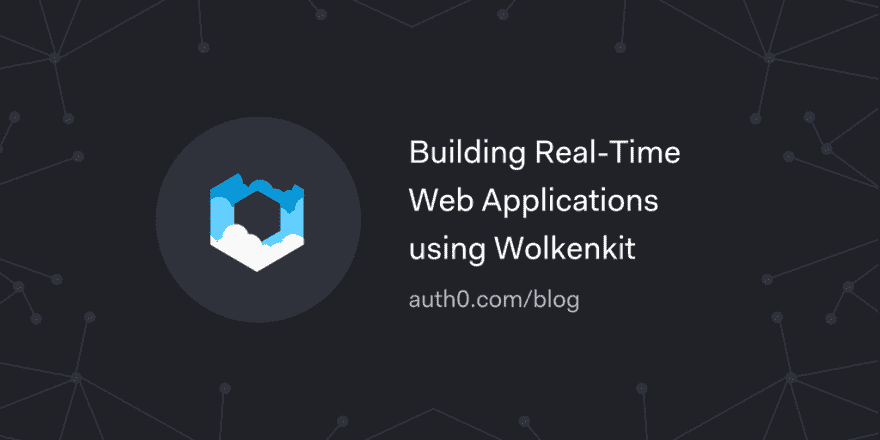

# 使用 wolkenkit 构建实时 Web 应用程序

> 原文：<https://dev.to/auth0/building-real-time-web-applications-using-wolkenkit-1ona>

了解如何使用 Wolkenkit 构建实时 web 应用程序，Wolkenkit 是 JavaScript 和 Node.js 的 CQRS 和事件源框架，与 DDD 完美匹配。

[读下去🎢](https://auth0.com/blog/building-real-time-web-applications-using-wolkenkit/?utm_source=dev&utm_medium=sc&utm_campaign=wolkenkit)

[T2】](https://res.cloudinary.com/practicaldev/image/fetch/s--uupRkRw3--/c_limit%2Cf_auto%2Cfl_progressive%2Cq_auto%2Cw_880/https://thepracticaldev.s3.amazonaws.com/i/701oli7p3h3vf1fpycac.png)