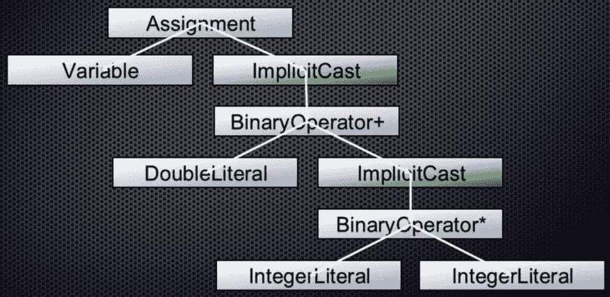

# 编译器 104 - IR 生成

> 原文:[https://dev.to/lefebvre/compilers-104-IR-generation-39e 8](https://dev.to/lefebvre/compilers-104---ir-generation-39e8)

既然语义分析器已经验证了代码实际上是正确的，并且创建了语法树，那么是时候讨论 IR 生成了。

该编译器系列:

*   [编译器 101–概述和词法分析器](https://dev.to/lefebvre/compilers-101---overview-and-lexer-3i0m)
*   [编译器 102–解析器](https://dev.to/lefebvre/compilers-102---parser-2gni)
*   [编译器 103-语义分析器](https://dev.to/lefebvre/compilers-103--semantic-analyzer-540k)

## 什么是 IR？

在语义分析器之后，下一步是将它验证并添加了类型信息的树转换成更接近机器实际将要生成的表示。这种表示称为中间表示(IR)。Xojo 编译器在为 64 位或 ARM 构建时，使用 [LLVM IR](https://llvm.org/docs/LangRef.html) 。

最终的 LLVM IR 描述了程序的实际控制流以及最终程序中的每一个东西。除了执行用户可见的代码和现在在树中的隐式转换，它还需要包含所有隐藏的幕后调用，如引用计数和自省元数据。

LLVM IR 实际上比它最终生成的实际程序集更高级、更抽象。例如，与汇编语言不同，它完全是强类型的，Xojo 编译器必须非常精确地生成内容(这是一件好事！).

# IR 代码生成

首先，这里是语义分析器之前创建的抽象语法树:

[T2】](https://res.cloudinary.com/practicaldev/image/fetch/s--5_SOtdhq--/c_limit%2Cf_auto%2Cfl_progressive%2Cq_auto%2Cw_880/https://blog.xojo.com/wp-content/uploads/2017/05/2017-05-19_09-02-03.png)

为了生成 IR，编译器遍历上面的树， [depth first](https://en.wikipedia.org/wiki/Depth-first_search) ，以到达叶节点。这样做可以让我们在树的右下方找到倍数的 BinaryOperator*。

将这两个值相乘的 LLVM IR([mul](https://llvm.org/docs/LangRef.html#mul-instruction))如下所示:

```
%1 = mul i32 2, 4 
```

<svg width="20px" height="20px" viewBox="0 0 24 24" class="highlight-action crayons-icon highlight-action--fullscreen-on"><title>Enter fullscreen mode</title></svg> <svg width="20px" height="20px" viewBox="0 0 24 24" class="highlight-action crayons-icon highlight-action--fullscreen-off"><title>Exit fullscreen mode</title></svg>

现在它通过树向后工作。因此，下一项是隐式转换，它必须转换在前一个命令中计算的值:

```
%2 = sitofp i32 %1 to double 
```

<svg width="20px" height="20px" viewBox="0 0 24 24" class="highlight-action crayons-icon highlight-action--fullscreen-on"><title>Enter fullscreen mode</title></svg> <svg width="20px" height="20px" viewBox="0 0 24 24" class="highlight-action crayons-icon highlight-action--fullscreen-off"><title>Exit fullscreen mode</title></svg>

[sitofp](https://llvm.org/docs/LangRef.html#sitofp-to-instruction) IR 命令表示“带符号整数到浮点”。

继续沿着树向上，二进制操作符是下一个，所以它现在可以获取左边的值来应用到右边的值。这是要添加值的 IR:

```
%3 = fadd double 3.14, %2 
```

<svg width="20px" height="20px" viewBox="0 0 24 24" class="highlight-action crayons-icon highlight-action--fullscreen-on"><title>Enter fullscreen mode</title></svg> <svg width="20px" height="20px" viewBox="0 0 24 24" class="highlight-action crayons-icon highlight-action--fullscreen-off"><title>Exit fullscreen mode</title></svg>

[fadd](https://llvm.org/docs/LangRef.html#fadd-instruction) IR 命令表示“浮点加法”。

继续沿着树向上，隐式转换是下一步:

```
%4 = fptosi double %3 to i32 
```

<svg width="20px" height="20px" viewBox="0 0 24 24" class="highlight-action crayons-icon highlight-action--fullscreen-on"><title>Enter fullscreen mode</title></svg> <svg width="20px" height="20px" viewBox="0 0 24 24" class="highlight-action crayons-icon highlight-action--fullscreen-off"><title>Exit fullscreen mode</title></svg>

[fptosi](https://llvm.org/docs/LangRef.html#fptosi-to-instruction) IR 命令的意思是“浮点到有符号整数”。

最后，我们用 IR 实现实际的赋值( [store](https://llvm.org/docs/LangRef.html#store-instruction) )，如下所示:

```
store i32 %4, i32* @sum 
```

<svg width="20px" height="20px" viewBox="0 0 24 24" class="highlight-action crayons-icon highlight-action--fullscreen-on"><title>Enter fullscreen mode</title></svg> <svg width="20px" height="20px" viewBox="0 0 24 24" class="highlight-action crayons-icon highlight-action--fullscreen-off"><title>Exit fullscreen mode</title></svg>

下面是生成的完整 IR:

```
%1 = mul i32 2, 4
%2 = sitofp i32 %1 to double
%3 = fadd double 3.14, %2
%4 = fptosi double %3 to i32
store i32 %4, i32* @sum 
```

<svg width="20px" height="20px" viewBox="0 0 24 24" class="highlight-action crayons-icon highlight-action--fullscreen-on"><title>Enter fullscreen mode</title></svg> <svg width="20px" height="20px" viewBox="0 0 24 24" class="highlight-action crayons-icon highlight-action--fullscreen-off"><title>Exit fullscreen mode</title></svg>

读完这篇文章，你现在应该明白为什么没有人愿意手工编写如此低级的代码了。

这是编译器的最后一部分，被认为是前端的一部分。其余的编译器组件属于后端。