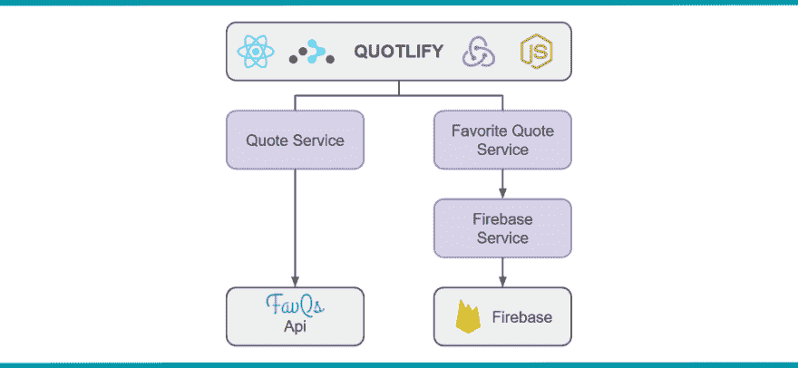
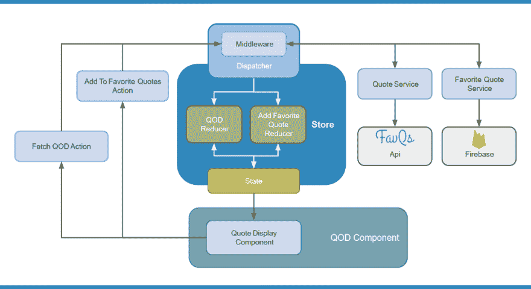
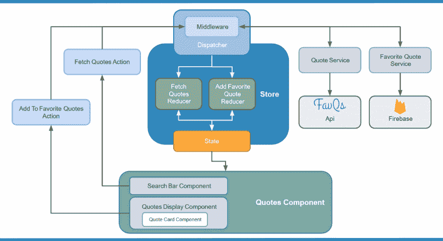
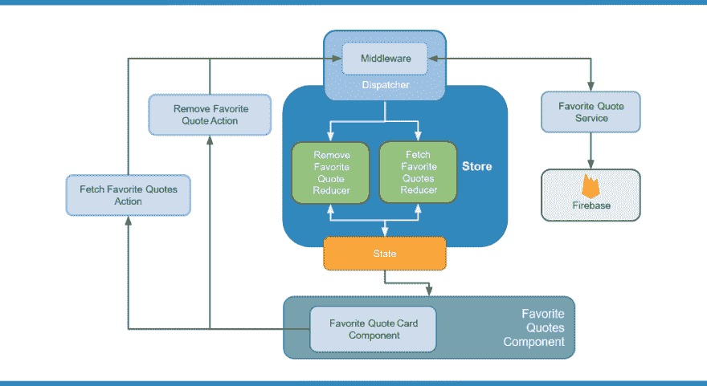
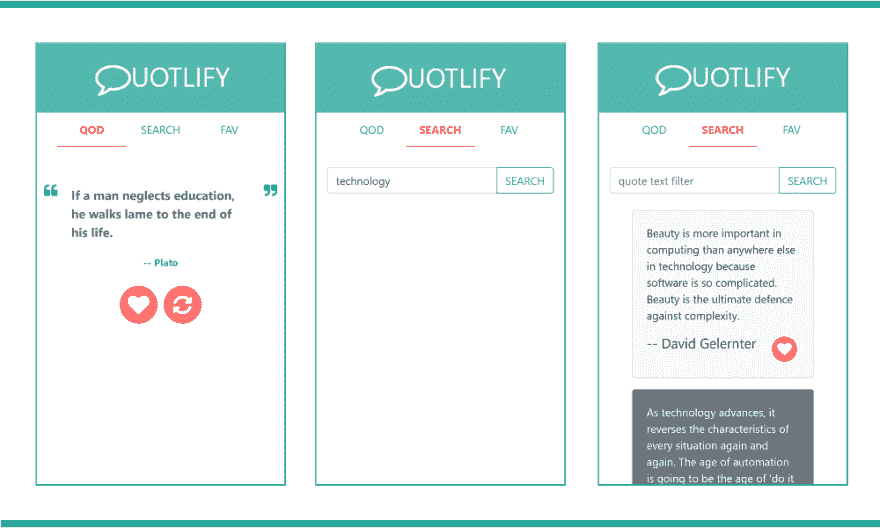
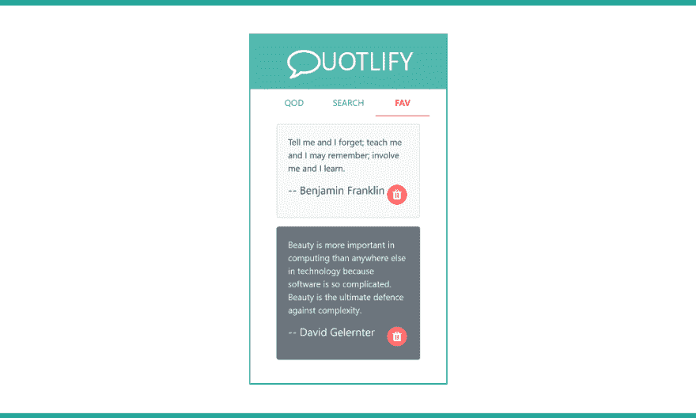

# Quotlify，一个 React/Redux 示例项目

> 原文:[https://dev . to/drminnaar/quotlify-a-react redux-example-project-2n8d](https://dev.to/drminnaar/quotlify-a-reactredux-example-project-2n8d)

## 总结

这是上一篇文章的后续，在那篇文章中，我展示了 11 个 React 项目，以帮助那些 React 编程初学者。在这篇文章中，我将介绍*系列的第 12 个项目*，名为*【报价】*。

Quotlify 是一个报价浏览器和管理器，允许搜索著名的报价，并保存到数据存储。该应用程序是使用 React、Redux(用于应用程序状态)和 React Router(用于页面和导航)以及 Firebase(用于数据存储)构建的。

### 特性

*   显示当日报价(QOD)
*   搜索报价
*   将报价保存为收藏夹
*   删除收藏的引用

### 链接

*   在这里找到现场试玩**T1**

*   在 Github **[这里](https://github.com/drminnaar/react-redux-quotlify)** 找到项目

*   在这里找到上一篇**T1**

### 关键要点

该项目还展示了:

*   典型的 React 项目布局结构
*   巴别塔设置和配置
*   Webpack 安装和配置
    *   包括 dotenv 设置
*   Eslint 设置和配置
*   SCSS 设置和配置
*   配置和使用 Redux 管理应用程序状态
*   配置 React 路由器并设置页面和导航
*   [FavQs](https://favqs.com/api) API 集成
*   [Firebase](https://firebase.google.com/) 集成

* * *

## 项目概述

概括地说，Quotlify 是一个单页面应用程序(SPA ),使用 React、React Router 和 Redux 等著名的库构建。应用程序从第三方 API ( [FavQs](https://favqs.com/api) )获取报价数据。它允许用户在数据库中添加/删除收藏的报价( [Firebase](https://firebase.google.com/) )。所有 API 和数据库交互都是通过域服务来管理的。下图说明了应用程序的一般设计。

**应用程序设计**

[T2】](https://res.cloudinary.com/practicaldev/image/fetch/s--7H5BSniZ--/c_limit%2Cf_auto%2Cfl_progressive%2Cq_auto%2Cw_880/https://user-images.githubusercontent.com/33935506/35609333-8c2348bc-0665-11e8-9eb4-8efc4e9a43dd.png)

## 初级组件

根应用程序组件(App)由 4 个主要组件组成:

*   页眉
    *   显示应用程序标题的标题
*   今日报价(QOD)页面
    *   “登录页面”或应用程序打开的第一个视图。它显示从第三方 API ( [FavQs](https://favqs.com/api) )检索的当天随机报价
*   报价页面
    *   一个搜索页面，用于通过查询 [FavQs](https://favqs.com/api) API 来搜索名人名言
*   收藏夹报价页面
    *   显示通过应用程序添加的所有收藏报价的列表。收藏夹报价数据通过 [Firebase](https://firebase.google.com/) 数据库进行管理

“页面”组件被配置为使用 [React 路由器](https://reacttraining.com/react-router/)进行显示和导航。

**主要部件设计**

[T2】](https://res.cloudinary.com/practicaldev/image/fetch/s--Ex3W0_a_--/c_limit%2Cf_auto%2Cfl_progressive%2Cq_auto%2Cw_880/https://user-images.githubusercontent.com/33935506/35668601-c2d14352-073a-11e8-9588-963b8353ae61.png)

### 当日报价页面

这是加载应用程序时显示的第一个视图。它显示当天的随机报价。有一个按钮来收藏一个报价。还有一个按钮用于刷新和检索当天的新随机报价。

**当日页面设计报价**

[T2】](https://res.cloudinary.com/practicaldev/image/fetch/s--6vobFa5T--/c_limit%2Cf_auto%2Cfl_progressive%2Cq_auto%2Cw_880/https://user-images.githubusercontent.com/33935506/35643325-a1e18150-06ce-11e8-8563-f6b9f81dffb2.png)

### 行情页面

该视图负责提供报价搜索功能。搜索功能是通过 SearchBar 组件提供的。搜索结果显示为包含的卡片列表，每个卡片包含一个报价和一个“收藏”按钮。

**报价设计**

[T2】](https://res.cloudinary.com/practicaldev/image/fetch/s--C-ZGBr_x--/c_limit%2Cf_auto%2Cfl_progressive%2Cq_auto%2Cw_880/https://user-images.githubusercontent.com/33935506/35643481-1a374cb6-06cf-11e8-937e-64db9b813558.png)

### 收藏行情页面

显示收藏的报价列表。每个报价都显示在带有“删除报价”按钮的*卡片*中。

**最喜欢的语录设计**

[T2】](https://res.cloudinary.com/practicaldev/image/fetch/s--ad-Gj1T3--/c_limit%2Cf_auto%2Cfl_progressive%2Cq_auto%2Cw_880/https://user-images.githubusercontent.com/33935506/35643601-80c2dcca-06cf-11e8-8f09-8575f69fa7f8.png)

* * *

## 发达了

*   [Visual Studio Code](https://code.visualstudio.com/)——微软为 Windows、Linux 和 macOS 开发的源代码编辑器。它包括对调试、嵌入式 Git 控件、语法高亮、智能代码完成、代码片段和代码重构的支持
*   [Node.js](https://nodejs.org/en/) - Javascript 运行时
*   一个用于构建用户界面的 javascript 库
*   [React 路由器](https://reacttraining.com/react-router/)-React 的声明式路由
*   Redux 是 JavaScript 应用程序的一个可预测的状态容器。
*   [Redux-Promise-Middleware](https://github.com/pburtchaell/redux-promise-middleware)-Redux 中间件，用于承诺、异步功能和条件乐观更新
*   [Redux-Thunk](https://github.com/gaearon/redux-thunk) -用于 Redux 的 Thunk 中间件
*   Babel -一个 javascript 的翻译器
*   [网络包](https://webpack.js.org/) -一个模块捆绑器
*   css 一种 CSS 元语言
*   Bootstrap 4 - Bootstrap 是一个开源工具包，用于开发 HTML、CSS 和 JS
*   [Axios](https://github.com/axios/axios) -浏览器和 node.js 的基于 Promise 的 HTTP 客户端
*   [FavQs](https://favqs.com/api) Api -提供报价数据
*   [Firebase](https://firebase.google.com/) -提供数据库即服务
*   面向前端开发者的静态 web 发布

需要注意的是，我使用了 [Redux-Promise-Middleware](https://github.com/pburtchaell/redux-promise-middleware) 和 [Redux-Thunk](https://github.com/gaearon/redux-thunk) 库作为中间件来处理异步操作，比如获取和持久化数据。我同时使用这两种方法的原因是因为要执行链式异步操作。如果你不需要链接，那么我推荐你只使用 [Redux-Promise-Middleware](https://github.com/pburtchaell/redux-promise-middleware) 。我已经选择不使用 [Redux Saga](https://github.com/redux-saga/redux-saga) ，因为我认为它是“下一级”。然而，我确实相信，一旦你理解了它，那么它实际上简化了很多事情。这将是一个很好的后续项目。

* * *

## 展柜

*   在这里找到现场试玩**T1**

*   在 Github **[这里](https://github.com/drminnaar/react-redux-quotlify)** 找到项目

### 截图

[T2】](https://res.cloudinary.com/practicaldev/image/fetch/s--Fg9ksZFx--/c_limit%2Cf_auto%2Cfl_progressive%2Cq_auto%2Cw_880/https://user-images.githubusercontent.com/33935506/35666235-e25aa2f8-0731-11e8-9d0c-8184ac9e49d5.png)

* * *

[T2】](https://res.cloudinary.com/practicaldev/image/fetch/s--yyu-E3Rh--/c_limit%2Cf_auto%2Cfl_progressive%2Cq_auto%2Cw_880/https://user-images.githubusercontent.com/33935506/35666236-e520ef2e-0731-11e8-9107-6503274ba2d5.png)

* * *

[T2】](https://res.cloudinary.com/practicaldev/image/fetch/s--8ml1mEdq--/c_limit%2Cf_auto%2Cfl_progressive%2Cq_auto%2Cw_880/https://user-images.githubusercontent.com/33935506/35666239-e7aaead8-0731-11e8-8342-2534ea9a3c60.png)

* * *

## 结论

有几件事，我想改善这个项目，如:

*   引入搜索分页
*   添加更多高级搜索功能
*   引入报价标签，并使用它们来帮助过滤
*   我想改进我为“添加到收藏夹报价”功能所做的异步链接方式
*   添加身份验证和授权，以允许不同的用户登录和管理报价

最后，我想分支这个项目，使用 [Redux-Saga](https://github.com/redux-saga/redux-saga) 作为中间件来管理异步功能