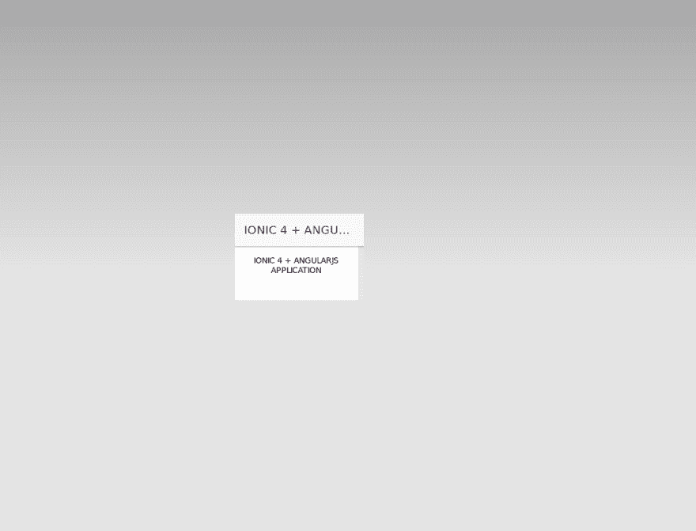
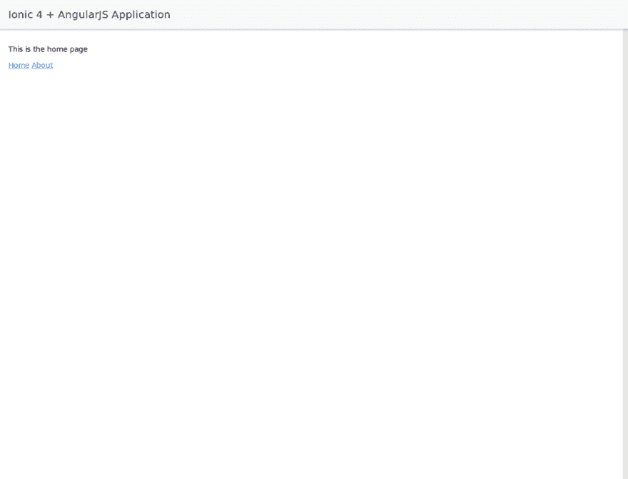

# AngularJS 和 Cordova 的 Ionic 4 教程

> 原文：<https://dev.to/techiediaries/ionic-4-tutorial-with-angularjs-and-cordova-45jn>

你喜欢用 Angular.js 构建 Ionic 1.x 应用吗？但被迫迁移到 TypeScript/Angular 2+以使用不再支持 AngularJS 的最新 Ionic 版本(2+)，还是因为不想使用 TypeScript 而仍然使用 Ionic 1.x 版本？如果是的话，那么幸运的是，你现在可以在 Ionic (4+)的最新和未来版本中使用 JavaScript 和 AngularJS，因为 Ionic 从版本 4 开始就是框架不可知的。

由于 Ionic CLI 还不支持生成框架无关的应用程序，我们将手动执行 Ionic CLI 在幕后为我们做的不同任务(主要是与集成 Cordova 相关的事情)

所以现在你需要生成一个新的 Cordova 项目

## 先决条件

不言而喻，你需要在 Node、NPM 和 Cordova 上安装你需要的目标平台(比如 Android 或 iOS)的 SDK，以及一台用于构建 iOS 应用的 MAC。

## 安装科尔多瓦

如果你没有安装 Cordova，你可以简单地运行下面的命令

```
npm install cordova -g 
```

Enter fullscreen mode Exit fullscreen mode

根据您的 npm 配置，您可能需要添加 *sudo* 来全局安装软件包。

## 生成一个新的科尔多瓦项目

现在让我们通过运行下面的命令来生成一个新的 Cordova 项目:

```
cordova create ionic4-cordova-angularjs 
```

Enter fullscreen mode Exit fullscreen mode

## 安装 AngularJS 和 Ionic 4 核心组件

在您的 Cordova 项目中导航，然后安装来自 npm 的 AngularJS 和 Ionic 4 核心包(包含为 Ionic 4 编译的模板组件/Web 组件)

```
cd ionic4-cordova-angularjs
npm install angular
npm install @ionic/core 
```

Enter fullscreen mode Exit fullscreen mode

你现在可以在你的 Cordova 应用中使用 AngularJS 和 Ionic 4 组件，但是由于它们安装在`node_modules`中，你需要使用钩子脚本或者手动将它们复制到`www`中。为了简单起见，我将手动把它们复制到`www/js`文件夹中。

请注意，您需要整个`@ionic`文件夹才能让 Ionic 正常工作。

然后你可以使用一个`<script>`标签来包含它们，所以打开`www/index.html`然后添加下面的代码:

```
<script src="js/angular.min.js"></script>
<script src='js/@ionic/core/dist/ionic.js'></script> 
```

Enter fullscreen mode Exit fullscreen mode

## 添加浏览器平台

接下来让我们添加[浏览器平台](https://github.com/apache/cordova-browser)，它允许您构建运行在浏览器中的 Cordova 应用程序(以及 PWAs)

所以回到您的终端，确保您的 Cordova 应用程序在里面，然后运行下面的命令:

```
cordova platform add browser 
```

Enter fullscreen mode Exit fullscreen mode

然后，您可以使用
运行您的应用程序

```
cordova run 
```

Enter fullscreen mode Exit fullscreen mode

您的应用将使用您的默认浏览器启动，并从`http://localhost:8000/`开始提供服务。

## 使用 UI 路由器添加路由

在添加任何页面之前，让我们首先使用 [UI-Router](https://ui-router.github.io/ng1/) 在我们的 Cordova 应用程序中设置路由

> UI-Router 是 AngularJS 中路由的事实标准。受核心 angular router $route 和 Ember Router 的影响，UI-Router 已经成为 AngularJS (1.x)中路由非平凡应用的标准选择。

所以回到您的终端，然后运行以下命令从 npm 安装路由器:

```
npm install --save @uirouter/angularjs 
```

Enter fullscreen mode Exit fullscreen mode

再次将`angular-ui-router.js`从`node_modules`文件夹中的`@uirouter`复制到`www/js`文件夹中，然后添加一个`<script>`将其包含在`www/index.html`文件
中

```
<script src="js/angular-ui-router.js"></script> 
```

Enter fullscreen mode Exit fullscreen mode

## 创建 AngularJS 应用并添加状态

接下来你需要创建一个 AngularJS 应用程序，所以在`www`中创建一个`app.js`，然后添加下面的代码:

```
var myApp = angular.module('app', ['ui.router']);
myApp.config(function($stateProvider,$urlRouterProvider) {

  var homeState = {
    name: 'home',
    url: '/home',
    component: 'home'
  }

  var aboutState = {
    name: 'about',
    url: '/about',
    component: 'about'
  }

  $stateProvider.state(homeState)
  $stateProvider.state(aboutState);
  $urlRouterProvider.otherwise('/home');
}); 
```

Enter fullscreen mode Exit fullscreen mode

## 创建你的离子页面

让我们创建我们的第一个离子页面。创建一个名为 pages 的文件夹。在里面创建一个包含文件`home.html`和`home.js`文件
的`home`文件夹

```
mkdir pages
cd pages
mkdir home
touch home.html
touch home.js 
```

Enter fullscreen mode Exit fullscreen mode

打开`home.html`然后添加以下内容

```
<ion-page class="show-page">
    <ion-header>
        <ion-toolbar>
            <ion-title>Ionic 4 + AngularJS Application </ion-title>
        </ion-toolbar>
    </ion-header>
          <ion-content class="content" padding>
                <p>This is the home page</p>
                <a ui-sref="home" ui-sref-active="active">Home</a>
                <a ui-sref="about" ui-sref-active="active">About</a>
          </ion-content>
</ion-page> 
```

Enter fullscreen mode Exit fullscreen mode

接下来打开`home.js`并添加以下代码

```
angular.module('app').component('home', {
    templateUrl: './pages/home/home.html',

    controller: function() {
        console.log("home component");
    }
}) 
```

Enter fullscreen mode Exit fullscreen mode

现在让我们创建关于页面。创建 about 文件夹，然后在里面添加`about.html`和`about.js`

打开`about.html`然后添加以下代码

```
<ion-app>
        <ion-page class="show-page">
          <ion-header>
            <ion-toolbar>
              <ion-title>Ionic 4 + AngularJS Application </ion-title>
            </ion-toolbar>
          </ion-header>
          <ion-content class="content" padding>
                <p>This is the about page</p>
                <a ui-sref="home" ui-sref-active="active">Home</a>
                <a ui-sref="about" ui-sref-active="active">About</a>
          </ion-content>
        </ion-page>
</ion-app> 
```

Enter fullscreen mode Exit fullscreen mode

接下来打开`about.js`并添加以下代码:

```
angular.module('app').component('about', {
    templateUrl: './pages/about/about.html',

    controller: function() {
        console.log("about component");
    }
}) 
```

Enter fullscreen mode Exit fullscreen mode

您需要在`index.html`
中包含这些组件

```
<script src="./app.js"></script>
<script src="./pages/home/home.js"></script>
<script src="./pages/about/about.js"></script> 
```

Enter fullscreen mode Exit fullscreen mode

接下来更改`<body>`以添加这些更改

```
<body ng-app="app">

    <ion-app>      
        <ui-view></ui-view>
    </ion-app>    
        <script type="text/javascript" src="cordova.js"></script>
    </body> 
```

Enter fullscreen mode Exit fullscreen mode

如果您遇到如下屏幕截图所示的缩放问题

[T2】](https://res.cloudinary.com/practicaldev/image/fetch/s--AEKpDIw6--/c_limit%2Cf_auto%2Cfl_progressive%2Cq_auto%2Cw_880/https://screenshotscdn.firefoxusercontent.cimg/f913187a-c11b-4bd2-bafe-e4d2b8738b1c.png)

你只需要在你的`index.html`文件
的`<head>`中添加以下从 Ionic 应用程序复制的标签

```
<meta name="viewport" content="width=device-width,initial-scale=1.0">
<meta http-equiv="Content-Security-Policy" content="default-src 'self' data: gap: https://ssl.gstatic.com 'unsafe-eval'; style-src 'self' 'unsafe-inline'; media-src *; img-src 'self' data: content:;">
<meta name="viewport" content="width=device-width, initial-scale=1.0, minimum-scale=1.0, maximum-scale=1.0, user-scalable=no">
<meta name="format-detection" content="telephone=no">
<meta name="msapplication-tap-highlight" content="no"> 
```

Enter fullscreen mode Exit fullscreen mode

现在，如果您使用`cordova run`运行应用程序，您应该会看到以下页面

[T2】](https://res.cloudinary.com/practicaldev/image/fetch/s--pepWP0VA--/c_limit%2Cf_auto%2Cfl_progressive%2Cq_auto%2Cw_880/https://screenshotscdn.firefoxusercontent.cimg/6b7e739f-e24e-4342-b3bb-bb48430a256d.png)

您可以使用链接在主页和“关于”页面之间导航

## 添加一个目标 Cordova 平台

您可以使用
添加目标平台

```
cd ionic4-cordova-angularjs
cordova platform add ios --save
cordova platform add android --save 
```

Enter fullscreen mode Exit fullscreen mode

这将在 Android 和 iOS 平台投放广告

## 在真实设备中运行您的应用

您也可以使用真实设备运行您的应用程序，首先连接一个设备，然后运行以下命令

```
cordova run android --device 
```

Enter fullscreen mode Exit fullscreen mode

或者对于 iOS

```
cordova run ios --device 
```

Enter fullscreen mode Exit fullscreen mode

## 结论

在本教程中，我们已经看到了如何使用 AngularJS 离子 4 组件。