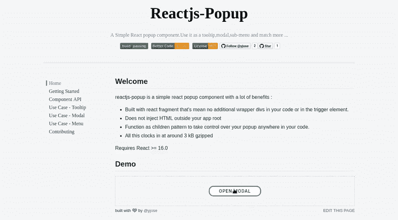
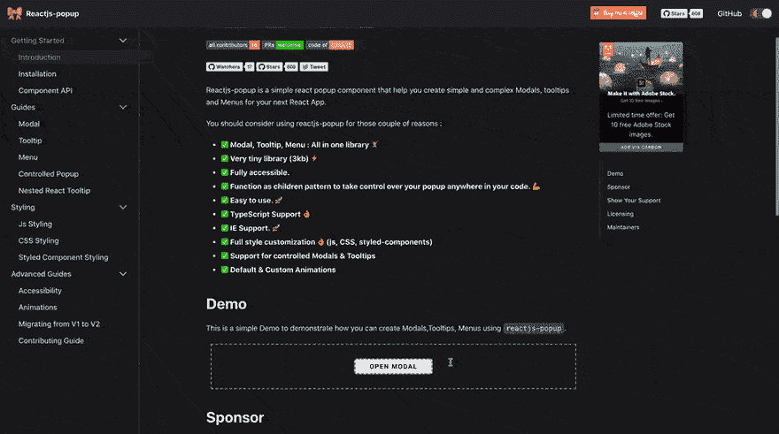

# reactjs-popup 简介🎉—模态、工具提示和菜单—全部在一个中

> 原文：<https://dev.to/elaziziyoussouf/introducing-reactjs-popup--modals-tooltips-and-menus-all-inone-4759>

> 本文将向您简要介绍使用 reactjs-popup 可以做什么，以及如何有效地使用它。

今天，我们很高兴地宣布 reactjs-popup 1.0。

Reactjs-popup 是一个简单且非常小(3 kb)的 react popup 组件，有多个用例。
我们创建了 reactjs-popup 来为我们的项目创建一个颜色选择器 [picsrush](https://picsrush.com/) 一个新的在线图像编辑器。过了一段时间，我们决定让 GitHub 和 npm 库中的每个人都可以使用它。

### 为什么需要选择 reactjs-popup 而不是其他所有实现？

*   使用 react 片段构建，这意味着在您的代码或触发器元素中没有额外的包装 div。😮
*   不要在应用程序根之外注入 HTML。📦
*   函数作为子模式来控制代码中任何地方的弹出窗口。💪
*   模态，工具提示，菜单:都在一个🏋️
*   全风格定制👌
*   好用。🚀
*   所有这些时钟都压缩了大约 3 kB。⚡️

要求反应> = 16.0

### reactjs-popup 如何在你的下一个 react 项目中帮助你？

如果你需要创建一个简单的模态，工具提示或者嵌套菜单，这个组件是你最好的选择。但是首先，让我们从组件开始。

> 全功能演示:模态工具提示和菜单

[T2】](https://res.cloudinary.com/practicaldev/image/fetch/s--_5t9apll--/c_limit%2Cf_auto%2Cfl_progressive%2Cq_66%2Cw_880/https://thepracticaldev.s3.amazonaws.com/i/8jx1f8jev90en8a695tg.gif)

### 入门

此软件包在 npm 存储库中以 reactjs-popup 的形式提供。它可以在所有流行的捆扎机上正常工作。

```
npm install reactjs-popup --save
#using yarn
yarn add reactjs-popup -S 
```

Enter fullscreen mode Exit fullscreen mode

现在您可以导入组件并开始使用它:

```
import React from "react";
import Popup from "reactjs-popup";

export default () => (
  <Popup trigger={<button> Trigger</button>} position="right center">
    <div>Popup content here !!</div>
  </Popup>
); 
```

Enter fullscreen mode Exit fullscreen mode

您也可以将它与 function as children 模式一起使用。

```
import React from "react";
import Popup from "reactjs-popup";

export default () => (
  <Popup trigger={<button>Trigger</button>} position="top left">
    {close => (
      <div>
        Content here
        <a className="close" onClick={close}>
          &times;
        </a>
      </div>
    )}
  </Popup>
); 
```

Enter fullscreen mode Exit fullscreen mode

文档和示例: [Reatjs 弹出主页](https://react-popup.netlify.com)

## 现在轮到你来试试了！！！

感谢阅读！如果你认为其他人应该阅读这篇文章并使用这个组件，发推文并分享这篇文章，然后启动[组件回购](https://github.com/yjose/reactjs-popup)。

## [yjose](https://github.com/yjose)/[reactjs-popup](https://github.com/yjose/reactjs-popup)

### 反应弹出组件-模态，工具提示和菜单-都在一个

<article class="markdown-body entry-content container-lg" itemprop="text">

# Reactjs-popup

[](https://travis-ci.org/yjose/reactjs-popup)[](https://travis-ci.org/yjose/reactjs-popup)[](https://www.npmjs.com/package/reactjs-popup)[T11】](http://www.npmtrends.com/reactjs-popup)

[](https://github.com/yjose/reactjs-popup/blob/master/LICENSE)[](https://raw.githubusercontent.com/yjose/reactjs-popup/master/#contributors)[](http://makeapullrequest.com)[T11】](https://github.com/yjose/reactjs-popup/blob/master/CODE_OF_CONDUCT.md)

[](https://github.com/yjose/reactjs-popup/watchers)[](https://github.com/yjose/reactjs-popup/stargazers)[](https://twitter.com/intent/tweet?text=Check%20out%20reactjs-popup%20by%20%40ElaziziYoussouf%20https%3A%2F%2Fgithub.com%2Fyjose%2Freactjs-popup%20%F0%9F%91%8D)

reactjs-popup 是一个简单的 react popup 组件，帮助你为下一个 React 应用创建简单和复杂的模态、工具提示和菜单。

出于以下几个原因，您应该考虑使用 reactjs-popup:

*   **<g-emoji class="g-emoji" alias="white_check_mark" fallback-src="https://github.githubassets.cimg/icons/emoji/unicode/2705.png">✅</g-emoji> Modal, Tooltip, Menu : All in one library <g-emoji class="g-emoji" alias="weight_lifting" fallback-src="https://github.githubassets.cimg/icons/emoji/unicode/1f3cb.png">🏋️</g-emoji>**
*   **<g-emoji class="g-emoji" alias="white_check_mark" fallback-src="https://github.githubassets.cimg/icons/emoji/unicode/2705.png">【非常整洁的图书馆(3kb)</g-emoji>**
*   **<g-emoji class="g-emoji" alias="white_check_mark" fallback-src="https://github.githubassets.cimg/icons/emoji/unicode/2705.png">✅</g-emoji> 完全可访问**
*   **<g-emoji class="g-emoji" alias="white_check_mark" fallback-src="https://github.githubassets.cimg/icons/emoji/unicode/2705.png">✅作为子模式来控制你代码中任何地方的弹出窗口<g-emoji class="g-emoji" alias="muscle" fallback-src="https://github.githubassets.cimg/icons/emoji/unicode/1f4aa.png">💪</g-emoji></g-emoji>**
*   **<g-emoji class="g-emoji" alias="white_check_mark" fallback-src="https://github.githubassets.cimg/icons/emoji/unicode/2705.png">✅</g-emoji> 好用<g-emoji class="g-emoji" alias="rocket" fallback-src="https://github.githubassets.cimg/icons/emoji/unicode/1f680.png">🚀</g-emoji>**
*   **<g-emoji class="g-emoji" alias="white_check_mark" fallback-src="https://github.githubassets.cimg/icons/emoji/unicode/2705.png">✅</g-emoji> 打字稿支持<g-emoji class="g-emoji" alias="ok_hand" fallback-src="https://github.githubassets.cimg/icons/emoji/unicode/1f44c.png">👌</g-emoji>**
*   **<g-emoji class="g-emoji" alias="white_check_mark" fallback-src="https://github.githubassets.cimg/icons/emoji/unicode/2705.png">ie 支持。<g-emoji class="g-emoji" alias="rocket" fallback-src="https://github.githubassets.cimg/icons/emoji/unicode/1f680.png">🚀</g-emoji></g-emoji>**
*   **<g-emoji class="g-emoji" alias="white_check_mark" fallback-src="https://github.githubassets.cimg/icons/emoji/unicode/2705.png">✅</g-emoji> 全风格定制<g-emoji class="g-emoji" alias="ok_hand" fallback-src="https://github.githubassets.cimg/icons/emoji/unicode/1f44c.png">👌</g-emoji> (js，CSS，styled-components)**
*   **<g-emoji class="g-emoji" alias="white_check_mark" fallback-src="https://github.githubassets.cimg/icons/emoji/unicode/2705.png">对受控模态的支持&工具提示</g-emoji>**
*   **<g-emoji class="g-emoji" alias="white_check_mark" fallback-src="https://github.githubassets.cimg/icons/emoji/unicode/2705.png">默认&自定义动画</g-emoji>**

## 演示

这是一个简单的演示程序，演示了如何使用`reactjs-popup`创建模态、工具提示和菜单。

[**现场试玩**](https://react-popup.elazizi.com)

[T2】](https://user-images.githubusercontent.com/11137944/92184555-74556c00-ee49-11ea-81c5-eb2a0087e93a.gif)

## 安装/入门

该软件包在 NPM 资源库中以 reactjs-popup 的形式提供。它可以在所有流行的捆扎机上正常工作。

```
npm install reactjs-popup --save
```

Enter fullscreen mode Exit fullscreen mode

使用纱线

…Enter fullscreen mode Exit fullscreen mode</article>

[View on GitHub](https://github.com/yjose/reactjs-popup)

你觉得怎么样，有什么想法吗👌？