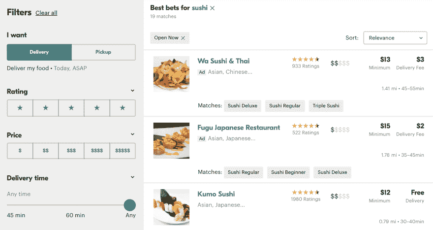

# 为什么 Seamless.com 违反了我的网页浏览期望？

> 原文：<https://dev.to/ben/why-does-seamlesscom-violate-my-web-browsing-expectations-8bk>

抱怨在我和我神奇地把我想要的几乎所有食物送到我家门口的能力之间的微妙互动是非常无聊的。但这就是我现在要做的。这是一个很好的学习机会，批评一个 60 亿美元的食品配送集团的用户体验选择似乎是公平的。

使用[seamless.com](https://seamless.com)的典型流程是登陆主页，根据我的位置搜索我感兴趣的食物类型，选择我的餐馆和点菜，然后结账。

我一路登陆这个页面，搜索结果:

[T2】](https://res.cloudinary.com/practicaldev/image/fetch/s--kge3uigQ--/c_limit%2Cf_auto%2Cfl_progressive%2Cq_auto%2Cw_880/https://thepracticaldev.s3.amazonaws.com/i/24ijvr2wuavxtz0g20qc.png)

到目前为止一切顺利，但这就是问题所在。

我不是每个用户，但我认为我在这种情况下很典型。当我登陆这样一个页面时，我打算`command+click`浏览每一家似乎感兴趣的餐馆，然后在各自的标签页中浏览每一家。这是记录我可能的选择并进行简单比较的好方法。这是我与大多数桌面列表视图交互的方式，浏览餐馆是完全合理的。

但是无缝不希望我这样使用他们的网站。`command+click`行为被覆盖并且没有新的标签被打开。没有一种点击方式能让我像我期望的那样在一个新标签页中打开一个页面。无缝打破了我的浏览体验。

这款应用背后的人可能有很多很好的理由来限制这种行为，但这并没有减少我作为用户/客户的互动挫败感。我很想听听他们的理由。也许原生移动应用程序如此受欢迎，以至于桌面应用程序甚至不值得为他们准备。不管他们的理由是什么，我都不会称我在他们网站上的经历为天衣无缝。

如果你是为浏览器而构建，那就为浏览器而构建。尊重用户的期望。在适当的地方增加行为是很好的，但是要注意用户的期望。

附注:不要碰我的默认滚动行为，但那是以后的事了。

快乐编码✌️