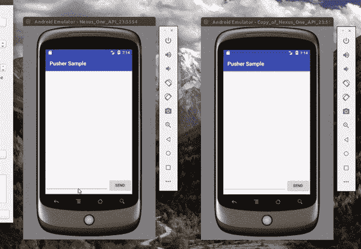
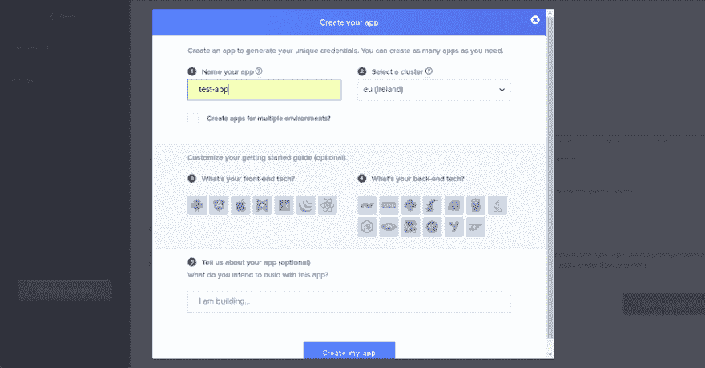
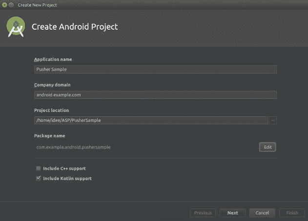
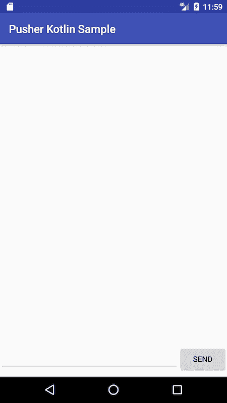
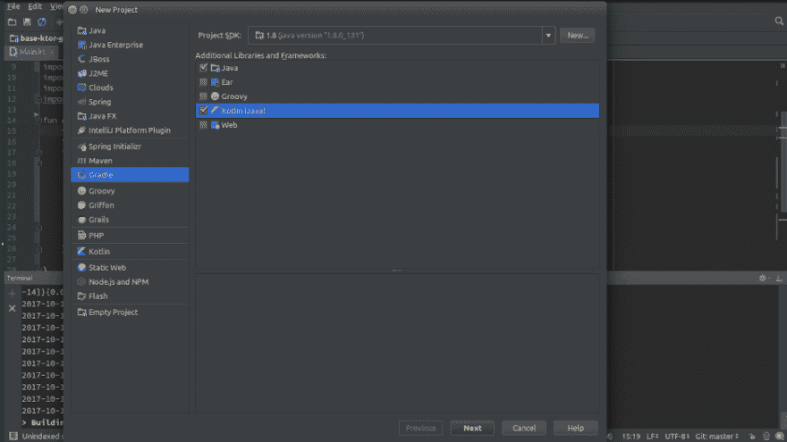
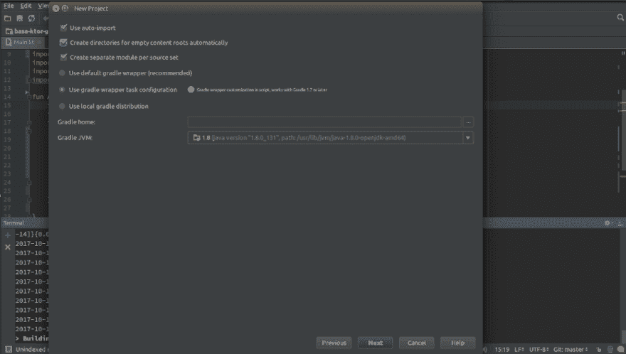

# 如何使用 Kotlin 构建实时评论功能

> 原文:[https://dev . to/neo/how-to-build-a-live-commenting-feature-using-kot Lin-5706](https://dev.to/neo/how-to-build-a-live-commenting-feature-using-kotlin-5706)

在构建应用程序时，拥有评论功能并不少见。使用实时评论，添加的评论将在所有设备上实时更新，无需用户刷新页面。像脸书这样的应用已经有了这个功能。

在这篇文章中，我们将构建一个基本的评论应用程序。我们将假设用户正在对一个虚构的帖子发表评论。这是我们将要构建的内容的屏幕记录:

[T2】](https://res.cloudinary.com/practicaldev/image/fetch/s--UOt4dfiK--/c_limit%2Cf_auto%2Cfl_progressive%2Cq_66%2Cw_880/https://blog.pusher.com/wp-content/uploads/2017/12/How-to-build-live-commenting-in-Kotlin-7.gif)

## 要求

为了跟随本教程，你需要满足以下要求:
–[kot Lin 编程语言的知识](http://kotlinlang.org/docs/tutorials/)。
–安装了 Android Studio 3.0。[在这里下载](https://developer.android.com/studio/archive.html)。
–推杆应用。[在这里创建一个](https://pusher.com)。
–IntelliJ IDEA 已安装。[在这里下载](https://www.jetbrains.com/idea/download/)。

当你有了所有的要求，让我们开始吧。

## 在推动器上创建新的应用程序

登录 Pusher 仪表盘，选择左侧导航栏上的应用程序，并创建一个新应用程序。输入您的应用程序名称(在我的例子中是 test-app)，选择一个集群(在我的例子中是 eu–Ireland)。

[T2】](https://res.cloudinary.com/practicaldev/image/fetch/s--5nDbeGPZ--/c_limit%2Cf_auto%2Cfl_progressive%2Cq_auto%2Cw_880/https://blog.pusher.com/wp-content/uploads/2017/12/How-to-build-live-commenting-in-Kotlin.png)

创建 Pusher 应用程序后，我们将继续创建 Kotlin 应用程序。

## 在 Kotlin 支持下创建我们的 Android 项目

打开 android studio，创建一个新项目。插入您的应用名称和公司域名，然后选择“包括 kotlin 支持”复选框以在项目中启用 Kotlin。

[T2】](https://res.cloudinary.com/practicaldev/image/fetch/s--8GNFO3eN--/c_limit%2Cf_auto%2Cfl_progressive%2Cq_auto%2Cw_880/https://blog.pusher.com/wp-content/uploads/2017/12/How-to-build-live-commenting-in-Kotlin-2.png)

对于本文，我们将把支持的最低 Android 版本设置为 4.03 (API 15)。接下来，选择一个空的活动模板，然后单击 Finish。

[T2】](https://res.cloudinary.com/practicaldev/image/fetch/s--9tuONj6D--/c_limit%2Cf_auto%2Cfl_progressive%2Cq_auto%2Cw_880/https://blog.pusher.com/wp-content/uploads/2017/12/How-to-build-live-commenting-in-Kotlin-3.png)

## 准备好客户端

在您的 app `build.gradle`文件中添加 pusher 依赖:

```
 implementation 'com.pusher:pusher-java-client:1.5.0' 
```

<svg width="20px" height="20px" viewBox="0 0 24 24" class="highlight-action crayons-icon highlight-action--fullscreen-on"><title>Enter fullscreen mode</title></svg> <svg width="20px" height="20px" viewBox="0 0 24 24" class="highlight-action crayons-icon highlight-action--fullscreen-off"><title>Exit fullscreen mode</title></svg>

我们的布局文件将包含:

*   回收器视图(显示注释)。
*   一个编辑文本视图(输入我们的消息)。
*   按钮(触发发送消息的动作)。

一个默认的项目是用回收器视图依赖项创建的，但是，要注意这个依赖项:

```
 implementation 'com.android.support:design:26.1.0' 
```

<svg width="20px" height="20px" viewBox="0 0 24 24" class="highlight-action crayons-icon highlight-action--fullscreen-on"><title>Enter fullscreen mode</title></svg> <svg width="20px" height="20px" viewBox="0 0 24 24" class="highlight-action crayons-icon highlight-action--fullscreen-off"><title>Exit fullscreen mode</title></svg>

如果没有找到，就添加它。

下面是我们的布局片段:

```
 <?xml version="1.0" encoding="utf-8"?>
    <RelativeLayout xmlns:android="http://schemas.android.com/apk/res/android"
        xmlns:tools="http://schemas.android.com/tools"
        android:layout_width="match_parent"
        android:layout_height="match_parent">

        <android.support.v7.widget.RecyclerView
            android:id="@+id/recycler_view"
            android:layout_width="match_parent"
            android:layout_height="match_parent" />
        <FrameLayout
            android:layout_width="match_parent"
            android:layout_height="?attr/actionBarSize"
            android:layout_alignParentBottom="true">
            <LinearLayout
                android:layout_width="match_parent"
                android:layout_height="wrap_content"
                android:orientation="horizontal">
                <EditText
                    android:layout_width="match_parent"
                    android:layout_height="wrap_content"
                    android:layout_weight="1" />
                <Button
                    android:id="@+id/button_send"
                    android:layout_width="wrap_content"
                    android:layout_height="wrap_content"
                        android:text="Send" />
            </LinearLayout>
        </FrameLayout>
    </RelativeLayout> 
```

<svg width="20px" height="20px" viewBox="0 0 24 24" class="highlight-action crayons-icon highlight-action--fullscreen-on"><title>Enter fullscreen mode</title></svg> <svg width="20px" height="20px" viewBox="0 0 24 24" class="highlight-action crayons-icon highlight-action--fullscreen-off"><title>Exit fullscreen mode</title></svg>

这是我们的应用程序目前的样子。它非常光秃秃，还没有评论:

[T2】](https://res.cloudinary.com/practicaldev/image/fetch/s--TKwzGik4--/c_limit%2Cf_auto%2Cfl_progressive%2Cq_auto%2Cw_880/https://blog.pusher.com/wp-content/uploads/2017/12/How-to-build-live-commenting-in-Kotlin-4.png)

然后我们创建一个名为`RecyclerViewAdapter.kt`的回收器视图适配器类。这个适配器是一个处理列表中项目显示的类。

将下面的代码粘贴到我们的新类中:

```
 class RecyclerViewAdapter (private val mContext: Context) 
      :RecyclerView.Adapter<RecyclerViewAdapter.MyViewHolder>() {        

        // The initial empty list used by the adapter
        private var arrayList: ArrayList<String> = ArrayList()

        // This updates the adapter list with list from MainActivity.kt which contains the messages. 
        fun setList(arrayList: ArrayList<String>) {
            this.arrayList = arrayList
            notifyDataSetChanged()
        }

        // The layout design used for each list item
        override fun onCreateViewHolder(parent: ViewGroup, viewType: Int): MyViewHolder {
            val view = LayoutInflater.from(mContext).inflate(android.R.layout.simple_list_item_1, parent, false)
            return MyViewHolder(view)
        }

        // This displays the text for each list item
        override fun onBindViewHolder(holder: RecyclerViewAdapter.MyViewHolder, position: Int) { 
            holder.text.setText(arrayList.get(position))
        }

        // This returns the size of the list.
        override fun getItemCount(): Int {
            return arrayList.size
        }

        inner class MyViewHolder(itemView: View) : RecyclerView.ViewHolder(itemView), 

        View.OnClickListener {
            var text: TextView = itemView.findViewById<View>(android.R.id.text1) as 
            TextView
            init {
                itemView.setOnClickListener(this)
            }

            override fun onClick(view: View) {

            }
        }
    } 
```

<svg width="20px" height="20px" viewBox="0 0 24 24" class="highlight-action crayons-icon highlight-action--fullscreen-on"><title>Enter fullscreen mode</title></svg> <svg width="20px" height="20px" viewBox="0 0 24 24" class="highlight-action crayons-icon highlight-action--fullscreen-off"><title>Exit fullscreen mode</title></svg>

我们将需要[改进的](https://github.com/square/retrofit)库(一个“类型安全的 HTTP 客户端”)来使我们能够将消息发送到我们稍后将构建的远程服务器。

添加改造依赖项后，您的应用程序`build.gradle`文件应该看起来像这样:

```
 apply plugin: 'com.android.application'
    apply plugin: 'kotlin-android'
    apply plugin: 'kotlin-android-extensions'

    android {
        compileSdkVersion 26
        defaultConfig {
            applicationId "com.example.android.pushersample"
            minSdkVersion 15
            targetSdkVersion 26
            versionCode 1
            versionName "1.0"
            testInstrumentationRunner "android.support.test.runner.AndroidJUnitRunner"
        }
        buildTypes {
            release {
                minifyEnabled false
                proguardFiles getDefaultProguardFile('proguard-android.txt'), 'proguard-rules.pro'
            }
        }
    }

    dependencies {
        implementation fileTree(dir: 'libs', include: ['*.jar'])
        implementation "org.jetbrains.kotlin:kotlin-stdlib-jre7:$kotlin_version"
        implementation 'com.android.support:appcompat-v7:26.1.0'
        implementation 'com.android.support:design:26.1.0'

        // pusher depencency
        implementation 'com.pusher:pusher-java-client:1.5.0'

        // retrofit dependencies
        implementation 'com.squareup.retrofit2:retrofit:2.3.0'
        implementation 'com.squareup.retrofit2:converter-scalars:2.3.0'
        implementation 'com.squareup.retrofit2:converter-gson:2.3.0'

        // testing dependencies
        testImplementation 'junit:junit:4.12'
        androidTestImplementation 'com.android.support.test:runner:1.0.1'
        androidTestImplementation 'com.android.support.test.espresso:espresso-core:3.0.1'
    } 
```

<svg width="20px" height="20px" viewBox="0 0 24 24" class="highlight-action crayons-icon highlight-action--fullscreen-on"><title>Enter fullscreen mode</title></svg> <svg width="20px" height="20px" viewBox="0 0 24 24" class="highlight-action crayons-icon highlight-action--fullscreen-off"><title>Exit fullscreen mode</title></svg>

接下来，在`src/main/kotlin`文件夹中创建名为`ApiService.kt`的 API 接口文件。此接口用于定义网络呼叫期间使用的端点。对于这个应用程序，我们将只创建一个端点:

```
 interface ApiService {
        @GET("/{message}")
        fun sendMessage(@Path("message") title: String):Call<String>
    } 
```

<svg width="20px" height="20px" viewBox="0 0 24 24" class="highlight-action crayons-icon highlight-action--fullscreen-on"><title>Enter fullscreen mode</title></svg> <svg width="20px" height="20px" viewBox="0 0 24 24" class="highlight-action crayons-icon highlight-action--fullscreen-off"><title>Exit fullscreen mode</title></svg>

在名为`RetrofitClient.kt`的`src/main/kotlin`文件夹中创建一个改进的客户端类。这个类为我们的网络调用提供了一个改进的实例:

```
 class RetrofitClient {
        fun getClient(): ApiService {
            val httpClient = OkHttpClient.Builder()

            val builder = Retrofit.Builder()
                    .baseUrl("http://10.0.2.2:5000/")
                    .addConverterFactory(ScalarsConverterFactory.create())
                    .addConverterFactory(GsonConverterFactory.create())

            val retrofit = builder
                    .client(httpClient.build())
                    .build()

            return retrofit.create(ApiService::class.java)
        }
    } 
```

<svg width="20px" height="20px" viewBox="0 0 24 24" class="highlight-action crayons-icon highlight-action--fullscreen-on"><title>Enter fullscreen mode</title></svg> <svg width="20px" height="20px" viewBox="0 0 24 24" class="highlight-action crayons-icon highlight-action--fullscreen-off"><title>Exit fullscreen mode</title></svg>

> 💡**我们使用地址** `**10.0.2.2**` **，因为这是 Android 默认模拟器识别本地主机的方式。所以 IP 地址指的是运行在您机器上的本地服务器。**

我们现在移动到我们的`MainActivity.kt`文件，并用下面的方法更新它:

```
 override fun onCreate(savedInstanceState: Bundle?) {
        super.onCreate(savedInstanceState)

        setContentView(R.layout.activity_main)

        // list to hold our messages
        var arrayList: ArrayList<String> = ArrayList()

        // Initialize our adapter
        val adapter = RecyclerViewAdapter(this)

        // assign a layout manager to the recycler view
        recycler_view.layoutManager = LinearLayoutManager(this)

        // assign adapter to the recycler view
        recycler_view.adapter = adapter

        // Initialize Pusher
        val options = PusherOptions()
        options.setCluster("PUSHER_APP_CLUSTER")
        val pusher = Pusher("PUSHER_APP_KEY", options)

        // Subscribe to a Pusher channel
        val channel = pusher.subscribe("my-channel")

        // this listener recieves any new message from the server
        channel.bind("my-event") { channelName, eventName, data ->
            val jsonObject = JSONObject(data)
            arrayList.add(jsonObject.getString("message"))
            runOnUiThread { adapter.setList(arrayList) }
        }
        pusher.connect()

        // We check for button clicks and if any text was inputed, we send the message
        button_send.setOnClickListener(View.OnClickListener {
            if (edit_text.text.length>0) {
                sendMessage(edit_text.text.toString())
            }
        })

    } // end of onCreate method

    fun sendMessage(message:String) {
        val call = RetrofitClient().getClient().sendMessage(message)

        call.enqueue(object : Callback<String> {
            override fun onResponse(call: Call<String>, response: Response<String>) {
                edit_text.setText("")
                hideKeyboard(this@MainActivity)
            }
            override fun onFailure(call: Call<String>, t: Throwable) {

            }
        })
    } // end of sendMessage method

    fun hideKeyboard(activity: Activity) {
        val imm = activity.getSystemService(Activity.INPUT_METHOD_SERVICE) as InputMethodManager

        // Find the currently focused view, so we can grab the correct window token from it.
        var view = activity.currentFocus

        // If no view currently has focus, create a new one, just so we can grab a window token from it
        if (view == null) {
            view = View(activity)
        }

        imm.hideSoftInputFromWindow(view.windowToken, 0)
    } // end of hideKeybnoard method 
```

<svg width="20px" height="20px" viewBox="0 0 24 24" class="highlight-action crayons-icon highlight-action--fullscreen-on"><title>Enter fullscreen mode</title></svg> <svg width="20px" height="20px" viewBox="0 0 24 24" class="highlight-action crayons-icon highlight-action--fullscreen-off"><title>Exit fullscreen mode</title></svg>

> ⚠️ **您需要将** `**PUSHER_APP_***` **键替换为您的 Pusher 应用仪表板中的凭证。**

在`onCreate`方法中，我们初始化了保存消息的列表，处理列表上项目显示的回收器视图适配器，并相应地分配了回收器视图。

然后我们用必要的参数初始化`PusherOptions`和`Pusher`对象。记得用您自己的 app 键设置推动器对象优先参数。您可以在您创建的应用程序的应用程序密钥选项卡上找到您的应用程序密钥。如果您忘记了创建应用程序时选择的集群，您也可以在那里找到它。

接下来，我们为该通道上的事件创建一个侦听器。当收到新消息时，它将被添加到我们的列表中，更新后的列表将被分配给我们的适配器，以便它可以立即显示。

最后，我们向布局中的按钮添加了一个侦听器，使我们能够发送消息。消息成功发送后，我们清除文本并隐藏键盘。

下一步是在您的`AndroidManifest.xml`文件中添加互联网权限。用下面的代码片段更新文件:

```
 <uses-permission android:name="android.permission.INTERNET"/> 
```

<svg width="20px" height="20px" viewBox="0 0 24 24" class="highlight-action crayons-icon highlight-action--fullscreen-on"><title>Enter fullscreen mode</title></svg> <svg width="20px" height="20px" viewBox="0 0 24 24" class="highlight-action crayons-icon highlight-action--fullscreen-off"><title>Exit fullscreen mode</title></svg>

有了这个改变，我们就完成了客户端应用程序的构建。

## 构建我们的 Kotlin 后端服务器

我们的服务器将由 Kotlin 构建，并在本地托管。您可以按照下面的步骤快速运行您的服务器。

在 IntelliJ IDEA 中创建一个新的基于 Gradle 的 Kotlin 项目。

[T2】](https://res.cloudinary.com/practicaldev/image/fetch/s--25vrNrKm--/c_limit%2Cf_auto%2Cfl_progressive%2Cq_auto%2Cw_880/https://blog.pusher.com/wp-content/uploads/2017/12/How-to-build-live-commenting-in-Kotlin-5.png)

为你的应用程序输入“groupId”。groupId 可以是一个包名，通常类似于“com.example”。

接下来，输入一个“artifactId”，它通常类似于“推送服务器”

[T2】](https://res.cloudinary.com/practicaldev/image/fetch/s--YskGosQy--/c_limit%2Cf_auto%2Cfl_progressive%2Cq_auto%2Cw_880/https://blog.pusher.com/wp-content/uploads/2017/12/How-to-build-live-commenting-in-Kotlin-6.png)

在我们的项目`build.gradle`文件中，我们将添加 Ktor 和 pusher 服务器依赖项。Ktor 是一个使用 Kotlin 编程语言在连接系统中构建服务器和客户机的框架。

这是我们完整的`build.gradle`文件，它包含了我们需要的所有依赖项:

```
 group 'com.example'
    version '1.0-SNAPSHOT'

    buildscript {
        // dependency version variables
        ext.kotlin_version = '1.1.4-3'
        ext.ktor_version = '0.2.4'
        repositories {
            mavenCentral()
        }
        dependencies {
            classpath "org.jetbrains.kotlin:kotlin-gradle-plugin:$kotlin_version"
        }
    }

    apply plugin: 'application'
    apply plugin: 'kotlin'

    sourceCompatibility = 1.8

    repositories {
        mavenCentral()
        maven {
            url 'http://dl.bintray.com/kotlin/kotlinx.support'
        }
        maven {
            url 'http://dl.bintray.com/kotlin/ktor'
        }
    }

    mainClassName = 'org.jetbrains.ktor.jetty.DevelopmentHost'

    dependencies {
        compile "org.jetbrains.kotlin:kotlin-stdlib-jre8:$kotlin_version"
        // ktor dependencies
        compile "org.jetbrains.ktor:ktor-core:$ktor_version"
        compile "org.jetbrains.ktor:ktor-locations:$ktor_version"
        runtime "org.jetbrains.ktor:ktor-jetty:$ktor_version"
        // pusher server dependency
        compile "com.pusher:pusher-http-java:1.0.0"
        testCompile group: 'junit', name: 'junit', version: '4.12'
    }

    compileKotlin {
        kotlinOptions.jvmTarget = "1.8"
    }

    compileTestKotlin {
        kotlinOptions.jvmTarget = "1.8"
    } 
```

<svg width="20px" height="20px" viewBox="0 0 24 24" class="highlight-action crayons-icon highlight-action--fullscreen-on"><title>Enter fullscreen mode</title></svg> <svg width="20px" height="20px" viewBox="0 0 24 24" class="highlight-action crayons-icon highlight-action--fullscreen-off"><title>Exit fullscreen mode</title></svg>

在您的`src/main/kotlin`文件夹中，创建一个`Main.kt`文件并插入以下代码片段:

```
 fun Application.main() {

        val pusher = Pusher("PUSHER_APP_ID", "PUSHER_APP_KEY", "PUSHER_APP_SECRET")
        pusher.setCluster("PUSHER_APP_CLUSTER")

        install(DefaultHeaders)
        install(CallLogging)
        install(Routing) {
            get("/{message}") {
                val i = call.parameters["message"]!!
                pusher.trigger("my-channel", "my-event", Collections.singletonMap("message", i))
                call.respond("response sent")
            }

        }
    } 
```

<svg width="20px" height="20px" viewBox="0 0 24 24" class="highlight-action crayons-icon highlight-action--fullscreen-on"><title>Enter fullscreen mode</title></svg> <svg width="20px" height="20px" viewBox="0 0 24 24" class="highlight-action crayons-icon highlight-action--fullscreen-off"><title>Exit fullscreen mode</title></svg>

> ⚠️:你需要将`**PUSHER_APP_***`键替换为在你的 Pusher 应用仪表板中找到的凭证。

在上面的代码片段中，我们定义了一个处理新消息的路由。当收到消息时，它会将消息发送到推送通道，以便同一通道上的任何事件侦听器都可以获取该消息。

接下来，打开`src/main/resources/application.conf`文件，将端口设置为`5000`。如果文件不存在，创建它并插入下面的代码片段:

```
 ktor {
        deployment {
            environment = development
            port = 5000
        }

        application {
            modules = [com.example.MainKt.main]
        }
    } 
```

<svg width="20px" height="20px" viewBox="0 0 24 24" class="highlight-action crayons-icon highlight-action--fullscreen-on"><title>Enter fullscreen mode</title></svg> <svg width="20px" height="20px" viewBox="0 0 24 24" class="highlight-action crayons-icon highlight-action--fullscreen-off"><title>Exit fullscreen mode</title></svg>

该文件允许您配置服务器参数。

之后，在 IDE 上打开终端，输入`./gradlew run`运行服务器。为了测试你的服务器，打开`http://localhost:5000/message`，你应该会看到一个显示“响应已发送”。

现在一切都结束了。多亏了 Pusher，我们可以毫无压力地发表评论和接收更新。

[T2】](https://res.cloudinary.com/practicaldev/image/fetch/s--UOt4dfiK--/c_limit%2Cf_auto%2Cfl_progressive%2Cq_66%2Cw_880/https://blog.pusher.com/wp-content/uploads/2017/12/How-to-build-live-commenting-in-Kotlin-7.gif)

## 结论

在本文中，我们展示了在创建评论系统时如何使用 Pusher 和 Kotlin。这是一个非常简单的实现，当然，您还可以做得更多。我很好奇你会想出什么。

如果你有问题或反馈，请在下面的评论区留下。该应用的源代码可在 [GitHub](https://github.com/neoighodaro/kotlin-pusher-live-commenting-sample) 上获得。

这篇文章最初出现在 [Pusher 博客](https://blog.pusher.com/build-live-commenting-feature-kotlin/)上。