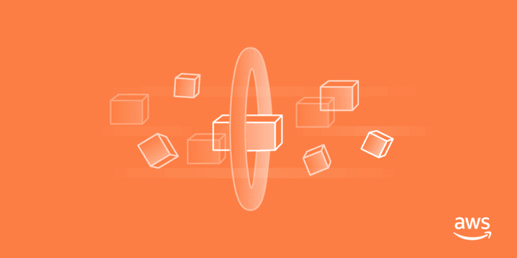
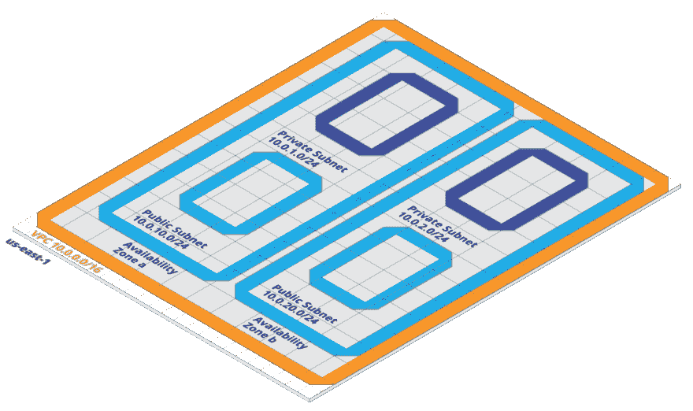
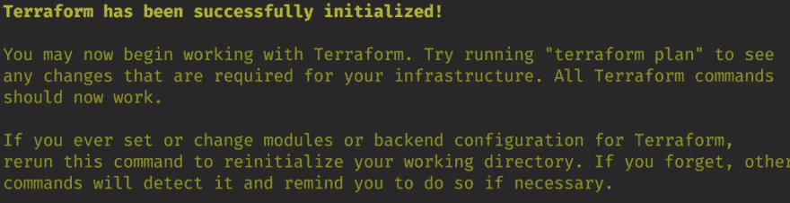
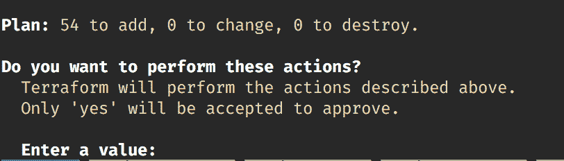
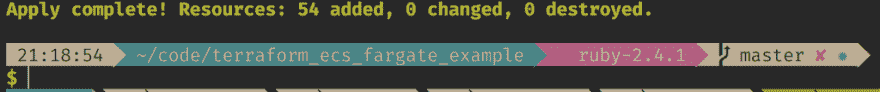
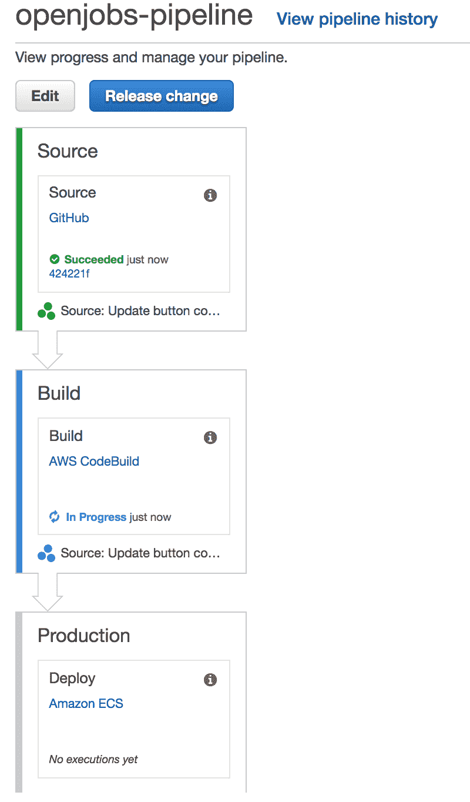
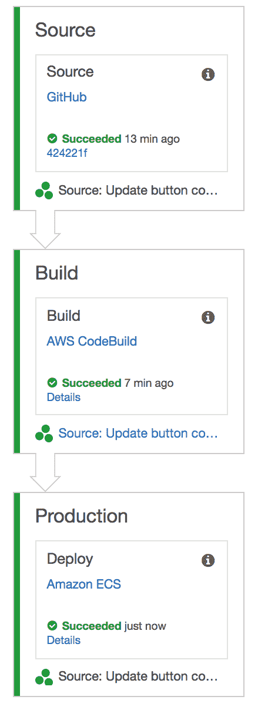
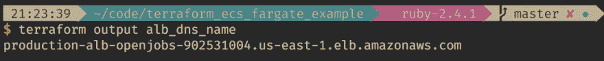
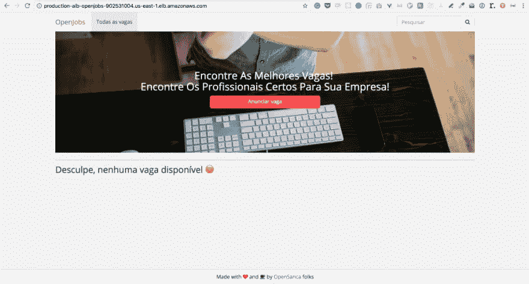

# 使用 ECS 和 Fargate 轻松将 Docker 应用程序部署到 AWS

> 原文:[https://dev . to/caduribeiro/easy-deploy-your-docker-applications-to-AWS-using-ECS-and-fargate-2 ain](https://dev.to/caduribeiro/easy-deploy-your-docker-applications-to-aws-using-ecs-and-fargate-2ain)

[T2】](https://res.cloudinary.com/practicaldev/image/fetch/s--TAXkNoTp--/c_limit%2Cf_auto%2Cfl_progressive%2Cq_auto%2Cw_880/https://cdn-images-1.medium.com/max/1024/1%2AL_1-B_5m036MTLsyQ135cw.png)

在本文中，我将尝试演示如何使用 ECS 和 Fargate 将 Docker 应用程序部署到 AWS 中。

例如，我将把这个应用程序部署到 ECS。来源可以在[这里](https://github.com/opensanca/opensanca_jobs/)找到。

我将使用 [Terraform](https://www.terraform.io/) 来旋转基础设施，这样我就可以轻松地跟踪我作为代码创建的所有东西。如果你想学习地形的基础知识，请阅读我的[帖子](https://dev.to/duduribeiro/creating-your-cloud-servers-with-terraform-2lpd)。

### ECS

什么是 ECS？

弹性容器服务(ECS)是一个 AWS 服务，它处理 EC2 集群中的 Docker 容器编排。它是 Kubernetes、Docker Swarm 和其他网站的替代产品。

#### ECS 术语

为了开始理解什么是 ECS，我们需要理解它不同于 Docker 世界的术语和定义。

*   **集群:**它是一组托管容器的 EC2 实例。
*   **任务定义:**是 ECS 应该如何运行你的 app 的规范。您可以在这里定义要使用的映像、端口映射、内存、环境变量等。
*   **服务:**服务启动并维护集群内部运行的任务。服务将自动恢复任何停止的任务，并按照您指定的数量保持运行。

### Fargate

Fargate 是一种允许在 ECS 中运行容器的技术，不需要管理集群的 EC2 服务器。您只需部署 Docker 应用程序并为其设置缩放规则。Fargate 是 ECS 的一个执行方法。

***出示代码***

完整的例子在 [Github](https://github.com/duduribeiro/terraform_ecs_fargate_example) 上。

### 项目结构

我们的 Terraform 项目由以下结构组成:

∞模块

【code _ pipeline】

【ECS】

【联网】

【rds】

*   模块是我们存储处理一组资源创建的代码的地方。它可以被所有环境(生产、试运行、QA 等)重用。)而不需要复制大量代码。
*   **production.tf** 是定义环境本身的文件。它调用传递变量给它的模块。
*   **pipeline.tf** 因为管道可以是全局资源，而不需要按照环境进行隔离。该文件将使用`code_pipeline`模块处理该管道的创建。

### 第一部分，联网

有这部分的分支可以在这里找到[。](https://github.com/duduribeiro/terraform_ecs_fargate_example/tree/01_networking)

我们需要创建的第一件事是在每个可用性分区中包含 2 个子网(1 个公共子网和 1 个专用子网)的 VPC。每个可用性区域都是地理上隔离的区域。将我们的资源保存在多个区域是实现高可用性的首要任务。如果一个物理区域由于某种原因出现故障，您的应用程序可以从其他区域进行响应。

<figure>[](https://res.cloudinary.com/practicaldev/image/fetch/s--QCnWKNuW--/c_limit%2Cf_auto%2Cfl_progressive%2Cq_auto%2Cw_880/https://cdn-images-1.medium.com/max/1024/1%2ACvu1YNJdfezuVfU8kAPgNA.png) 

<figcaption>我们的网络</figcaption>

</figure>

将群集保留在专用子网上可以保护您的基础架构免受外部访问。私有子网只允许从公共网络内部的资源访问(在我们的例子中，它只是负载平衡器)。

这是创建这个结构的代码(实际上与我在 Terraform 上的介绍相同):

[https://medium.com/media/3000fa3a6cfa0ccdb9678d3e4660424d/href](https://medium.com/media/3000fa3a6cfa0ccdb9678d3e4660424d/href)

上述代码在每个可用性分区中创建了 VPC、4 个子网(2 个公共子网和 2 个私有子网)。它还创建一个 NAT 来允许专用网络访问互联网。

**数据库**

有这部分的分支可以在这里找到[。](https://github.com/duduribeiro/terraform_ecs_fargate_example/tree/02_database)

我们将创建一个 RDS 数据库。它将位于专用子网上。只允许公共子网访问它。

[https://medium.com/media/59d7deafef35b800131d6d8061ad1e82/href](https://medium.com/media/59d7deafef35b800131d6d8061ad1e82/href)

使用这段代码，我们用从变量接收的值创建 RDS 资源。我们还创建了希望连接到数据库的资源(在我们的例子中，是 ECS 集群)应该使用的安全组。

好的。现在我们有了数据库。最后，让我们创建 ECS 来部署我们的应用程序。

### 取三:ECS

有这部分的分支可以在这里找到[。](https://github.com/duduribeiro/terraform_ecs_fargate_example/tree/03_ecs)

我们正在接近最后的步骤。现在，这是我们定义应用程序所需的 ECS 资源的部分。

#### 集控室知识库

第一件事是创建存储库来存储我们构建的图像。

[https://medium.com/media/356acc348a4487a6434c6e60919f7c62/href](https://medium.com/media/356acc348a4487a6434c6e60919f7c62/href)

#### ECS 集群

接下来，我们需要 ECS 群集。即使使用 Fargate(不需要任何 EC2)，我们也需要为应用程序定义一个集群。

[https://medium.com/media/007965a6291dc6a49086c14471cdd92f/href](https://medium.com/media/007965a6291dc6a49086c14471cdd92f/href)

#### 任务定义

现在，我们将定义 2 个任务定义。

*   Web:包含 web 应用程序本身的定义。
*   Db Migrate:该任务将只运行命令来迁移我们的数据库，并将终止。因为这是一个单次运行的任务，所以我们不需要为它提供服务。[https://medium . com/media/cbba 359 b 380 BAF 0de 6398 ebbb 29d 66 c 0/href](https://medium.com/media/cbba359b380baf0de6398ebbf29d66c0/href)

任务定义在 JSON 文件中配置，并在 Terraform 中呈现为模板。

这是 web app 的任务定义:

[https://medium.com/media/cd914e0e8af12d8d338da2acd81e85d2/href](https://medium.com/media/cd914e0e8af12d8d338da2acd81e85d2/href)

在上面的文件中，我们将任务定义给 ECS。我们将创建的 ECR 图像存储库作为变量传递给它。我们还配置了其他变量，以便 ECS 可以启动我们的 Rails 应用程序。

DB 迁移任务的定义几乎相同。我们只改变将要执行的命令。

#### 负载平衡器

在创建服务之前，我们需要创建负载平衡器。它们将位于公共子网上，并将请求转发给 ECS 服务。

[https://medium.com/media/3033baa23cf2903207443201d7762619/href](https://medium.com/media/3033baa23cf2903207443201d7762619/href)

在上面的文件中，我们定义我们的目标组将在端口 80 上使用 HTTP。我们还创建了一个安全组，允许从互联网访问端口 80。之后，我们创建应用程序负载平衡器和监听器。要使用 Fargate，您应该使用应用程序负载平衡器，而不是弹性负载平衡器。

#### 最后，ECS 服务

现在我们将创建服务。要使用 Fargate，我们需要将 lauch_type 指定为 Fargate。

[https://medium.com/media/9a7598bcb9d94c58ca13ca1be88a7d69/href](https://medium.com/media/9a7598bcb9d94c58ca13ca1be88a7d69/href)

#### 自动缩放

Fargate 允许我们轻松地自动扩展我们的应用程序。我们只需要在 CloudWatch 中创建指标，并触发对其进行放大或缩小。

[https://medium.com/media/0163c1beacb8ade34e9f09209dd80916/href](https://medium.com/media/0163c1beacb8ade34e9f09209dd80916/href)

我们创建了两个自动扩展策略。一个是向上扩展，另一个是向下扩展我们的 ECS 服务中正在运行的任务的期望数量。

之后，我们创建一个基于 CPU 的 CloudWatch 指标。如果 CPU 使用率在两个周期内都大于 85%，我们将触发 alarm_action 来调用扩展策略。如果它返回到 Ok 状态，将触发缩减策略。

### 部署我们应用的管道

我们运行 Docker 应用程序的基础设施已经准备就绪。但是部署到 ECS 上还是没意思。我们需要手动将我们的映像推送到存储库，用新的映像更新任务定义，并更新新的任务定义。我们可以通过 Terraform 运行它，但如果我们有办法将代码推送到主分支中的 Github，它会自动为我们部署，那会更好。

*进入，* [*代码管道*](https://aws.amazon.com/codepipeline) *和* [*代码构建*](https://aws.amazon.com/codebuild/) *。*

CodePipeline 是 AWS 托管的持续集成和持续交付服务。

CodeBuild 是一个托管的构建服务，它可以执行测试并为我们生成包(在我们的例子中，是一个 Docker 映像)。

有了它，我们可以创建将代码交付给 ECS 的管道。流程将是:

*   你把代码推到主人的分支
*   CodePipeline 获取源阶段的代码，调用构建阶段(CodeBuild)。
*   构建阶段处理我们的 docker 文件构建并将映像推送到 ECR 并触发部署阶段
*   部署阶段使用新映像更新我们的 ECS

让我们用 Terraform 来定义我们的管道:

[https://medium.com/media/68275343cb24ec50baf32ce6cc1002e3/href](https://medium.com/media/68275343cb24ec50baf32ce6cc1002e3/href)

在上面的代码中，我们使用以下 buildspec(构建规范文件)创建了一个 CodeBuild 项目:

[https://medium.com/media/40583c74d4308338360de35bb99a1921/href](https://medium.com/media/40583c74d4308338360de35bb99a1921/href)

我们在上面的文件中定义了一些阶段。

*   pre_build:升级 aws-cli，设置一些环境变量:带有 ECR 存储库的 REPOSITORY_URL 和带有 CodeBuild 源代码版本的 IMAGE_TAG。Terraform 将 ECR 存储库作为变量传递。
*   构建:从存储库中构建 Dockerfile 文件，在存储库 URL 中将它标记为最新的。
*   post_build:将映像推送到存储库。创建一个名为 imagedefinitions.json 的文件，其内容如下:“[{"name":"web "，" imageUri":REPOSITORY_URL"}]”此文件由 CodePipeline 用来在部署阶段升级 ECS 群集。
*   工件:获取在最后阶段创建的文件，并将其用作工件。

之后，我们创建一个包含 3 个阶段的代码管道资源:

*   Source:从 Github 获取存储库(用你的存储库信息修改它)并传递到下一阶段。
*   Build:调用我们在上一步中创建的 CodeBuild 项目。
*   生产:从构建阶段获取工件(imagedefinitions.json)并部署到 ECS。

让我们看看他们一起工作？

### 一起奔跑

完整例子的代码是[这里是](https://github.com/duduribeiro/terraform_ecs_fargate_example)。

克隆它。此外，因为我们使用 Github 作为代码管道源代码提供者，所以您需要生成一个令牌来访问存储库。[阅读此处](%5Bhttps://help.github.com/articles/creating-a-personal-access-token-for-the-command-line/%5D(https://help.github.com/articles/creating-a-personal-access-token-for-the-command-line/))生成你的。

生成令牌后，将其作为环境变量导出。

```
$ export GITHUB\_TOKEN=YOUR\_TOKEN 
```

现在，我们需要导入模块和提供者库。

```
$ terraform init 
```

[T2】](https://res.cloudinary.com/practicaldev/image/fetch/s--6Xz9VD8D--/c_limit%2Cf_auto%2Cfl_progressive%2Cq_auto%2Cw_880/https://cdn-images-1.medium.com/max/1024/1%2A6HQQkkurojqHSIw3ywQTSw.png)

现在，让魔法开始吧！

```
$ terraform apply 
```

它将显示 Terraform 将创建一些资源，如果您想继续

[T2】](https://res.cloudinary.com/practicaldev/image/fetch/s--MeC8uQs6--/c_limit%2Cf_auto%2Cfl_progressive%2Cq_auto%2Cw_880/https://cdn-images-1.medium.com/max/812/1%2AN_Ce_3nRV-hk4QFgd-J3sw.png)

键入 yes。

Terraform 将开始建造我们的基础设施。

[T2】](https://res.cloudinary.com/practicaldev/image/fetch/s--gXtXEC0---/c_limit%2Cf_auto%2Cfl_progressive%2Cq_66%2Cw_880/https://cdn-images-1.medium.com/max/260/1%2AlZ7NXzq0NMQmObgMoyoJIg.gif)

说真的，喝一杯咖啡直到它结束。

[T2】](https://res.cloudinary.com/practicaldev/image/fetch/s--8I3qfWZF--/c_limit%2Cf_auto%2Cfl_progressive%2Cq_auto%2Cw_880/https://cdn-images-1.medium.com/max/1024/1%2Ahl4G1GBfzMSBuBJ2axn0LQ.png)

[T2】](https://res.cloudinary.com/practicaldev/image/fetch/s--q4jLuu7E--/c_limit%2Cf_auto%2Cfl_progressive%2Cq_auto%2Cw_880/https://cdn-images-1.medium.com/max/1024/1%2A-w-oLVLxuyebsaUStamQHg.png)

厉害！。我们的基础设施已经准备就绪！！。如果您在 AWS Dashboard 的代码管道中输入，您可以看到它也触发了第一次构建:

[T2】](https://res.cloudinary.com/practicaldev/image/fetch/s--Pth2IE-U--/c_limit%2Cf_auto%2Cfl_progressive%2Cq_auto%2Cw_880/https://cdn-images-1.medium.com/max/800/1%2AXfmkQU8ae8v9Pbp6iaJQIA.png)

等到所有阶段都是绿色。

[T2】](https://res.cloudinary.com/practicaldev/image/fetch/s--yYE4-Raj--/c_limit%2Cf_auto%2Cfl_progressive%2Cq_auto%2Cw_880/https://cdn-images-1.medium.com/max/456/1%2AZdNh3pr5qIdU-vMwlQfi4Q.png)

获取您的负载平衡器 DNS 并检查部署的应用程序:

```
$ terraform output alb\_dns\_name 
```

[T2】](https://res.cloudinary.com/practicaldev/image/fetch/s--fiCg5bOj--/c_limit%2Cf_auto%2Cfl_progressive%2Cq_auto%2Cw_880/https://cdn-images-1.medium.com/max/1024/1%2AWW07XGYH37It1xq5tUnGrQ.png)

<figure>[](https://res.cloudinary.com/practicaldev/image/fetch/s---h4Cu3sQ--/c_limit%2Cf_auto%2Cfl_progressive%2Cq_auto%2Cw_880/https://cdn-images-1.medium.com/max/1024/1%2AwJmKvO2Pd36jtJMZePd-3Q.png) 

<figcaption>这是工作\o/</figcaption>

</figure>

终于，app 运行了。近乎神奇！

[T2】](https://res.cloudinary.com/practicaldev/image/fetch/s--w6s7t-H2--/c_limit%2Cf_auto%2Cfl_progressive%2Cq_66%2Cw_880/https://cdn-images-1.medium.com/max/275/1%2AmPUc2fU1VPbW6gjbw1DjeQ.gif)

如果你有任何问题，请联系我。这只是一篇关于使用 Terraform 的 Fargate 的介绍文章。

[T2】](https://res.cloudinary.com/practicaldev/image/fetch/s--l6hqfwDL--/c_limit%2Cf_auto%2Cfl_progressive%2Cq_auto%2Cw_880/https://cdn-images-1.medium.com/max/1024/1%2AdsHpznpcd482MHT1fvyc3Q.png)

干杯🍻

* * *