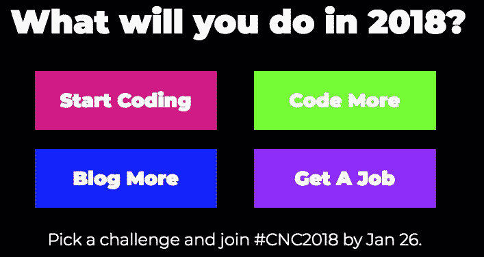
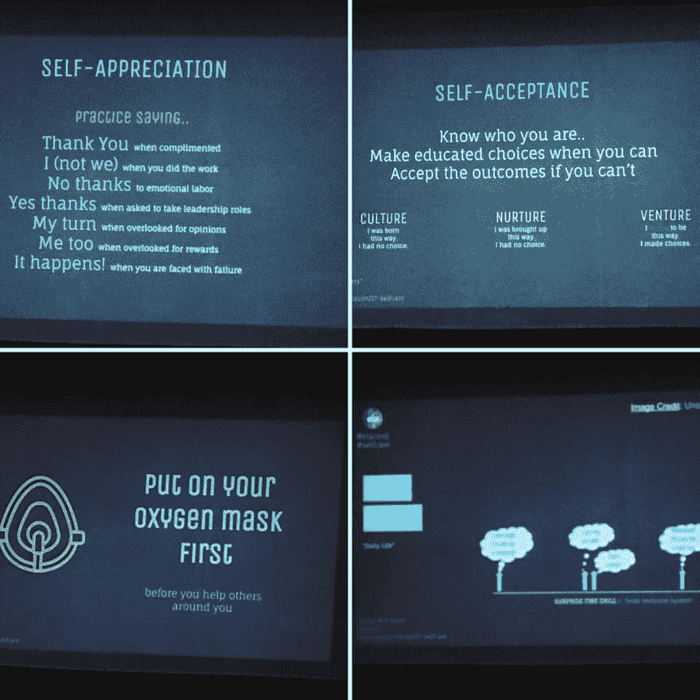
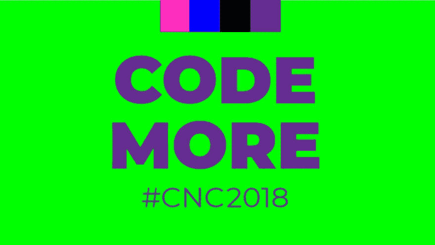
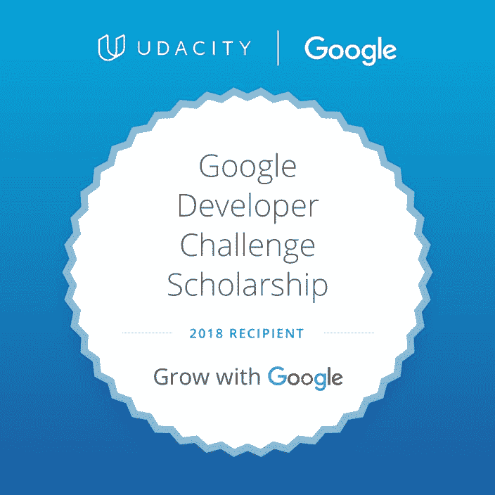

# 2018 年编码更多:#CNC2018 挑战

> 原文：<https://dev.to/nitya/code-more-in-2018-the-cnc2018-challenge-1epd>

## 关于#CNC2018

到现在为止，你可能已经听说过[Code Newbies 2018 Challenge](https://2018.codenewbie.org/)——你们中的许多人可能已经注册了这四个目标中的一个:*开始编写代码*，*编写更多代码*，*博客更多*，*找份工作*。

这个想法是让你选择一个目标，然后完成一些任务(每周一个，持续 n 周——n 取决于你的目标)来完成这个挑战。目前的队伍已经开始了他们的任务，但是你仍然可以报名参加第二轮。

> 萨拉梅[@萨拉梅](https://dev.to/sarahmei)@ codenewbies 的了不起的伙计们正在进行一场免费的新年挑战&今天是报名的最后一天。开始编码，多编码，多写博客，或者找份工作！所有的挑战看起来都经过深思熟虑。[2018.codenewbie.org](https://t.co/c9oP5kHZ4z)[# CNC 2018](https://twitter.com/hashtag/CNC2018)2018 年 1 月 26 日 21 点 29 分2939

## 我的动力:自理&个人成长

我从事软件开发和研究已经 20 多年了，但是和其他人一样，我总是发现自己面临两个主要挑战:

*   *冒名顶替综合症*。作为一个母亲，我向儿子宣扬自信。我告诉他，他应该只根据自己前一天的进步来判断自己，而不是和别人比较。但是作为一名技术人员，我总是发现自己看着我尊敬/钦佩的人，问自己“我真的足够好去做他们做的事情吗？”。这可能会让人变得虚弱，尤其是当你后来意识到你“顺从”(因为自我怀疑)的那个人实际上知道的比你少得多，而只是把自己放在那里更多的时候。

*   *时间管理*。技术是惊人的，但我们目前的工作时间表可能会令人筋疲力尽，有时还会适得其反。我们是一个工作狂和永远在线交流上瘾者的国家。越来越多的人认为*的可见性*比*的技能*更重要，那些经常发言/写博客/分享的人往往比那些也花时间但只是没被“看见”的人更有优势。但是，被人看见会对语境转换(代码-推特-闲言碎语)和注意力中断(提醒、电子邮件、短信)的数量造成影响..)你处理。突然间，“时间”成了稀有商品。

这两种情况的结果都是你会筋疲力尽。

我去年就是这么做的。我花了几个月才把自己挖出来。我谈到了我在 ElaConf 的自我保健之旅，并惊讶地发现有如此多的人参与了这个问题和过程。

> 杰西卡·萨利纳斯@ phobiageek诸如此类的妙招更多[#自我保健](https://twitter.com/hashtag/selfcare)by[@ nitya](https://twitter.com/nitya)at[@ elaconf](https://twitter.com/elaconf)谢谢分享！[# ElaConf](https://twitter.com/hashtag/ElaConf)[# Diversity](https://twitter.com/hashtag/Diversity)[# Diversity intech](https://twitter.com/hashtag/diversityintech)2017 年 10 月 28 日下午 14:4702

我的深刻见解是，职业挑战(如上所述)会降低你的自尊，从而影响你的心理健康。

冒名顶替综合症之所以会这样，是因为你在没有现实背景的情况下质疑自己的自我价值。时间管理间接做到了这一点，因为你现在设定了无法实现的最后期限，无法满足它们或做得令人满意，道歉，然后责怪自己。

随着自尊的下降，压力水平上升，导致糟糕的决策，导致更多的自尊损失。一个恶性循环产生了，加速了倦怠。我意识到有效解决这个问题的唯一方法就是积极主动的控制和应对策略。

一个关键策略是创建反映健康行为的*惯例*。

当你有规律地做某事时，你会建立“肌肉记忆”,这会增加你对任务的信心，但也会消除与时间管理相关的压力。你不仅会有成就感，而且你也开始更好地调整任务的复杂性/时间安排，以更好地利用你的时间和专业知识。

在过去，我已经采用了[# 30 天](https://www.ted.com/talks/matt_cutts_try_something_new_for_30_days)作为一种创建和设定常规的方法。我看#CNC2018 也差不多。

## 我的目标:多码

我实际上是从选择“博客更多”开始的，因为我 2018 年的愿望之一是分享更多关于我正在做的许多事情，这些事情我以前没有时间去做。但我改变了主意，转而选择了“多编码”。

> code newbies@ code newbies你一直在说你会编写更多的代码，但是你太忙了，你会分心，生活总是这样。让我们找到一个适合你的时间表。
> 
> 加入 [#CNC2018](https://twitter.com/hashtag/CNC2018) 。注册今晚截止。[bit.ly/2FYJuud](https://t.co/mtSUkhcest)2018 年 1 月 26 日下午 23:01119

这是为什么呢？

我已经开始定期编写代码，主要是为我从事的咨询和顾问项目。但是我也做了很多公开演讲和培训，而且我真的很有兴趣从事开发者权益方面的职业。我也有很多技术和语言想采用，想学习，想探索。但我似乎从来没有时间。

然后我意识到，如果我把写博客作为应对编码挑战的一种责任措施，那么“写更多代码”实际上可以帮助我实现“写更多博客”的目标。

#CNC2018 挑战赛实际上要求人们到脸书发帖，但我拒绝去那里(因为很多原因)。但是这些天我真的很喜欢 dev.to，想在这里贡献更多的内容。因此，我在 dev.to 上发帖，对我的代码保持负责，更多的目标:-)

## 移动网络专家和# GrowWithGoogle

顺便说一句，大约在这个挑战开始的同时，我发现我被 Udacity 主办的# GrowWithGoogle“移动网络专家”奖学金项目录取了。

> Nitya Narasimhan[@ Nitya](https://dev.to/nitya)Woot！！这是一个良好开端的 2018 年决议。
> 
> 很高兴成为[# Google uda city scholars](https://twitter.com/hashtag/GoogleUdacityScholars)[# grow with Google](https://twitter.com/hashtag/GrowWithGoogle)[# mobile web specialist](https://twitter.com/hashtag/MobileWebSpecialist)赛道的奖学金获得者之一。我们以 [#OfflineFirst](https://twitter.com/hashtag/OfflineFirst) 深潜开始，所以我很兴奋！
> [# pwa camp](https://twitter.com/hashtag/PWACamp)[# goals](https://twitter.com/hashtag/goals)23:28PM-2018 年 1 月 10 日012

虽然我从事全栈开发已经有几年了，但我一直想获得现代 web 最佳实践的严格概述(特别关注渐进式 web 应用程序和离线优先思想)，而这门课程非常完美！不仅有结构化的内容，还有编码项目。

而且，我的另一个雄心是更好地使用 [Glitch](https://glitch.com/) 来建立&共享一些概念的快速想法或原型。

因此，在接下来的几周里，期待看到一些带有这种标签组合的帖子(# cnc2018 # growwithgoogle)，这些帖子将专注于分享课程的见解，同时也让我对自己的“编写更多代码”目标负责。

*PS。如果你在做#CNC2018 代码更多挑战，打个招呼！我想保持联系，做一些合作拉拉队，并就进展交换意见*