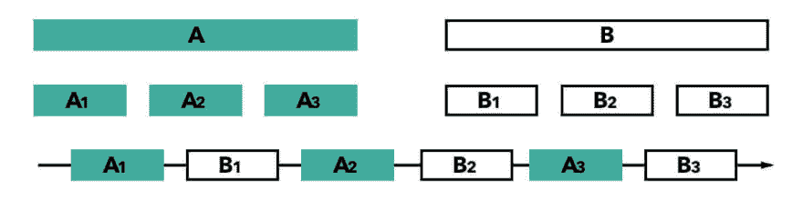
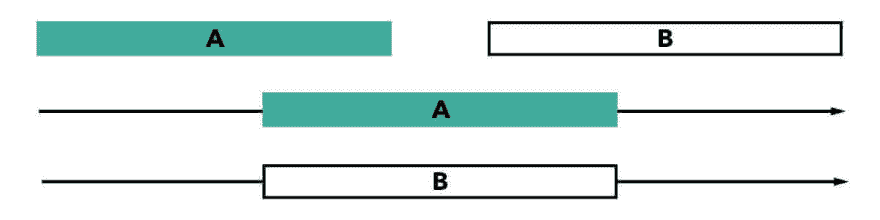

# 并发！=并行度

> 原文：<https://dev.to/roperzh/concurrency--parallelism-55h5>

*本帖最初发表于[monades.roperzh.com](https://monades.roperzh.com/concurrency-is-different-than-parallelism/?cm=devto)T3】*

我真的很喜欢听卡尔·休伊特谈论计算机，他经常重复的一句话是“并发不是并行”。对我来说，没有真正的区别，老实说，我从来没有费心去挖掘它。

上周，我偶然发现了 Rob Pike 关于这个主题的演讲，这让我最终对这个问题做了一些研究。这是我的发现。

当心:就像生活中的大多数事情一样，许多人认为这两者之间没有真正的区别。

## 并发

并发就是在相同的时间间隔内完成任务。这里重要的细节是，任务不一定同时执行*，但是它们可以被分成可以交错的更小的任务。*

 *[T2】](https://res.cloudinary.com/practicaldev/image/fetch/s--5jo_D9Hp--/c_limit%2Cf_auto%2Cfl_progressive%2Cq_auto%2Cw_880/https://user-images.githubusercontent.com/4419992/35572695-ee6275c8-05b3-11e8-8460-2c1ac7081574.jpg)

发生并发的一个好地方是厨房，想象一下一个厨师一边切生菜，一边不时检查烤箱里的东西。他必须停止切割，检查烤箱，停止检查烤箱，然后再次开始切割，并重复该过程，直到完成。

如您所见，并发性主要与*物流*有关，没有并发性，厨师将不得不等到烤箱中的肉准备好才能切生菜。

## 排比

另一方面，并行性是指在同一时间执行任务*，顾名思义，它们是并行执行的。*

[T2】](https://res.cloudinary.com/practicaldev/image/fetch/s--7LZI52RC--/c_limit%2Cf_auto%2Cfl_progressive%2Cq_auto%2Cw_880/https://user-images.githubusercontent.com/4419992/35572701-f14520f6-05b3-11e8-9989-f4dcc7fc987e.jpg)

回到厨房，现在我们有两个厨师，一个可以负责烤箱，而水獭可以切生菜，我们分担工作，代价是多了一个厨师。

并行性是并发性的一个子类:在您同时执行多个任务之前，您首先必须管理多个任务。

## 来源

*   勇敢的 Clojure:并发和并行编程的神圣艺术
*   [哈斯克尔维基](https://wiki.haskell.org/Parallelism_vs._Concurrency)
*   [罗布·派克的演讲](https://blog.golang.org/concurrency-is-not-parallelism)

**奖金**

如果你有时间，可以看看 Carl Hewitt 和维基百科版主之间关于并发性和并行性的幽默交流。*