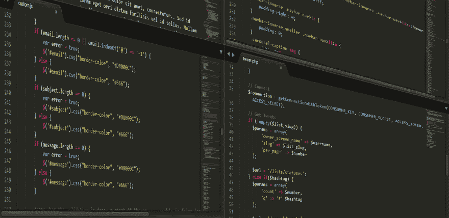
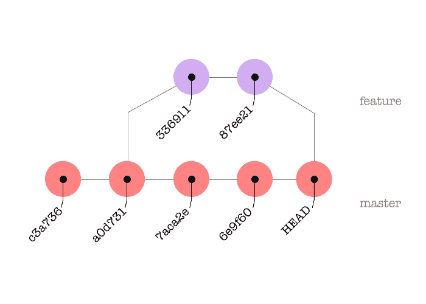
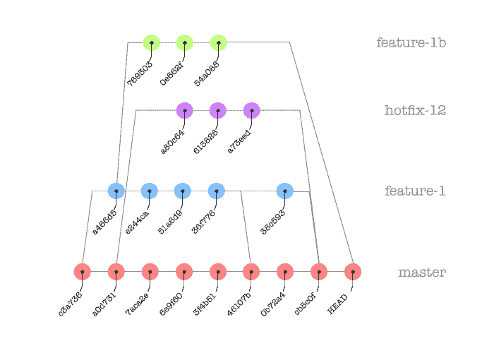
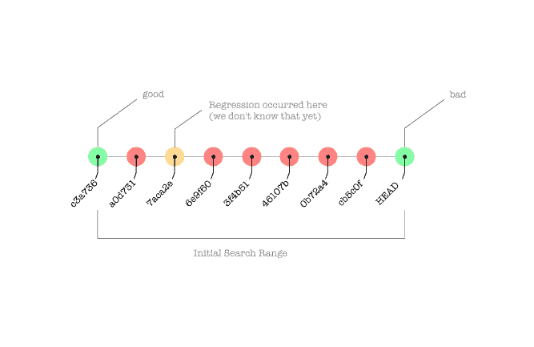
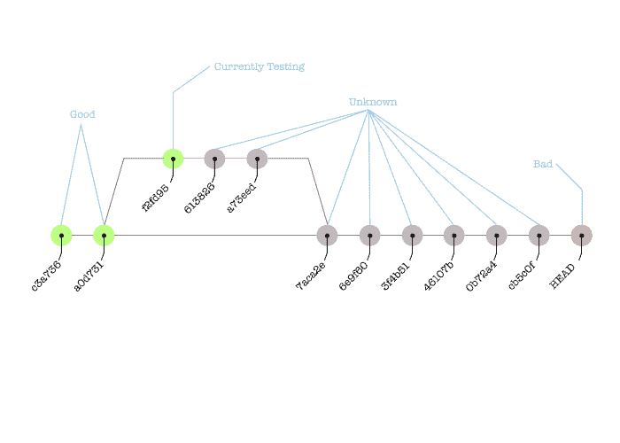
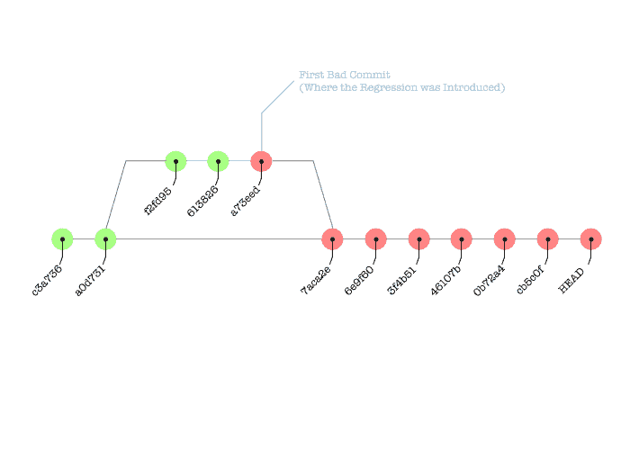

# git 二等分:一个温和的介绍

> 原文：<https://dev.to/jwir3/git-bisect-a-gentle-introduction-1bn1>

# 动机

[T2】](https://res.cloudinary.com/practicaldev/image/fetch/s--mSRKD0dt--/c_limit%2Cf_auto%2Cfl_progressive%2Cq_auto%2Cw_880/http://www.jwir3.com/conteimg/2018/01/computer-1833058_1920.png)

想象一下这种情况:你是一名软件开发人员，刚刚被分配了一张罚单。这是一个错误，问题的症状是你的应用程序在应该渲染四边形的地方渲染三角形。

看起来很简单，对吧？但是等等——你实际上得到了更多的信息。这是一个*回归*，这意味着该应用程序以前可以正确地渲染四边形，现在它将它们渲染为三角形。每当软件工程师看到回归，第一个想法应该是“这个错误第一次出现是什么时候？”如果你问提出这个错误的人，你可能会得到这样的回答:

[T2】](https://res.cloudinary.com/practicaldev/image/fetch/s--6LT_te12--/c_limit%2Cf_auto%2Cfl_progressive%2Cq_66%2Cw_880/http://www.jwir3.com/conteimg/2018/01/giphy.gif)

这个问题到底为什么重要？好吧，如果我们可以隔离回归第一次出现的变更，我们就知道错误在应用变更时添加或删除的代码中。

# git bisect

`git bisect`是一个工具，您可以使用它对一组提交运行二分搜索法<sup>[【1】](#fn1)</sup>，以(有希望地)确定哪一个首先出现了问题。这是一个强大的工具，但是有一个陷阱:你必须有一个*独立构建*、*小*、*工作*变化的*线性*历史，以便它以可能的最好方式工作。

## 先决条件

`git`(你可能已经知道了，否则你不会读这篇文章)是一个控制文件修改的工具。您编辑文件，然后在验证您的更改后，*将它们提交给存储库。`git`跟踪这些*提交*对象的*历史*，有效地构建一个图。*

在理想情况下，您的提交历史如下所示:

[T2】](https://res.cloudinary.com/practicaldev/image/fetch/s--Bwzum3Uj--/c_limit%2Cf_auto%2Cfl_progressive%2Cq_auto%2Cw_880/http://www.jwir3.com/conteimg/2018/01/Linear-Commit-History-1.png)

不幸的是，通过糟糕的提交/合并实践，您有时会陷入这种历史是*非线性*的情况:

[T2】](https://res.cloudinary.com/practicaldev/image/fetch/s--hTRHsqJ9--/c_limit%2Cf_auto%2Cfl_progressive%2Cq_auto%2Cw_880/http://www.jwir3.com/conteimg/2018/01/Crazy-Commit-History.png)

修复一段非线性的历史超出了这篇博文的范围，但是如果你遇到了这种情况，你可能想要查看一下<sup>[【3】](#fn3)</sup>来获得一些指导。<sup></sup>

另一个重要的先决条件是回归是*可重复的*。如果你没有一个可持续重现的回归，你就不能在每个阶段测试它。依赖于回归可以在过程的每一步进行测试的事实。

# 二等分过程

## 基础知识

`git bisect`工作原理是这样的:给定一个提交的输入范围，它使用范围中心附近的提交将发生回归的范围分成两个部分。它检查这个*透视*修订，并根据您的输入，确定下一步应该检查透视两边的哪一个范围。

[T2】](https://res.cloudinary.com/practicaldev/image/fetch/s--f1Q4l66S--/c_limit%2Cf_auto%2Cfl_progressive%2Cq_auto%2Cw_880/http://www.jwir3.com/conteimg/2018/01/BIsect-Process.png)

在上图中，您可以看到我们有一个已知的“好的”提交，一个已知的“坏的”提交(通常这是`HEAD`，因为回归可能存在于`master`分支的当前头，否则您可能不需要修复它<sup>[【5】](#fn5)</sup>)，以及一些引入回归的未知点。

使用`git bisect` :
实际上只需要知道四个命令

```
git bisect good
git bisect bad
git bisect skip
git bisect reset 
```

## 开始一个等分线

可以用`git bisect start`<sup>[【6】](#fn6)</sup>:
开始一个对分会话

```
scottj|jwir3/master:~/Source/SinkingMoon/website$ git bisect start
scottj|jwir3/master|BISECTING:~/Source/SinkingMoon/website$ 
```

但是，等等...不在我说过你需要知道的命令列表中。这是因为如果你运行其他命令中的一个，`git`将为你提供启动进程:

```
scottj|master:~/Source/SinkingMoon/website$ git bisect bad
You need to start by "git bisect start"
Do you want me to do it for you [Y/n]? y
scottj|master|BISECTING:~/Source/SinkingMoon/website$ 
```

## 标记提交

在对分时，`git`跟踪每个提交的状态。每个提交可以是“好的”(即该提交中不存在回归)、“坏的”(即该提交中存在回归)，或者“未知的”(即没有足够的信息来确定该提交中是否存在回归)，使用`git bisect good`将当前提交标记为“好的”。或者，将它标记为“坏”，使用`git bisect bad`。您还可以通过在命令末尾添加提交散列来将不是当前提交的提交标记为“好”或“坏”，如`git bisect bad <hash>`所示。

一旦您标记了“好的”和“坏的”提交，`git bisect`将检查范围中间附近的提交，并提示您测试此提交是否存在回归:

```
scottj|master:~/Source/SinkingMoon/website$ git bisect bad
You need to start by "git bisect start"
Do you want me to do it for you [Y/n]? y
scottj|master|BISECTING:~/Source/SinkingMoon/website$ git bisect good c3a736
Bisecting: 12 revisions left to test after this (roughly 4 steps)
[f2fd95cc92fa63a8a1a38a2ff2a8ccd406286849] Add handling for shapes that were previously considered non-primitive.
scottj|(f2fd95c...)|BISECTING:~/Source/SinkingMoon/website$ 
```

正如您所看到的，`git bisect`告诉您在这个范围内有多少次提交，以及您需要执行多少次手动测试来找到回归。

您现在要做的是使用任何可用的过程来检查回归是否在当前签出的提交中。如果回归*在当前签出的提交中存在*，用`git bisect bad`将其标记为“坏的”。如果不是，那就用`git bisect good`标记。

有一种特殊的情况，当你有一个无法测试的提交<sup>[【7】](#fn7)</sup>——你必须使用`git bisect skip`跳过它。您应该避免过度使用`git bisect skip`，因为如果实际的回归恰好发生在被跳过的提交之后，那么您最终会得到一系列的提交，而*可能已经导致了*的回归，并且`git bisect`将无法进一步帮助您。

回到输出，我们看到要测试的下一个提交是`f2fd95`，但是这不在我们的图表上。怎么会这样呢？发生这种情况的原因是`git bisect`将自动检查合并分支中的提交:

[T2】](https://res.cloudinary.com/practicaldev/image/fetch/s--qWc1cWGa--/c_limit%2Cf_auto%2Cfl_progressive%2Cq_auto%2Cw_880/http://www.jwir3.com/conteimg/2018/01/Bisect-In-Progress.png)

随着您不断重复这个过程，最终您将到达一个点，在这个点上，所有的提交要么被标记，要么被跳过:

[T2】](https://res.cloudinary.com/practicaldev/image/fetch/s--Dgsw-9qd--/c_limit%2Cf_auto%2Cfl_progressive%2Cq_auto%2Cw_880/http://www.jwir3.com/conteimg/2018/01/Bisect-Complete.png)

`git bisect`将以如下方式报告包含回归的第一次提交:

```
commit a73eed9a145bea5c05833f33eb26eec6

Author: Scott Johnson <jaywir3@gmail.com>
Date: Sat May 20 18:44:29 2017 -0500

    Subdivide all polygons into triangles using ear-clipping algorithm.

    Fixes #817. 
```

现在，您可以使用`git diff a73eed..a73eed^`来查看提交中的所有更改，并且(希望)确定回归的来源！【8】

## 复位一个坏的等分线

时不时地，你会遇到这样的情况:等分线不能正常工作，或者你在没有意识到的情况下搞砸了。如果发生这种情况，使用`git bisect reset`。这将终止对分过程，并在开始`git bisect`之前检出您已检出的最后一个版本。

如果你不小心将一个本该是“好”的提交标记为“坏”(反之亦然)，那么回到你想要的状态就有点不靠谱了。您不能只是检查提交，然后将其设置为您想要的任何值(`git`将报告`Commit XXXXXXX is both good and bad`)。您需要做的是将日志输出到一个文件，更改您需要更改的文件，然后*使用`git bisect`回放*日志。

假设我们不小心将提交`6138263837a802d9b32c9a5a5daf668378384108`标记为*坏*，而它应该是*好* :

```
git bisect log > /tmp/bisect.log 
```

日志看起来会像这样:

```
git bisect start
# good: [f2fd95cc92fa63a8a1a38a2ff2a8ccd406286849] Add handling for shapes we previously considered non-primitive.
git bisect good f2fd95cc92fa63a8a1a38a2ff2a8ccd406286849
# good: [3f4b51f80ac276e471809ed6127b0d893df01875] Re-enable texture filling of arbitrary polygons.
git bisect good 3f4b51f80ac276e471809ed6127b0d893df01875
# bad: [0b72a4ac45df7b483b61a1799557ac952b74b398] Add the ability to rotate the camera 35 degrees off of the normal.
git bisect bad 0b72a4ac45df7b483b61a1799557ac952b74b398
# bad: [7aca2e12f0e76b73a408d4d13aad52d7af1f4a84] Merge branch 'jwir3/#961-ear-clipping'
git bisect bad 7aca2e12f0e76b73a408d4d13aad52d7af1f4a84
# bad: [a73eed9a145bea5c05833f33eb26eec6] Subdivide all polygons into triangles using ear-clipping algorithm.
git bisect bad a73eed9a145bea5c05833f33eb26eec6
# bad: [6138263837a802d9b32c9a5a5daf668378384108] Add package for more general matrix math computations.
git bisect bad 6138263837a802d9b32c9a5a5daf668378384108 
```

删除最后两行(或者，将最后一行改为`git bisect good 6138263837a802d9b32c9a5a5daf668378384108`，保存文件，然后运行`git bisect replay` :

```
scottj|(6138263...) *|BISECTING:~/Source/SinkingMoon/website$ git bisect reset
Previous HEAD position was 6138263... Add package for more general matrix math computations.
Switched to branch 'master'
scottj|master:~/Source/SinkingMoon/website$ git bisect replay /tmp/bisect.log
We are not bisecting.
Bisecting: a merge base must be tested
[6138263837a802d9b32c9a5a5daf668378384108] Subdivide all polygons into triangles using ear-clipping algorithm.
scottj|(6138263...) *|BISECTING:~/Source/SinkingMoon/website$ 
```

# 自动化 Git 二等分

我发现`git bisect`的另一个特性很有用:自动化测试过程的能力，即`git bisect run`<sup>[【9】](#fn9)</sup>:

```
git bisect run /tmp/script.sh [optional arguments to the script] 
```

当然，您需要编写这个脚本，但是如果您能够自动化测试过程，它会很有用。换句话说，如果回归是源代码不能编译，单元测试不能通过，或者其他一些脚本可以很容易确定的事情，你可以让这个脚本做有问题的事情，然后如果测试通过，返回一个退出代码`0`(即在这个版本中没有回归)，或者如果测试失败，返回一个范围`1-127`内的任何数字，不包括`125`(即在这个版本中有回归)。特殊值`125`仅在测试无法运行时返回(即相当于`git bisect skip`)。

# 结论

是一个工具，你可以用它来追踪你代码中的回归。请记住:

*   `git bisect` *将*深入研究在单独的分支上进行的提交以及随后的合并，前提是合并提交没有被压缩成一个单独的提交。
*   `git bisect` *只有*在提交级别工作，所以如果你有更小的、一点点的提交，它会更有效。
*   `git bisect`可用于查找在特定提交中引入的*任何东西*——不一定是回归。例如，您可以使用它来查找某个功能首次推出的时间。
*   尽管`git bisect` *可以用于很多事情(见前面的评论)，如果可能的话，最好使用一些其他的跟踪/搜索方法(例如使用`git tag`记录每个版本的特性)，因为这可能比手动二分搜索法更快。*
*   虽然您可以使用`git bisect skip`来跳过无法测试的提交，但是最好使用*来避免*，因为这会增加结果的模糊性。(作为一个推论，尽量只让*和*提交那些没有普遍的、明显的错误，并且在最基础的层次编译和运行的东西)。

你可以从 [git 二分文档页面](https://git-scm.com/docs/git-bisect)了解更多关于`git bisect`的信息(它有许多其他很酷的东西，比如可以将二分会话的术语从“好”和“坏”更改为你想要的任何东西——比如*呈现*和*缺失*，以确定特性)。它实际上是非常易读的文档，我强烈建议至少粗略地浏览一下。

不过，在学习如何有效使用`git bisect`方面，我最大的建议是*去做*。当你发现一个你认为可以用`git bisect`解决的问题时，试着用那个工具来解决它！这将教会你更多关于这个工具的知识。如果你有任何问题，我随时欢迎在下面的评论中回答，在 slack/IRC 上以`jwir3`的身份，或者在`jaywir3@gmail.com`通过电子邮件。

# 参考文献和注释

* * *

1.  一个[二分搜索法](https://en.wikipedia.org/wiki/Binary_search_algorithm)是一种特殊类型的搜索，它将搜索空间分成两半，检查其中的一半，然后根据初始检查的结果在两半中的一个上递归。 [↩︎](#fnref1)

2.  参见我的另一篇文章，[rebase against Independence](https://dev.to/jwir3/rebasing-toward-independence-gfk),获得如何确保你的存储库满足这些规则的建议。 [↩︎](#fnref2)

3.  吉尔纳德，马库斯。(2015).一个整洁的，线性的 git 历史。于 2018 年 1 月 30 日从 http://www.bitsnbites.eu/a-tidy-linear-git-history/[取回。](http://www.bitsnbites.eu/a-tidy-linear-git-history/) [↩︎](#fnref3)

4.  如果您想查看您的 git 历史是否是线性的，可以尝试使用命令`git log --graph --oneline --abbrev=6`。这将向您显示 git 提交的图形，您可以查看它是线性图形(看起来像第一幅图)还是非线性图形(看起来像第二幅图)。 [↩︎](#fnref4)

5.  当然，您应该尽量减少二等分过程中的步骤数量，所以如果您知道早于`HEAD`提交是不好的，那么就使用那个，因为它会节省您在二等分过程中的时间。也就是说，这是在这和手动尝试找到更接近实际回归的提交之间的权衡，因为越接近回归，在二分搜索法的另一边花费的时间就越多。因此，大约 85%-90%的时间，我只是使用`HEAD`作为我的“已知错误”提交。 [↩︎](#fnref5)

6.  对于下面所有的例子，我在 Mac OSX 上使用带有 zsh 的 git-prompt，这就是为什么当我运行`git rebase`时你会看到剩余的步骤。如果您使用不同的 shell 或操作系统，您的里程数可能会有所不同。 [↩︎](#fnref6)

7.  通常，发生这种情况是因为在合并之前，在分支中作为非最终提交添加了一个编译时错误。这很烦人，因为，除非您可以简单地修复它，并且不偏离二分搜索法(即，意外地修复回归或使其变得更糟)，否则除了跳过它之外，您将无法对该提交做任何事情。这也是为什么对于*每次*提交，而不仅仅是一个分支上的最后一次提交，每次提交都应该是独立的*可编译的*和*可运行的*(除非你正在使用[挤压合并](https://github.com/blog/2141-squash-your-commits))。另见上文注 2。 [↩︎](#fnref7)

8.  根据差异的长度，您可能能够立即发现问题。如果你有*小*、*独立*、*直截了当*提交，这种可能性更大。我倾向于遵守短语“**尽早提交，经常提交**”。这也是我不使用 *squash merges* 的原因，因为它们将一堆小提交合并成一个单一的整体提交，并且您会丢失所有这些增量工作(以及在这些增量工作中找到回归的能力)。 [↩︎](#fnref8)

9.  [Git 文档:平分运行](https://git-scm.com/docs/git-bisect#_bisect_run)。于 2018 年 1 月 30 日从 https://git-scm.com/docs/git-bisect#_bisect_run[取回。](https://git-scm.com/docs/git-bisect#_bisect_run) [↩︎](#fnref9)