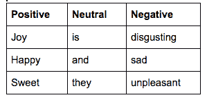
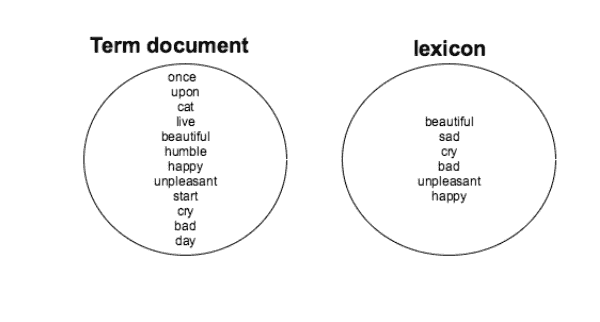
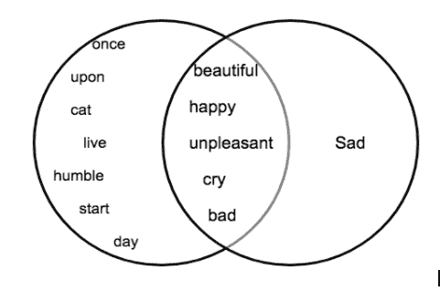
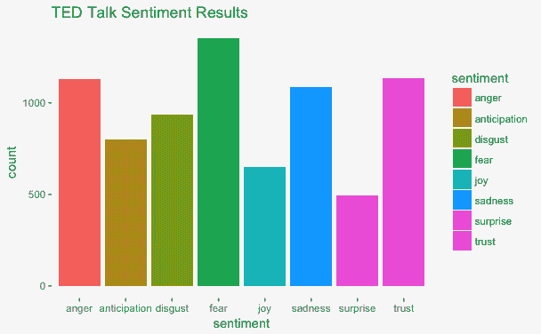
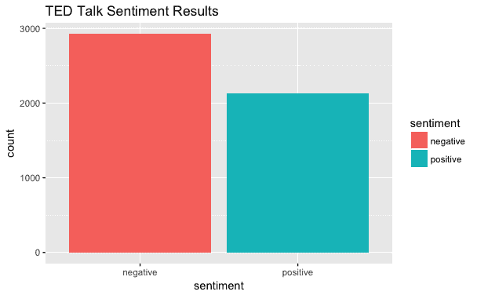

# 探索情感分析作为文本挖掘的应用。

> 原文：<https://dev.to/lornamariak/exploring-sentiment-analysis-o6j>

[T2】](https://res.cloudinary.com/practicaldev/image/fetch/s--DW2hjXuI--/c_limit%2Cf_auto%2Cfl_progressive%2Cq_auto%2Cw_880/https://thepracticaldev.s3.amazonaws.com/i/h9dvvoo3rgbg7z4xjylf.jpg)

## 简介

本文是理解文本挖掘的第 2 部分。如果你刚登陆这里，第一部分在这里可用[。
文本挖掘的应用之一是情感分析。为了让我们继续对挖掘出的文本进行情感分析，我们需要清理和准备我们的数据集，正如我们在第 1 部分中看到的。](https://dev.to/lornamariak/understanding-and-writing-your-first-text-mining-script-withr-345k)

## 理解情绪分析

情绪分析:对提取的信息进行研究，以识别反应、态度、背景和情绪。作为文本挖掘的应用之一，情感分析揭示了挖掘文本中的态度。

它基于词的极性，它考虑积极或消极的词，中性词被解雇。

[T2】](https://res.cloudinary.com/practicaldev/image/fetch/s--AtaDmfKw--/c_limit%2Cf_auto%2Cfl_progressive%2Cq_auto%2Cw_880/https://thepracticaldev.s3.amazonaws.com/i/lxz42i73p3jml05atk9t.png)

情感分析是基于词汇完成的。比如说英语词典，用更简单的术语来说，词典就是词汇。在这种情况下，词典是具有两种极性的词的选择，可以用作情感分析中的度量。

根据您正在处理的数据的上下文，可以使用许多不同类型的词典。也有可能创建一个自定义词典，这取决于我们希望对您的数据进行多少自定义。

在本文中，我们将使用 syuzhet 包。虽然 CRAN 上有许多用于情感分析的包，但 syuzhet 包非常适合学习，因为它是 nrc、bing 和 afinn 等最常见词汇的组合。我们还利用 ggplot2 进一步可视化我们的情感分析结果。

## 情感分析是如何工作的？

简而言之，情感分析是作为术语文档(从挖掘的文本构建)和选择的词典的交集来执行的。

第一步是准备一个术语文档和你选择的词典。

[T2】](https://res.cloudinary.com/practicaldev/image/fetch/s--fqq9j9r5--/c_limit%2Cf_auto%2Cfl_progressive%2Cq_auto%2Cw_880/https://thepracticaldev.s3.amazonaws.com/i/d3t0evjy423rk00u2z8f.png)

然后在两个集合之间形成一个交集。

[T2】](https://res.cloudinary.com/practicaldev/image/fetch/s--2dzejbsG--/c_limit%2Cf_auto%2Cfl_progressive%2Cq_auto%2Cw_880/https://thepracticaldev.s3.amazonaws.com/i/83i67718zz9dwcoqsgns.png)

## 动手进行情感分析

#### 例子一

这是一个简单的例子，我们从一个句子中提取情感。我们加载句子，使用 strsplit()函数拆分每个单词以形成一个字符向量，并使用 syuzhet 库中的 get _ NRC _ invision()函数。该函数接收 new_sentence 并将其与 nrc 情感词典进行比较，以返回如下所示的分数。

```
library(syuzhet)  sentence  <-  "i love cats such a bundle of joy."  new_sentence  <-  as.character(strsplit(sentence," "))  get_nrc_sentiment(new_sentence)  #This is the output  anger  anticipation  disgust  fear  joy  sadness  surprise  trust  negative  0  0  0  0  2  0  0  0  0  positive  2 
```

#### 例子二

第二个例子使用了一个从 Kaggle 下载的 TED talks 数据集，名为 transcript.csv，按照本文第 1 部分中的步骤使用 tm 包对其进行了清理，并在第 2 部分中进行了情感分析。

```
#load the libraries  library(syuzhet)  library(tm)  library(ggplot2)  #mydataCopy is a term document,generated from cleaning #transcripts.csv  mydataCopy  <-  mydata  #carryout sentiment mining using the get_nrc_sentiment()function #log the findings under a variable result  result  <-  get_nrc_sentiment(as.character(mydataCopy))  #change result from a list to a data frame and transpose it  result1<-data.frame(t(result))  #rowSums computes column sums across rows for each level of a #grouping variable.  new_result  <-  data.frame(rowSums(result1))  #name rows and columns of the dataframe  names(new_result)[1]  <-  "count"  new_result  <-  cbind("sentiment"  =  rownames(new_result),  new_result)  rownames(new_result)  <-  NULL  #plot the first 8 rows,the distinct emotions  qplot(sentiment,  data=new_result[1:8,],  weight=count,  geom="bar",fill=sentiment)+ggtitle("TedTalk Sentiments")  #plot the last 2 rows ,positive and negative  qplot(sentiment,  data=new_result[9:10,],  weight=count,  geom="bar",fill=sentiment)+ggtitle("TedTalk Sentiments") 
```

[T2】](https://res.cloudinary.com/practicaldev/image/fetch/s--nsAFay0e--/c_limit%2Cf_auto%2Cfl_progressive%2Cq_auto%2Cw_880/https://thepracticaldev.s3.amazonaws.com/i/arjlve7c28nv4vgm0l5z.png)

[T2】](https://res.cloudinary.com/practicaldev/image/fetch/s--swKawmi3--/c_limit%2Cf_auto%2Cfl_progressive%2Cq_auto%2Cw_880/https://thepracticaldev.s3.amazonaws.com/i/ys5yzu537d4qin7rromf.png)

剧情一:展现截然不同的情绪
剧情二:展现两种极性下的情绪组合。

## 结论

我们已经将我们的情感分析技巧应用于挖掘的文本，以得出对附加到文本数据的情感的明显描述。

这可能是一个完整的项目，可以帮助你了解如何以及何时与你的听众交谈，他们对某个话题/产品/服务的感觉，以及你可以用什么更好的方式与他们互动。

现在，继续选择一篇文章/数据集/活动，并按照步骤进行情感分析。

快乐编码，我永远在这里帮助@lornamariak