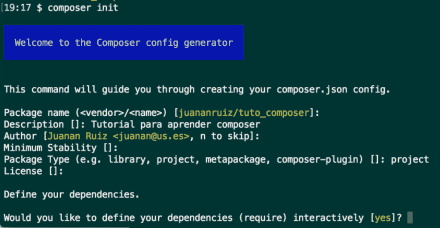

# 使用 composer 自动创建项目

> [https://dev . to/juananuiz/自动化-创建-使用 composer-4mib](https://dev.to/juananruiz/automatiza-la-creacion-de-tus-proyectos-con-composer-4mib)

## 什么是作曲家，你能帮助我什么

当你创建一个新的代码开发项目时，不管是用什么语言，我都不认为你从头到尾读完了整个代码。通常，您会使用您或其他人已经开发的项目的一部分作为项目的中心，然后在此处和此处添加书店，以此作为起点。我敢说，所有这些代码可能占项目的 75%。

通常，我们在此任务中所做的工作是复制去年某个项目中使用的一个库文件夹，以及我们最近在网络上找到的另一个库文件夹，这是我们为以前项目开发的代码，我们正在逐步对其进行调整，等等。

问题是，我们正在混合库版本，这些版本通常彼此不兼容(不是库，而是版本)，或者与我们当前版本的 PHP 不兼容。此外，在发布新版本或安全修补程序时，彼此结婚、相互呼叫甚至更新它们通常都是疯狂的。

在这种恐怖的情况下，我们发明了设备管理器，它只是一种实用工具，可以帮助您安装所需的软件包，并检查和安装设备，而这些设备又可以运行这些软件包。

在操作系统级别上，Linux 上的一个例子是 apt 和**yum**；对于 Javascript 有 **npm** 或 **bower** ，Java 有 **Maven** 。对于 PHP 我们有幸拥有 **Composer**

[T2】](https://res.cloudinary.com/practicaldev/image/fetch/s--1cH4dubs--/c_limit%2Cf_auto%2Cfl_progressive%2Cq_auto%2Cw_880/http://galatar.com/wp-content/uploads/2018/01/logo-composer.png)

### 从 Windows 安装

下载可执行文件，以便从 composer[web 进行自动安装 https://getcomposer . org/doc/00-intro . MD # installation-windows](https://getcomposer.org/doc/00-intro.md#installation-windows)

安装后，您可以从任何目录使用 Composer，方法是使用命令行并按**PHP composer . phar**

### 从 Linux 和 Mac 安装

访问 Composer 安装页面，并按照[https://getcomposer . org/download/](https://getcomposer.org/download/)中的说明进行操作(安装过程随每个版本而变化，因此您最好在此处查看)。从这些系统中，您可以直接从命令行使用 Composer，就像它是可执行文件一样，而无需调用 php。于是，安装完毕后，打开终端并按键**【composer】**

## 开始使用合成器

Composer 不在全局级别运行，而是在项目级别运行。安装后，从终端或命令行访问您的项目根目录，如果您使用 Windows 开发，请按**composer init**或**PHP composer . phar init**。

这会启动 Composer 组态产生器，它会以互动方式提示您为您的专案产生相依性组态档案:**composer . JSON**。

我建议您在学习本教程时并行执行此操作。

[T2】](https://res.cloudinary.com/practicaldev/image/fetch/s--RraKjuPL--/c_limit%2Cf_auto%2Cfl_progressive%2Cq_auto%2Cw_880/http://galatar.com/wp-content/uploads/2018/01/composer_init-1024x531.png)

首先询问您要生成的项目的名称，实际上将其命名为“”，因为要合成所有内容，通常使用的格式是:**【开发者名称/软件包名称】**(如果您是一次性枪手)，或者**【公司名称/软件包名称】然后提示您输入项目说明、反映项目成熟状态的版本号(您可以将此字段留空)、要创建的软件包类型:库、项目、元软件包、Composer 插件，最后是用于您的项目的“T4”许可类型(所有者、GPL)页:1。**

这样，您就有了项目的基本参数，然后可以开始声明要使用的依赖关系。为此，请继续设置(当询问是否要定义依赖关系时，请回答 **Yes** 。

对于您要首先定义的每个依赖项，请将包的大致名称放在 Composer 在其包数据库中搜索(https://packagest . org/)，然后从结果中选择一个，然后将您想要的版本(如果您想要最新的版本，请将其留空)。作为示例，安装模板管理器**【twig/twig】**。这将需要一段时间，并再次询问您是否要继续添加依赖项。

如果您想继续定义相依性，当您要停止时，请在下次询问「T2」寻找套件时按下

小心不要按**【ctrl-c】**，也不要在结束前关闭终端，因为你会中止整个过程。

接下来，他问你是否要在开发阶段定义依赖关系，如果你有什么明确的，向前看，如果你不按键退出。然后，它会询问您是否要使用您提供的数据创建配置文件，请按 **Yes** 键，或按 **enter** 键完成。

这会产生一个档案，并储存在您的专案资料夹中，如**composer . JSON**开启该档案来检视它，您会看到它包含您所指定的选项。

```
{  "name":  "galatar/tuto_composer",  "description":  "Tutorial sobre composer",  "type":  "project",  "require":  {  "twig/twig":  "^2.4"  },  "authors":  [  {  "name":  "Juanan Ruiz",  "email":  "juanan@us.es"  }  ]  } 
```

目前，Composer 没有下载任何内容，也没有创建任何其他文件来运行您刚刚定义的配置文件，请在终端上键入“**composer install**”。

下载过程完成后，有时需要一段时间，您可以查看在您的项目中创建的文件夹和文件，原则上您将有一个新的文件**【composer . lock】**和一个文件夹

```
.  
├── composer.json  
├── composer.lock  
└── vendor  
    ├── autoload.php  
    ├── composer  
    ├── symfony  
    └── twig 
```

文件 **composer.lock** 存储 composer 下载的包的数据，如果您查看一下它，就会发现它包含大量信息，因为您下载的每个包都有自己的依赖文件(composer.json)，它反映在此文件中。小心，因为决不能手动触摸这个文件，你需要对你的文件**【composer . JSON】**做的更改，然后用**【composer update】**命令使它们生效。最后但并非最不重要的一点是，Composer 创建了“**vendor**”文件夹，用于存储您安装的软件包文件以及 Composer 自身运行所需的文件。

## 为开发环境安装软件包

Composer 还允许您指定原则上只能在& quot；模式下使用的包，即只应下载这些包并在应用程序的开发和测试团队中使用。

你会看到 **composer init** 向导底部显示的选项之一是这样的:

```
Would you like to define your dev dependencies (require-dev) interactively [yes]? 
```

因为您此时安装的软件包将安装在名为“**”要求-dev“**”的文件“**composer . JSON’t1]的特殊分支中。**

如果您此时不这样做，您也可以使用类似于: **composer 要求 monolog/monolog–dev**的东西，随时从命令行向该分支添加软件包

安装**单记簿**超完备的信息管理包，以便在开发模式下跟踪您的项目日志。将在 composer.json 文件中添加以下内容:

```
...  "require-dev":  {  "monolog/monolog":  "^1.23",  },  ... 
```

无论如何，请注意 Composer 在开发团队中以及在生产团队中时都无法通过魔法发现，因此当您在生产团队中部署项目时，composer 总是使用‘t0’composer install–no-dev 或‘T2’composer update–no-dev

## 使用 Composer 处理现有项目

如果您是团队成员，则可能是其他人建立并与您共用专案。或者，您可能是按照本教程创建的，现在想与他人共享。

在本例中，您已经收到或与项目的其他部分共享了一个文件“**”composer . JSON“**”的一部分。你没有收到或分享的东西，如果你做得好的话，就是**供应商**文件夹及其内容。

该文件夹及其文件和文件夹将在新环境中创建，方法是从项目根目录运行“**composer install**”。

如果使用依赖管理器，如 **git** 进行团队编程(或只是为了保护自己)，则必须将文件**【composer . JSON】**和**【composer . lock】**包含在您的存储库中，但必须删除目录**这通常会在您执行上述指令**【composer install】**时，在您的专案的新例证中建立。**

## 包装自卸

您下载的大多数包都将包含自己的 autoload 信息，以便您可以实例化其中包含的类。Composer 的另一个优点是，它负责直接从一个集中的文件组织整个自动加载，该文件命名为“**”autoload . PHP**，您可以在您的项目的“**vendor”**文件夹中找到该文件。

要访问任何类，只需从脚本中包含文件“**”autoload . PHP“**”。

```
<?php  
require_once '../vendor/autoload.php';  
$twig_loader = new Twig_Loader_Filesystem('../templates');  
$twig = new Twig_Environment($twig_loader, array('cache' => '../cache/twig',)); 
```

也可以使用 Composer 加载自己的类，继续阅读。

## 用合成器自动加载你的课

如果您已经知道 php 中有命名空间(我希望是)，现在是时候声明您的项目的根命名空间以及 PHP 解释器应该在其中查找您的类的文件夹了。为此，在文件 **composer.json**
中添加类似如下的内容

```
"autoload":  {  "psr-4":  {  "Galatar\\TutoComposer\": "src"  
    }  
} 
```

你会得到这样的东西:

```
{  "name":  "galatar/tuto_composer",  "description":  "Tutorial sobre composer",  "type":  "project",  "require":  {  "twig/twig":  "^2.4"  },  "require-dev":  {  "monolog/monolog":  "^1.23",  },  "autoload":  {  "psr-4":  {  "Galatar\\TutoComposer\": "src"  
      }  
  },  
  "authors": [  
      {  
          "name": "Juanan  Ruiz",  
          "email": "juanan@us.es"  
      }  
  ]  
} 
```

现在，您终于可以开始编写您的第一个类，而不用手动编写自动加载类。

在项目根目录中创建一个名为“**src**”的文件夹，并在其中创建一个名为“**person . PHP**”的文件，其内容如下:

```
<?php  
// src/Persona.php 
namespace Galatar\TutoComposer;  
class Persona  
{  
    public function saluda()  
    {  
        print("Hola soy una persona");  
    }  
} 
```

还在项目根目录下创建一个名为“**public**”的文件夹，并在其中写入一个名为“**index . PHP**”的文件，其内容如下:

```
<?php  
// tuto_galatar/public/index.php 
require_once '../vendor/autoload.php';  
use Galatar\TutoComposer\Persona;  
$persona = new Persona();  
$persona->saluda(); 
```

现在你的目录结构应该是这样的，如果你看看你已经有了一个小框架:

```
.  
├── composer.json  
├── composer.lock  
├── public  
│   └── index.php  
├── src  
│   └── Persona.php  
└── vendor  
    ├── autoload.php  
    ├── composer  
    ├── symfony  
    └── twig 
```

使用以下顺序从控制台激活与 php 集成的 web 服务器: **php -S localhost:8000**

现在去你的网页浏览器和键盘:[【http://localhost:8000](http://localhost:8000)

应该会出现一页上面写着:**你好我是**人

感谢您来到这里，希望本教程对您有所帮助。

如果出了什么事，再一次超越了以前的指示。如果你有任何疑问或希望我谈一谈任何有关的话题，请给我一点意见，我会尽快给您答复。

### 了解更多信息

*   [网络书籍:合成器，官方手册](http://librosweb.es/libro/composer/capitulo_2/cargando_clases_de_forma_automatica.html)**