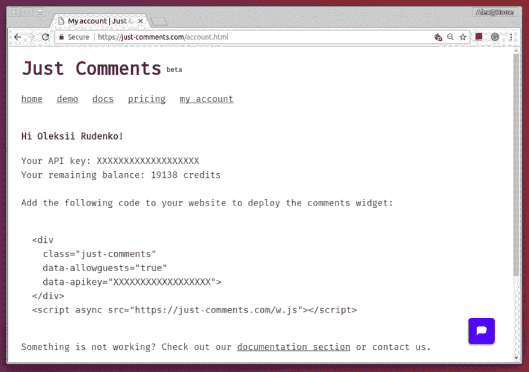
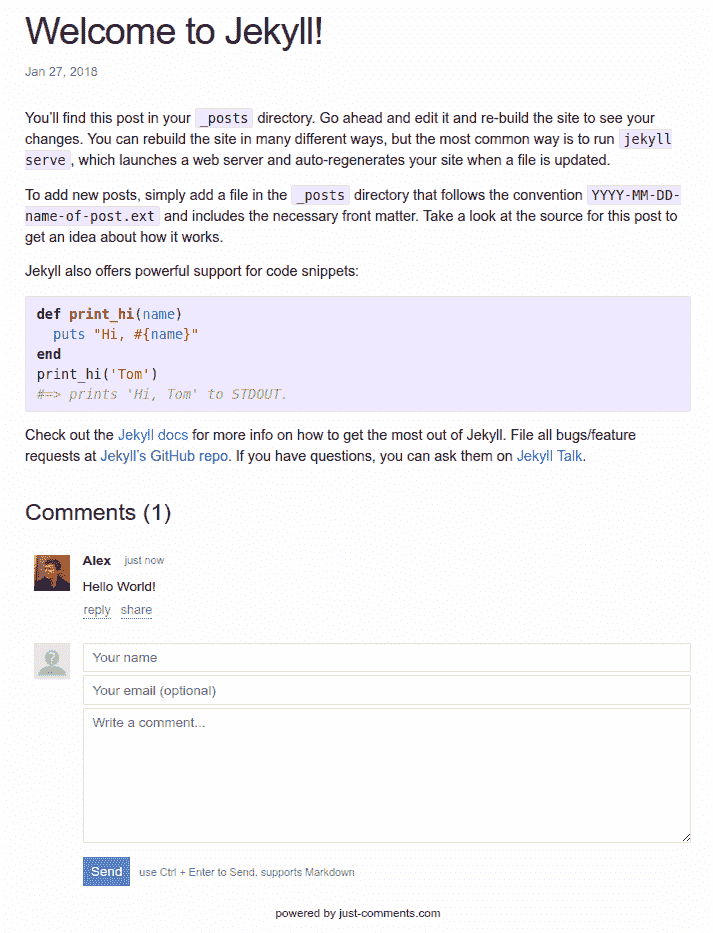

# 给你的 Jekyll 博客添加评论

> 原文:[https://dev . to/orkon/adding-comments-to-your-Jekyll-blog-1e 40](https://dev.to/orkon/adding-comments-to-your-jekyll-blog-1e40)

Jekyll 是一个基于 Ruby 的引擎，可以帮助你创建静态网站和博客。这是最受欢迎的系统之一，有大量的插件和例子。其中一个优势是它由 [Github Pages](https://pages.github.com/) 提供开箱即用的支持，在那里你可以免费托管静态网站，包括拥有自定义域名的可能性。在这篇文章中，我将向你展示一个简单的方法，使用 [Just Comments](https://just-comments.com/) ，在你基于 Jekyll 的静态网站上添加一个评论小部件。默认情况下，Jekyll 推荐使用 Disqus，但在我看来，只是评论是一个更好的选择，因为它的客户端捆绑包不那么庞大，而且它不专注于通过广告赚钱。

## 用 Jekyll 创建新博客

如果你已经有了 Jekyll 的博客，跳过这一部分。然而，创建一个新博客很容易:

```
jekyll new my-awesome-site 
```

<svg width="20px" height="20px" viewBox="0 0 24 24" class="highlight-action crayons-icon highlight-action--fullscreen-on"><title>Enter fullscreen mode</title></svg> <svg width="20px" height="20px" viewBox="0 0 24 24" class="highlight-action crayons-icon highlight-action--fullscreen-off"><title>Exit fullscreen mode</title></svg>

将目录更改为`my-awesome-site`并运行以下命令，该命令使用生成的网站在[http://localhost:4000](http://localhost:4000)
启动本地服务器

```
bundle exec jekyll serve 
```

<svg width="20px" height="20px" viewBox="0 0 24 24" class="highlight-action crayons-icon highlight-action--fullscreen-on"><title>Enter fullscreen mode</title></svg> <svg width="20px" height="20px" viewBox="0 0 24 24" class="highlight-action crayons-icon highlight-action--fullscreen-off"><title>Exit fullscreen mode</title></svg>

## 向 Jekyll 博客添加评论

现在，当我们至少有一个基本的博客时，我们可以添加评论，这样你的访问者就可以对你的内容发表评论。

首先，通过 Github 或脸书登录，在 Just Comments 上创建一个账户。您将看到系统自动生成的 API 密钥。

[T2】](https://res.cloudinary.com/practicaldev/image/fetch/s--6yimH2GK--/c_limit%2Cf_auto%2Cfl_progressive%2Cq_auto%2Cw_880/https://60devs.com/img/article-jc-jekyll/api-key.png)

现在我们需要修改博客模板，并将小部件集成到我们的博客中。你可以通过定制现有的博客主题来做到这一点。例如，要定制名为`minima`的默认主题，在您喜欢的编辑器中创建文件`_includes/head.html`。将以下内容放入文件:

```
<head>
  <meta charset="utf-8">
  <meta http-equiv="X-UA-Compatible" content="IE=edge">
  <meta name="viewport" content="width=device-width, initial-scale=1">
  
  <link rel="stylesheet" href="{{ "/assets/main.css" | relative_url }}">
  <link rel="alternate" type="application/rss+xml"
    title="{{ site.title | escape }}" href="{{ "/feed.xml" | relative_url }}">
  
    
  
  <!-- START OF RELEVANT PART -->
  <script async src="https://just-comments.com/w.js"></script>
  <!-- END OF RELEVANT PART -->
</head> 
```

<svg width="20px" height="20px" viewBox="0 0 24 24" class="highlight-action crayons-icon highlight-action--fullscreen-on"><title>Enter fullscreen mode</title></svg> <svg width="20px" height="20px" viewBox="0 0 24 24" class="highlight-action crayons-icon highlight-action--fullscreen-off"><title>Exit fullscreen mode</title></svg>

通过添加`script`标签，我们嵌入了仅由评论提供的小部件，这将增强我们的评论。

其次，将注释的容器元素放在您想要的位置。为此，我们需要通过创建包含以下内容的文件`./_layouts/post.html`来定制帖子模板，将 **YOUR_API_KEY** 替换为 Just Comments 帐户的实际 API 密钥。

```
--------
layout: default
--------
<article class="post h-entry" itemscope itemtype="http://schema.org/BlogPosting">

  <header class="post-header">
    <h1 class="post-title p-name" itemprop="name headline">{{ page.title | escape }}</h1>
    <p class="post-meta">
      <time class="dt-published" datetime="{{ page.date | date_to_xmlschema }}" itemprop="datePublished">
        {% assign date_format = site.minima.date_format | default: "%b %-d, %Y" %}
        {{ page.date | date: date_format }}
      </time>
      
        • <span itemprop="author" itemscope itemtype="http://schema.org/Person">
        <span class="p-author h-card" itemprop="name">{{ page.author }}</span>
        </span>
      </p>
  </header>

  <div class="post-content e-content" itemprop="articleBody">
    {{ content }}
  </div>

  <!-- START OF RELEVANT PART -->
  <div 
    class="just-comments"
    data-allowguests="true"
    data-apikey="YOUR_API_KEY">
  </div>
  <!-- END OF RELEVANT PART -->

  <a class="u-url" href="{{ page.url | relative_url }}" hidden></a>
</article> 
```

<svg width="20px" height="20px" viewBox="0 0 24 24" class="highlight-action crayons-icon highlight-action--fullscreen-on"><title>Enter fullscreen mode</title></svg> <svg width="20px" height="20px" viewBox="0 0 24 24" class="highlight-action crayons-icon highlight-action--fullscreen-off"><title>Exit fullscreen mode</title></svg>

结果看起来像这样:

[T2】](https://res.cloudinary.com/practicaldev/image/fetch/s--VbBgvI90--/c_limit%2Cf_auto%2Cfl_progressive%2Cq_auto%2Cw_880/https://60devs.com/img/article-jc-jekyll/result.png)