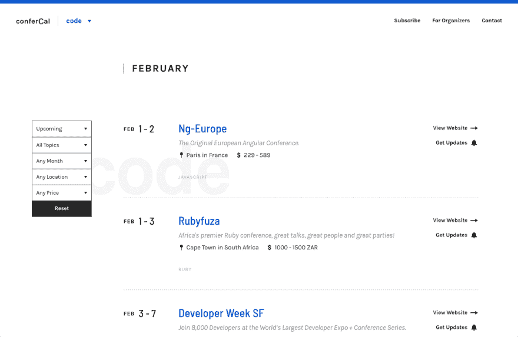

# 我为技术人员做了一个会议日历

> 原文：<https://dev.to/madebybourn/a-conference-calendar-for-people-in-tech-4ag7>

大家好！我最近推出了[conference cal](https://www.confercal.com)，这是一个面向开发人员和其他技术人员的会议日历。

通过对主题、日期、价格和地点的过滤，我想更容易地找到你想参加、发言、展览等的创意或技术会议。

[T2】](https://res.cloudinary.com/practicaldev/image/fetch/s--I18ITYy5--/c_limit%2Cf_auto%2Cfl_progressive%2Cq_auto%2Cw_880/https://thepracticaldev.s3.amazonaws.com/i/dbug017dpp5a6wwsypdv.png)

### 为什么

conferenc al 的想法是因为我太懒了，不想在网上搜索所有与设计、代码或创业相关的会议列表。找到很酷的会议，然后点击 3 次后，发现从地点或价格的角度来看，参加太贵了，这也很烦人。

### 计划

我的第一个目标是成为一个单一的资源，为那些主要从事技术的人(从设计师到开发人员到营销人员到企业家)找到会议。最终，如果有需求，扩展到其他创意领域将是非常棒的。但我会一步一步来。

**查看:**[https://www.confercal.com](https://www.confercal.com)
**开发者大会:**[https://www.confercal.com/calendars/code](https://www.confercal.com/calendars/code)

让我知道你的想法！🙈