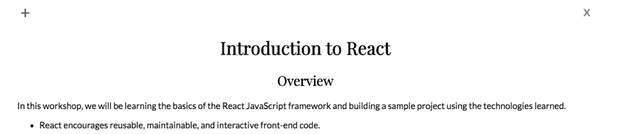
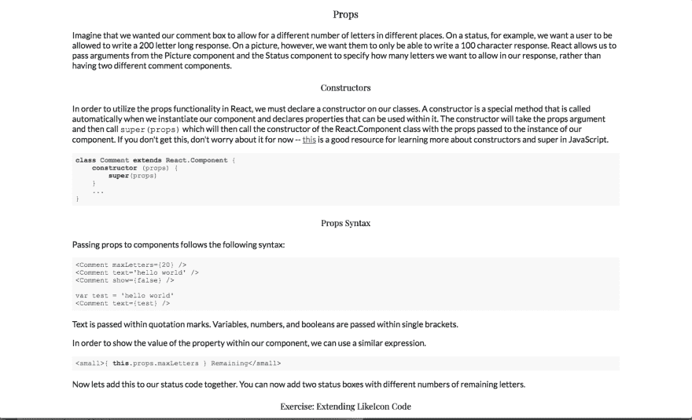

# 建立一个电子阅读器

> 原文：<https://dev.to/aspittel/building-a-markdown-editor-in-electron-3dof>

自从它问世以来，我一直对 Electron 感兴趣，因为它允许你用 JavaScript 编写桌面应用程序。这允许您使用所有您习惯使用的 JavaScript 包！另外，我花了这么多时间使用 VS 代码，我可能应该学习它背后的技术，对吗？

## 入门

我开始使用`npm`全球安装电子。然后，我浏览了电子网站上的“Hello World”示例。它主要展示了如何启动一个电子应用程序的实例，以及如何处理关闭窗口。我最终在我的最终项目中使用了大部分代码。

然后我做了一些谷歌搜索，看看人们是如何分离出他们的代码的。我最初并不完全理解，应该有单独的代码来创建桌面应用程序，然后“查看”代码供用户查看和交互。不过，为了包含 npm 包，您仍然可以在视图端使用`require`语句，这不同于普通的“客户端”JavaScript。我确实看了几个样本项目，但是在我的最终项目中，除了文件结构之外，我没有使用任何东西。

## 最终项目

我做了很多演讲，我通常会为这些演讲写笔记。我通常使用 VS 代码中的 Markdown 预览来在我说话的时候查看那些笔记。当我有另一个包含代码的 VS 代码实例时，这可能会变得复杂——我的缩放级别和定制在每个窗口中都有变化！我决定我应该制作自己的 Markdown 浏览器，它是为演讲量身定制的。

我从处理大部分窗口创建代码的`main.js`开始。我的代码与电子网站上的[快速入门](https://electronjs.org/docs/tutorial/quick-start)代码基本相同。我的一个改变是我用用户显示器的大小来决定窗口的大小。

```
const { width, height } = electron.screen.getPrimaryDisplay().workAreaSize
win = new BrowserWindow({ width, height, frame: false }) 
```

Enter fullscreen mode Exit fullscreen mode

此外，在开发中，我使用了[电子重装](https://www.google.com/search?q=electron+hot+reload&oq=electron+hot+relo&aqs=chrome.0.0j69i57j0.4754j1j1&sourceid=chrome&ie=UTF-8)，这真的很有帮助。默认情况下，每次进行更改时，您都必须重新启动电子实例，这很快就会变得非常烦人！这个 npm 包为代码的视图端引入了热重载。

我最终创建了一个包含以视图为中心的 html、css 和 js 的`view`文件夹。这个 html 看起来和其他 html 文件非常相似！

```
<!DOCTYPE html>
<html>

<head>
  <meta charset="UTF-8">
  Markdown Reader!
  <link rel="stylesheet" href="style.css">
  <link 
    rel="stylesheet" 
  href="https://cdnjs.cloudflare.com/ajax/libs/highlight.js/9.12.0/styles/github.min.css"
  >
</head>

<body>
  <div class="container">
    <input type="button" value="+" class="select-file"/>
    <button class="close">x</button>
    <div class="md"></div>    
  </div>
  <script src="./script.js"></script>
</body>

</html> 
```

Enter fullscreen mode Exit fullscreen mode

然而，JavaScript 文件看起来确实与普通的客户端文件有点不同。

```
const fs = require('fs')
const marked = require('marked')
const hljs = require('highlight.js')

const { getCurrentWindow, dialog } = require('electron').remote

const readFile = (file) => {
  fs.readFile(file, (err, data) => {
    document.querySelector('.md').innerHTML = marked(data.toString())
    Array.from(document.querySelectorAll('pre code')).forEach(
      block => hljs.highlightBlock(block))
  })
}

const filters = { filters: [{ name: 'Markdown', extensions: ['md', 'markdown'] }] }

const openFilePicker = () => {
  dialog.showOpenDialog(filters, fileNames => {
    if (fileNames) {
      readFile(fileNames[0])
    }
  })
}

const close = e => {
  const window = getCurrentWindow()
  window.close()
}

document.querySelector('.close').addEventListener('click', close)
document.querySelector('.select-file').addEventListener('click', openFilePicker) 
```

Enter fullscreen mode Exit fullscreen mode

首先，我在`index.html`中使用了 require 语句，而不是脚本标签。其次，Electron 有一些不会在浏览器中使用的动作，比如关闭窗口或打开用户的文件对话框。搞清楚这些动作很容易。`dialog.showOpenDialog`打开一个文件选择器，然后我使用 Node 的`fs`打开那个文件。我还删除了电子邮件的灰色默认标题，所以我需要自己的关闭按钮。我用上面代码中的`close`函数做到了这一点。

除此之外，我可以使用普通的 JavaScript 方法与 dom 交互并添加事件监听器。

我**真的**喜欢这个应用程序的结果，而且我实际上几乎每天都会使用这个应用程序。顶部看起来如下:

[T2】](https://res.cloudinary.com/practicaldev/image/fetch/s--y1RMdOzA--/c_limit%2Cf_auto%2Cfl_progressive%2Cq_auto%2Cw_880/https://thepracticaldev.s3.amazonaws.com/i/1rsk2o7yho2xtc9dbtw1.png)

代码 snippits 使用 GitHub 的文本编辑器主题:
[](https://res.cloudinary.com/practicaldev/image/fetch/s--a1LkvK5l--/c_limit%2Cf_auto%2Cfl_progressive%2Cq_auto%2Cw_880/https://thepracticaldev.s3.amazonaws.com/i/0bygkrnn7hlaq2av9q1t.png)

我使用了自定义的间距、填充和字体，以使我在演示时可读性更好！

我确实尝试过捆绑这个应用，让它成为一个真正的桌面应用，但我没有太大的成功。我可能会进一步研究它，但我尝试了两个库，两个库似乎都不像我希望的那样。相反，我在我的`.zshrc`中使用了一个别名，在我的电脑上的任何地方打开它。老实说，对我来说，这是一个更好的选择，因为当我的电脑启动时，除了 iTerm，我不使用 finder 或 Launchpad 打开任何东西！

## 下一步

如果我要再开发一个桌面应用程序，我肯定会使用 electronic。它易于使用，有很好的文档记录，并且与我的正常开发过程相似。我不一定认为我会有很多其他我想构建的桌面应用程序，但我喜欢构建这个应用程序的过程，并会向那些想轻松构建桌面应用程序的人推荐 Electron！

[代码](https://github.com/aspittel/markdown-viewer)

设置说明:

```
$ git clone https://github.com/aspittel/markdown-viewer
$ cd markdown-viewer
$ npm install -g electron
$ npm install
$ electron . 
```

Enter fullscreen mode Exit fullscreen mode

**我的一部分[关于学习新事物](https://medium.com/on-learning-new-things/learning-new-things-f4db7f16724)系列**