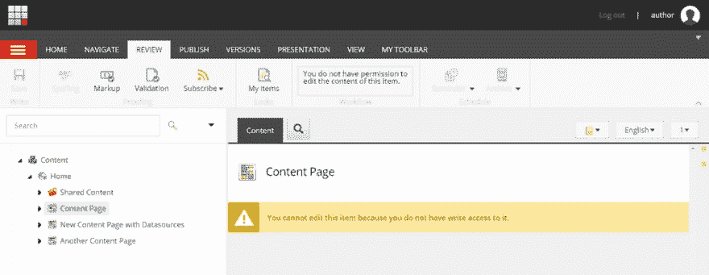
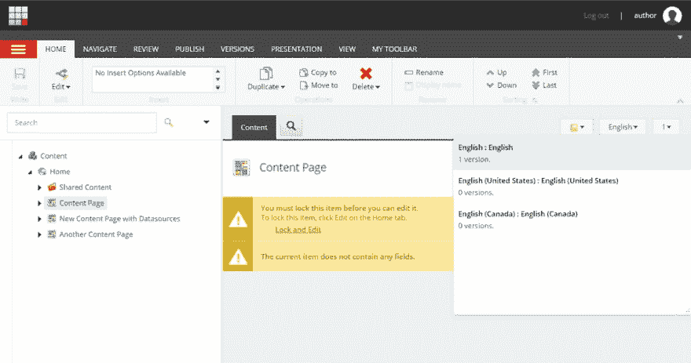

# Sitecore QA 最佳实践

> 原文:[https://dev . to/anastasiyaflynn/sitecore-QA-best-practices-8nd](https://dev.to/anastasiyaflynn/sitecore-qa-best-practices-8nd)

## 所有质量保证专家都应遵循的测试 Sitecore 的 4 个具体实践，以确保正确性并尽早阻止错误。

### 不要使用管理员帐户测试内容编辑器或体验编辑器

当 Sitecore 的一个新实例被设置时，默认情况下只有一个“admin”帐户。创建额外的用户和角色可能会推迟到项目的后期，但是只使用“admin”帐户进行开发和测试可能会隐藏错误。管理员可以访问普通内容作者不能访问的项目和字段。作者可能受限于特定的语言，但管理员不受限制。作者必须锁定页面进行编辑，但管理员可以绕过锁定和工作流程。作者与管理员拥有不同的发布权限。这两种类型的帐户在创作体验上有足够的不同，值得进行测试。[T2】](///static/f4715b4aac1912e3756c44091df5cbec/9fb8a/author-no-permissions.png)

### 使用至少两种不同的语言测试定制功能

当 Sitecore 的一个新实例被设置时，默认情况下只有一种语言可用，“en”。通常，开发人员只使用“en”来构建和测试组件，只有在内容输入人员需要时才添加其他语言。只用默认语言开发会隐藏 bug。问题是，当从数据库中获取条目和字段时，开发人员可以明确指定要获取的语言版本，或者他可以让 Sitecore 使用当前的上下文语言。在前端呈现页面时，Sitecore 将上下文语言设置为被查看页面的语言，因此在理想情况下，我们在代码中获取的所有项目和字段都与页面的语言相同。然而，有时 Sitecore 没有页面语言可循，比如在索引抓取期间。在这种情况下，Sitecore 默认使用“en”作为上下文语言。因此，如果您正在抓取一个页面的法语版本，并且代码从数据库中获取数据而没有明确指定语言，您可能会在您的法语页面中获得“en”内容索引。[T2】](///static/e69054089b9fccc49c224d8fb29b7f86/bd597/author-language-selection.png)

### 测试如果丢失数据源，渲染会正常失败

并非所有的渲染都使用数据源，但是那些确实需要编码的渲染会考虑到数据源丢失的可能性。数据源怎么会丢失:

*   呈现是通过演示细节添加的，演示细节不提示创建数据源项，用户忘记添加它了
*   数据源项目被意外删除
*   数据源项存在，但未复制到 web 数据库，因为它有验证错误或不处于已批准的工作流状态。如果缺少数据源，理想的行为是在编辑模式下显示有用的错误消息，并在前端模式下完全禁止呈现。我们当然需要避免一次渲染占用整个页面。要测试正常失败，请使用 Experience Editor 将带有数据源的呈现添加到页面，保存，然后从内容编辑器的 Sitecore 树中删除数据源项目。在编辑、预览和前端模式下检查页面。

### 尽早并经常运行可访问性符合性扫描

在像 SEO 和性能这样的扫描中，不同的元素对单个页面级别的分数有影响，所以推迟运行这些测试是有意义的，直到项目结束，那时开发接近完成，页面接近最终状态。但是，可访问性符合性错误是在单个 DOM 元素的级别上分配的，所以即使页面只是部分完成，也可以运行可访问性扫描。以我的经验来看，对可访问性遵从性错误的补救是相当复杂的。例如，如果一个组件的 HTML 需要改变，那么 CSS 和 JavaScript 可能也需要重构。所以在项目早期开始扫描是个好主意。

使用的工具:[https://wave.webaim.org/](https://wave.webaim.org/)[T3](https://res.cloudinary.com/practicaldev/image/fetch/s--8fuIjhBJ--/c_limit%2Cf_auto%2Cfl_progressive%2Cq_auto%2Cw_880/https://www.codealamode.blog/static/4d94eb4d80fcb1d191b53bccb9b5c852/e11df/wavetoolexample.png)