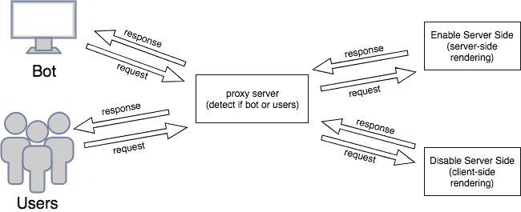
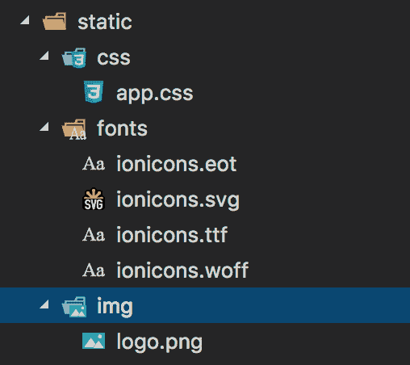
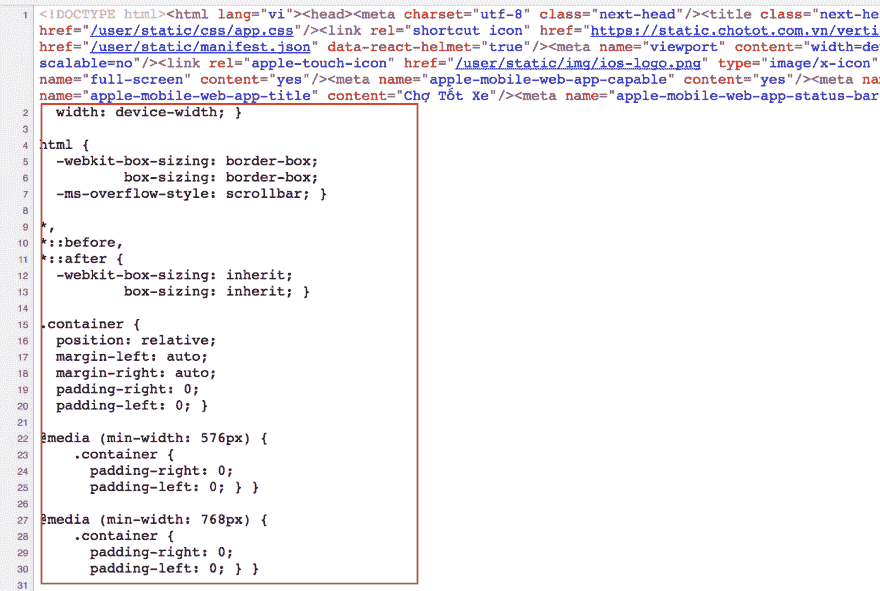
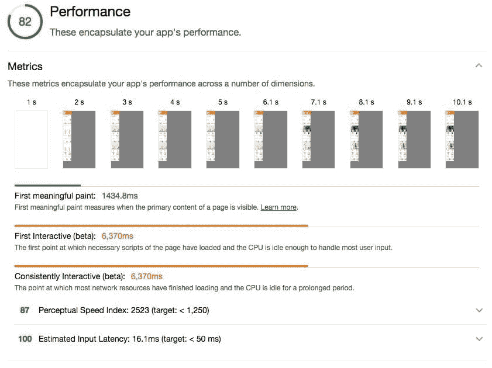
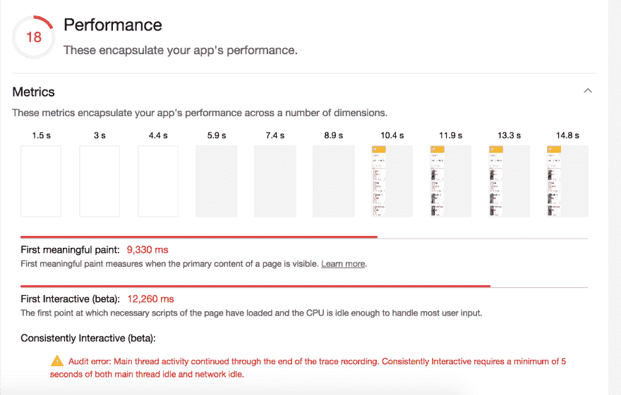

# Chotot 的 next.js

> 原文：<https://dev.to/dzungnguyen179/nextjs-at-chotot-7h0>

# 概述

每天， [Chợ tốt](https://www.chotot.com) (Chotot)接受超过 100 万次跨平台访问，大部分流量来自移动设备。开发可以跨设备运行的产品对我们来说非常重要。去年，我们改用新的堆栈来重建我们的产品。

我们为我们的新堆栈选择的技术是: [React](https://reactjs.org) ， [Redux](https://redux.js.org) & [NodeJS](https://nodejs.org/en/) 来构建新的 web 应用程序。React 使构建可在其他产品中重用的 web 组件变得容易。Redux 是后端&前端之间通信的主要通道。NodeJS 构建一个 web 服务器。为了用这个堆栈支持 SEO，我们实现了“[通用 Web 应用程序](https://www.smashingmagazine.com/2016/03/server-side-rendering-react-node-express/)”方法。

# 第一个样板文件

基于由 [erikras](https://github.com/erikras) (链接[此处](https://github.com/erikras/react-redux-universal-hot-example))整理的一个开始样板文件来试验我们的新网络堆栈。然而，我们在生产中遇到了问题。

## 问题

在生产中，如果流量很大，web 服务器将停止响应客户端。起初，我们优化了我们的代码库，但结果还是一样。我们决定使用客户端渲染，而不是服务器端渲染。但挑战是，如果我们关闭服务器渲染，搜索引擎优化将受到影响。

## 方案 1

搜索引擎现在在其爬虫中支持 Javascript(更多细节请点击此处)。我们的第一个解决方案是将呈现页面委托给客户端。以下是我们的分析:

*   搜索引擎优化受到负面影响
*   我们的排名下降了

爬网程序仍在索引，但比使用服务器端渲染要慢。因此，将所有任务委托给客户端对我们来说是行不通的。

## 方案二

下一个解决方案是将项目分成两部分，并部署到两个不同的服务器上。一个为用户提供客户端渲染。另一个服务于脸书谷歌的爬虫机器人，带有服务器端渲染。

[T2】](https://res.cloudinary.com/practicaldev/image/fetch/s--93CAm7Fl--/c_limit%2Cf_auto%2Cfl_progressive%2Cq_auto%2Cw_880/https://cdn-images-1.medium.com/max/1600/1%2AqVApQ-95VJPJMmCEw7L3JQ.png)

这个解决方案运行良好。然而，我们也在寻找另一个样板来代替它。

## 我们为什么要改变？

*   当部署代码变更时，我们必须将新版本部署到两个不同的服务器上。
*   样板文件已经过时了。
*   开发时重新构建代码的时间太慢。花了 10 多秒来重建每一个变化。
*   我们希望应用新的工具来为工程师提供良好的体验，并为产品提供良好的性能:webpack 2 有许多改进，如“[树摇动](https://webpack.js.org/guides/tree-shaking/)”、“[动态导入](http://thejameskyle.com/react-loadable.html)...

# next.js 2 救命恩人

在考察了一些回购后，我们认为 next.js 是一个潜在的替代者，原因如下:

*   本机支持服务器呈现。
*   关于 next.js 和其他库或技术之间的集成有很多小例子(在这里查看)。
*   文档非常清晰，并且是最新的。
*   next.js 负责所有的基本配置。允许扩展 webpack 或 babel 的配置…

我将谈谈我们在产品中应用 next.js 的方式，包括一些问题和解决方案。我将在本文末尾提供示例。

## redux

我们选择 redux 来管理应用程序状态。next.js 提供了一个 [redux 包装器](https://github.com/kirill-konshin/next-redux-wrapper)来帮助它更容易和更一致地集成(你可以访问[这里](https://github.com/zeit/next.js/tree/master/examples/with-redux)看例子)

```
import React from 'react'
import withRedux from 'next-redux-wrapper'
import { initStore } from '@/store'

class ExamplePage extends React.Component {
  render() {
    <h1>Hello Next.js</h1>
  }
}

export default withRedux(initStore, (state) => ({
  newsListing: state.newsListing
}))(ExamplePage) 
```

Enter fullscreen mode Exit fullscreen mode

这里我们可以看到 Redux 被“next-redux-wrapper”包装成了一个更高阶的组件。要使用 redux，我们必须用函数“withRedux”包装我们的组件。

## 路由

**"next.js"** 提供了非常干净的目录结构。有一个特殊的目录“页面”。当您将所有 React 组件放入该组件时，next.js 会自动执行:

*   代码拆分
*   按指定路线发送
*   热代码重载和通用(服务器端和客户端)呈现。

你不必担心所有这些东西的配置，next.js 会管理它们。

我们创建了两个目录来放置 React 组件。第一个是页面目录。第二个是组件目录。

*   **pages:** 我们用它来表示 redux 中的容器。
*   **组件:**在 react 中存储有状态的&无状态组件。

## 静态资源

**next.js** 还提供了一个静态目录，为 web 应用程序提供静态资源。你所要做的就是把所有的资源，比如图像、字体、样式表……放到“静态”目录中。那么就按如下方式使用它:

[T2】](https://res.cloudinary.com/practicaldev/image/fetch/s--8uctqWAc--/c_limit%2Cf_auto%2Cfl_progressive%2Cq_auto%2Cw_880/https://cdn-images-1.medium.com/max/1600/1%2Aq7ApZv_Ch3jG9LsClb_rkA.png)

**图片**

```
 
```

Enter fullscreen mode Exit fullscreen mode

**css**

```
<link rel='stylesheet' href='/static/css/app.css' /> 
```

Enter fullscreen mode Exit fullscreen mode

## 导入模块

```
import CSSTag from '../../../components/CSSTag' 
```

Enter fullscreen mode Exit fullscreen mode

如果你的模块包含许多嵌套目录，这个选项将会很复杂。有许多方法可以解决这个问题:

**web pack 的别名配置**

您可以使用 webpack 的[别名特性](https://webpack.js.org/configuration/resolve/#resolve-alias)来为您的模块定义别名(您可以在这里查看如何在 next.js 中扩展 webpack 配置)。然后导入它，如下所示:

next.config.js

```
module.exports = {
  webpack: (config, { dev }) => {
    config.alias: {
       components_example: path.resolve(__dirname, '../components'),
    }
    return config
  },
} 
```

Enter fullscreen mode Exit fullscreen mode

并且像
一样使用

```
import CSSTag from 'components_example/CSSTag' 
```

Enter fullscreen mode Exit fullscreen mode

但是每次你添加一个新的目录作为模块容器时，你必须在你的 webpack 配置中定义它。

**将节点路径添加到命令中**

您可以在 package.json 的命令中设置 NODE_PATH，如下所示:

package.json

```
{  "scripts":  {  "dev":  "NODE_PATH=./ next"  }  } 
```

Enter fullscreen mode Exit fullscreen mode

通过设置 NODE_PATH，当我们运行命令“npm run dev”时，我们的当前位置现在位于根目录。我们可以导入如下:

```
import CSSTag from 'components/CSSTag' 
```

Enter fullscreen mode Exit fullscreen mode

然而，这将使我们的命令变得复杂，如果命令需要根路径，则需要添加 NODE_PATH。

**巴别塔插件**

我们通过使用 next.js 提供的 babel 插件解决了这个问题。babelrc(你可以在这里学习如何定制 babel 配置[)。](https://github.com/zeit/next.js#customizing-babel-config) 

```
{  "presets":  [  "next/babel"  ],  "plugins":  [  ["babel-plugin-root-import",  [  {  "rootPathPrefix":  "@"  }  ]]  ]  } 
```

Enter fullscreen mode Exit fullscreen mode

根路径是“@”。所以你可以在组件:
导入一个模块

```
import CSSTag from '@/components/CSSTag' 
```

Enter fullscreen mode Exit fullscreen mode

**CSS 开发**

为了开发 CSS，我们使用带有 SCSS 语法的预处理器 [Sass](http://sass-lang.com) 。Sass 提供了许多功能(点击查看[)。它允许我们](http://sass-lang.com/guide)

*   编写函数(@mixin)
*   定义变量
*   调用函数( [@include](https://dev.to/include) )
*   我们可以用模块范围写 CSS

为了将 SCSS 与 next.js 集成，我们还引用了这个[示例](https://github.com/zeit/next.js/tree/master/examples/with-global-stylesheet)。

例如:

/styles/index.scss

```
.indexPage {
  .cardItem {
    margin-bottom: 15px;
  }
} 
```

Enter fullscreen mode Exit fullscreen mode

/pages/index.js

```
import React from 'react'
import withRedux from 'next-redux-wrapper'
import { initStore } from '@/store'

// style
import style from '@/styles/index.scss'

class IndexPage extends React.Component {
  render() {
    <div>
      <div className="indexPage">
        Hello I am Index page!!!
      </div>
      <style dangerouslySetInnerHTML={{ __html: style }} />
    </div>
  }
}

export default withRedux(initStore, (state) => ({
  newsListing: state.newsListing
}))(IndexPage) 
```

Enter fullscreen mode Exit fullscreen mode

**问题**

在生产模式下，当您浏览您的站点并使用**“查看页面源”**时，您会看到 HTML 文档中的样式没有缩小。如果我们的样式很大，这意味着将你的页面发送给客户的时间会增加。

[T2】](https://res.cloudinary.com/practicaldev/image/fetch/s--ttYmRUbm--/c_limit%2Cf_auto%2Cfl_progressive%2Cq_auto%2Cw_880/https://cdn-images-1.medium.com/max/1600/1%2A41bdhnJ61XBQB2OaWvmAjA.png)

**解决方案**

我们使用 [gulp](https://gulpjs.com) 和 [postCSS](https://github.com/postcss/postcss-cli) CLI 来管理生产模式下的 CSS。这一步的输出将生成一个 app.css 文件，其中包含我们的 web 应用程序中使用的所有缩小的样式。

这个想法是每个组件都有一个样式文件(*。scss)。我们把开发 CSS 的方式分成了两种环境。

**发展**

我们创建了一个名为 CSSTag 的无状态组件来管理开发中的 CSS。

```
import React from 'react'

const dev = process.env.NODE_ENV !== 'production'

// Note
// this component will only work for ENV = development
function CSSTag (props) {
  const { style } = props
  const element = dev && <style dangerouslySetInnerHTML={{ __html: style }} />
  return element
}

export default CSSTag 
```

Enter fullscreen mode Exit fullscreen mode

我们可以这样使用它:

```
import style from '@/styles/Example.scss'

<CSSTag style={style} /> 
```

Enter fullscreen mode Exit fullscreen mode

```
import React from 'react'

import CSSTag from '@/components/CSSTag';

// style
import style from '@/styles/Example.scss'

class Example extends React.Component {
  render () {
    return (
      <div>
        <div className='example'>
          <h1>Hello Example Component</h1>
        </div>
        <CSSTag style={style} />
      </div>
    )
  }
}

export default Example 
```

Enter fullscreen mode Exit fullscreen mode

**生产**

我们创建了**‘app . scss’**，它包含了 web 应用程序的所有样式，然后我们使用 **gulp** 来构建基于**‘app . scss’**的最终 css。

最终的 CSS 必须满足一些规则:

*   包含 web 应用程序的所有样式
*   自动前缀
*   使变小

app.scss

```
// components
@import "./variables";
@import "./ultilities";
@import "./global.scss";
@import "./components/ToolBar";

// pages
@import "./index.scss"; 
```

Enter fullscreen mode Exit fullscreen mode

gulpfile.js

```
const gulp = require('gulp')
const sass = require('gulp-sass')
const minifyCSS = require('gulp-csso')

gulp.task('app', () => {
  return gulp.src('./styles/**/app.scss')
             .pipe(sass().on('error', sass.logError))
             .pipe(minifyCSS())
             .pipe(gulp.dest('./static/css'))
})

gulp.task('default', ['app']) 
```

Enter fullscreen mode Exit fullscreen mode

**用 postCSS 自动前缀**

生成最终 CSS 的最后一步是自动添加前缀。我们使用 [postCSS CLI](https://github.com/postcss/postcss-cli) 在 gulp 捆绑最终 CSS 后自动添加前缀。然后通过“_document.js”将最终的 CSS 包含到我们的文档中(你可以点击[这里](https://github.com/zeit/next.js/#custom-document)了解如何使用 extend document)

下图显示了我们在生产模式下管理 CSS 的方式:

[T2】](https://res.cloudinary.com/practicaldev/image/fetch/s--G36XsAIK--/c_limit%2Cf_auto%2Cfl_progressive%2Cq_auto%2Cw_880/https://cdn-images-1.medium.com/max/1600/1%2A0585i_utNTYz-bYO0VaYZQ.png)

# 结果

用“next.js”完成一个项目后，我们用 [lighthouse](https://chrome.google.com/webstore/detail/lighthouse/blipmdconlkpinefehnmjammfjpmpbjk) 来审计我们的网页。这里有一个结果。

[T2】](https://res.cloudinary.com/practicaldev/image/fetch/s--VEsdpq62--/c_limit%2Cf_auto%2Cfl_progressive%2Cq_auto%2Cw_880/https://cdn-images-1.medium.com/max/1600/1%2Ac8ZAblSWnxG2lerweQWlaA.jpeg)

下面是旧方法的一个结果:

[T2】](https://res.cloudinary.com/practicaldev/image/fetch/s--AdayivlO--/c_limit%2Cf_auto%2Cfl_progressive%2Cq_auto%2Cw_880/https://cdn-images-1.medium.com/max/1600/1%2AUMW4ExtkVDy6wgN-mz_bXg.png)

你可以在这里看到第一个结果的[关键渲染路径](https://developers.google.com/web/fundamentals/performance/critical-rendering-path/)我们只需要 1.5s 进行第一次有意义的绘制，而第二个结果是 9.5s。我们通过 next.js 提高了很多性能。

# 演示

*这里是完整的演示*

*   [https://github.com/davidnguyen179/nextjs-full-demo](https://github.com/davidnguyen179/nextjs-full-demo)

# 接下来是什么？

到目前为止，Next.js 给了我们很多好处:

*   表演
*   轻量级选手
*   使用方便
*   油井文件
*   社区的大力支持

有了 next.js 3 的新特性，我们非常兴奋地将**“动态导入”**应用到我们的产品中，以加快性能。