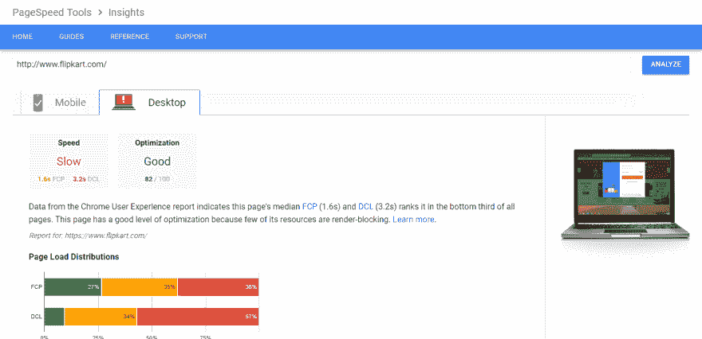
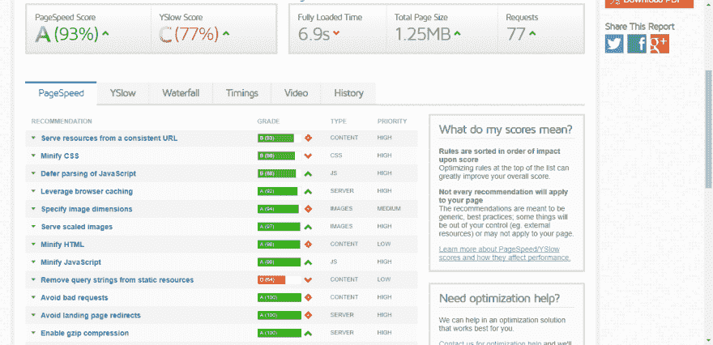
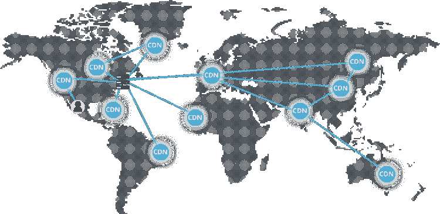

# #为 Magento 电子商务商店选择 CDN 之前需要了解的事项

> 原文:[https://dev . to/akashdeepsharma 337/things-to-know-before-select-a-cdn-for-magento-ecommerce-store-1a 85](https://dev.to/akashdeepsharma337/things-to-know-before-selecting-a-cdn-for-magento-ecommerce-store-1a85)

随着技术和全球互联网连接速度的进步，快速的网站加载时间已经成为电子商务商店客户转化的一个关键因素。不仅仅是终端用户，搜索引擎也希望网站能在 400 毫秒内加载(这实际上是一眨眼的时间)。随着 4g 蜂窝网络在大多数国家可用，页面加载速度不再受最终用户的互联网连接速度影响。这完全取决于网站的优化程度和支持网站的服务器基础设施。
根据 Akamai 和 Gomez 的数据，47%的消费者希望网页在 2 秒或更短的时间内加载，而 40%的消费者会放弃加载时间超过 3 秒的网站。
像 GTMetrix、Google Page Speed Insights 和 Pingdom 这样的网络应用程序旨在帮助用户跟踪阻碍页面加载速度的原因并修复它。

*谷歌页面速度洞察:*

*gt metrix:*

这样的工具可以帮助你优化所有影响 Magento 网站加载速度的重要方面。然而，如果你想把它推向下一个层次，你需要为你的 Magento 商店建立一个 CDN(内容交付网络)。

## 什么是 CDN，它们是如何工作的？

Magento 商店的速度很大程度上取决于保存网站数据的虚拟主机以及主机提供商向网站访问者提供数据的位置。比方说，你的 Magento 电子商务网站由 Godaddy 托管，而 go daddy 的数据中心位于北美。如果一个来自北美的用户访问你的商店，你的网站在加载速度上会表现得很好，因为用户离数据源很近。
但是，如果用户从印度访问您的电子商务商店，由于源和目标之间的距离，网站将运行缓慢。
为了克服这种不一致性，并在网站速度方面提供最佳体验，商家利用了 CDN。

### CDN 工作原理:

CDN 服务提供商向您收取维护全球服务器基础设施的费用，并在每个节点(也称为边缘服务器)上放置网站静态内容的缓存版本。
缓存内容可以包括图像、CSS/JS 文件和其他消耗大部分页面加载时间的结构组件。当消费者打开您的网站时，这些内容将从距离用户地理位置最近的 CDN 节点加载。随着数据传输时间的减少，页面加载时间大大减少。

*距离用户最近的地理 CDN 节点，获取页面加载速度更快:*

由于基于 Magento 的电子商务商店拥有大量产品、变体、描述等，加载所有这些静态内容所需的时间可能会很长，这取决于网站上产品和页面的数量。
通过利用分布在全球各地的服务器，通过离消费者最近的 CDN 交付这些静态内容，商家可以提供卓越的客户体验。

## 在 Magento 电子商务网站上使用 CDN 的利弊:

为什么您应该使用 CDN:
1)由于您的 CDN 将使用缓存数据提供静态内容，您的源服务器的带宽使用将会减少很多。这对于使用像 Amazon EC2 这样基于类似因素收费的托管解决方案的客户来说非常有用。
2)借助 CDN，您可以将页面加载速度降低至少 50-60%
3)由于大部分内容分散在 CDN 服务器上，您网站上的数据负载将会减少，因此您网站因高磁盘利用率而出现故障的几率会降低。快速的网站速度会提升你的网站在搜索引擎中的排名，因为搜索引擎也会考虑速度和性能。

为什么可以忽略 CDN:
1)您的目标受众与您的服务器数据中心位于同一地理位置。
2)您的网站上没有很多产品和多种变化会增加静态文件的大小。
3)你的网站正处于开发阶段，你会定期更新网站。这将意味着你必须定期用 CDN 缓存清除你的更改。你不想要一个额外的层，因为它会使你的网站下降。如果 CDN 节点出现故障，将会影响网站的可见性。

## Magento 的 5 大最佳 CDN 解决方案

注意，这个列表没有对 CDN 进行排序。所有这 5 个 CDN 都是业务中最好的，消费者可以根据他们的业务需求选择一个。

#### 1)亚马逊云锋

具有丰富配置能力和全球影响力的高性价比和高质量服务。
优点:
第一年免费
价格合理
大量配置选项
提供高级设置【Magento 1.x 提供免费扩展

缺点:
维护和支持的额外成本
定价很棘手，因为它是基于使用的【Magento 2 没有免费扩展

#### 2)CDN.net

适合小型企业的基本 CDN，功能有限。
优点:
低价
免费试用
高达 80 POP 的
低于 50 毫秒的延迟

缺点:
非常有限的功能
有限的配置能力
支持有时会不足
延迟会因地区而异

#### 3)谷歌云 CDN

凭借谷歌卓越的基础设施和低廉的定价模式，成为同类产品中的佼佼者。
优点:
全球优质服务
免费 SSL/TLS 证书
适用于所有节点的单一 IP
易于使用
物超所值

反对:Magento 没有扩展

#### 4) MaxCDN

一个很好的初始 CDN，它没有在所有地点都有数据中心，但在美国和英国仍然非常快。
优点:
设置简单
物超所值
实时报道
优质技术支持

缺点:
亚洲地区需要额外费用
没有免费试用
没有专门的 Magento 扩展

#### 5) Cloudflare

Cloudflare 提供了一个出色的免费计划，包含大量功能和一些有价值的附加功能。
优点:免费计划可用
功能丰富
在许多地方质量优越
高度安全——阻止 ddos 攻击
用户友好且易于设置
免费 Magento 扩展

反对意见:
美国和英国地区的平均速度

#### 底线

没有硬性规定强迫 Magento 店主使用 CDN 系统，事实上，如果你是一个在本地服务的店主，并且使用一个有本地数据中心的服务器，那么使用 CDN 就没有意义。然而，如果你的网络商店处理大量的流量，并提供尽可能好的客户体验是你的座右铭，那么 CDN 应该是你的 Magento 商店优化策略的重要组成部分。
[https://www.brihaspatitech.com/](https://www.brihaspatitech.com/)