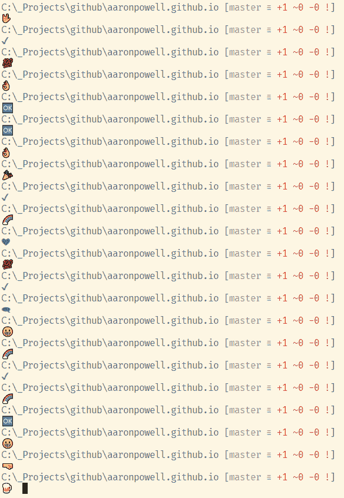

# 快乐的 PowerShell 提示符

> 原文：<https://dev.to/azure/the-happy-powershell-prompt-2l4f>

最近，没有什么特别好的理由，我决定对我的 PowerShell 提示符进行修改，创建一个我称之为快乐的 PowerShell 提示符。

[T2】](https://res.cloudinary.com/practicaldev/image/fetch/s--r_BKXtbs--/c_limit%2Cf_auto%2Cfl_progressive%2Cq_auto%2Cw_880/https://www.aaron-powell.cimg/happy-powershell-prompt.PNG)

您知道您可以像这样定制 PowerShell 提示符吗？事实证明，这其实很简单，PowerShell 有一堆内置函数，您可以覆盖这些函数来更改操作，其中一个这样的函数是`function:\prompt`，覆盖它将覆盖您的提示！

首先，在我们拆开任何东西之前，也许我们应该看看我们目前看到的，最简单的方法是用`Get-Content` :

```
PS  C:\>  Get-Content  function:\prompt 
```

Enter fullscreen mode Exit fullscreen mode

这应该会返回如下内容:

```
"PS $($executionContext.SessionState.Path.CurrentLocation)$('>'  *  ($nestedPromptLevel  +  1)) ";  # .Link  # http://go.microsoft.com/fwlink/?LinkID=225750  # .ExternalHelp System.Management.Automation.dll-help.xml 
```

Enter fullscreen mode Exit fullscreen mode

现在，第一行显然是重要的东西，这就是你的提示如何工作。您将会看到这是一个插值字符串，它包含`PS`，后跟当前路径和您所在的嵌套 PowerShell 会话的数量(老实说，在我开始阅读关于`Host.EnterNestedPrompt`的内容之前，我并不知道它是什么)，在这里我就不赘述了。

好了，现在我们可以开始使用它了:

```
PS  C:\>  $prompt  =  {  "Aaron Rocks $($executionContext.SessionState.Path.CurrentLocation)$('>'  *  ($nestedPromptLevel  +  1)) "  }  PS  C:\>  Set-Item  -Path  function:\prompt  -Value  $prompt 
```

Enter fullscreen mode Exit fullscreen mode

首先，您需要定义一个包含您的新提示值的脚本博客，然后我们使用`Set-Item`来设置`function:\prompt`的值。

哒哒！你现在得到了一个提示，告诉你一些重要的事情，我摇滚！

但不幸的是，这只适用于当前的 PowerShell 会话，我们想要一些持久的东西。是时候打开您的 PowerShell 档案了。您需要做的第一件事是确定您是否有 PowerShell 配置文件:

```
Aaron  Rocks  C:\>  Test-Path  $profile  False  Aaron  Rocks  C:\>  New-Item  -Path  $profile  -ItemType  File  -Force  Aaron  Rocks  C:\>  $profile  C:\Users\ContainerAdministrator\Documents\WindowsPowerShell\Microsoft.PowerShell_profile.ps1 
```

Enter fullscreen mode Exit fullscreen mode

所以在这里我发现这个概要文件并不存在，所以我们在你的`%USERPROFILE%\Documents\WindowsPowerShell`文件夹中创建了一个新的(我在 Docker 容器中做这个，因为，为什么不呢😝).

现在从上面抓取你的代码，粘贴进去并启动一个新的 PowerShell 会话，你的配置文件被应用，你将永远看到我摇滚！

## 发出愉快的提示

好吧，也许一个提示告诉你`Aaron Rocks`并不适用于所有人，让我们看看如何从上面创建快乐的 PowerShell 提示。

为此，我有三件事要做:

1.  我显示当前路径
2.  如果我在一个有 git repo 的文件夹中，我会显示 git repo 状态
3.  展示一些积极的东西

我们知道如何获取当前路径，这很简单，git 信息呢？为此，我使用了优秀的 [Posh-Git](https://github.com/dahlbyk/posh-git) 模块，如果你在 Windows 上使用 Git 而不使用 Posh-Git，你会错过这个模块。事实上，Posh-Git 无论如何都会希望为您修改提示，但不幸的是，它与我将要做的事情不太合拍，因此，我将手动调用它。

首先，我需要知道我是否在磁盘上的 git repo 中，为了做到这一点，我将假设如果在当前文件夹中有一个`.git` repo，或者它的任何父文件夹，我在 git repo 中。为此，我将创建两个函数，一个导入 Posh-Git，另一个检查`.git`文件夹:

```
$gitLoaded  =  $false  function  Import-Git($Loaded){  if($Loaded)  {  return  }  Import-Module  Posh-Git  >  $null  return  $true  }  function  IsGitRepo($Path)  {  if  (Test-Path  -Path  (Join-Path  $Path  '.git')  )  {  $gitLoaded  =  Import-Git  $gitLoaded  Write-VcsStatus  return  }  $SplitPath  =  split-path  $path  if  ($SplitPath)  {  IsGitRepo($SplitPath)  }  } 
```

Enter fullscreen mode Exit fullscreen mode

我还跟踪一个变量，即我是否已经加载了 Posh-Git，这样我就不会多次加载它。现在你会注意到在我称为`Write-VscStatus`的`IsGitRepo`函数内部。这是由 Posh-Get 提供的一个函数，它会输出状态，就像你在上面我的路径中看到的当前位置，所以一切都很好，我们正在获得我们的 git 状态！

最后，我将创建一个快乐表情数组，使用`Get-Random` PowerShell 函数选择一个表情，然后将其添加到我的提示中。下面是它的样子:

```
[ScriptBlock]$Prompt  =  {  $host.UI.RawUI.WindowTitle  =  Microsoft.PowerShell.Management\Split-Path  $pwd.ProviderPath  -Leaf  $Host.UI.RawUI.ForegroundColor  =  "White"  Microsoft.PowerShell.Utility\Write-Host  $pwd.ProviderPath  -NoNewLine  -ForegroundColor  Green  checkGit($pwd.ProviderPath)  $happyPrompts  =  @('🍺';  '😀';  '🤜';  '🎉';  '🤟';  '✔';  '👌';  '🌈';  '❤';  '💯';  '🆗';  '🗨';)  $prompt  =  $happyPrompts[(Get-Random  -min  0  -max  ($happyPrompts.Length))]  Microsoft.PowerShell.Utility\Write-Host  "`n$prompt "  -NoNewLine  -ForegroundColor  "DarkGray"  return  " "  }  Set-Item  -Path  function:\prompt  -Value  $Prompt  -Options  ReadOnly 
```

Enter fullscreen mode Exit fullscreen mode

为了换行，我在表情符号前插入了一个 **`n** 。

这就是你自己的快乐提示。

提醒一句——如果你让你的提示符太复杂，并在其中运行命令，你可以减慢你的 shell，记住这每次都执行。此外，小心不要违反退出代码😉。