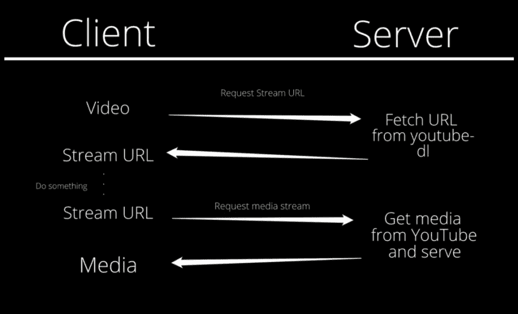

# 用烧瓶品尝流媒体的滋味

> 原文:[https://dev . to/singhpratyush/the-taste-of-media-streaming-with flask-58 a4](https://dev.to/singhpratyush/the-taste-of-media-streaming-with-flask-58a4)

[T2】](https://res.cloudinary.com/practicaldev/image/fetch/s--MiOO3KrG--/c_limit%2Cf_auto%2Cfl_progressive%2Cq_auto%2Cw_880/https://cdn-images-1.medium.com/max/800/1%2ALUOeruyHbP5I-syqgozJHg.png)

###### 照片由[奥斯丁·尼尔](https://unsplash.com/photos/oI3Vb4Q_Nl0?utm_source=unsplash&utm_medium=referral&utm_content=creditCopyText)在 [Unsplash](https://unsplash.com/search/photos/streaming?utm_source=unsplash&utm_medium=referral&utm_content=creditCopyText) 上拍摄(已编辑)

AnyAudio 是我在工程专业第二年和朋友一起开始的一个业余爱好项目。到目前为止，它由一个 [API 服务器](https://api.anyaudio.in/)(它也提供媒体服务😅)，一个基于 [react 的 PWA](https://web.anyaudio.in/) (至少这是我正在努力做的)和一个 [Android 应用](https://github.com/anyaudio/anyaudio-android-app)。有一个 Github 组织专门负责项目的不同部分。

在这篇博文中，我将讨论我们的流 API 是如何变得足够适合日常使用的。

## 但是你从哪里得到媒体呢？

> "你在哪里可以找到你听过的每首歌的每一个版本？"

简单， [YouTube](https://www.youtube.com/) ！

YouTube 托管了所有曾经存在过的歌曲，并将继续这样做。不仅如此，它还拥有多种音频格式和比特率。更不用说它提供的搜索结果的准确性了。

牢记这些事情，我们决定使用 YouTube 作为一切的数据源——搜索结果、播放列表、媒体、自动完成等等。

大部分内容来自 youtube，但为了获取视频的音频 URL，我们使用了 [youtube-dl](https://rg3.github.io/youtube-dl/) (一个从 YouTube 和[许多其他网站](https://rg3.github.io/youtube-dl/supportedsites.html)下载视频的命令行工具)。

## 请求串流的流程

为了流式传输音频，客户端需要遵循以下请求流程—

1.  获取它想要播放的音频的详细信息。到目前为止，有两种方法可以做到这一点——使用搜索和从预定义的播放列表。
2.  一旦客户机获得了音频的细节，它就向服务器请求`stream_url`(当需要时)。
3.  然后，er 用一个 URL 进行响应，客户端可以通过这个 URL 发出请求，以获得实际的音频。这是它可以嵌入在`<audio../>`标签或者 [`ExoPlayer`](https://github.com/google/ExoPlayer) 源中的网址，直接播放歌曲。它再次由 AnyAudio 服务器提供服务。
4.  服务器充当中间人，将数据从 YouTube 重定向到客户端。

[T2】](https://res.cloudinary.com/practicaldev/image/fetch/s--CeBN2If---/c_limit%2Cf_auto%2Cfl_progressive%2Cq_auto%2Cw_880/https://cdn-images-1.medium.com/max/1000/1%2AS4Xo9pANvr6QNUHHcC6Fng.jpeg)

您首先想到的可能是**“为什么客户端需要发出额外的请求来获取实际的流 URL？”**

这是因为找出实际的媒体 URL 是一个耗时的过程。获取 YouTube 视频的资源位置需要相当长的时间。为搜索结果或播放列表中的每个媒体提前获取它将是 UX 的一大难题。因此，我们决定根据客户的需求来生成它。

* * *

这就是我们如何让流 API 工作的。但是为了让它变得可用，我们必须做很多改进。

## 兄弟，你真的在找吗？

在流 API 中提供了最终 URL 的 API。但是当使用这个 URL 作为源时，结果播放器是不可搜索的。这种行为对于媒体播放网站来说是不可接受的。

在互联网上寻找解决方案后(比如这个 [stackoverflow 问题](https://stackoverflow.com/questions/35751736/seeking-in-html5-video-with-chrome)，我发现[部分内容](https://developer.mozilla.org/en-US/docs/Web/HTTP/Status/206)支持对于创建可搜索的媒体元素是必要的。

为了让客户端知道服务器支持部分内容，服务器需要在响应中添加以下报头—

```
"Accept-Ranges": "bytes" 
```

<svg width="20px" height="20px" viewBox="0 0 24 24" class="highlight-action crayons-icon highlight-action--fullscreen-on"><title>Enter fullscreen mode</title></svg> <svg width="20px" height="20px" viewBox="0 0 24 24" class="highlight-action crayons-icon highlight-action--fullscreen-off"><title>Exit fullscreen mode</title></svg>

这意味着服务器能够提供部分内容，指定为一个字节范围。

要将这个标题添加到响应中，可以使用下面的修饰—

```
@app.after_request
def after_request(response):
    response.headers.add('Accept-Ranges', 'bytes')
    return response 
```

<svg width="20px" height="20px" viewBox="0 0 24 24" class="highlight-action crayons-icon highlight-action--fullscreen-on"><title>Enter fullscreen mode</title></svg> <svg width="20px" height="20px" viewBox="0 0 24 24" class="highlight-action crayons-icon highlight-action--fullscreen-off"><title>Exit fullscreen mode</title></svg>

此后，客户端将知道服务器支持部分内容。并且它们将开始发送请求报头，提及它们想要的数据的字节范围。它看起来像这样—

```
Range: bytes=0-1023 
```

<svg width="20px" height="20px" viewBox="0 0 24 24" class="highlight-action crayons-icon highlight-action--fullscreen-on"><title>Enter fullscreen mode</title></svg> <svg width="20px" height="20px" viewBox="0 0 24 24" class="highlight-action crayons-icon highlight-action--fullscreen-off"><title>Exit fullscreen mode</title></svg>

因此，我们现在必须在收到请求时只提供媒体文件的这一部分。在烧瓶中，这可以很容易地如下完成—

```
r = requests.get(url)
range_header = request.headers.get('Range', None)
if range_header:  # Client has requested for partial content
  size = int(r.headers.get('content-length'))  # Actual size of song 
  # Look up for ranges
  m = re.search('(\d+)-(\d*)', range_header)
  g = m.groups()
  byte1, byte2 = 0, None
  if g[0]:
    byte1 = int(g[0])
  if g[1]:
    byte2 = int(g[1])
  length = size - byte1
  if byte2:
    length = byte2 + 1 - byte1
  data = r.content[byte1: byte2]  # Trim the data from server 
  # Prepare response
  rv = Response(data, 206, mimetype=mime, direct_passthrough=True)
  rv.headers.add('Content-Range', 'bytes {0}-{1}/{2}'.format(byte1, byte1 + length - 1, size))
  return rv

# No partial content, handle normally 
```

<svg width="20px" height="20px" viewBox="0 0 24 24" class="highlight-action crayons-icon highlight-action--fullscreen-on"><title>Enter fullscreen mode</title></svg> <svg width="20px" height="20px" viewBox="0 0 24 24" class="highlight-action crayons-icon highlight-action--fullscreen-off"><title>Exit fullscreen mode</title></svg>

在这之后，seekbar 就可以工作了，用户可以去播放音频的任何位置。

## 长歌的问题

[T2】](https://res.cloudinary.com/practicaldev/image/fetch/s---rvSahj2--/c_limit%2Cf_auto%2Cfl_progressive%2Cq_auto%2Cw_880/https://cdn-images-1.medium.com/max/1000/1%2ADeoeucAOAiqayDcCL8X6tg.png)

AnyAudio 上的流媒体音频体验比以前更好了。但是这里有一个问题。对于向服务器发出的每个媒体请求，首先要做的是从 YouTube 服务器获取媒体(参见上面代码中的第 1 行)。在此之后，媒体的固定部分作为响应被发送给客户端。

YouTube 上的冗长歌曲，如点唱机和音乐汇编，仅音频文件就很大。考虑到媒体播放器对每次搜索都有一个后端请求的事实，听长音频会花费很长时间。

解决这个问题的方法很简单——只问你需要什么。

## 只要求你所需要的

早些时候，向服务器发出的每个媒体请求都会导致在提供任何音频之前从 YouTube 下载整个音频。这个问题是由—

限制服务器为每个流请求提供的媒体的大小。
从 YouTube 请求部分内容。
文件大小的限制有助于限制将从 YouTube 请求的数据量，因此，我们将拥有比以前更具确定性的流时间。这里有一段代码解释了这个过程——

```
range_header = request.headers.get('Range', None)
    if range_header:
        from_bytes, until_bytes = range_header.replace('bytes=', '').split('-')
        if not until_bytes:  # No until bytes is set, set it to start + 3MB
            until_bytes = int(from_bytes) + int(1024 * 1024 * 3)  # 1MB * 3 = 3MB 
        # Get only what required from YouTube
        headers = {'Range': 'bytes=%s-%s' % (from_bytes, until_bytes)}
        r = requests.get(url, headers=headers)
        data = r.content

        # Generate response
        rv = Response(data, 206, mimetype=mime, direct_passthrough=True)
        rv.headers.add('Content-Range', r.headers.get('Content-Range'))
        return rv 
```

<svg width="20px" height="20px" viewBox="0 0 24 24" class="highlight-action crayons-icon highlight-action--fullscreen-on"><title>Enter fullscreen mode</title></svg> <svg width="20px" height="20px" viewBox="0 0 24 24" class="highlight-action crayons-icon highlight-action--fullscreen-off"><title>Exit fullscreen mode</title></svg>

通过将`Range`头与对 YouTube 的请求放在一起，服务器在提供给客户端之前需要下载的数据量变少了。

## 更进一步—连接流

有了这个改变，流媒体比以前好了很多。但是这仍然不是人们期望从媒体流服务中得到的最佳性能。

除非服务器已经从 YouTube 下载了部分数据，并且已经准备好并发送了响应，否则客户端不会收到服务器的响应。这可以通过将 YouTube 上的内容直接传输给用户来改善。简而言之，通过将来自 YouTube 的数据流连接到客户端期待回复的连接。

要在`requests`中启用流，我们可以在发出请求时简单地添加`stream=True`参数。结合 [Flask 的流能力](http://flask.pocoo.org/docs/0.12/patterns/streaming/)，我们可以立即开始向客户端提供数据，而无需等待一些请求完成。这里有一个大概的例子来说明这是如何工作的—

```
 def generate_data_from_response(resp, chunk=2048):
    for data_chunk in resp.iter_content(chunk_size=chunk):
        yield data_chunk

def serve_partial(url, range_header, mime, size=3145728):
    from_bytes, until_bytes = range_header.replace('bytes=', '').split('-')
    if not until_bytes:
        until_bytes = int(from_bytes) + size  # Default size is 3MB 
    # Make request to YouTube
    headers = {'Range': 'bytes=%s-%s' % (from_bytes, until_bytes)}
    r = requests.get(url, headers=headers, stream=True)

    # Build response
    rv = Response(generate_data_from_response(r), 206, mimetype=mime,
                  direct_passthrough=True)
    rv.headers.add('Content-Range', r.headers.get('Content-Range'))
    rv.headers.add('Content-Length', r.headers['Content-Length'])
    return rv 
```

<svg width="20px" height="20px" viewBox="0 0 24 24" class="highlight-action crayons-icon highlight-action--fullscreen-on"><title>Enter fullscreen mode</title></svg> <svg width="20px" height="20px" viewBox="0 0 24 24" class="highlight-action crayons-icon highlight-action--fullscreen-off"><title>Exit fullscreen mode</title></svg>

这导致在具有平均客户端速度的双核服务器上，首字节时间(`TTFB`)值约为 400 毫秒。虽然这与同一客户端向 YouTube 发出的请求(大约 15 毫秒)相比不可同日而语，但对于一个拥有廉价服务器的业余爱好项目来说，这是一项成就。

## 我们下一步的计划是什么？

截至目前，很难在 AnyAudio 投入时间。但是我们真的很期待将 API v3 引入服务器，它允许更直接的请求和播放列表支持。这意味着用户可以在网络应用上收听完整的 YouTube 播放列表。

我们还计划改进 web 应用程序上的建议。截至目前，它只是与当前正在播放的歌曲相关。但相反，如果考虑到读者的收听习惯、搜索查询、歌曲与用户建议相遇的频率等等，它会好得多。

整合这将需要用户在平台上创建一个帐户，我们不希望包括在内，因为我们只是希望该平台尽可能无麻烦。为此，我们计划只使用浏览器的本地存储。附加功能包括保存歌曲，并在用户需要时随时收听。离线倾听也是我们希望整合的东西，一旦它被证明是一个好的 PWA。

## 临别赠言

我从这个项目中学到了很多，并希望学到更多。如果你能顺便来看看我们的 [GitHub 库](https://github.com/anyaudio/)，我们会很高兴。如果你是一名开发人员，并且喜欢修复一些肮脏的代码和引入令人敬畏的测试用例，请随时通过我们的 [Gitter 频道](https://gitter.im/Any-Audio/)与我们联系。

### 所以，现在就去[安音频](https://web.anyaudio.in/)听歌吧。请让我们知道你的观点，并继续关注。