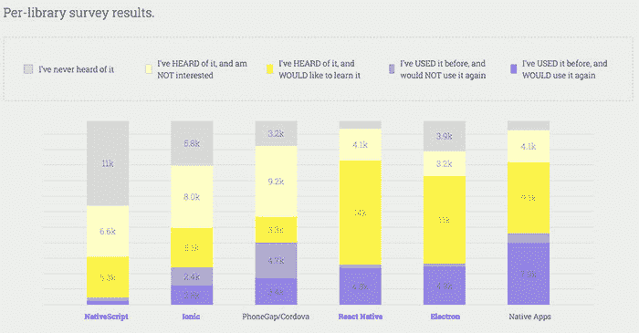

# 混淆视听的许可

> 原文:[https://dev.to/remotesynth/a-license-to-confuse-fk8](https://dev.to/remotesynth/a-license-to-confuse-fk8)

*本文最初发表于[我的博客](https://www.remotesynthesis.com/blog/license-to-confuse)T3*

不久前，我写了一篇文章，建议[开发者需要开始关注许可证](https://www.remotesynthesis.com/blog/developers-and-licenses)。这在某种程度上受到了整个[反应许可纠纷](https://heathermeeker.com/2017/08/19/open-source-community-over-reacts-to-x-rated-code/)的启发。

关于那场争议，启发我的不是 React 许可证本身的细节(它是一个 [BSD + patents](https://dev.toBSD+Patent) 许可证的版本),而是这个许可证自 2014 年 10 月以来一直由 React 库使用的事实——在该库从 Apache v2 许可证转移到争议曝光之前近 3 年。有报道称，由于这一争议，大型企业希望将 React 从复杂的应用程序中剥离出来，这可能是一个巨大而昂贵的努力，因为一个问题本来是可以避免的。

现在，你可以说这被严重夸大了(还有什么新的吗？)并且脸书已经通过转向非常自由的麻省理工学院许可纠正了这一点。然而，我的好奇心更多的是“怎么过了 3 年才有人注意到？”

## 那么为什么又提起这件事呢？

最近，我被邀请在今年六月圣何塞的流畅会议上就这个话题发表演讲。我为我的演讲做了一点初步研究，并意识到 React Native 仍然在使用同样有争议的 BSD +专利许可证。

事实上，我对 9 月 25 日之前的 [React 许可和专利](https://raw.githubusercontent.com/facebook/react/bef45b0b1a98ea9b472ba664d955a039cf2f8068/LICENSE)和[当前 React 本地许可](https://raw.githubusercontent.com/facebook/react-native/master/LICENSE)以及专利授权进行了比较，它们是相同的。唯一的区别是软件的名字和版权的年份。

然而，似乎没有任何对许可证的愤怒。事实上，根据 JavaScript 调查结果的[状态，超过 4.8k 的开发者已经使用了 React Native 并计划再次使用它，另有 14k 的受访者希望学习和使用它。](https://stateofjs.com/2017/mobile/results)

[T2】](https://res.cloudinary.com/practicaldev/image/fetch/s--MHKxAvYo--/c_limit%2Cf_auto%2Cfl_progressive%2Cq_auto%2Cw_880/https://thepracticaldev.s3.amazonaws.com/i/44i1nye1uzf6vzx6yysx.jpg)

并不是说*没人*注意到。例如，Paul Chong 在 Medium 的一篇[帖子中提出了这个问题。一些人提出了一个](https://medium.com/@paulhyunchong/react-native-is-not-under-the-mit-license-54308f8b26ed) [GitHub 问题，这个问题已经被关闭](https://github.com/facebook/react-native/issues/16079)，没有迹象表明即将发生变化。但是如果关于 React 的争论是有根据的，为什么不在 React Native 上争论呢？

> 完全披露:我为 Progress Software 工作，他们创建了与 React Native 竞争的 NativeScript 项目。然而，我想声明，我在这里不是讨论许可证或项目本身的优点，只是社区反应的不一致说明了普遍缺乏对许可证的认识。

## 我的理论

我有一些潜在的理论。

1.  大多数开发者意识到最初的争议被严重夸大了，并调整了他们的预期。这似乎不太可能。最初的争议并没有平息，直到 React 改变了它的许可证。当时推动使用 BSD +专利的解释几乎没有平息愤怒，即使它可能被夸大了，甚至是不值得的。
2.  大多数开发者或企业对移动框架的期望与 web 框架不同。老实说，这毫无意义。无论是否合理，关于其宽泛的专利撤销条款的争论(原因在于 Apache 的[类别 x](https://www.apache.org/legal/resolved.html#category-x) )将同样适用于移动应用和网络应用。
3.  大多数开发人员并不知道 React 的许可不同，只是简单地认为它们是一样的。是的，我的钱在这上面。

我在自己的工作经验中和整个行业中都见过这种情况，因为它与双许可软件有关。很多时候，开发者(和许多公司)仍然不知道与开源版本的使用相关的各种规定，并简单地假设开源= = =免费。在这种情况下，软件不是双重许可的，但是对于开发人员来说，假设 React 是 MIT 许可的(假设开发人员甚至知道 React 许可)，那么 React Native 也是许可的，这并不是不合逻辑的...那为什么还要看执照呢？

我并不是说在这种特定的情况下，它可能会让你的公司陷入潜在的麻烦——同样，我也不是在这里争论这种特定许可证的优点。然而，正是这种*类型*的情况——作为开发人员，我们采用了我们不知道其许可的工具——可能会导致问题。

随着我继续为六月份的演讲做准备，我希望能更深入地了解整个过程。我很乐意听到你的想法和反馈来指导我准备。