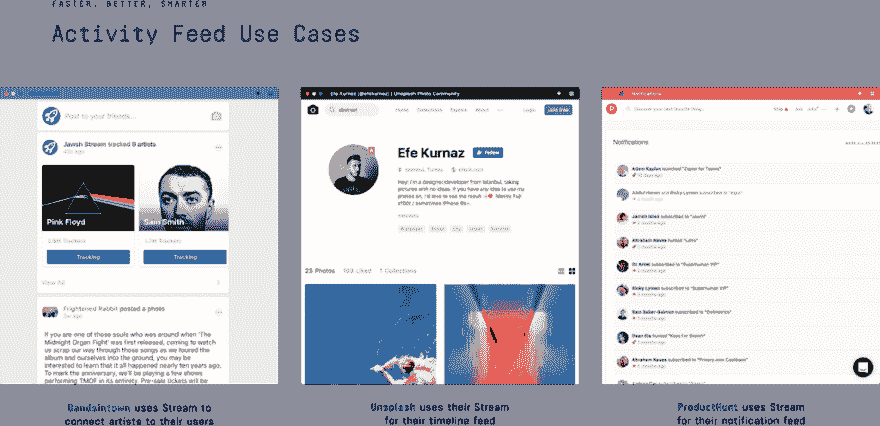
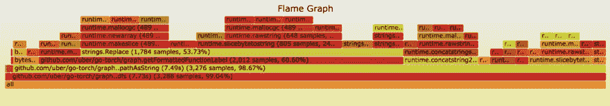
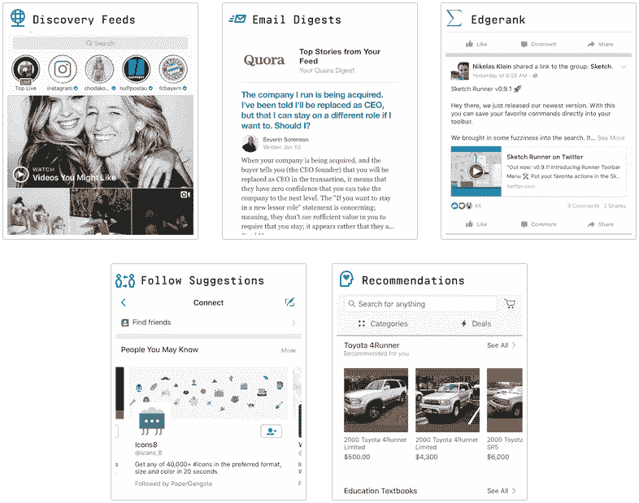
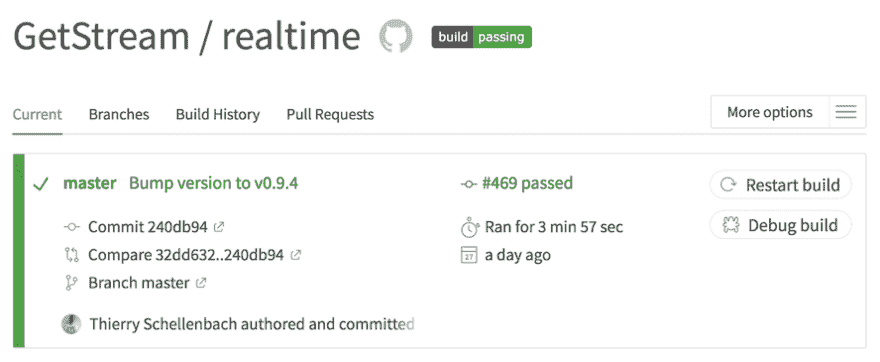
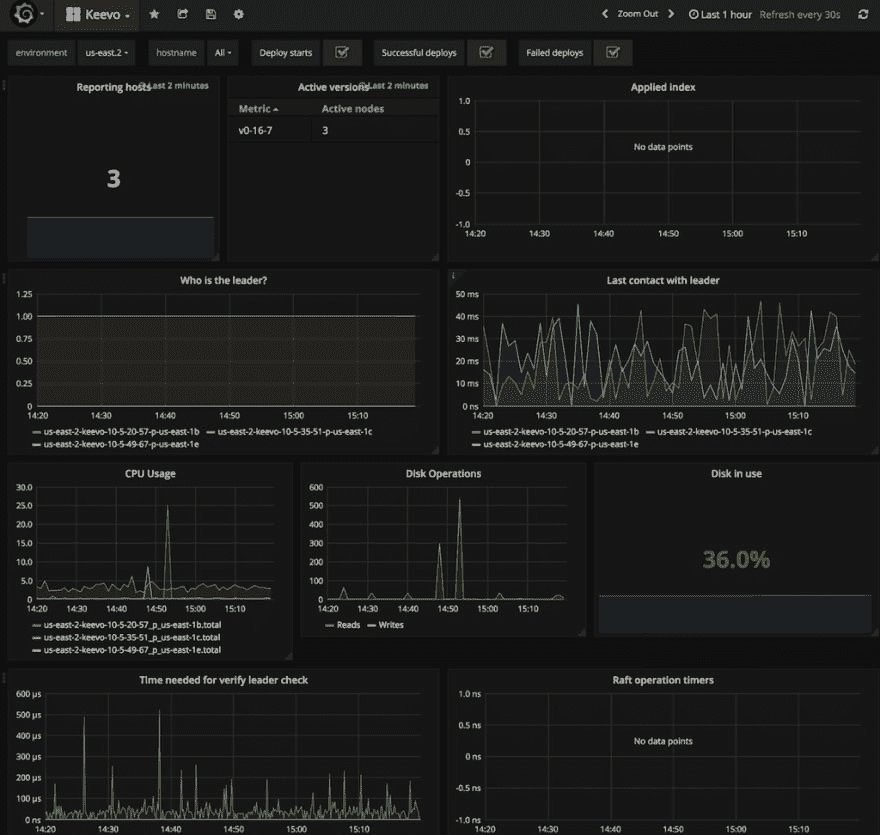

# Stream & Go:面向超过 3 亿最终用户的新闻源

> 原文:[面向 3 亿多终端用户的 https://dev.to/getstream_io/stream 新闻频道 55ni](https://dev.to/getstream_io/stream--go-news-feeds-for-over-300-million-end-users-55ni)

[T2】](https://res.cloudinary.com/practicaldev/image/fetch/s--G60-N0vm--/c_limit%2Cf_auto%2Cfl_progressive%2Cq_auto%2Cw_880/https://cdn-images-1.medium.com/max/690/1%2AhlWxQRXVUz4GJysQCV4F9Q.png)

[**Stream**](https://getstream.io/) 是一个 API，可以让开发者构建新闻提要和活动流( [**试试 API**](https://getstream.io/try-the-api/) )。超过 500 家公司使用我们的产品，为超过 3 亿最终用户提供信息。诸如 Product Hunt、 [**、安德玛**](https://stackshare.io/under-armour/connected-fitness) 、Powerschool、[**bands town**](https://stackshare.io/bandsintown/bandsintown)、[**dubssmash**](https://stackshare.io/dubsmash/dubsmash-scaling-to-200-million-users-with-3-engineers)、Compass and Fabric(谷歌)等公司都依赖于 Stream 来为其新闻源提供动力。除了 API，Stream 的创始人还编写了最广泛使用的 [**开源解决方案，用于构建可扩展的提要**](https://github.com/tschellenbach/stream-framework) 。

以下是 Stream 今天的样子:

*   服务器数量:180
*   每月更新 340 亿次
*   平均 API 响应时间:12 毫秒
*   平均实时响应时间:2 毫秒
*   地区:4 个(美国东部、EU-西部、东京和新加坡)
*   每月 1B API 请求数(约 20k/分钟)

鉴于我们的大多数客户是工程师，我们经常谈论我们的堆栈。这是一个高层次的概述:

1.  [**Go**](https://stackshare.io/go) 是我们主要的编程语言。
2.  我们使用基于[**RocksDB**](https://stackshare.io/rocksdb)+[+**Raft**](https://raft.github.io/)构建的定制解决方案作为我们的主数据库(我们从 [**Cassandra**](https://stackshare.io/cassandra) 开始，但希望对性能有更多的控制)。 [**PostgreSQL**](https://stackshare.io/postgresql) 存储配置、API 密钥等。
3.  [**OpenTracing**](https://stackshare.io/opentracing) 和[**Jaeger**](https://stackshare.io/jaeger)handle tracing， [**StatsD**](https://stackshare.io/statsd) 和 [**Grafana**](https://stackshare.io/grafana) 提供详细的监控，我们使用 [**麋鹿**](https://www.elastic.co/products) 栈进行集中日志记录。
4.  [**Python**](https://stackshare.io/python) 是我们机器学习的首选语言，devops 和我们的网站[**https://getstream . io**](https://getstream.io/)([**Django**](https://stackshare.io/django)，[**DRF**](https://stackshare.io/django-rest-framework)&[**React**](https://stackshare.io/react))。
5.  Stream 结合使用了**写扇出**和**读扇出**。当用户打开他们的提要时，这会产生快速的读取性能，当著名用户发布更新时，也会产生快速的传播时间。

[**托马索·巴尔古利**](https://twitter.com/tommasobarbugli) 和我( [**@tschellenbach**](https://twitter.com/tschellenbach) )是近 3 年前开始流的开发者。我们在阿姆斯特丹成立了公司，参加了 2015 年纽约 Techstars，并于 2016 年在科罗拉多州博尔德开设了办事处。在相当短的时间内，这是一次相当疯狂的旅程！超过 15 名开发人员和许多支持角色，包括销售和市场营销，与早期相比，这个团队感觉非常庞大。

### 挑战:新闻提要&活动流

关注关系的本质使得扩展提要变得很困难。你们大多数人都会记得脸书的长加载时间、Twitter 的 fail whale 或者 Tumblr 的技术债务年。提要很难扩展，因为没有明确的方法来分割数据。关注关系将每个人和其他人联系起来。这使得在多台机器上分割数据变得困难。如果你想了解更多关于这个问题的信息，请查阅以下文件:

*   [**Twitter 的技术回到拥有 1.5 亿活跃用户的日子**](http://highscalability.com/blog/2013/7/8/the-architecture-twitter-uses-to-deal-with-150m-active-users.html)
*   [**LinkedIn 的排名提要**](https://engineering.linkedin.com/blog/2016/03/followfeed--linkedin-s-feed-made-faster-and-smarter)
*   [**雅虎/普林斯顿研究论文**](http://jeffterrace.com/docs/feeding-frenzy-sigmod10-web.pdf)

在很高的层面上，有 3 种不同的方式来扩展您的订阅源:

1.  写入时扇出:基本上预先计算所有内容。这很昂贵，但是很容易将数据分片。
2.  扇出-读取:很难扩展，但更实惠和新的活动出现得更快。
3.  以上两种方法的结合:更好的性能和减少的延迟，但增加了代码的复杂性。

Stream 结合使用写扇出和读扇出。这使我们能够有效地支持具有高度关联图形的客户，以及具有更稀疏数据集的客户。这很重要，因为我们的客户使用 Stream 的方式非常不同。看看这些截图来自[**bands town**](https://stackshare.io/bandsintown/bandsintown)、Unsplash、 [**产品狩猎**](https://stackshare.io/product-hunt/product-hunt) :

[T2】](https://res.cloudinary.com/practicaldev/image/fetch/s--o6qnIgeC--/c_limit%2Cf_auto%2Cfl_progressive%2Cq_auto%2Cw_880/https://cdn-images-1.medium.com/max/1024/1%2A0vgRcttdQVBKyzWfwNtSgg.png)

### 从 [Python](https://stackshare.io/python) 切换到[围棋](https://stackshare.io/go)

在多年优化我们现有的 feed 技术后，我们决定用 2.0 的 Stream 来实现更大的飞跃。虽然 Stream 的第一次迭代是由 Python 和 Cassandra 支持的，但对于我们基础设施的 Stream 2.0，我们 [**切换到 Go**](https://getstream.io/blog/switched-python-go/) 。我们从 Python 切换到 Go 的主要原因是性能。使用 Python 很难加速 Stream 的某些特性，如聚合、排序和序列化。

我们从 2017 年 3 月开始使用 Go，到目前为止这是一次很棒的体验。Go 大大提高了我们开发团队的生产力。它不仅提高了我们的开发速度，对于 Stream 的许多组件来说，它也快了 30 倍。

围棋的表现以积极的方式极大地影响了我们的建筑。使用 Python 时，我们经常发现自己纯粹出于性能原因而将逻辑委托给数据库层。Go 的高性能在架构方面给了我们更多的灵活性。这极大地简化了我们的基础架构，并显著改善了延迟。例如，我们看到 web 服务器数量减少了 10 比 1，这是由于相同数量的请求使用了更少的内存和 CPU。

最初，我们在 Go 的包管理方面有些困难。然而，使用 [**Dep**](https://github.com/golang/dep) 连同 [**VG 包**](https://github.com/getstream/vg) 有助于创建一个伟大的工作流。

[T2】](https://res.cloudinary.com/practicaldev/image/fetch/s--Tj9G88sY--/c_limit%2Cf_auto%2Cfl_progressive%2Cq_auto%2Cw_880/https://cdn-images-1.medium.com/max/434/1%2A3YtBsG5iw6brMTHvPA4ztQ.png)

如果你从未尝试过围棋，你会想试试这个在线巡回赛:

 **作为一门语言，围棋非常注重性能。内置的 [**PPROF**](https://golang.org/pkg/net/http/pprof/) 工具对于发现性能问题非常神奇。优步的 [**Go-Torch**](https://github.com/uber/go-torch) 库非常适合可视化 PPROF 中的数据，并将在 Go 1.10 中捆绑到 PPROF 中。

[T2】](https://res.cloudinary.com/practicaldev/image/fetch/s--dYuw-FAv--/c_limit%2Cf_auto%2Cfl_progressive%2Cq_auto%2Cw_880/https://cdn-images-1.medium.com/max/1000/1%2AuCWv4L8tYxlUsBjLPz2_Fw.png)

### 从卡珊德拉切换到[洛克 sDB](https://stackshare.io/rocksdb) &筏

1.0 的流杠杆 [**Cassandra**](https://stackshare.io/cassandra) 用于存储 feed。Cassandra 是构建提要的常见选择。例如，Instagram 开始时使用 [**Redis**](https://stackshare.io/redis) ，但最终 [**切换到 Cassandra**](https://www.datastax.com/dev/blog/facebooks-instagram-making-the-switch-to-cassandra-from-redis-a-75-insta-savings) 以应对其快速的使用增长。Cassandra 可以非常高效地处理繁重写入工作。

Cassandra 是一个很棒的工具，允许您通过添加更多节点来扩展写入容量，尽管它也非常复杂。这种复杂性使得很难诊断性能波动。尽管我们有多年运行 Cassandra 的经验，但感觉还是有点像黑箱。当构建 Stream 2.0 时，我们决定采用不同的方法，构建 Keevo。Keevo 是我们在 RocksDB、gRPC 和 Raft 基础上建立的内部键值商店。

[**RocksDB**](https://stackshare.io/rocksdb) 是由脸书的数据工程团队开发和维护的高性能嵌入式数据库库。RocksDB 最初是 Google 的 LevelDB 的一个分支，它为 SSD 引入了几项性能改进。现在 RocksDB 是一个独立的项目，正在积极开发中。它是用 C++写的，速度很快。看看这个 [**基准如何处理 700 万 QPS**](https://github.com/facebook/rocksdb/wiki/RocksDB-In-Memory-Workload-Performance-Benchmarks) 。就技术而言，它比 Cassandra 简单得多。这意味着维护开销减少，性能提高，最重要的是，性能更加一致。有趣的是 [**LinkedIn**](https://stackshare.io/linkedin/linkedin) 也使用 RocksDB 为 [**他们的 feed**](https://engineering.linkedin.com/blog/2016/03/followfeed--linkedin-s-feed-made-faster-and-smarter) 。

我们的基础架构托管在 [**AWS**](https://stackshare.io/amazon-ec2) 上，旨在承受整个可用性区域的中断。与 Cassandra 不同，Keevo clusters 将节点组织成领导者和追随者。当领导者(主)节点变得不可用时，同一部署中的其他节点将开始选举并挑选新的领导者。选举新领导人是一项快速操作，几乎不会影响实时流量。

为此，Keevo 使用 Hashicorp 的 Go 实现 来实现 Raft 一致性算法。这确保了 Keevo 中存储的每一位都存储在 3 个不同的服务器上，并且操作始终一致。这个网站很好地展示了 Raft 是如何工作的:【https://raft.github.io/】

 **[T2】](https://res.cloudinary.com/practicaldev/image/fetch/s--B7QtcpQV--/c_limit%2Cf_auto%2Cfl_progressive%2Cq_auto%2Cw_880/https://cdn-images-1.medium.com/max/965/1%2Al3C6o4EqveWRd5KImjf5gA.png)

### 不太微服

通过利用 Go 和 RocksDB，我们能够实现出色的提要性能。平均响应时间约为 12 毫秒。该架构介于整体架构和微服务之间。Stream 在以下 7 种服务上运行:

1.  [**流 API**](https://stackshare.io/stream/stream-api)
2.  [**基沃**T3】](https://stackshare.io/stream/keevo)
3.  [**实时&消防水管**T3】](https://stackshare.io/stream/realtime)
4.  [**分析学**](https://stackshare.io/stream/analytics)
5.  [**个性化&机器学习**T3】](https://stackshare.io/stream/machine-learning-and-personalization)
6.  [**地点&仪表盘**T3】](https://stackshare.io/stream/site-and-dashboard)
7.  异步工作线程

要查看我们划分为堆栈的所有服务，请点击这里的**。**

 ****个性化&机器学习**

几乎所有带有提要的大型应用都使用机器学习和个性化。例如，LinkedIn 会对你订阅源中的条目进行优先排序。Instagram 的 explore feed 显示你关注的人之外你可能感兴趣的照片。Etsy 使用类似的方法来优化电子商务转换。Stream 支持以下 5 种个性化用例:

[T2】](https://res.cloudinary.com/practicaldev/image/fetch/s--RthVxgQN--/c_limit%2Cf_auto%2Cfl_progressive%2Cq_auto%2Cw_880/https://cdn-images-1.medium.com/max/786/1%2A0XAcnQgsD_f-JNAoll-_4w.png)

[**用于构建个性化订阅源的文档。**T3】](https://getstream.io/docs_personalization/)

所有这些个性化用例都依赖于将 feeds 与分析和机器学习相结合。对于机器学习方面，我们使用 [**Python**](https://stackshare.io/python) 生成模型。对于我们的每个企业客户，模型都是不同的。通常我们会使用这些神奇的库之一:

*   [**LightFM**](https://github.com/lyst/lightfm) — [**如何实现推荐系统**](https://www.infoworld.com/article/3241852/machine-learning/how-to-implement-a-recommender-system.html)
*   [**XGBoost**T3】](https://github.com/dmlc/xgboost)
*   [**Scikit 学**](https://stackshare.io/scikit-learn)
*   [**Numpy**](https://stackshare.io/numpy)[**熊猫**](https://stackshare.io/pandas) 和 Dask
*   **(开发用)**
***   [**台面框架**](https://github.com/projectmesa/mesa)**

 ****分析**

分析数据是通过一个基于 Go 的微型服务器收集的。在后台，它将生成 go-routine 来根据需要汇总数据。由此产生的指标存储在**中。过去，我们看着 [**德鲁伊**](https://stackshare.io/druid) ，这似乎是一个坚实的项目。现在，我们可以用一个更简单的解决方案。**

 ****仪表盘&现场**

仪表盘由 [**React**](https://stackshare.io/react) 和 [**Redux**](https://stackshare.io/reduxjs) 供电。我们还在所有示例应用程序中使用 React 和 Redux:

*   [**小屋:用 React&Redux**T3】建立社交网络的教程系列](http://cabin.getstream.io/)
*   [**Winds:开源 RSS &播客 app**](http://github.com/getstream/winds) (Winds 2.0 即将推出)

该网站以及该网站的 API 由 [**Python**](https://stackshare.io/python) 、 [**Django**](https://stackshare.io/django) 和 [**Django Rest 框架**](http://www.django-rest-framework.org/) 提供支持。Stream 赞助了 Django Rest 框架，因为这是一个非常棒的开源项目。如果你需要快速构建一个 API，没有比 DRF 和 Python 更好的工具了。

我们使用 [**Imgix**](https://stackshare.io/imgix) 来调整我们网站上图像的大小。对我们来说，Imgix 具有成本效益，速度快，总的来说是一个很好的服务。 [**Thumbor**](https://github.com/thumbor/thumbor) 是一个很好的开源替代品。

**实时**

我们的实时基础设施是基于 Go、Redis 和优秀的 [**gorilla websocket**](https://github.com/gorilla/websocket) 库。它实现了 Bayeux 协议。就架构而言，它非常类似于基于节点的 [**法耶**](https://stackshare.io/faye) 库。

在黑客新闻上看到“ [**放弃 Node.js**](https://news.ycombinator.com/item?id=15766011) ”的帖子很有趣。作者从转到节点来提高性能。我们实际上反其道而行之，从节点转移到实时系统。新的基于 Go 的基础设施处理每个节点 8 倍的流量。

### Devops，测试&多个地区

就 devops 而言，实例的调配和配置是完全自动化的，结合使用了:

*   [**云组**](https://stackshare.io/aws-cloudformation) 云组
*   云初始化
*   [**傀儡**](https://stackshare.io/puppet)
*   Boto & [**面料**](https://stackshare.io/fabric)

因为我们的基础设施是用代码定义的，所以推出新区域变得很简单。我们大量使用**。我们堆栈的每一个部分都在 CloudFormation 模板中定义。如果需要，我们可以在几分钟内生成一个新的专用碎片。此外，AWS 参数存储用于保存应用程序设置。我们最大的部署在美国东部，但我们在东京、新加坡和都柏林也有分支机构。**

 **Puppet 和 Cloud-init 的组合用于配置我们的实例。我们直接在 EC2 实例上运行自包含的 Go 二进制文件，没有任何额外的容器层。

发布我们服务的新版本是由 [**特拉维斯**](https://stackshare.io/travis-ci) 完成的。特拉维斯首先运行我们的测试套件。一旦通过，它就会发布一个新的二进制版本到 [**GitHub**](https://stackshare.io/github) 。一些常见的任务，比如为 Go 项目安装依赖项，或者构建二进制文件，都是使用普通的 Makefiles 自动完成的。(我们知道，疯狂的老派，对吧？)我们的二进制文件是用 UPX 压缩的。

**工具高亮:** [**特拉维斯**](https://stackshare.io/travis-ci)

> [**特拉维斯**](https://stackshare.io/travis-ci) 在过去的几年里取得了长足的进步。在某些情况下，我更喜欢 [**詹金斯**](https://stackshare.io/jenkins) ，因为这样更容易调试不完整的版本。随着名副其实的“debug build”按钮的加入，Travis 现在是明显的赢家。它易于使用并且是免费开源的，不需要维护任何东西。

[T2】](https://res.cloudinary.com/practicaldev/image/fetch/s--LlrgH-VK--/c_limit%2Cf_auto%2Cfl_progressive%2Cq_auto%2Cw_880/https://cdn-images-1.medium.com/max/888/1%2Ah7BP-v2TyRosk8_LvWTEWQ.png)

接下来，我们使用 [**Fabric**](https://stackshare.io/fabric) 对我们的 AWS 实例进行滚动部署。如果在部署过程中出现任何问题，它将暂停部署。我们非常重视稳定性:

*   需要高水平的测试覆盖率。
*   发布是由 Travis 创建的(不运行测试很难部署)。
*   代码由至少 2 名团队成员评审。
*   我们广泛的 QA 集成测试套件评估所有 7 个组件是否仍然工作。

我们已经写了我们用 [**测试我们的 Go 代码库**](https://getstream.io/blog/how-we-test-go-at-stream/) 的经验。当事情不顺利时，我们会尽最大努力对正在发生的问题保持透明:

*   [**状态页面**](https://stackshare.io/statuspage-io)
*   [**Twilio**](https://stackshare.io/twilio) 全天候电话支持
*   [**胜利**](https://stackshare.io/victorops) 通知我队
*   #救火频道开启[T1】懈怠 T3】](https://stackshare.io/slack)
*   [**对讲**](https://stackshare.io/intercom) 为客户支持

VictorOps 是我们支持团队的新成员。这使得在当前问题上的合作变得非常容易。

**工具高亮:** [**胜利**](https://stackshare.io/victorops)

> 关于 [**VictorOps**](https://stackshare.io/victorops) 最好的部分是他们如何使用时间表在团队成员中进行协作。VictorOps 是让我们的团队了解停机情况的一种很好的方式。与 [**懈怠**](https://stackshare.io/slack) 也融合得很好。这种设置使我们能够对生产中出现的任何问题做出快速反应，协同工作并更快地解决问题。

[T2】](https://res.cloudinary.com/practicaldev/image/fetch/s--6BmLYeer--/c_limit%2Cf_auto%2Cfl_progressive%2Cq_auto%2Cw_880/https://cdn-images-1.medium.com/max/430/1%2AJxfmNSyUsFHmKMZLZJmINQ.png)

我们的大部分基础设施都运行在 AWS 上:

*   **进行负载均衡**
***   [**RDS**](https://stackshare.io/amazon-rds-for-postgresql) 进行可靠的 Postgres 托管*   [**【弹性缓存】**](https://stackshare.io/amazon-elasticache) 用于里氏托管*   [**Route53**](https://stackshare.io/amazon-route-53) 为我们的 DNS*   [**云锋**](https://stackshare.io/amazon-cloudfront) 为我们的 CDN*   [**AWS elastics search**](https://stackshare.io/amazon-elasticsearch-service)为麋鹿而追踪用 [**Jaeger**](https://stackshare.io/jaeger)**

 **devops 的职责由我们的团队共同承担。虽然我们有一个专门的 devops 工程师，但我们所有的开发人员都必须了解并拥有整个工作流程。

**监控**

Stream 使用 [**OpenTracing**](https://stackshare.io/opentracing) 进行追踪，使用 [**Grafana**](https://stackshare.io/grafana) 进行漂亮的仪表盘。使用 [**StatsD**](https://stackshare.io/statsd) 完成对 Grafana 的跟踪。最终的结果是这样的美:

[T2】](https://res.cloudinary.com/practicaldev/image/fetch/s--bw54zYDp--/c_limit%2Cf_auto%2Cfl_progressive%2Cq_auto%2Cw_880/https://cdn-images-1.medium.com/max/1024/1%2AFLDN9Kgu-A7EwtFMQlckkg.png)

我们在 [**哨兵**](https://stackshare.io/sentry) 中跟踪我们的错误，并使用 ELK 堆栈集中我们的日志。

**工具高亮:**[**OpenTracing**](https://stackshare.io/opentracing)**+**[**Jaegar**](https://stackshare.io/jaegar)

> 栈中的一个新成员是**。过去我们使用 [**New Relic**](https://stackshare.io/new-relic) ，它对 Python 来说就像一个魔咒，但不能自动测量 Go 的跟踪信息。用 [**Jaeger**](https://stackshare.io/jaeger) 进行 OpenTracing 是一个很好的解决方案，非常适合 Stream。它也可能是追踪解决方案的最佳标志:**

 **[T2】](https://res.cloudinary.com/practicaldev/image/fetch/s--rMrPC-M3--/c_limit%2Cf_auto%2Cfl_progressive%2Cq_auto%2Cw_880/https://cdn-images-1.medium.com/max/484/1%2AEKEsybT_RuPyfpm3CYA8lw.png)

### 关闭思绪

[**Go**](https://stackshare.io/go) 是一门绝对令人惊叹的语言，并且在性能和开发人员生产力方面取得了巨大的成功。对于追踪，我们使用 OpenTracing 和 Jaeger。我们的监控运行在 StatsD 和 Graphite 上。集中式日志记录由 ELK 堆栈处理。

Stream 的主数据库是构建在 [**RocksDB**](https://stackshare.io/rocksdb) 和 Raft 之上的定制解决方案。过去我们使用 Cassandra，我们发现它很难维护，而且与 RocksDB 相比，它不能给我们足够的性能控制。

我们利用外部工具和解决方案来解决非核心竞争力的一切问题。 [**Redis**](https://stackshare.io/redis) 托管由 ElastiCache 处理，Postgres 由 RDS 处理，email 由 [**Mailgun**](https://stackshare.io/mailgun) 处理，测试构建由 Travis 处理，错误报告由 Sentry 处理。

感谢您阅读我们的堆栈！如果您是 Stream 的用户，请务必将 [**Stream**](https://stackshare.io/stream) 添加到您在 StackShare 上的堆栈中。如果你是一个有才华的人， [**来和我们**](https://stackshare.io/stream/stacks#jobs) 一起工作吧！最后，如果你还没有尝试过 Stream，看看这个 API 的快速 [**教程。**](https://getstream.io/try-the-api/)

*本文最初由*[*getstream . io*](https://getstream.io)*的首席执行官 Thierry Schellenbach 撰写。原文可以在*[*https://stack share . io/stream/stream-and-go-news-feeds-for-over-3 亿终端用户*](https://stackshare.io/stream/stream-and-go-news-feeds-for-over-300-million-end-users) *找到。*

* * *****************