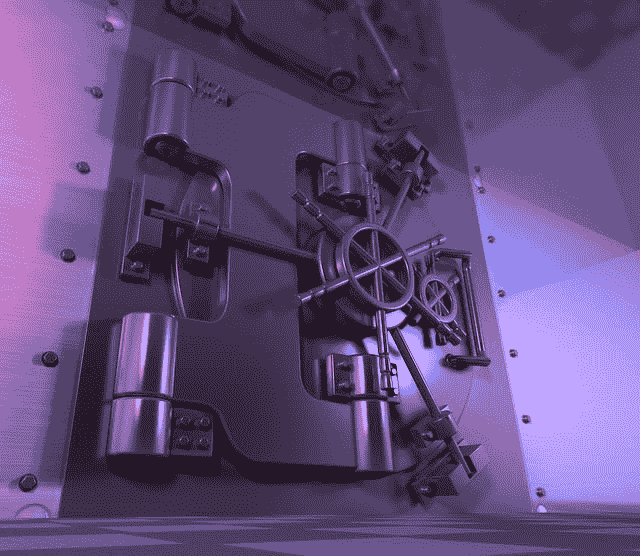

# 如果你突然死亡，你的雇主会有多惨？

> 原文：<https://dev.to/bosepchuk/how-screwed-would-your-employer-be-if-you-died-suddenly-250i>

如果你明天在上班的路上死于车祸，你的替代者能够访问你的系统和工作产品吗？或者他们会被锁在所有的事情之外，挣扎几个星期或几个月来获得进入和前进的机会？大多数人都会将业务连续性规划与首席执行官和大公司联系在一起。然而，作为公司多年来唯一的软件开发人员，我敏锐地意识到，如果我突然去世，我的雇主会有多惨。

在这篇文章中，我将向你展示我采取的步骤，以确保我死后我的公司不会瘫痪。

### 在私人维基上记录下你所能记录的一切，并与你的老板分享

业务连续性规划的第一条规则是记录。我创建了一个私人维基(由第三方托管)，记录了我认为重要的一切。然后我在 wiki 上分享了我的老板的全部管理权限，这样他就可以在我死后与我的继任者分享。

我在我们的维基上放了各种有用的信息，比如:

*   概述我们生产环境的所有部分以及它们是如何组合在一起的
*   我们使用的 SaaS 产品有 BitBucket、吉拉、Campaign Monitor 等。
*   web 服务器配置
*   防火墙配置
*   项目特定的配置文件
*   带有屏幕截图的路由器配置设置
*   网络布局，包括静态和动态范围以及交换机和打印机 IP 地址
*   DNS 设置
*   SSL 证书详细信息
*   我们的数据库备份如何工作以及备份存储在哪里

我有三个标准来创建这种文档。它必须:

1.  如果错误的人看到它，不要破坏我们的安全(这意味着没有用户名、密码或私人加密密钥)
2.  如果需要的话，请帮我重建我们的系统
3.  如果我死了，请帮我接替我的职务

当我们从一个程序员发展到两个时，wiki 还帮助我了解我们的新程序员，并把工作委派给他，这是一个不错的附带好处。

#### 一些提示

在设置新系统时，创建此文档是最容易的。我大部分时间都是这么做的。但是有时我会偶然发现一些我忘记记录的东西，我发现在事后记录会更痛苦。

我记录了我的替代者的预期技能水平。这意味着我假设我的读者是对 Windows 和 Linux 管理、web 服务器、网络等有一定了解的程序员。

我自由地记录了文本命令，并对我没有编写脚本来执行任务的所有命令的设置进行了截图。我的目标是在这个过程中尽可能减少猜测。

最后，每当我使用文档时，我都会更新它:

*   减少歧义
*   记录新设置
*   GUI 或命令的文档更新

### 密码和私有加密密钥的业务连续性规划

因为我是所有事情的管理员，我觉得我需要对我的密码和私人加密密钥采取极端的预防措施。我非常清楚，如果这些信息落入坏人之手，有人可能会毁掉我们的业务。

另一方面，我还需要能够定期访问这些信息，确保我永远不会丢失这些信息，并且在我突然死亡的情况下，以某种方式让我的老板可以获得这些信息。

#### 我的方法

我采取了双管齐下的方法。首先，我为我的老板建立了单独的账户，并让他拥有尽可能多的账户。这是像 AdWords，Google Analytics，共享 Google Docs，我们的域名提供商，DNS 等东西..如果我死了，他可以简单地删除我的访问权限，并在这些帐户上添加我的替代者。

但是，如果你遵循了最小特权原则，那么有些账户你不应该与任何人共享，比如服务器登录、ssh 密码、数据库登录、路由器密码、私有加密密钥等等。大多数非技术人员无法保护高度敏感的凭证。如果他们不需要访问这些帐户来完成工作，他们就不应该访问这些帐户。

所以，对于我方法的第二个方面，我:

*   创建强、长、随机的密码(越重要的帐户，密码越长)
*   我把它们存放在一个加密的容器里，里面有一个超强的主密码，我记住了这个密码(从来没有在任何地方写过)
*   将加密的容器存储在云中，以便我可以从任何地方访问它，并利用我首选的存储提供商的自动版本控制和备份
*   将我的密码打印出来，并定期安全地与我的老板分享(详见下文)

#### 我如何在不暴露密码的情况下与老板分享我的密码

我打印了一份我的密码，并把它们封在一个信封里，我在信封上签名并注明日期。然后我安排把信封存放在公司的保险箱里。我亲眼看着保管员把它放进保险箱，因为我是那种偏执狂。

[T2】](https://res.cloudinary.com/practicaldev/image/fetch/s--i92s7HsS--/c_limit%2Cf_auto%2Cfl_progressive%2Cq_auto%2Cw_880/https://thepracticaldev.s3.amazonaws.com/i/fff7ub98blywqz9372q4.jpg)

我的老板知道如果我死了就要这个信封。保险箱保管员知道只有在我活着的时候才能把信封给我，如果我死了就只能给我的老板。

每隔几个月，或者更频繁地，如果一些重要的事情改变了，我会把保险箱里的信封换成一个更新的版本。如果旧信封不见了或者被打开了，我就会知道我的密码被泄露了。我还会打开旧信封，确保里面有我期待的密码文件，然后我会横切撕碎它和信封(这样就没有人会看到我是如何签名和日期的)。

就是这样。我的老板很高兴，因为他知道如果我死了，他可以进入我们所有的系统。我很高兴，因为我知道我们最敏感的密码不会写在贴在某人键盘底部的便利贴上。他们也不容易受到社会工程攻击，就像凯文·米特尼克因犯罪而出名。

#### 只是一个小小的警告

特别注意你用对称或公钥加密法加密的东西。你替代者不会通过简单的密码重置或给你的供应商打电话来访问那些东西。因此，请确保这些密码(和私钥)是您计划的一部分，并且它们总是最新的。

### 包装完毕

业务连续性规划对公司的每个关键员工都很重要，不仅仅是对所有者和高级经理。

我相信每个人都应该记录他们的系统。那只是常识。这真的没什么大不了的，而且这些年来，它为我节省了很多时间，让我得到了很多回报。

作为公司唯一的程序员，我必须在密码和加密密钥的业务连续性规划上有点创意。鉴于我的情况，我相信我在安全和方便之间取得了很好的平衡。但是适合自己的可能就不一样了。我鼓励你考虑一下自己的情况，参与一些自己的业务连续性规划，这样，如果有一天你在上班路上死于车祸，你的公司也不会瘫痪。

*同意还是不同意？我很想听听你的想法。*