# iOS 团队城市项目

> 原文:[https://dev.to/brightdevs/teamcity-for-ios-project-36ag](https://dev.to/brightdevs/teamcity-for-ios-project-36ag)

嗨！今天的主题将是关于 [TeamCity](https://www.jetbrains.com/teamcity/) 以及如何在你的 iOS 项目中提供持续集成。

[T2】](https://res.cloudinary.com/practicaldev/image/fetch/s--1kYPEaek--/c_limit%2Cf_auto%2Cfl_progressive%2Cq_auto%2Cw_880/https://thepracticaldev.s3.amazonaws.com/i/r1cbzhmuxv4ztgm87vmr.jpg)

# 动机

我已经为许多项目配置了多次团队合作。在你的项目开发过程中使用持续集成系统有很多好处。此外，团队精神还有很多替代方案，比如 circle ci T1、T2 TravisCI T3 等等。但是在这篇文章中，我想和你分享我在[光明发明](https://brightinventions.pl)获得的团队合作经验。

我们开始的每一个项目——我们从配置持续集成的东西开始，在我们的情况下，我们使用 TeamCity 来处理。

这篇文章更像是一个教程，指导你完成 iOS 项目配置的所有基本和最重要的步骤。另外，我假设你已经下载并托管了你的团队城市服务。

希望你会喜欢！

# 第一步:创建根项目

首先，你需要进入一个你的团队所在的页面。登录后，进入管理页面，点击`Project-related Settings`部分的`Projects`选项卡，然后点击`Create project`

[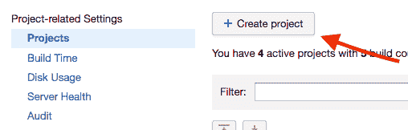T2】](https://res.cloudinary.com/practicaldev/image/fetch/s--qIFTlnIf--/c_limit%2Cf_auto%2Cfl_progressive%2Cq_auto%2Cw_880/https://thepracticaldev.s3.amazonaws.com/i/5h3qrlbqvr0w1af1boqx.png)

之后，您应该看到项目中使用的版本控制的配置屏幕。

[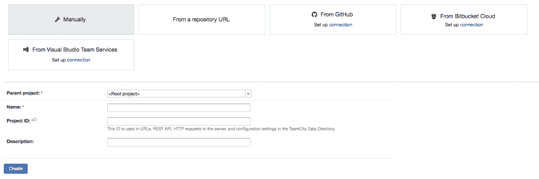T2】](https://res.cloudinary.com/practicaldev/image/fetch/s--zgRegzC5--/c_limit%2Cf_auto%2Cfl_progressive%2Cq_auto%2Cw_880/https://thepracticaldev.s3.amazonaws.com/i/ze86k7fxbf62r2wsiges.png)

我更喜欢手动配置一切的方式，但当然你也可以使用预定义的部分，如:`From GitHub`。`From Bitbucket Cloud`等。
在这一步，你需要做的就是提供你的项目名称，然后点击`Create`

# 第二步:添加 VCS 根

当然，为了构建我们的项目，我们需要提供构建的源代码。我们的团队城市服务应该能够从存储库中获取变更。如果你使用的是 GitHub、BitBucket 或者类似的平台，你有两种方法:

*   向有权访问存储库的帐户提供凭据

或者

*   生成一个 SSH 密钥，并使用它在 GitHub/Bitbucket 中授权 TeamCity

在这篇文章中，我将向你展示如何通过上传 SSH 密钥来配置它。

### 生成新的 SSH 密钥

*如果您没有听说过生成 SSH 密钥，或者您不知道 SSH 密钥到底是什么，请查看[此链接](https://help.github.com/articles/generating-a-new-ssh-key-and-adding-it-to-the-ssh-agent/)T3】*

要生成新的 SSH 密钥，您可以使用终端命令:

```
ssh-keygen -t rsa 
```

<svg width="20px" height="20px" viewBox="0 0 24 24" class="highlight-action crayons-icon highlight-action--fullscreen-on"><title>Enter fullscreen mode</title></svg> <svg width="20px" height="20px" viewBox="0 0 24 24" class="highlight-action crayons-icon highlight-action--fullscreen-off"><title>Exit fullscreen mode</title></svg>

接下来，提供新密钥的名称和可选的密码，然后在运行`ssh-keygen -t rsa`命令的目录中，您应该会看到两个文件。一个是扩展名为`.pub`的公钥，第二个是私钥。
公共的会在你的 github/bitbucket 上的仓库里使用。私钥将在 TeamCity 服务中使用。

### 在 TeamCity 中使用生成的密钥

转到已经创建的项目，设置页面，点击`VCS SSH Keys`选项卡。

[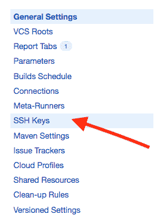T2】](https://res.cloudinary.com/practicaldev/image/fetch/s--nf7ax_I0--/c_limit%2Cf_auto%2Cfl_progressive%2Cq_auto%2Cw_880/https://thepracticaldev.s3.amazonaws.com/i/6nv274t08knlp9rv68qc.png)

点击`Upload SSH Key`。之后，您应该会看到一个弹出窗口，允许您上传之前创建的 SSH 密钥。
*请记住，你应该上传你的密钥的私有部分，没有`pub`扩展名*。如果选择正确，单击 save，您应该会看到如下屏幕:

[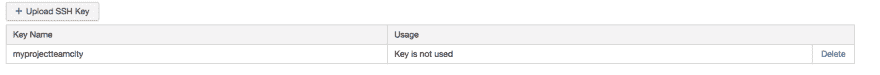T2】](https://res.cloudinary.com/practicaldev/image/fetch/s--yN4DL57l--/c_limit%2Cf_auto%2Cfl_progressive%2Cq_auto%2Cw_880/https://thepracticaldev.s3.amazonaws.com/i/q9qfesq3d8es7rt925du.png)

如您在`Usage`选项卡中所见，该键尚未用于配置。
为了使用它，您必须完成以下步骤...

### 配置 VCS 根

转到已经创建的项目的设置页面。正如您在`SSH Keys`选项卡中看到的数字‘1’——这意味着我们已经上传了一个 SSH 密钥，可以使用了。

[T2】](https://res.cloudinary.com/practicaldev/image/fetch/s--yN4DL57l--/c_limit%2Cf_auto%2Cfl_progressive%2Cq_auto%2Cw_880/https://thepracticaldev.s3.amazonaws.com/i/q9qfesq3d8es7rt925du.png)

点击`VCS Roots`选项卡，然后点击`Create VC Root`。

在我们的例子中，在`Type of VCS`中选择`Git`

[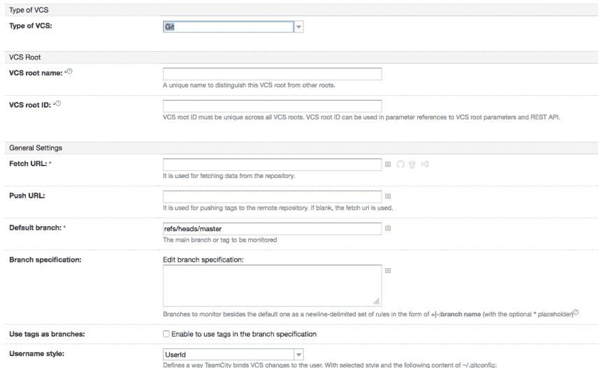T2】](https://res.cloudinary.com/practicaldev/image/fetch/s--hEwIYmIG--/c_limit%2Cf_auto%2Cfl_progressive%2Cq_auto%2Cw_880/https://thepracticaldev.s3.amazonaws.com/i/w3t6gkczoqgz4eb2zmsm.png)

在`VCS root name`中，提供一个名称:

> 一个独特的名字来区分这个 VCS 根从其他根。

接下来，在`Fetch URL`中粘贴一个到您的存储库的链接。*请记住在这里粘贴一个 SSH 链接类型，例如`git@github.com:yournickname/yourrepositoryname.git`*

[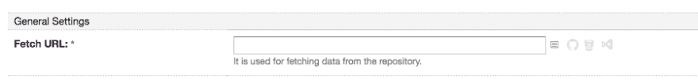T2】](https://res.cloudinary.com/practicaldev/image/fetch/s--bAA0i-cC--/c_limit%2Cf_auto%2Cfl_progressive%2Cq_auto%2Cw_880/https://thepracticaldev.s3.amazonaws.com/i/kwi8pp1epupqeb9zn2gc.png)

接下来，最重要的是，在`Authentication method`中选择`Uploaded Key`,并为您的存储库选择一个先前上传的私有 ssh 密钥。

[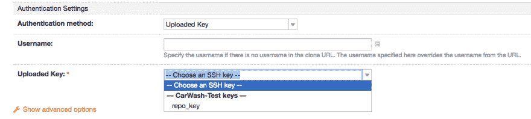T2】](https://res.cloudinary.com/practicaldev/image/fetch/s--V9AgF4t5--/c_limit%2Cf_auto%2Cfl_progressive%2Cq_auto%2Cw_880/https://thepracticaldev.s3.amazonaws.com/i/rcxqbva9p9y4dj8e1si8.png)

快好了。现在转到页面末尾，点击`Test Connection`。

如果您看到这样的屏幕:

[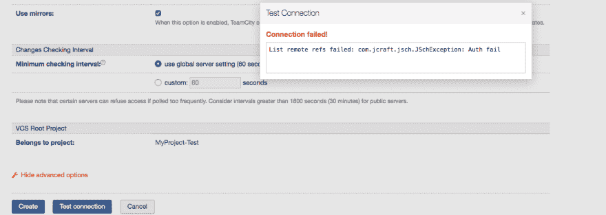T2】](https://res.cloudinary.com/practicaldev/image/fetch/s--sax_vDIJ--/c_limit%2Cf_auto%2Cfl_progressive%2Cq_auto%2Cw_880/https://thepracticaldev.s3.amazonaws.com/i/odh5hdshdidzqdyj0k7t.png)

这意味着我们生成的 SSH 密钥的公共部分没有在存储库中使用，这就是为什么会出现`Auth failed`错误。因此，您需要做的就是在您的存储库中的`Access keys`或`Deploy keys`中添加 SSH 密钥的公共部分。

这里有 Bitbucket 和 GitHub 指令的链接:

[位桶-使用访问密钥](https://confluence.atlassian.com/bitbucket/use-access-keys-294486051.html)

[GitHub -部署键](https://developer.github.com/v3/guides/managing-deploy-keys/#deploy-keys)

如果你已经成功上传了 SSH 密钥的公共部分，再次点击`Test Connection`，我希望你能够看到`Connection successful`提示。这意味着 TeamCity 有权读取您的存储库。

[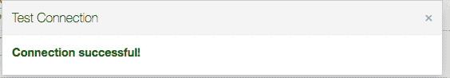T2】](https://res.cloudinary.com/practicaldev/image/fetch/s--jKx3Z7pv--/c_limit%2Cf_auto%2Cfl_progressive%2Cq_auto%2Cw_880/https://thepracticaldev.s3.amazonaws.com/i/d27ltpd6sgiu101yk10d.png)

# 步骤 3:创建构建配置

好了，我们的 VCS 已经配置好了。现在是时候在 TeamCity 项目中创建构建配置了。构建配置是一种通道，它指定您在该通道中提供什么类型的构建。这可能是一个通道:编译你的项目并运行单元测试，或者只是编译一个项目，或者编译一个项目然后创建。ipa 文件，并将其发送到 iTunesConnect，甚至是运行 UI 测试的单独通道。

转到您已经创建的项目中的`General Settings`并点击`Create build configuration`

[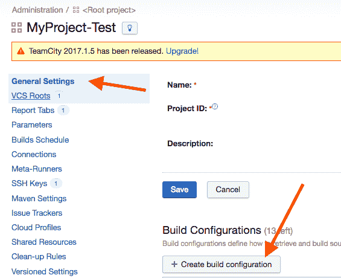T2】](https://res.cloudinary.com/practicaldev/image/fetch/s--xsYRcUWV--/c_limit%2Cf_auto%2Cfl_progressive%2Cq_auto%2Cw_880/https://thepracticaldev.s3.amazonaws.com/i/bh4nq87135skue65vwz1.png)

在下一个屏幕中，再次选择`Manually`选项并命名您的新构建配置。在我们的例子中，我们把它命名为`[Develop] Build & Test`。这个名字很有意义，意味着我们的 lane 将使用 develop configuration - `Develop`构建 iOS 项目，并且还提供了该 lane 将做什么的简短信息- `Build & Test`，这意味着我们将编译我们的项目并运行单元测试。

[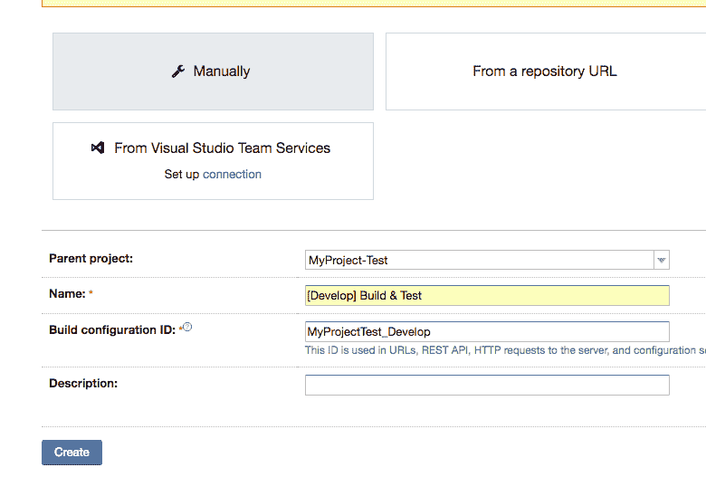T2】](https://res.cloudinary.com/practicaldev/image/fetch/s--xesYeqkh--/c_limit%2Cf_auto%2Cfl_progressive%2Cq_auto%2Cw_880/https://thepracticaldev.s3.amazonaws.com/i/612hue7oa301kc4ph7wj.png)

点击`Create`,之后您应该会看到:

[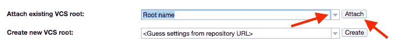T2】](https://res.cloudinary.com/practicaldev/image/fetch/s--u4O5pK5f--/c_limit%2Cf_auto%2Cfl_progressive%2Cq_auto%2Cw_880/https://thepracticaldev.s3.amazonaws.com/i/zkjlsxg3dudyytma2mma.png)

在这里，选择一个先前创建的`VCS Root`并点击`Attach`。

所有工作完成后，我们的构建配置就与 VCS 连接起来了。

# 第四步:配置构建步骤进行配置

现在是时候定义构建配置中的步骤了。构建步骤是什么？它们是 TeamCity 将在我们的代理机器上运行的一系列指令。简单地说，它可能是这样的:

1.  从回购获取新的变更
2.  安装依赖项(cocoapods、捆绑安装等等)
3.  使用脚本编译项目(xcodebuild，fastlane)

请记住，构建步骤取决于您如何配置您的 iOS 项目。在我的例子中，我使用了[浪子](https://fastlane.tools)和[邦德勒](http://bundler.io/)来管理安装在 iOS 项目中的 gems 版本。

为了创建构建步骤，转到`Build configuration Settings`并点击`Build Steps`

[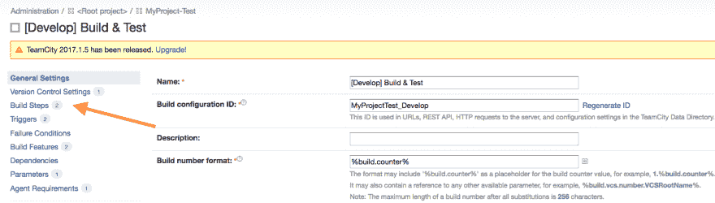T2】](https://res.cloudinary.com/practicaldev/image/fetch/s--jiREnngt--/c_limit%2Cf_auto%2Cfl_progressive%2Cq_auto%2Cw_880/https://thepracticaldev.s3.amazonaws.com/i/lgka4txr0cb5vb7frwgc.png)

点击`Add build step`，在下一个屏幕上选择一个`Command line`流道类型。
在`Step name`中命名您的构建步骤(在我的例子中是`Install Dependencies`)。在`Custom script`中，键入将在这个构建步骤中执行的脚本。同样，在我的例子中，它将是

```
bundle install 
```

<svg width="20px" height="20px" viewBox="0 0 24 24" class="highlight-action crayons-icon highlight-action--fullscreen-on"><title>Enter fullscreen mode</title></svg> <svg width="20px" height="20px" viewBox="0 0 24 24" class="highlight-action crayons-icon highlight-action--fullscreen-off"><title>Exit fullscreen mode</title></svg>

[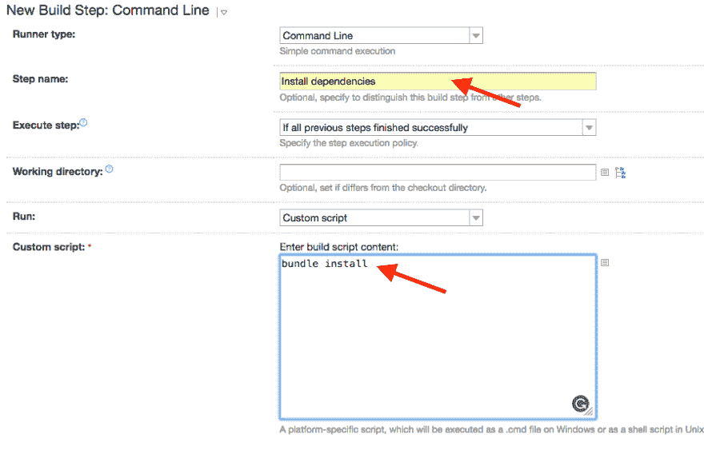T2】](https://res.cloudinary.com/practicaldev/image/fetch/s--kqaHyxht--/c_limit%2Cf_auto%2Cfl_progressive%2Cq_auto%2Cw_880/https://thepracticaldev.s3.amazonaws.com/i/g0i5hz8zzzcf84frg5cg.png)

点击`Save`，你的第一步就准备好了！

我还添加了另一个名为`Build and tests`的命令行构建步骤，它将运行命令:

```
bundle exec fastlane build_and_test 
```

<svg width="20px" height="20px" viewBox="0 0 24 24" class="highlight-action crayons-icon highlight-action--fullscreen-on"><title>Enter fullscreen mode</title></svg> <svg width="20px" height="20px" viewBox="0 0 24 24" class="highlight-action crayons-icon highlight-action--fullscreen-off"><title>Exit fullscreen mode</title></svg>

*`build_and_test`是`Fastfile`中车道的名称。如果你不熟悉浪子，请看看这个。这是一个伟大的工具[浪子](https://fastlane.tools)T5】*

现在，我们已经创建了所有的构建步骤。

[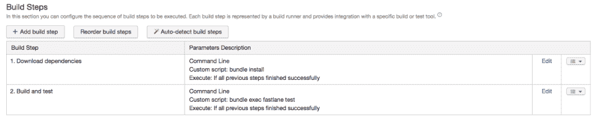T2】](https://res.cloudinary.com/practicaldev/image/fetch/s--Bqatkpu8--/c_limit%2Cf_auto%2Cfl_progressive%2Cq_auto%2Cw_880/https://thepracticaldev.s3.amazonaws.com/i/zicvtashuklys64yshaw.png)

# 第五步:触发器

您是否想过 TeamCity 如何知道何时从存储库中获取新的变更并构建它？触发器是一个答案。

我更喜欢使用两种类型的触发器。其中一个叫做`VCS Trigger`，这意味着 TeamCity 会自动检查您的存储库中是否发生了变化，如果是这样，它将启动一个包含该类型触发器的构建配置。
`VCS Trigger`用于`Compile & Test`等配置中。因为我们希望在每次推送到存储库之后编译并运行测试。

后一种触发，叫做`Schedule Trigger`。这是一个简单的触发器，可以说:*在每周一上午 7:00 运行此配置*

转到构建配置主页中的`Triggers`部分。点击`Add new trigger`并选择`VCS Trigger`，然后点击`Save`

[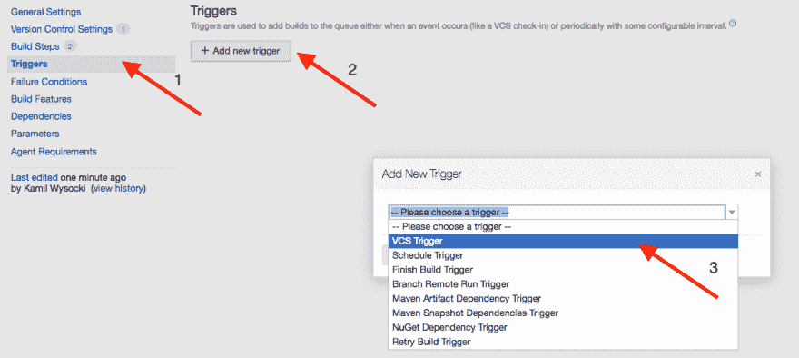T2】](https://res.cloudinary.com/practicaldev/image/fetch/s--okdJFUry--/c_limit%2Cf_auto%2Cfl_progressive%2Cq_auto%2Cw_880/https://thepracticaldev.s3.amazonaws.com/i/74r7bq9qswma8wd9oa4c.png)

`VCS Trigger`配置成功，容易吧？。

接下来，做同样的操作，`Add new trigger`->-`Schedule Trigger`，选择符合您要求的选项(在我的例子中是每天凌晨 04:00 触发)，然后点击`Save`。

[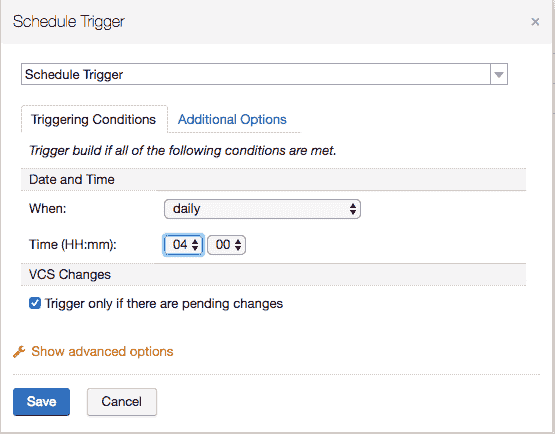T2】](https://res.cloudinary.com/practicaldev/image/fetch/s--tUDZREbk--/c_limit%2Cf_auto%2Cfl_progressive%2Cq_auto%2Cw_880/https://thepracticaldev.s3.amazonaws.com/i/mabqemex9a05tbo9v48k.png)

所有触发器已创建！

# 第六步:添加构建特性

构建特性是很酷的东西。例如，在使用构建特性时，您可以创建一个条件来检查安装了哪个版本的 Ruby，或者您可以创建一个条件来检查您的机器上是否有一些可用空间。如果你想生成`.ipa`文件，并且你知道你需要至少 100MB 的空闲空间，这是非常有用的。在这篇文章中，我将向你展示如何配置两个构建特性——一个是`XML report processing`，另一个是`Ruby environment configurator`。

*   `XML report processing`

转到构建配置主页的`Build Features`部分，点击`Add build feature`。选择`XML report processing`，选择`Ant JUnit`，在`Monitoring rules`中粘贴一个路径给`scan`动作后浪子生成的`report.junit`文件。
在`report.junit`中，您可以找出已经运行了多少测试，失败了多少测试，成功完成了多少测试。

[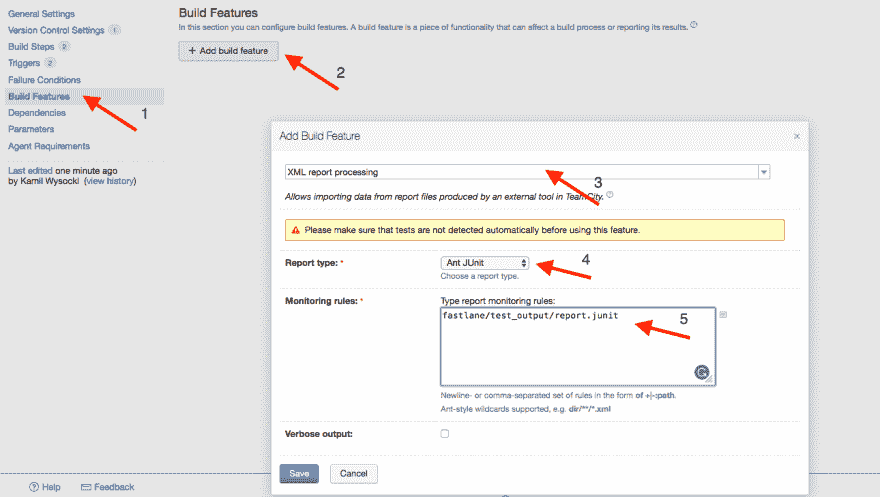T2】](https://res.cloudinary.com/practicaldev/image/fetch/s--Mvwk-ZYa--/c_limit%2Cf_auto%2Cfl_progressive%2Cq_auto%2Cw_880/https://thepracticaldev.s3.amazonaws.com/i/kev783pn70ioxs1hmohz.png)

*   `Ruby environment configurator`

这次在`Add build feature`窗口中选择`Ruby environment configurator`。在`gemset`中定义你需要的 ruby 版本。我的情况是`ruby-2.3.3`。

这个特性将检查代理机器上是否有这个版本的 ruby，如果没有，它将不会启动构建配置。这是一个可选步骤，但有时它非常有用——特别是，如果您使用多个 ruby 版本，或者其他人可以在代理机器上更改一个全局版本的 ruby。

[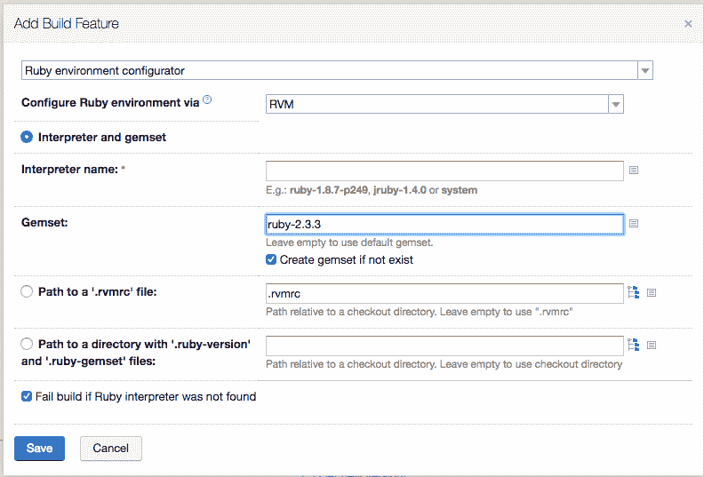T2】](https://res.cloudinary.com/practicaldev/image/fetch/s--rALplpoe--/c_limit%2Cf_auto%2Cfl_progressive%2Cq_auto%2Cw_880/https://thepracticaldev.s3.amazonaws.com/i/lpk2b568p07r8ywfpccn.png)

# 第七步:参数

构建配置甚至根项目有 3 种类型的参数。

*   结构参数

*   系统属性(系统。)

*   环境变量(env)

在这篇文章中，我将重点关注`Environment variables`。这种类型的变量是在构建开始后创建的(准备好了吗？)并且可以通过前缀为`$`的命令行来访问它们。环境变量的一个例子是 XCode 路径。为了编译我们的项目，我们需要浪子工具将使用的 XCode 路径。所以在`Fastfile`我加了一行:

```
xcode_select ENV["XCODE_PATH"] 
```

<svg width="20px" height="20px" viewBox="0 0 24 24" class="highlight-action crayons-icon highlight-action--fullscreen-on"><title>Enter fullscreen mode</title></svg> <svg width="20px" height="20px" viewBox="0 0 24 24" class="highlight-action crayons-icon highlight-action--fullscreen-off"><title>Exit fullscreen mode</title></svg>

这意味着-从一个可以在`ENV["XCODE_PATH"]`变量下找到的路径中选择 XCode。

在构建配置主页上，选择`Parameters`并点击`Add new parameter`。在`Name`中键入`env.XCODE_PATH`，TeamCity 应该自动将种类更改为`Environment variable`，并在值中提供代理机器上 XCode.app 的路径。

[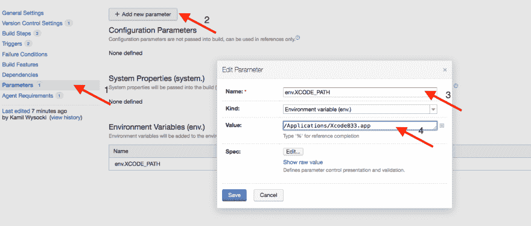T2】](https://res.cloudinary.com/practicaldev/image/fetch/s--ymyW2RJ---/c_limit%2Cf_auto%2Cfl_progressive%2Cq_auto%2Cw_880/https://thepracticaldev.s3.amazonaws.com/i/jk87kbin2qv21rs4040q.png)

通过使用参数，您可以传递许多有用的值，比如您的构建号或应该构建的方案的名称等等。我鼓励你去看看:)

# 第 8 步:故障条件

当您想要强制您的构建失败时，应该使用失败条件。一个很好的例子就是超时。让我们想象一下，在您的代理机器上发生了一些不好的事情，您的构建挂起了 2 个多小时，而正常情况下只需要几分钟。失败的条件伴随着帮助而来！你可以在这里设置，如果构建持续超过`n`分钟，那么它应该失败。

在构建配置主页中，转到`Failure Conditions`，在第`if runs longer than specified limit in minutes`行输入一个值(以分钟为单位)。我的情况是 60 分钟。

[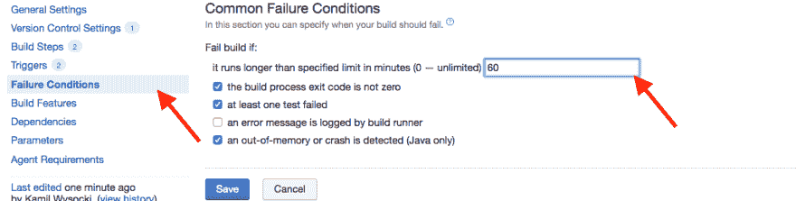T2】](https://res.cloudinary.com/practicaldev/image/fetch/s--MrMU5S2W--/c_limit%2Cf_auto%2Cfl_progressive%2Cq_auto%2Cw_880/https://thepracticaldev.s3.amazonaws.com/i/qjiivjmzdnjld4m9bw63.png)

# 第九步:代理机

你可能已经注意到了，我经常提到`agent machine`。代理，**在 iOS 的情况下**，是装有 macOS 系统的电脑(Macbook、MacMini 等)。代理通过脚本连接到您的 TeamCity 页面。TeamCity 可以与代理通信，以便使用它来执行构建配置中的构建步骤。重要的是，您的代理应该一直打开，以提供持续的集成。

好的，但是如何配置代理呢？

转到 TeamCity 页面中的`Agents`选项卡。你可以在顶部找到它。

[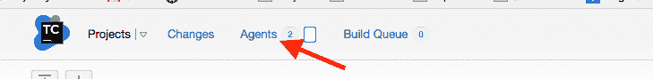T2】](https://res.cloudinary.com/practicaldev/image/fetch/s--eAQC5-2T--/c_limit%2Cf_auto%2Cfl_progressive%2Cq_auto%2Cw_880/https://thepracticaldev.s3.amazonaws.com/i/6ywuzrhyr4ob8uknp801.png)

在新创建的团队城市中，还没有可用的代理。让我们点击`Install Build Agents`。

[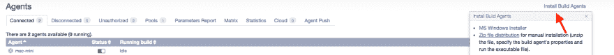T2】](https://res.cloudinary.com/practicaldev/image/fetch/s--ytsepJLU--/c_limit%2Cf_auto%2Cfl_progressive%2Cq_auto%2Cw_880/https://thepracticaldev.s3.amazonaws.com/i/rqi2excf4bnqipihmgg1.png)

我更喜欢通过`Zip file distribution`安装的方式。单击后，您的 web 浏览器将下载运行代理所需的所有文件。

你可以在 [TeamCity 文档中找到关于如何配置 Mac 代理的指导，点击](https://confluence.jetbrains.com/display/TCD10//Setting+up+and+Running+Additional+Build+Agents#SettingupandRunningAdditionalBuildAgents-InstallingviaZIPFile)。以下是该文档中的步骤:

```
1.Make sure a JDK (JRE) 1.8 (versions 1.6-1.8 are supported, but 1.8 is recommended) is properly installed on the agent computer.

2.On the agent computer, make sure the JRE_HOME or JAVA_HOME environment variables are set (pointing to the installed JRE or JDK directory respectively).

3.In the TeamCity Web UI, navigate to the Agents tab.

4.Click the Install Build Agents link and select Zip file distribution to download the archive.

5.Unzip the downloaded file into the desired directory.

6.Navigate to the <installation path>\conf directory, locate the file called buildAgent.dist.properties and rename it to buildAgent.properties.

7.Edit the buildAgent.properties file to specify the TeamCity server URL and the name of the agent. Please refer to Build Agent Configuration section for details on agent configuration.

8.Under Linux, you may need to give execution permissions to the bin/agent.sh shell script. 
```

<svg width="20px" height="20px" viewBox="0 0 24 24" class="highlight-action crayons-icon highlight-action--fullscreen-on"><title>Enter fullscreen mode</title></svg> <svg width="20px" height="20px" viewBox="0 0 24 24" class="highlight-action crayons-icon highlight-action--fullscreen-off"><title>Exit fullscreen mode</title></svg>

完成这些步骤后，您可以通过命令:
启动代理

```
pathToDownloadedUnzippedBuildAgentFiles\bin\agent.sh start 
```

<svg width="20px" height="20px" viewBox="0 0 24 24" class="highlight-action crayons-icon highlight-action--fullscreen-on"><title>Enter fullscreen mode</title></svg> <svg width="20px" height="20px" viewBox="0 0 24 24" class="highlight-action crayons-icon highlight-action--fullscreen-off"><title>Exit fullscreen mode</title></svg>

接下来要做的是再次进入`Agents`选项卡上的团队城市页面。您需要等待一段时间，过一会儿您应该会在`Unauthorized`选项卡下看到一个可用的代理。唯一要做的就是向`Authorize`代理。此后，您将在`Connected`选项卡下看到您的代理。

[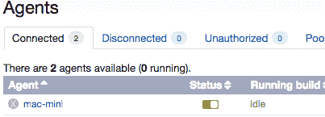T2】](https://res.cloudinary.com/practicaldev/image/fetch/s--4UZJX6wr--/c_limit%2Cf_auto%2Cfl_progressive%2Cq_auto%2Cw_880/https://thepracticaldev.s3.amazonaws.com/i/8djecskwgoh627driu7f.png)

# 步骤 10:为构建配置设置代理需求

最后一件事...您现在需要指定哪个代理应该构建您的配置。如果你的 TeamCity 包含一个 iOS 和 Android 的项目，可能会有两个代理——一个用于 Android，另一个用于 iOS。当然，我们不想在可能没有 XCode 甚至 macOS 的 Android 项目的电脑上开始我们的 iOS 构建配置。因此，为了给你的项目提供一个合适的代理，你需要使用`Agent requirements`进行构建配置。

在构建配置主页中，转到`Agent requirements`选项卡，然后:

*   选择`Add new requirement`
*   在`Parameter Name`中输入`teamcity.agent.jvm.os.name`
*   在`Condition`中选择`equals`
*   在`Value`中选择`Mac OS X`
*   救援

[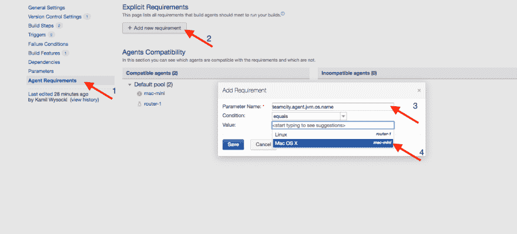T2】](https://res.cloudinary.com/practicaldev/image/fetch/s--plASqOEk--/c_limit%2Cf_auto%2Cfl_progressive%2Cq_auto%2Cw_880/https://thepracticaldev.s3.amazonaws.com/i/fhnlej3m9pa7v22hytfm.png)

我们已经创建的要求意味着代理操作系统名称应该是 Mac OS X，因为我们为 iOS 配置了一个项目。

# 步骤 11:准备好构建-运行！🎉

所有配置完成后，您就可以通过 TeamCity 开始构建了。转到 TeamCity 主页，在您新创建的构建配置上点击`Run`。

[T2】](https://res.cloudinary.com/practicaldev/image/fetch/s--6KSzIpP7--/c_limit%2Cf_auto%2Cfl_progressive%2Cq_auto%2Cw_880/https://thepracticaldev.s3.amazonaws.com/i/9fadr0ubxjo8yg48pix4.png)

之后，您将能够看到构建进度:

[T2】](https://res.cloudinary.com/practicaldev/image/fetch/s--qoRKsHQM--/c_limit%2Cf_auto%2Cfl_progressive%2Cq_auto%2Cw_880/https://thepracticaldev.s3.amazonaws.com/i/n0nikhqc09683grwv78q.png)

如果您想查看当前构建的进度，只需点击`Running`标签并转到`Build log`部分。如果在编译时发生了一些错误，这是非常有用的。

[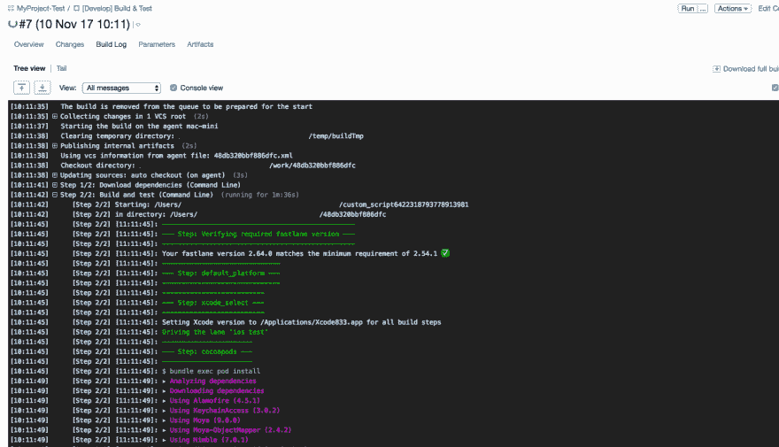T2】](https://res.cloudinary.com/practicaldev/image/fetch/s--7xqvGhuS--/c_limit%2Cf_auto%2Cfl_progressive%2Cq_auto%2Cw_880/https://thepracticaldev.s3.amazonaws.com/i/ebfrz3k5wagw0jtxru9e.png)

最后，在所有构建步骤之后，您将能够看到:

[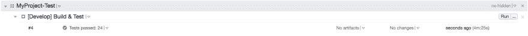T2】](https://res.cloudinary.com/practicaldev/image/fetch/s--UeREOQBd--/c_limit%2Cf_auto%2Cfl_progressive%2Cq_auto%2Cw_880/https://thepracticaldev.s3.amazonaws.com/i/r2a78x8t5h0xxl80db6r.png)

正如您所看到的，`XML Processing Report` Build 特性提供了一个关于单元测试的很酷的输出:`Test passed: 24`。

# 第十二步:神器！

最后一个可选步骤。我可以想象你可以找到很多案例，你想编译一个项目，创建一个`.ipa`文件，并发送给客户端。神器就是为它而造的。
为此:点击`Edit Settings`进入构建配置设置:

[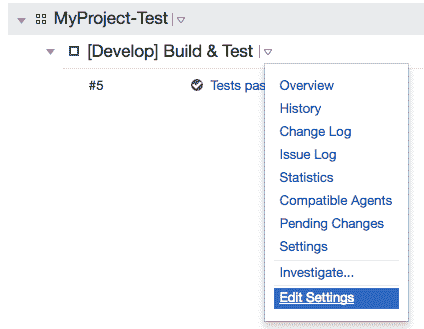T2】](https://res.cloudinary.com/practicaldev/image/fetch/s--xNB4EgqN--/c_limit%2Cf_auto%2Cfl_progressive%2Cq_auto%2Cw_880/https://thepracticaldev.s3.amazonaws.com/i/e91xqe7qml6r3iuqt7xd.png)

在`Artifacts paths`下的`General Settings`中，输入一个到`.ipa`文件的路径，该文件将由您的构建脚本生成。我建议再次使用浪子。名为`gym`的浪子动作将构建您的项目并在输出目录中创建`.ipa`文件。更多关于`gym`你可以[阅读这里](https://docs.fastlane.tools/actions/gym/)。

[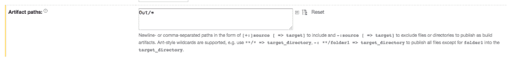T2】](https://res.cloudinary.com/practicaldev/image/fetch/s--dxdIVUA7--/c_limit%2Cf_auto%2Cfl_progressive%2Cq_auto%2Cw_880/https://thepracticaldev.s3.amazonaws.com/i/evnikgedcaq1n1f96v7w.png)

如果你这样做，在下一次构建之后，你将能够通过 TeamCity 上的`Artifacts`页面下载`.ipa`。

[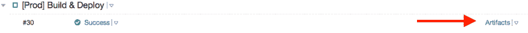T2】](https://res.cloudinary.com/practicaldev/image/fetch/s--q67aiHyT--/c_limit%2Cf_auto%2Cfl_progressive%2Cq_auto%2Cw_880/https://thepracticaldev.s3.amazonaws.com/i/z8ghyx94x40dcft4zq8d.png)

# 结论

TeamCity 是在您的项目中提供持续集成的一个很好的平台。与浪子相结合，它可以为您节省大量的手动部署、测试和编译时间。

此外，如果您将在构建配置中配置工件，您可以很容易地向您的客户发送一个指向 TeamCity 页面的链接，并给他一些如何点击下载`.ipa`的说明。因此，您不必担心每次创建新的文件版本时都要发送`.ipa`文件。

希望你喜欢这个帖子。欢迎随时评论分享:)

最初发布于 [brightinventions.pl](https://brightinventions.pl/blog/)

由 Kamil Wysocki，软件工程师@光明发明
[博客](https://wysockikamil.com)，[推特](//htpps://twitter.com/kamwysoc)