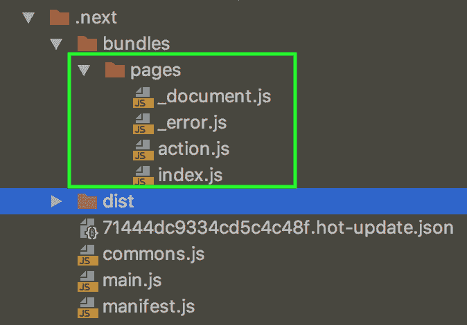
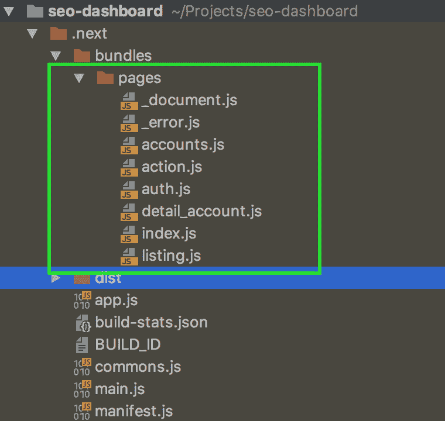

# next.js 多个环境构建

> 原文:[https://dev . to/dzunnguyen 179/nextjs-multiple-environment-builds-4 hef](https://dev.to/dzungnguyen179/nextjs-multiple-environment-builds-4hef)

# 概述

Next.js 是一个使用 [ReactJS](https://reactjs.org/) 的通用 web 应用程序的极简框架。它于 2016 年 10 月 25 日开源。紧随其后的公司是 [ZEIT](https://zeit.co/) 。它有大量的贡献者需要维护和改进。Next 为 web 开发提供了简单的界面，并具有一些优势，例如:

*   本机支持服务器呈现。
*   有许多 next.js 和其他库或技术集成的小例子(在这里查看)。
*   文档非常清晰，并且是最新的。
*   接下来负责所有基本配置。允许扩展 webpack 或 babel 的配置…
*   当我们遇到问题时，它有一个巨大的社区来支持我们。

最近我们公司的一些实验项目用到了 next.js(你可以在这里查看[了解我们为什么选择 next.js)。在开发过程中，我们遇到了多个 env 构建的问题。](https://codeburst.io/next-js-at-chotot-ca9c1520f436)

# 下一次构建—开发与生产

## 发展

*   下一步只建立一个网页，你正在访问。
*   每一个变化，下一步重建你的网络应用程序到”。下一个”目录，但只有一个页面，你正在访问，以加快发展。

**例如:**

*   我们的 web 应用程序有 6 个页面:主页(index.js)，新建(action.js)，列表(listing.js)注册和登录(auth.js)，帐户列表(accounts.js)，明细帐户(detail_account.js)。
*   当访问“主页”时，Next 将捆绑属于“主页”的所有内容(index.js)。
*   与“新建”页面类似，Next 将属于“新建”页面(action.js)的所有内容捆绑到“新建”页面中。下一个”目录。

[T2】](https://res.cloudinary.com/practicaldev/image/fetch/s--k-W7ktWy--/c_limit%2Cf_auto%2Cfl_progressive%2Cq_auto%2Cw_880/https://cdn-images-1.medium.com/max/1600/0%2AIIR-nu76WmDWbIw2.)

## 生产

*   Next 将属于我们的 web 应用程序的所有内容打包成”。下一个”目录。
*   当你访问一个页面时，next 不会重新构建，因为它已经内置了”。下一个”目录。

[T2】](https://res.cloudinary.com/practicaldev/image/fetch/s--plHG4rm7--/c_limit%2Cf_auto%2Cfl_progressive%2Cq_auto%2Cw_880/https://cdn-images-1.medium.com/max/1600/0%2AiZ1gcg7x4tFG4peM.)

# 场景

在我们的过程中，我们将开发环境(env)分为 3 个部分:

*   **开发:**供工程师开发特性。
*   **Staging:** 用于质量保证(QA)在真正生产之前测试特性。
*   **制作:**供用户使用的功能。

每个 env 使用不同的配置、API 端点和资源(CPU、RAM 等)。但是舞台和制作必须尽可能的相似。

下面是我们的 package.json 脚本，用于构建和运行我们的 web 应用程序

```
{  "scripts":  {  "build":  "next build",  "start:development":  "node server.js",  "start:staging":  "NODE_ENV=staging node server.js",  "start:production":  "NODE_ENV=production node server.js"  }  } 
```

<svg width="20px" height="20px" viewBox="0 0 24 24" class="highlight-action crayons-icon highlight-action--fullscreen-on"><title>Enter fullscreen mode</title></svg> <svg width="20px" height="20px" viewBox="0 0 24 24" class="highlight-action crayons-icon highlight-action--fullscreen-off"><title>Exit fullscreen mode</title></svg>

我们有 4 个命令。在每一个环境中，我们都会按照顺序运行:
**开发**

*   npm 开始

**分期**

*   npm 运行构建
*   npm 运行开始:分段

**生产**

*   npm 运行构建
*   npm 运行开始:生产

运行上面的命令后，我们有了 **NODE_ENV** ，然后我们可以得到那个 **NODE_ENV** 的配置来服务我们的东西。

```
const env = process.env.NODE_ENV || 'development';

const configs = {
  development: {
    api: 'https://api.staging.com',
  },
  staging: {
    api: 'https://api.staging.com',
  },
  production: {
    api: 'https://api.production.com',
  },
}[env];

export default configs; 
```

<svg width="20px" height="20px" viewBox="0 0 24 24" class="highlight-action crayons-icon highlight-action--fullscreen-on"><title>Enter fullscreen mode</title></svg> <svg width="20px" height="20px" viewBox="0 0 24 24" class="highlight-action crayons-icon highlight-action--fullscreen-off"><title>Exit fullscreen mode</title></svg>

# 问题

而开发和生产运作良好。我们在“登台”env 遇到了一个问题。下面是我们在 staging env 中构建和运行 web 应用程序时发生的情况:

*   **npm run build:** Next 将所有内容(页面、资源、…)捆绑到“中。下一个”目录。
*   **npm 运行开始:分段:**下一步检测到 **NODE_ENV** 不在生产中。每当你访问一个页面时，它会自动用 development env 重建我们的 web 应用程序。

这意味着在 staging env 中，我们的 web 应用程序被视为开发 env。所以当你访问一个页面的时候，Next 会花时间重新构建它。它会影响我们团队在筹备 env 时的绩效和生产力。

# 解

我们发现 Next 在“运行命令”中只支持 2 env: development & production。因此，如果您将 NODE_ENV=production 传递给“run command ”, Next 不会将您的应用程序视为开发环境。

所以在 **package.json** 文件中有新的“运行命令:

```
{  "scripts":  {  "build":  "next build",  "start:development":  "node server.js",  "start:staging":  "NODE_ENV=production ENV=staging node server.js",  "start:production":  "NODE_ENV=production ENV=production node server.js"  }  } 
```

<svg width="20px" height="20px" viewBox="0 0 24 24" class="highlight-action crayons-icon highlight-action--fullscreen-on"><title>Enter fullscreen mode</title></svg> <svg width="20px" height="20px" viewBox="0 0 24 24" class="highlight-action crayons-icon highlight-action--fullscreen-off"><title>Exit fullscreen mode</title></svg>

在 staging & production run 命令中，我们传递 **NODE_ENV=production** 来通知 Next 我们想要在生产模式下构建我们的 web 应用程序。我们还传递另一个名为 **ENV** 的参数来确定从“config.js”加载 ENV 资源的环境值。

在配置文件中，我们改为使用 **ENV** 而不是 **NODE_ENV** 。

```
const env = process.env.ENV || 'development';

const configs = {
  development: {
    api: 'https://api.staging.com',
  },
  staging: {
    api: 'https://api.staging.com',
  },
  production: {
    api: 'https://api.production.com',
  },
}[env];

export default configs; 
```

<svg width="20px" height="20px" viewBox="0 0 24 24" class="highlight-action crayons-icon highlight-action--fullscreen-on"><title>Enter fullscreen mode</title></svg> <svg width="20px" height="20px" viewBox="0 0 24 24" class="highlight-action crayons-icon highlight-action--fullscreen-off"><title>Exit fullscreen mode</title></svg>

# 结论

这个解决方案很适合我们使用 Next 的项目。当然，有很多解决方案。如果你有更好的解决方案，你可以给我反馈。

非常感谢！