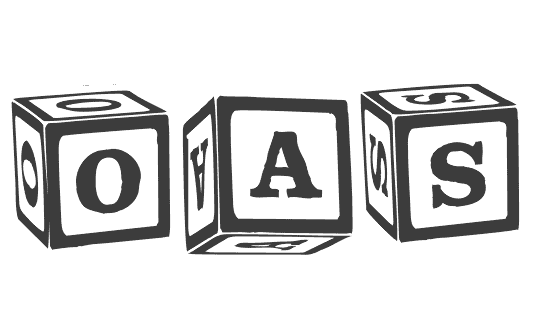

# 用 OpenAPI 规范定义可重用组件

> 原文：<https://dev.to/mikeralphson/defining-reusable-components-with-the-openapi-specification-4077>

[T2】](https://res.cloudinary.com/practicaldev/image/fetch/s--HNvRpQ22--/c_limit%2Cf_auto%2Cfl_progressive%2Cq_auto%2Cw_880/https://thepracticaldev.s3.amazonaws.com/i/r0fpenaxrgcb3gl3xnng.png)

我越来越多地看到的一种模式是从多个文件中组合 [OpenAPI 规范](https://www.openapis.org/) (OAS，以前称为 Swagger)文档。这允许重用、更容易的协作，并使更大的文档更容易跟踪。

生成的文档可以由完全理解并实现 [JSON 引用规范](https://tools.ietf.org/html/draft-pbryan-zyp-json-ref-03)的工具解析(即，它们包括解析器)，或者可以通过使用这样的 JSON 引用实现工具解引用外部引用来“打包”。

但是，那些美洲国家组织文件的碎片应该是什么样的呢？

除了被引用的对象必须是预期的类型之外，OAS 规范对此没有规定。

因此，自包含 OAS 文档中的`parameter`定义可能如下所示:

```
...
paths:
  /:
    get:
      parameters:
      - $ref: '#/components/parameters/sort'
...
components:
  parameters:
    sort:
      name: sort
      in: query
      schema:
        type: string
        description: 'The  direction  of  the  sort'
        enum:
          - asc
          - desc 
```

Enter fullscreen mode Exit fullscreen mode

引用外部片段的参数可能如下:

```
...
paths:
  /:
    get:
      parameters:
        - $ref: './includes/parameters.yaml#/sort' 
```

Enter fullscreen mode Exit fullscreen mode

并且`parameters.yaml`可以简单地看起来像这样，没有额外的结构:

```
sort:
  name: sort
  in: query
  schema:
    type: string
    description: 'The  direction  of  the  sort'
    enum:
        - asc
        - desc 
```

Enter fullscreen mode Exit fullscreen mode

如果我们希望跨主题领域组合我们的可重用组件，而不是在结构上与 OAS 相关，我们可以像这样构造我们的文档:

```
paths:
  /:
    get:
      parameters:
        - $ref: './includes/parameters.yaml#/parameters/sort' 
```

Enter fullscreen mode Exit fullscreen mode

```
parameters:
  sort:
    name: sort
    in: query
    schema:
      $ref: '#/definitions/sortType'
definitions:
  sortType:
    type: string
    description: 'The  direction  of  the  sort'
    enum:
      - asc
      - desc 
```

Enter fullscreen mode Exit fullscreen mode

被包含文档的这两种风格的问题在于，除了有效的 JSON 或 YAML 之外，它们都没有被任何标准定义。即使它们的内容应该由有效的 OAS 对象组成，也不能根据规范进行验证。

它提出了一些问题，比如:允许在 OAS v2 和 OAS v3 文档中共享`sortType`模式的定义吗，即使这两个规范中模式对象的定义不同？

我认为将包含的文档组织成完全有效的 OAS 文档有很大的好处。

以下面六行元数据开销(在 JSON 中稍微多一点)和稍长的`$ref`值为代价，我们的`parameters.yaml`文档变成了:

```
openapi: 3.0.1
info:
  title: An include file to define sortable attributes
  version: 1.0.0
paths: {}
components:
  parameters:
    sort:
      name: sort
      in: query
      schema:
        $ref: '#/components/schemas/sortType'
  schemas:
    sortType:
      type: string
      description: 'The  direction  of  the  sort'
      enum:
        - asc
        - desc 
```

Enter fullscreen mode Exit fullscreen mode

这份文件现在的好处是可以使用 OAS 兼容的[工具](http://openapi.tools)进行验证、链接、转换、转化和编辑。在转换的情况下，这意味着 OAS v2 文档片段可以就地升级到 OAS v3，而不必将文档捆绑成一个整体。

minimal `info`对象为我们提供了描述片段预期用途的属性，以及独立于引用它的“主”OAS 文档对其进行版本控制的能力。

仅仅通过空的`paths`对象的出现，我们就可以知道我们正在处理一个片段，而不是一个完全定义的 OAS 文档。

这些可重用的子文档也可以在项目之间共享，允许出现行业特定的标准组件。