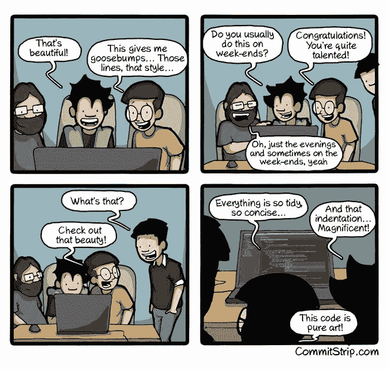

# 路线图-产品开发

> 原文:[https://dev.to/vishwan/roadmap-产品-开发-3n2j](https://dev.to/vishwan/roadmap---product-development-3n2j)

许多第一次开发应用程序的人，尤其是疯狂的人(移动应用程序开发人员)感觉到了压力。我之前也是这种情况，但是现在我已经克服了这种恐惧。我并没有意识到如何做到这一点，直到来自开发人员社区的一个人问道，“*在这个过程中，任何人如何能够保留所有这些信息呢？*

[ images on Coding from the internet #1](img/5dd8bc36191eb32b857c35e3c7c2a998.png)T2】](https://res.cloudinary.com/practicaldev/image/fetch/s--nLjXww8K--/c_limit%2Cf_auto%2Cfl_progressive%2Cq_auto%2Cw_880/https://thepracticaldev.s3.amazonaws.com/i/wxscib1eec1n8zx8x9mw.jpg)

事后看来，我必须说这种恐惧是好的。因为它让你真正思考。看到每天都有新的 API 发布，AI (ML/DL)，AR，VR，区块链和其他不同的理论，实现，调整的算法等等，有点恐慌是很自然的。很自然地，你可能会想，“我什么时候才能学会所有这些东西，并把它们放到我的应用程序里？”。但是当你走出恐慌模式去看它的时候，它就变得清晰了。你可能会说，像捏缩小。

首先，让我们把问题弄清楚。没有人能记住所有的内容并神奇地运用它们。然而，我们看到许多开发人员自然地将它们编码为正确的！？

我们退一步观察一下。

1)有经验的开发人员如何使用所有这些 API 和其他像 Pros 一样的时髦实现？

它就在问题中——体验。

2)他们从哪里获得这种经验？

他们在构建小型学习应用程序时，尝试了许多这样的实现。你知道，把他们的问题男人分成小块，然后解决他们。然后将小块的所有解决方案拼凑在一起。随后，根据他们的用例，他们在真正的应用程序中修改和实现它们，并运送到商店。

3)但是他们如何知道使用正确的实现呢？

没有人第一次能 100%正确。他们小心翼翼地摆弄着代码——害怕犯错误。因此，在实现最适合的实现之前，会出现许多反复试验的模式。

他们也知道正确的实现，因为他们在早些时候会面临类似的需求/要求来解决。假设他们面临一个这样的**需求**，在他们的小型学习应用中构建新的功能。他们通常会使用正确的关键词进行搜索。作为程序员，我们首要的技能是掌握“**问正确的问题**”。你必须明确知道你想要什么。

*关于关键词*:当我们问正确的问题时，甚至是使用随意的术语(比如，如何在 iOS/Android 中获取位置？)，搜索会自动给我们相关的描述和正确的关键字(比如，地理位置、GPS/用户位置、当前位置，甚至是 CGlocation 框架)。所以下次当你搜索的时候，你可以把它记在心里，进行一次精炼的搜索。随着时间的推移，当你面对这样的问题时，你会知道去哪里找——像 Stack Overflow 这样的资源，像 [ours](https://dev.to) 这样的开发者论坛，文档&指南，GitHub 等等。

4)好吧，我什么时候面对这些*要求*？我该怎么做呢？

到现在为止，你可能已经猜到了。是的，通过构建*小型学习应用*。如果没有经验，我们很难发现需求本身具有足够的挑战性。但是你总是可以尝试重新创建让你感兴趣的应用程序。一些常见的应用程序，如“银行应用程序”(掌握 MVC 架构模式)或“天气应用程序”(获取用户的位置并使用相关的 API)，或者基本的“聊天应用程序”(了解网络)等等。

此外，你可以随时重温这些应用程序，以巩固你的知识，并加以改进。还有，不要害怕，在 Github 上公开托管它们。谁知道呢，一个有经验的开发人员有时甚至会偶然发现你的代码并纠正你。世界真小。我们生活在一个学习比以往任何时候都简单和容易的时代。每一条评论都是一次学习的机会。你会看到各行各业各种各样的人。尽管如此，保持谦逊，感谢别人的帮助，优雅地接受缺点并改正它们会让你比大多数人走得更快。

你可能想使用另一种技术——当你在智能手机上使用日常应用时，试着从开发者的角度来看待它们。想象一下，“*哦，这个功能太酷了。让我搜索一下它是什么以及如何实现它。同时，它也应该适合我的用例。我不能因为这里看起来很酷就申请。无论如何，如果我尝试，我会知道。*

一般来说，基本的和流行的需求是大多数开发人员会感到舒服的，当他们遇到挑战时，他们会无缝地处理这些需求(记住，他们已经很熟悉花费时间和精力在他们的*小型学习应用*和*真实应用*中多次实现这些需求)。但是新的对他们来说也有点挑战性。问题是他们比初学者更快地解决了这个问题，因为他们基本上已经习惯了解决他们需求的方法。是的，解决问题。本质上，这一切都来自实践，这就是我们在上面的*经历*中所讨论的。

[ images on Coding from the internet #1](img/065ab5a3345c5b7c98641e034e6e874c.png)T2】](https://res.cloudinary.com/practicaldev/image/fetch/s--k-dS6U2F--/c_limit%2Cf_auto%2Cfl_progressive%2Cq_auto%2Cw_880/https://thepracticaldev.s3.amazonaws.com/i/9kf5nfrtejitxi32spa5.jpg)

5)嘿，面试怎么办？他们不会拿市场上的*【新趋势】*来考验我吗？

是的，当然。准备好。除了阅读书籍、博客和实践培训，准备重温你的“*”小型学习应用程序——这不会占用你太多时间，因为它是你创建的，像视频回放一样一帧一帧地掌握它的本质会很容易。事实上，感到尴尬和被诱惑去改变你以前版本的一些代码是正常的——那是你发现你有一个以前的代码的时候！；)*

 *(生活提示:“不断努力，打造下一个最好的你。唯一的竞争对手就是你。每天把自己敲昏！。)

还要记住，产品开发不仅仅是你用多种语言编码的能力，掌握 ide，了解很多库和框架，甚至是精通架构设计模式。是的，所有这些都非常重要。但是我们也必须承认另一个事实。在你职业生涯的某一点之后，更重要的是要意识到公司雇佣个人是因为他们有能力制造产品。不仅仅是构建，而是智能地构建产品。好吧，这里的聪明并不意味着擅长数学(尽管这很有帮助)。

聪明就是表现得像"*哦，嘿，等一下，我知道这件事！几年前，我在解决一个数据结构概念问题时遇到了类似的架构挑战。好久不见了！这是一个不同的场景。但是我想这个解决方案可以在这里进行调整和应用。如果我错了呢？至少当我尝试的时候，我会知道我肯定是错的！*”——这样的**似曾相识**将对你的职业生涯有巨大的帮助。你可能会说这与每个人的个性和方法有关，然而，它有其应有的重要性。一个人可以通过拥有良好的价值观和美德、谦逊的个性、正面的态度以及良好的记忆力、头脑冷静、想象力和概念应用等技能来实现这种对话。记住，你可以一直训练自己成为这样的人。这些都是能给面试官留下持久印象的关键特征。毕竟，如果公司真的关心员工带来了什么样的价值观，它将拥有一个与其长期愿景和近期目标相一致的蓬勃发展的工作文化。

重要的是要知道，面试官除了认可你的技能之外，还认可这一点，尤其是在申请产品开发人员职位时。(这也从根本上要求成为一名软件开发人员，因此两者都适用。)

6)最后—软件工程！

**这整个事情就是一个开发者的旅程**。你可以把它想象成一条乡间小路，不全是闪亮的，但风景很美。**会有很多障碍**(形式为*解决问题/获取要求/理解挑战* ) **比如随机的石头、海市蜃楼、倒下的树、折断的招牌、灯柱。当你满怀信心地前进时，就很容易少被打扰。一开始可能需要时间，但是很快你就会意识到你能够自然地解决它们。坦率地说，这个旅程没有尽头，随着你的继续，* *你会获得很多智慧**，看到每件事情中的数学以及每件事情是如何相互联系的。随着风景离你越来越近，你会寻找更多的风景，并在你的旅途中保持快乐。

在这一点上，它更像是一个*因果循环或自启动循环*。你越进步，你就越喜欢它，这反过来会推动你前进，你会进步得更多！

希望这对你有帮助。☺️
嘿，使用 [Venngage 信息图](https://www.venngage.com)像专家一样开始创建一个真正的[产品路线图](https://venngage.com/blog/inspiration-marketing-product-roadmap-templates/)！
感谢您抽出时间通读。编码快乐！

[T2】](https://res.cloudinary.com/practicaldev/image/fetch/s--2YsEgZwo--/c_limit%2Cf_auto%2Cfl_progressive%2Cq_auto%2Cw_880/https://thepracticaldev.s3.amazonaws.com/i/bhnano0vm57avkjh9h32.jpeg)

这篇文章最初发表在 [Vishwan@Medium](https://medium.com/@vishwan/psychology-behind-product-development-6d0913d4fe0)

[#DFTBC！—别忘了好奇！:)](https://curiouscamp.wordpress.com)*