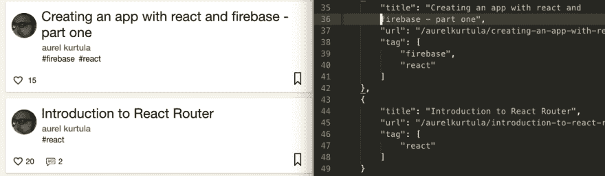
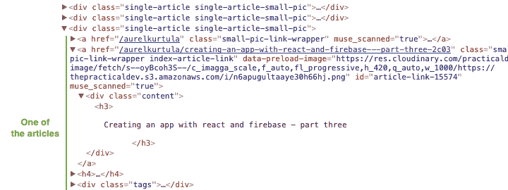

# Node.js 网页抓取简介

> 原文:[https://dev . to/aurelkurtula/introduction-to-web-scraping-with-nodejs-9 H2](https://dev.to/aurelkurtula/introduction-to-web-scraping-with-nodejs-9h2)

很长一段时间以来，当我想尝试创建网站进行练习时，我会访问一个网站，打开控制台，试图获得我需要的内容——所有这一切都是为了避免使用 lorem ipsum，这是我绝对讨厌的。

几个月了，我听说了网络抓取，嘿，越晚越好，不是吗？它似乎做了一件类似于我试图手动做的事情。

今天我将解释如何用 Node 进行网页抓取。

## 设置

我们将使用三个包来完成这个任务。

*   **[Axios](https://github.com/axios/axios)** 是一个“基于 promise 的浏览器和 node.js 的 HTTP 客户端”，我们将使用它从任何选定的网站获取 html。
*   **[Cheerio](https://github.com/cheeriojs/cheerio)** 类似于 jQuery，但用于服务器。我们将使用它作为从 Axios 结果中挑选内容的一种方式。
*   **[fs](https://nodejs.org/api/fs.html)** 是一个节点模块，我们将使用它将获取的内容写入 JSON 文件。

让我们开始设置项目。首先创建一个文件夹，然后在终端中`cd`到它。

要初始化项目，只需运行`npm init`并按照步骤操作(你可以点击 enter 键进入所有操作)。当初始设置完成时，您已经创建了一个`package.json`文件。

现在我们需要安装上面列出的两个包

```
npm install --save axios cheerio 
```

<svg width="20px" height="20px" viewBox="0 0 24 24" class="highlight-action crayons-icon highlight-action--fullscreen-on"><title>Enter fullscreen mode</title></svg> <svg width="20px" height="20px" viewBox="0 0 24 24" class="highlight-action crayons-icon highlight-action--fullscreen-off"><title>Exit fullscreen mode</title></svg>

(记住`fs`已经是 node 的一部分，我们不需要为它安装任何东西)

你会看到上面的包安装在`node_modules`目录下，它们也列在`package.json`文件中。

## 从 dev.to 中获取内容

您的开发人员档案位于`https://dev.to/<username>`。我们的任务是获取我们写的帖子，并将它们存储在一个 JSON 文件中，如下所示:

[T2】](https://res.cloudinary.com/practicaldev/image/fetch/s--0XW7Ahbl--/c_limit%2Cf_auto%2Cfl_progressive%2Cq_auto%2Cw_880/https://thepracticaldev.s3.amazonaws.com/i/kdpg0kc0fmnb1cog0uv7.png)

在您的项目文件夹中创建一个 JavaScript 文件，如果您愿意，可以将其命名为`devtoList.js`。

首先需要我们安装的软件包

```
let axios = require('axios');
let cheerio = require('cheerio');
let fs = require('fs'); 
```

<svg width="20px" height="20px" viewBox="0 0 24 24" class="highlight-action crayons-icon highlight-action--fullscreen-on"><title>Enter fullscreen mode</title></svg> <svg width="20px" height="20px" viewBox="0 0 24 24" class="highlight-action crayons-icon highlight-action--fullscreen-off"><title>Exit fullscreen mode</title></svg>

现在让我们从`dev.to`
获取内容

```
axios.get('https://dev.to/aurelkurtula')
    .then((response) => {
        if(response.status === 200) {
        const html = response.data;
            const $ = cheerio.load(html); 
    }
    }, (error) => console.log(err) ); 
```

<svg width="20px" height="20px" viewBox="0 0 24 24" class="highlight-action crayons-icon highlight-action--fullscreen-on"><title>Enter fullscreen mode</title></svg> <svg width="20px" height="20px" viewBox="0 0 24 24" class="highlight-action crayons-icon highlight-action--fullscreen-off"><title>Exit fullscreen mode</title></svg>

在第一行中，我们从指定的 URL 获取内容。如前所述，`axios`是基于承诺的，`then`我们检查响应是否正确，并获取数据。

如果你登录控制台`response.data`，你会看到来自 url 的 html 标记。然后，我们将 HTML 加载到`cheerio` (jQuery 会在幕后为我们完成这项工作)。为了说明这一点，让我们用硬编码的 html
代替`response.data`

```
const html = '<h3 class="title">I have a bunch of questions on how to behave when contributing to open source</h3>'
const h3 = cheerio.load(html)
console.log(h3.text()) 
```

<svg width="20px" height="20px" viewBox="0 0 24 24" class="highlight-action crayons-icon highlight-action--fullscreen-on"><title>Enter fullscreen mode</title></svg> <svg width="20px" height="20px" viewBox="0 0 24 24" class="highlight-action crayons-icon highlight-action--fullscreen-off"><title>Exit fullscreen mode</title></svg>

这将返回不带`h3`标签的字符串。

## 选择内容

此时，您可以打开您想要抓取的网站的控制台，找到您需要的内容。这是:

[T2】](https://res.cloudinary.com/practicaldev/image/fetch/s--xZ3Jfhsp--/c_limit%2Cf_auto%2Cfl_progressive%2Cq_auto%2Cw_880/https://thepracticaldev.s3.amazonaws.com/i/o5yqdb5vaar1czrvpayb.png)

从上面我们知道每篇文章都有一个`single-article`类，标题是一个`h3`标签，标签在一个`tags`类中。

```
axios.get('https://dev.to/aurelkurtula')
    .then((response) => {
        if(response.status === 200) {
            const html = response.data;
            const $ = cheerio.load(html); 
            let devtoList = [];
            $('.single-article').each(function(i, elem) {
                devtoList[i] = {
                    title: $(this).find('h3').text().trim(),
                    url: $(this).children('.index-article-link').attr('href'),
                    tags: $(this).find('.tags').text().split('#')
                          .map(tag =>tag.trim())
                          .filter(function(n){ return n != "" })
                }      
            });
    }
}, (error) => console.log(err) ); 
```

<svg width="20px" height="20px" viewBox="0 0 24 24" class="highlight-action crayons-icon highlight-action--fullscreen-on"><title>Enter fullscreen mode</title></svg> <svg width="20px" height="20px" viewBox="0 0 24 24" class="highlight-action crayons-icon highlight-action--fullscreen-off"><title>Exit fullscreen mode</title></svg>

上面的代码非常容易阅读，特别是如果我们参考上面的截图。我们用类`.single-article`遍历每个节点。然后我们找到唯一的`h3`，我们从中获得文本，只是`trim()`多余的空白。然后 url 也很简单，我们从相关的锚标签中获取`href`。

获取标签真的很简单。我们首先将它们作为一个字符串(`#tag1 #tag2`)获取，然后将该字符串(每当`#`出现时)拆分成一个数组。最后，我们将数组中的每个值映射到空白的`trim()`，最后我们过滤掉所有的空值(大部分是由修剪引起的)。

在循环外部声明一个空数组(`let devtoList = []`)允许我们从内部填充它。

那就是了。`devtoList`数组对象有我们从网站上抓取的数据。现在，我们只想将这些数据存储到一个 JSON 文件中，以便在其他地方使用。

```
axios.get('https://dev.to/aurelkurtula')
    .then((response) => {
        if(response.status === 200) {
            const html = response.data;
            const $ = cheerio.load(html); 
            let devtoList = [];
            $('.single-article').each(function(i, elem) {
                devtoList[i] = {
                    title: $(this).find('h3').text().trim(),
                    url: $(this).children('.index-article-link').attr('href'),
                    tags: $(this).find('.tags').text().split('#')
                          .map(tag =>tag.trim())
                          .filter(function(n){ return n != "" })
                }      
            });
            const devtoListTrimmed = devtoList.filter(n => n != undefined )
            fs.writeFile('devtoList.json', 
                          JSON.stringify(devtoListTrimmed, null, 4), 
                          (err)=> console.log('File successfully written!'))
    }
}, (error) => console.log(err) ); 
```

<svg width="20px" height="20px" viewBox="0 0 24 24" class="highlight-action crayons-icon highlight-action--fullscreen-on"><title>Enter fullscreen mode</title></svg> <svg width="20px" height="20px" viewBox="0 0 24 24" class="highlight-action crayons-icon highlight-action--fullscreen-off"><title>Exit fullscreen mode</title></svg>

原始的`devtoList`数组对象可能有空值，所以我们只需要把它们修剪掉，然后我们使用`fs`模块写入一个文件(上面我把它命名为`devtoList.json`，数组对象把它的内容转换成 JSON。

这就是一切！

上面的代码可以在 [github](https://github.com/aurelkurtula/web-scraping) 中找到。

除了使用上面的代码抓取 dev.to 之外，我还从 goodreads 抓取了书籍，从 IMDB 抓取了电影，其代码在资源库中。