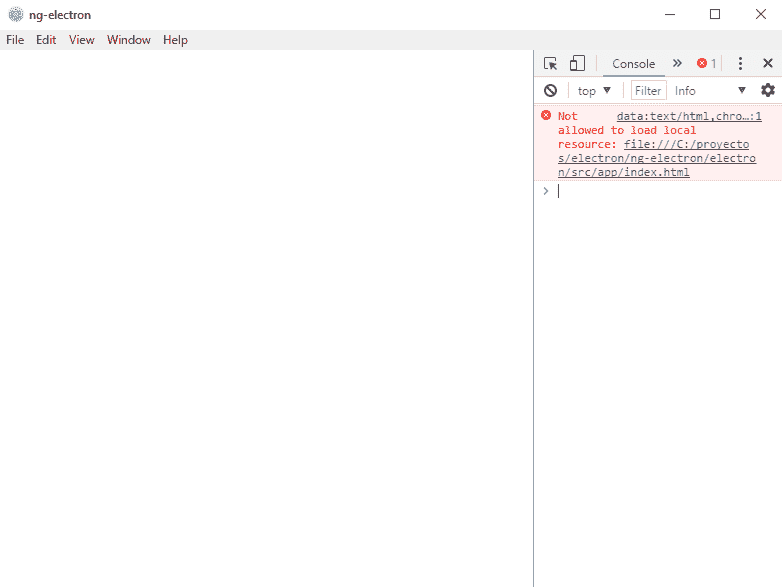

# 使用 ts 节点的电子打字稿

> 原文：<https://dev.to/michaeljota/electron-with-typescript-using-ts-node-8oi>

在我的上一篇文章中，我谈到了如何[整合 Angular-CLI 与电子](https://dev.to/michaeljota/integrating-an-angular-cli-application-with-electron-34mi)。缺少的东西之一是使用 Typescript，而不是普通的 Javascript，尽管 Electron 的主要功能是基于节点的引擎，所以几乎所有关于 ES2015 和 ES2016 的功能都应该工作，一些新功能仍然缺少，因为当前版本`1.7.11`是基于`node 7.9`。由于 JavaScript 的原因，类型仍然缺失。使用电子打字稿，真的很简单，但我们需要安装一些模块。

## 安装依赖项

我们转到电子输入文件夹。如果您按照我的指导集成 Angular-CLI，它将是`electron`文件夹。然后，我们运行:

```
npm install -D typescript ts-node 
```

Enter fullscreen mode Exit fullscreen mode

*   *打字稿*:嗯，这其实就是我们要用的。
*   *ts-node* :节点的脚本执行环境和 REPL。这将动态解析所有的`.ts`文件。

## 创建 tsconfig.json

如果您使用 npm 5.2+来创建`tsconfig.json`，请运行`npx tsc --init`。既然行得通，我们就不去管它了。

## 更新文件

我们需要修改应用程序的运行方式。

*   创建一个名为`src`的文件夹，这将是我们的开发文件夹。
*   将`index.js`移动到`src`并重命名为`index.ts`。这现在是一个类型脚本文件。
*   在应用程序根中创建一个新的`index.js`，内容如下。

```
require('ts-node').register(); // This will register the TypeScript compiler
require('./src'); // This will load our Typescript application 
```

Enter fullscreen mode Exit fullscreen mode

## 运行电子

现在是时候尝试了，如果您遵循集成指南，请运行`npm start`,如果您没有相关的脚本，请运行`electron .`。

你应该看到这样的东西:
[](https://res.cloudinary.com/practicaldev/image/fetch/s--oXo--Dpn--/c_limit%2Cf_auto%2Cfl_progressive%2Cq_auto%2Cw_880/https://thepracticaldev.s3.amazonaws.com/i/z1g6mt642m943tunr9my.png)

这很好。因为我们正在使用`__dirname`作为我们的文件夹根，现在电子找不到应用程序源。

## 更新`index.ts`

希望解决方案真的很简单。用`app.getAppPath()`改变`path.join`功能中的`__dirname`即可。

【getAppPath()是什么？ [Docs](https://electronjs.org/docs/api/app#appgetapppath)
这是一个电子函数，将解析到应用程序路径的根。

## (再次运行的电子)

如果一切顺利，您现在应该看到您的应用程序在 electronic 中运行。

# 备注

这只是一个指南，展示这个*如何工作*。但是，我不推荐使用`ts-node`作为生产解决方案。另外，我还没有在捆绑应用程序中测试过`getAppPath`函数，所以它可能会失败。

# 向前移动

我们现在有一个用打字稿写的电子应用程序。它可以通过使用构建系统(如 Webpack)来优化生产。此外，我们可以将`tsconfig`文件中的`es6`作为目标，因为 Electron main 将与 es2015 配合使用。

使用本机模块似乎是用户感兴趣的事情，所以我可能会制作一个关于使用它们的指南。

# 亦见

*   [集成电子角度 CLI 应用](https://dev.to/michaeljota/integrating-an-angular-cli-application-with-electron-34mi/)